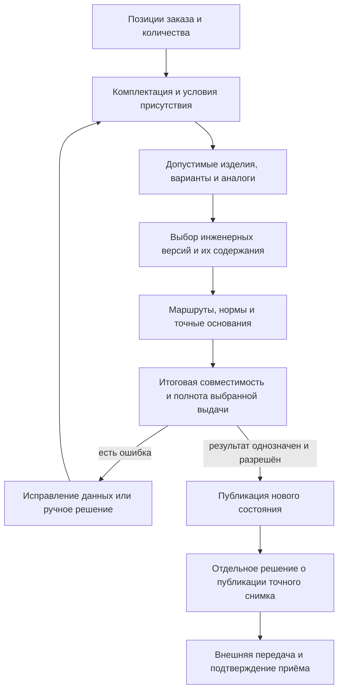

# Формирование производственного заказа

> Описан целевой процесс по состоянию на 6 сентября 2026 года. Подготовленный рабочий ПЗ, разрешённая выдача и принятое производством задание — разные результаты.

## Продуктовый смысл

Коммерческое требование «поставить два станка такой комплектации» ещё не является достаточным заданием цеху. Для запуска производства нужно получить точный и объяснимый состав: какие версии узлов и документов применить, какие варианты выбрать, по каким маршрутам изготавливать и где требуются решения специалиста.

В IPS эту задачу решают механизмы формирования производственного заказа: они рассматривают структуру изделия, версии, контексты, применимость, аналоги, замены и технологические маршруты. Interlink сохраняет смысл этого процесса, но раскладывает его на явные последовательные решения и отделяет живое планирование от точной передачи.

Схема показывает путь к официальной выдаче, а не запрет сохранять промежуточный ПЗ. В подтверждённом сценарии IPS пользователь может сформировать ПЗ, не снимая вариантность автоматически: оставить несколько заменителей и маршрутов, получить предупреждение о незаданном количестве и продолжить подготовку. Interlink обязан сохранить этот рабочий путь. Однозначные варианты и точное количество требуются для выбранной области выдачи, а не для каждого сохранения или просмотра.

## Входные данные

Для формирования нужны не только верхние изделия. Система учитывает:

- версию заказа, позиции и количество;
- выбранную комплектацию каждой позиции;
- дату, серию, организацию, площадку и другие согласованные условия;
- разрешённые состояния зрелости версий;
- независимый контекст выбора версий и, когда требуется, доступные рабочие данные участников;
- правила применимости, вариантов, аналогов и замен;
- производственные маршруты, нормы и требуемые документы;
- ранее принятые ручные решения, если они остаются допустимыми.

Набор условий должен быть виден пользователю и сохраняться вместе с результатом. Формулировка «система выбрала актуальное» без уточнения контекста недостаточна.

Контекст не обязан существовать внутри пакета изменения. Например, постоянный контекст производственной программы задаёт согласованные версии для нескольких заказов, а пакет объединяет только конкретную предстоящую публикацию. Рабочий просмотр, сохранённый выбор и состав проводимых изменений не смешиваются. Подробности — [[контексты выбора|Selection-contexts]] и [[мягкая конкретизация|Selection-soft-concretion]].

## Последовательность формирования

### 1. Раскрытие позиций заказа

Каждая строка рассматривается независимо: изделие, количество, комплектация и место в заказе. Несколько верхних изделий не объединяются в искусственную конструкторскую сборку.

### 2. Определение присутствующего состава

Условия комплектации решают, какие ветви обязательны, какие исключены и где не хватает параметров. Исключённая ветвь не должна затем влиять на выбор версии или расчёт материалов.

### 3. Выбор предметного варианта

Если в позиции допускаются основной вариант, аналог или замена, специалист определяет, какое изделие или полный комплект будет применён. Выбор содержания заменителя выполняется обычным механизмом подбора версий. Это не позволяет подменить отсутствие подходящей версии незаметной установкой другой номенклатуры.

Важна зависимость от источника допуска. В IPS аналоги могут назначаться для версии исходного объекта. Если у двигателя версии 04 и версии 05 разные допустимые аналоги, сначала надо определить, к какой исходной версии относится позиция, прочитать именно её разрешение и лишь затем выбрать заменитель. Нельзя воспользоваться более удобным разрешением соседней версии. Для общего каталога, не привязанного к версии, искусственная предварительная стадия не нужна.

Библиотека допустимых замен не является общим переключателем заказов. Заказ для завода А может выбрать «двигатель и фланец», а заказ для завода Б — «мотор-редуктор, плита и крепёж», ссылаясь на одно описание альтернатив. Каждый заказ сохраняет собственный выбор, места применения и точную редакцию разрешения. Система применяет полный вариант: отсутствие обязательной плиты не превращает замену в частично успешную.

### 4. Подбор версии

Для каждой включённой позиции выбирается инженерная версия, затем её содержание по заданному режиму: рабочие данные для проработки либо конкретное опубликованное состояние для выдачи. Жёсткое закрепление версии не тождественно фиксации её содержания на определённую дату. Подробные сценарии приведены в отдельном [[пакете подбора версий|Version-selection-guide]].

### 5. Наложение технологии

Для выбранного инженерного состава определяются маршруты, операции, нормы материалов и труда, а также производственные документы. Технология может зависеть от версии детали, места её применения, предприятия и заказа. Рабочий результат ещё может сохранять альтернативы; в официальном комплекте все обязательные основания должны стать точными.

### 6. Проверка результата

Система разделяет:

- **ошибку** — точный результат получить нельзя;
- **предупреждение** — работу можно продолжить, но требуется внимание; допустимость официальной выдачи проверяется отдельно;
- **вопрос выбора** — есть несколько допустимых результатов и нужно утверждённое решение.

Каждое сообщение должно указывать предметную позицию, причину и возможное действие. Внутренний технический номер не заменяет понятного пути: «Заказ 1847 → насосная станция, позиция 10 → насос → торцевое уплотнение».

Кроме ранней проверки комплектации нужна проверка уже выбранного содержания: конкретной платы с конкретной прошивкой, покрытия с материалом и средой, маршрута с ресурсами площадки. Три попарных разрешения не доказывают пригодность всего комплекта. Если два привода по отдельности допустимы с блоком питания, но вместе превышают мощность, выдача блокируется. Система не исправляет это скрытым подбором более старой версии или снятием жёсткого закрепления; она показывает нарушенное требование и предлагает отдельное решение.

## Как сохраняется функциональность IPS

| Потребность IPS | Решение Interlink |
|---|---|
| Формировать состав из нескольких заказных изделий | Независимые верхние позиции одной версии заказа |
| Учитывать комплектацию | Явные параметры и условия присутствия для каждой позиции |
| Выбирать версии по контексту | Единый механизм подбора с сохранёнными условиями и объяснением |
| Работать с аналогами и заменами | Установить источник допуска, явно выбрать разрешённый полный вариант и затем подобрать содержание выбранных целей |
| Учитывать маршрут | Производственное наложение на точный инженерный состав |
| Видеть проблемы формирования | Структурированные ошибки, предупреждения и вопросы выбора |
| Контролируемо изменить результат | Рабочая правка, новое опубликованное состояние, проверенный расчёт и отдельный снимок выдачи |
| Воспроизвести прошлый запуск | Неизменяемый полный снимок вместо повторного чтения текущих данных |

## Пример 1. Насосная станция для Крайнего Севера

В заказе три станции НС-400. Комплектация включает обогрев шкафа и низкотемпературные уплотнения. Условие исключает стандартную вентиляционную ветвь и включает утеплённый кожух.

Для электродвигателя найдены две инженерные версии: у одной есть разрешённое опубликованное состояние, другая ещё прорабатывается. В этом примере правило обычной выдачи выбирает допустимое опубликованное содержание. В совместной работе конструктор может проверить будущий вариант, но передача возможна только после его разрешённой публикации. Если позиция жёстко требует ещё не подготовленную версию, система не подменит её другой только ради завершения расчёта.

Технологический маршрут выбирается для северной площадки. Если обязательный маршрут покраски не определён, система показывает проблему именно на кожухе. Рабочий ПЗ можно сохранить с диагностикой, но выдача этой области в производство блокируется.

## Пример 2. Обрабатывающий центр с покупным поворотным столом

Заказ включает центр, поворотный стол и комплект кулачков, поставляемый отдельно. Конфигурация центра требует усиленной станины. Для покупного стола основной поставщик недоступен, но разрешён аналог.

Специалист явно выбирает аналог и видит, что для него требуется другой переходной фланец. Система показывает затронутые ветви, подбирает содержание чертежей фланца и проверяет маршрут его изготовления. Перед выдачей она оценивает весь обязательный набор ограничений, а не только изменённую строку. Отдельно поставляемые кулачки остаются самостоятельной строкой заказа и не превращаются в установленную часть станка.

## Пример 3. Партия редукторов с разными маршрутами валов

Заказ содержит десять одинаковых редукторов. Для выходного вала допустим маршрут собственного изготовления и маршрут кооперации. Условия предприятия допускают оба, поэтому система не должна произвольно выбрать «первый».

Планировщик принимает решение: шесть валов изготовить на своей площадке, четыре передать кооператору. Инженерный состав редуктора остаётся одинаковым, но производственное обеспечение разделяется. Это решение сохраняется как часть конкретного производственного результата.

## Пример 4. Сборочная линия с повторно используемым модулем

Модуль ограждения встречается у сварочного поста и у упаковочного робота. Для первой позиции требуется огнестойкое исполнение, для второй — исполнение с дополнительным окном обслуживания.

Формирование идёт по полному пути каждой позиции. Система не переносит выбор одной ветви во вторую только потому, что исходное обозначение модуля совпадает.

Если обе выбранные замены требуют общий контроллер безопасности, требование его наличия не означает, что нужно заказать два контроллера. Но другая замена не вправе удалить или изменить этот контроллер так, чтобы нарушить условия первой. Проверяется совместный итог: что заменено, что должно остаться и что требуется для работы.

## Табличные основания формирования

При выборе уплотнения насосной станции технолог может использовать карту «среда × температура × материал корпуса». Она возвращает разрешённые кандидаты либо сообщает, что сопоставление не задано. Нормы расхода покрытия читаются из справочника, а результат испытания состава покрытия — из отдельного набора данных. Это не три файла, которые можно незаметно заменить после выпуска: производственная выдача удерживает конкретные использованные редакции и сведения, необходимые для объяснения расчёта.

Карта кандидатов сама не устанавливает уплотнение и не подтверждает совместимость всего насоса. Выбор, проверка и применение остаются явными действиями. См. [[справочные таблицы|Reference-tables]], [[координатные карты|Coordinate-maps]] и [[матрицы совместимости|Compatibility-matrices]].

## Границы

Interlink определяет и объясняет состав. Он не заменяет:

- календарное планирование мощностей;
- складское обеспечение и взаимозачёт остатков;
- диспетчеризацию цеха;
- учёт фактического выполнения операций;
- коммерческое управление портфелем заказов.

Эти функции используют точный результат Interlink через принимающую PLM-систему, ERP или MES.

## Открытые вопросы

- Какие сообщения IPS должны сохранять точные названия и степень важности?
- Где проходит граница автоматического выбора и обязательного решения специалиста?
- Можно ли разделять количество одной позиции между разными вариантами и маршрутами?
- Какие технологические данные обязательны для признания результата полным?
- Как оформляется частичное повторное формирование после изменения одной ветви?
- Какие правила конкретной установки IPS являются корпоративными, а не общепродуктовыми?

## Критерии приёмки

1. Формируется заказ с несколькими верхними изделиями и разными комплектациями.
2. Исключённые условиями ветви не участвуют в дальнейшем подборе.
3. Аналог или замена выбирается отдельно от версии изделия.
4. Повторное применение одной подсборки разрешается независимо по каждому пути.
5. Неоднозначный результат не публикуется без явной политики или решения.
6. Пользователь получает предметное объяснение каждой ошибки и замены.
7. Точный результат можно воспроизвести после изменения исходных данных.
8. Рабочий ПЗ сохраняет разрешённую вариантность и предупреждения, но не выдаётся как готовое однозначное задание.
9. Проверяются точное содержание участников и совместные требования всех выбранных замен; отказ не запускает скрытую подмену версии.

## Состояние реализации

Порядок формирования и его продуктовые гарантии описывают целевое состояние. В архитектуре уже определены понятия явного контекста, применимости, предпочтений версий и адреса позиции. Полное исполнение правил применимости и подбора версий, многоуровневое раскрытие, конфигуратор, варианты, технология и заказная публикация ещё не являются готовым пользовательским сценарием и относятся к последующим этапам.

## Связанные документы

- [[Формирование состава: IPS → Interlink|Versions-and-composition]]
- [[Пакет сценариев подбора версий|Version-selection-guide]]
- [[Маршруты, нормы и обеспечение|Order-routes-and-norms]]
- [[Допустимые замены|Allowed-replacements]]
