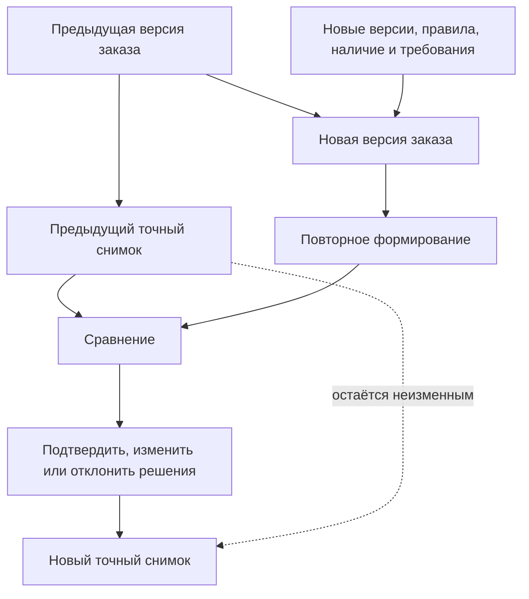

# Перепланирование, замены и история изменений

## Почему перепланирование должно быть явным

После первой передачи заказ редко остаётся неизменным. Заказчик увеличивает количество, поставщик снимает компонент с производства, конструктор выпускает улучшенную версию, технолог меняет маршрут, а цех сообщает о фактическом отклонении.

Опасны две крайности: навсегда заморозить живой заказ или молча пересчитать уже переданный результат. Interlink использует третий путь: новое требование оформляется новой версией заказа, система показывает разницу, пользователь принимает решения, а новая передача получает отдельный снимок.

## Какие изменения встречаются

- добавление или удаление позиции заказа;
- изменение количества;
- смена комплектации или отдельной опции;
- новая версия того же изделия или документа;
- выбор аналога либо замены другой номенклатурой;
- смена маршрута, площадки или способа обеспечения;
- изменение нормы материала или труда;
- разделение поставки на этапы;
- разрешённое фактическое отклонение экземпляра.

Система должна различать эти причины. Сообщение «состав изменился» слишком мало помогает специалисту.

## Пересчёт и сравнение

Повторное формирование не должно сразу создавать новую передачу. Сначала пользователь получает сравнение:

- какие позиции добавлены и удалены;
- где изменилась точная версия;
- где изменился предметный вариант или маршрут;
- как изменились количества, материалы и трудоёмкость;
- какие ранее принятые решения больше недопустимы;
- какие ручные позиции потеряли однозначную связь с новым составом.

Только после проверки и согласования выпускается новая версия и создаётся снимок.

## Устойчивое сопоставление позиций

Нельзя сопоставлять старый и новый состав только по порядковому номеру строки или обозначению детали. Одна деталь может повторяться в нескольких местах. Для объяснения различий Interlink использует устойчивую нить позиции и полный путь применения.

Пользователь видит предметный путь, например: «Станок → магазин инструмента → привод → муфта». Внутренний идентификатор может быть доступен для диагностики, но не является основным языком документа.

Если конструкторская перестройка уничтожила прежний путь, система не должна молча прикрепить ручное решение к похожей детали. Оно помечается как потерявшее основание и требует подтверждения.

## Изменение только для заказа

Иногда заказ требует разового отклонения: особую табличку, дополнительное испытание, временную замену материала. Такое решение может относиться только к конкретному заказу или экземпляру и не должно автоматически менять нормативное изделие.

Если отклонение нужно повторять, предприятие решает, оформить ли комплектацию, новую версию исходного изделия или самостоятельное точное изделие.

## Пример 1. Количество редукторов увеличено с 10 до 12

Первая передача содержит десять редукторов. Заказчик добавляет ещё два. Новая версия заказа показывает изменение количества и пересчитывает материальную потребность.

Принимающий продукт выбирает способ передачи. Для полного нового результата он создаёт корень передачи на 12 штук. Для добавочного задания он создаёт отдельный корень или явное распределение на 2 штуки и проверяет, что оно не пересекается с прежней передачей десяти. Только затем Interlink фиксирует этот корень снимком. Снимок сам не делит строку заказа и не вычисляет остаток. Прежний снимок сохраняется.

## Пример 2. Подшипник снят с производства

Пять из десяти редукторов уже собраны. Для оставшихся основной подшипник недоступен, но разрешён аналог с другим стопорным кольцом.

Система показывает замену номенклатуры, затронутую дочернюю деталь и изменение комплекта документов. Технолог подтверждает новый маршрут сборки. Принимающий продукт создаёт отдельную передачу или распределение для оставшихся пяти и доказывает отсутствие пересечения с первой пятёркой. Новый снимок фиксирует уже оформленный корень этой передачи; сам он количество не отсекает. Фактические экземпляры первых пяти сохраняют исходную родословную.

## Пример 3. Маршрут перенесён на другую площадку

Корпуса насосов планировалось обрабатывать на заводе А, но оборудование остановлено. Завод Б использует другой маршрут и иные приспособления.

Конструкторская версия корпуса не меняется. Повторное формирование показывает изменения операций, документов, трудоёмкости и срока подготовки оснастки. После согласования создаётся новая производственная передача, связанная с исходной причиной.

## Пример 4. Перестроена конструкция шкафа

Конструктор объединил две монтажные панели в одну. В старой версии заказа для одной панели было ручное указание «изготавливать у кооператора».

Новый состав не имеет прежней позиции. Interlink отмечает решение как утратившее однозначное место и просит планировщика определить способ обеспечения новой объединённой панели. Автоматически переносить решение по совпадению материала нельзя.

## Пример 5. Разовое отверстие для монтажа у заказчика

Для одного станка заказчик просит дополнительное монтажное отверстие. Если это разовое разрешённое отклонение, оно сохраняется в позиции заказа и производственных документах конкретного экземпляра. Базовая станина не меняется.

Если требование становится типовым, конструктор оформляет новую версию или комплектацию. История показывает переход от разового заказного решения к нормативному.

## Управление отклонениями

Для каждого отклонения важно хранить:

- инициатора и причину;
- область действия: заказ, часть количества, партия или экземпляр;
- затронутые позиции;
- разрешающий документ и согласующих;
- срок действия;
- влияние на документы, маршруты и нормы;
- связь с последующим фактическим составом.

## Открытые вопросы

- Когда изменение требует новой версии заказа, а когда достаточно новой производственной ведомости?
- Как предприятие оформляет добавочную передачу?
- Можно ли изменить только оставшееся количество одной позиции?
- Как долго сохраняется ручное решение при появлении новых версий?
- Какие отклонения разрешены после начала изготовления?
- Кто подтверждает потерявшие связь ручные позиции?
- Нужно ли автоматически оценивать влияние на уже созданные задания ERP/MES?

## Критерии приёмки

1. Повторный расчёт не меняет предыдущий снимок.
2. Сравнение различает количество, версию, номенклатуру, маршрут и нормы.
3. Пользователь видит причину и предметный путь каждого изменения.
4. Решение для исчезнувшей позиции не переносится наугад.
5. Заказное отклонение не изменяет нормативное изделие автоматически.
6. Замена части количества оформлена отдельным корнем передачи или явным распределением без пересечения; снимок лишь фиксирует эту область.
7. Фактическое отклонение связано с разрешением и конкретными экземплярами или партиями.

## Состояние реализации

Версионирование заказа и неизменяемость прошлой передачи приняты как целевой контракт. Подробное сравнение, перенос решений, область действия замены и управление отклонениями ещё требуют предметной реализации и приёмочных сценариев.

## Связанные документы

- [Жизненный цикл заказа](Order-lifecycle)
- [Экземпляры и фактический состав](Order-units-lots-as-built)
- [Сквозные сценарии](Order-end-to-end)
