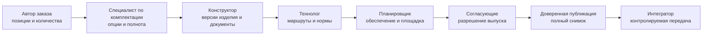

# Роли, согласование и права

## Почему заказ нельзя выпускать одной безымянной операцией

Точный производственный результат объединяет решения разных специалистов. Автор заказа отвечает за потребность, конструктор — за изделие, специалист по комплектации — за допустимое исполнение, технолог — за маршрут и нормы, а планировщик — за способ обеспечения. Выпуск должен сохранять границы этой ответственности.

Interlink предоставляет точные версии, состав, происхождение решений и снимки. Названия ролей, этапы согласования, подписи и корпоративные права задаёт принимающая PLM-система.

Последовательность на конкретном предприятии может быть параллельной или иной. Схема показывает разделение решений, а не обязательный маршрут.

## Типовые роли

| Роль | Основная ответственность | Чего не должна делать без отдельного права |
|---|---|---|
| Автор заказа | Позиции, количества, назначение, заказные примечания | Выпускать незавершённую конструкцию |
| Специалист по комплектации | Опции, совместимость, полнота исполнения | Менять нормативную конструкцию |
| Конструктор | Версии изделия и конструкторские документы | Выбирать производственный маршрут вместо технолога |
| Технолог | Маршруты, операции, нормы, технологические документы | Менять потребность заказчика |
| Планировщик | Площадка, способ обеспечения, разделение количества | Делать неразрешённую конструкторскую замену |
| Автор ПВ | Содержание и оформление производственной ведомости | Подменять точный исходный снимок |
| Согласующий | Проверка своей области и разрешение этапа | Скрыто исправлять данные при подписании |
| Публикатор | Создание полного снимка после всех проверок | Публиковать неполный доступный ему фрагмент |
| Интегратор | Надёжная передача и протокол обмена | Менять предметный состав в процессе преобразования |
| Администратор модели | Типы, правила, справочники и права | Принимать предметные решения за специалистов |

Роль может исполнять человек, группа или доверенная служба. Главное — явно сохранить автора решения и основание полномочий.

## Согласование конкретного содержания

Подпись должна относиться к точной версии данных. Нельзя подписать «заказ вообще», а затем незаметно заменить версию чертежа или маршрут. В записи согласования указываются:

- версия заказа;
- проверяемый точный результат или его однозначное основание;
- область ответственности согласующего;
- замечания и решения;
- время и личность;
- результат: согласовано, отклонено, возвращено на доработку;
- связь с последующей публикацией.

При значимом изменении система определяет, какие согласования утратили силу. Например, смена количества может не требовать нового конструкторского согласования, но изменение материала требует его обязательно. Правила задаёт предприятие.

## Права и полный снимок

Пользователь может не иметь права видеть секретную подсборку. Но при формировании производственного снимка нельзя просто удалить эту ветвь и назвать оставшееся полным заказом.

Допустимы два безопасных варианта:

1. Пользователь не получает право публикации полного заказа.
2. Доверенная служба формирует полный снимок, а интерфейс показывает пользователю только разрешённое представление, не изменяя самого снимка.

Получатель также должен быть уполномочен принять все данные. Для передачи внешнему кооператору может создаваться отдельный разрешённый поставочный пакет, но он не выдаётся за полный производственный снимок всего заказа.

## Разделение обязанностей

Для ответственных изделий предприятие может запретить одному человеку одновременно:

- внести заказную замену;
- согласовать её;
- выпустить производственный результат.

Такое разделение снижает риск скрытой ошибки и должно настраиваться в корпоративном процессе, а не жёстко в ядре Interlink.

## Пример 1. Северное исполнение насосной станции

Менеджер задаёт три станции и северную комплектацию. Специалист по комплектации подтверждает совместимость обогрева, кожуха и уплотнений. Конструктор выпускает недостающий чертёж. Технолог выбирает маршрут покрытия. Ответственные подписывают свои области, после чего доверенная операция создаёт полный снимок.

Менеджер не может обойти незавершённый технологический документ только потому, что видит верхнюю часть заказа.

## Пример 2. Замена материала корпуса

Технолог предлагает заменить материал корпуса из-за недоступности заготовки. Это затрагивает прочностные характеристики, поэтому решение направляется конструктору и службе качества.

Технолог не утверждает замену единолично. После согласования создаются новая версия конструкции, новые нормы и новая версия заказа. Старые подписи остаются в истории предыдущей передачи.

## Пример 3. Пакет для кооператора

Кооператор выполняет покрытие рам станка и не должен видеть полный состав линии. Интегратор формирует отдельный пакет: точные чертежи рам, требования к покрытию, количество и сроки.

Полный внутренний снимок заказа сохраняется без урезания. Пакет кооператора связан с ним как разрешённое представление ограниченного назначения.

## Пример 4. Исправление производственной ведомости

Автор ПВ исправляет ошибочную ссылку на инструкцию. После изменения прежняя подпись становится недействующей для новой версии ПВ. Согласующие видят точную разницу и подписывают исправленный документ. Производственный снимок меняется только если изменился сам передаваемый состав; иначе новая ПВ остаётся связанной с тем же основанием.

## Аудит действий

Для значимых операций нужно хранить:

- кто и в какой роли действовал;
- что было до и после;
- какое правило или право разрешило действие;
- какие предупреждения были приняты;
- какое обоснование введено;
- какие передачи и экземпляры затронуты.

Журнал должен быть понятен продуктовому и качественному аудиту, а не только разработчику.

## Открытые вопросы

- Какие роли и этапы существуют в конкретной установке IPS?
- Какие изменения обнуляют какие согласования?
- Нужна ли квалифицированная электронная подпись?
- Кто имеет право создавать точное изделие и точный снимок?
- Как формируются ограниченные пакеты для поставщиков?
- Разрешено ли публиковать при предупреждениях и кто принимает риск?
- Как долго хранится аудит и кто может его просматривать?

## Критерии приёмки

1. Каждое существенное решение связано с ролью, автором и причиной.
2. Подпись относится к точной версии содержания.
3. Значимое изменение делает требуемые согласования недействующими.
4. Ограничение прав не урезает полный снимок незаметно.
5. Пакет кооператора явно отличается от полного внутреннего снимка.
6. Разделение обязанностей можно настроить средствами принимающей системы.
7. Аудитор восстанавливает последовательность решений без внутренних технических знаний.

## Состояние реализации

Требования к атомарной публикации, точному основанию и полной фиксации сформулированы. Пользовательские роли, маршруты согласования, подписи и корпоративные права принадлежат интеграции с принимающей PLM-системой и не реализованы как готовый заказный модуль Interlink.

## Связанные документы

- [Точный состав передачи](Order-exact-publication)
- [Производственные ведомости](Order-production-documents)
- [Доставка модели и границы принимающей системы](Extensibility-and-migration)
