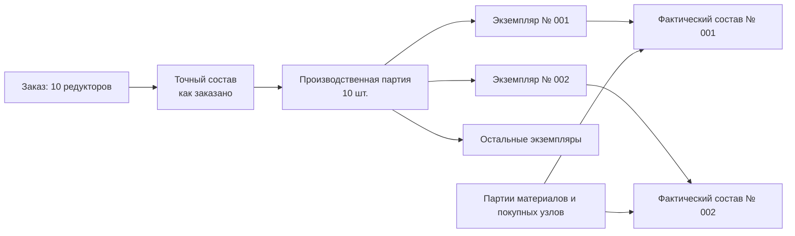

# Экземпляры, партии и фактический состав

## Четыре уровня, которые нельзя смешивать

Путь от заказа до реального изделия проходит несколько уровней учёта:

1. **Количественная потребность** — например, заказано десять редукторов.
2. **Производственная позиция** — конкретное место изделия в точном составе и плане изготовления.
3. **Идентичность экземпляра или партии** — серийный номер конкретной единицы либо номер совместно учитываемой группы.
4. **Фактический состав** — какие реальные детали, партии материалов и разрешённые отклонения вошли в результат.

Количество «10 шт.» не означает, что при создании заказа надо сразу породить десять объектов-экземпляров. Они появляются тогда, когда производство действительно начинает различать единицы: при запуске, маркировке, испытаниях или приёмке — по правилам предприятия.

## Экземпляр

Экземпляр нужен, если физическую единицу сопровождают индивидуально. Обычно у неё есть серийный или заводской номер, результаты испытаний, паспорт, история ремонтов и точный фактический состав.

Примеры индивидуального учёта: станок, насосная станция, двигатель, редуктор ответственного применения, шкаф управления с паспортом.

## Партия

Партия объединяет изделия или материалы, которые достаточно отслеживать совместно. Это может быть партия ста крепёжных деталей, плавка металла, поставка подшипников или группа однотипных изделий, изготовленная по общему запуску.

Партия не обязана совпадать с заказом. Одна партия материала может быть распределена между несколькими заказами, а один заказ — изготовлен несколькими партиями. Допустимость такой связи является важным открытым вопросом для конкретного предприятия.

## «Как заказано» и «как изготовлено»

**Как заказано** — точный состав, разрешённый и переданный до производства. Он является нормативным основанием.

**Как изготовлено** — фактический состав конкретного экземпляра или партии. В нём могут быть разрешённые замены, реальные номера покупных узлов, партии материалов, результаты доработки и отклонения.

Фактический состав не должен переписывать заказной снимок. Между ними хранится сравнимая связь: что совпало, что заменено, по какому разрешению и где применено.

После эксплуатации может появиться ещё одно состояние — **как обслуживается сейчас**. Оно отражает ремонтные замены и модернизации и также не должно стирать историю изготовления.

## Когда создаются экземпляры

Единое правило для всех предприятий невозможно. Возможны точки появления:

- выпуск серийного номера до запуска;
- создание производственного задания;
- начало сборки;
- успешное испытание;
- приёмка отделом качества;
- отгрузка заказчику.

Interlink должен поддержать выбранную политику, но не создавать экземпляры автоматически на стадии коммерческого заказа без предметного основания.

## Родословная изделия

Родословная показывает происхождение фактического изделия:

- из какого заказа и снимка оно возникло;
- по какой производственной ведомости изготовлено;
- какие экземпляры узлов установлены;
- какие партии материалов использованы;
- какие отклонения и замены разрешены;
- какие испытания выполнены;
- какие последующие ремонты изменили состав.

Эта связь особенно важна для рекламаций и отзыва дефектной партии.

## Пример 1. Три насосные станции

Заказ содержит три одинаково сконфигурированные станции. До производства это одна позиция с количеством три. После присвоения заводских номеров появляются экземпляры НС-24001, НС-24002 и НС-24003.

Во вторую станцию устанавливают двигатель из другой разрешённой партии поставщика. Заказной снимок одинаков для всех трёх, а фактическая родословная № 24002 содержит конкретный номер двигателя и основание применения этой партии.

## Пример 2. Сто болтов одной партии

Для сборки линии требуется сто специальных болтов. Индивидуальные серийные номера не нужны. Болты изготовлены одной партией, прошли общий контроль твёрдости и распределены по пяти узлам.

Система хранит связь узлов с партией болтов и протоколом контроля, не создавая сто тяжёлых карточек экземпляров. При обнаружении дефекта партии можно найти все затронутые изделия.

## Пример 3. Поставка подшипников для двух заказов

Партия из пятидесяти подшипников поступила от поставщика. Тридцать использованы в заказе на редукторы, двадцать — в заказе на насосы.

Учётная система сообщает фактическое распределение. Interlink связывает производственные экземпляры с партией поставщика, но не меняет точные заказные составы: в них по-прежнему указана разрешённая версия подшипника.

## Пример 4. Разрешённое отклонение при сборке станка

Для конкретного станка отсутствует датчик исходного производителя. Служба качества разрешает эквивалентный датчик только для экземпляра № 017.

В фактическом составе № 017 указывается установленный датчик, документ разрешения и результаты проверки. Другие экземпляры не получают эту замену автоматически. В состоянии «как заказано» остаётся исходный датчик.

## Пример 5. Замена узла при ремонте

Через два года у насосной станции заменён электродвигатель. История «как изготовлено» остаётся неизменной, а состояние «как обслуживается» получает новое событие. Пользователь может восстановить состав на дату выпуска, на дату ремонта и текущий состав.

## Границы ответственности

Interlink должен предоставить общие идентичности, версии, позиции и связи происхождения. Управление цеховыми операциями, сканирование маркировки, складские проводки и сервисное обслуживание обычно реализуются MES, ERP или специализированными модулями. Их факты возвращаются как прослеживаемые события, а не как редактирование исходной версии заказа.

## Открытые вопросы

- В какой момент и какая система присваивает серийный номер?
- Какие изделия ведутся поштучно, а какие партиями?
- Может ли партия охватывать несколько заказов и площадок?
- Как учитывается разукомплектование и повторное объединение партий?
- Кто разрешает фактическую замену и какова область её действия?
- Требуется ли хранить состояние «как обслуживается» в Interlink или во внешней системе?
- Как связать физическую маркировку с устойчивой цифровой идентичностью?

## Критерии приёмки

1. Количество заказа не создаёт экземпляры преждевременно.
2. Один заказ может породить несколько экземпляров и партий.
3. Одна партия материала может быть прослежена до всех затронутых изделий.
4. «Как заказано» и «как изготовлено» доступны независимо.
5. Замена одного экземпляра не распространяется на остальные без правила.
6. Родословная ведёт от физического изделия к заказу, снимку, ПВ и партиям компонентов.
7. Ремонтное изменение не стирает состав на момент изготовления.

## Состояние реализации

Разделение проекта, точного заказа, экземпляра, партии и факта закреплено как продуктовый принцип. Полная модель экземпляров, партий, родословной и фактического состава относится к будущему общему производственному слою и в текущем опытном образце не реализована.

## Связанные документы

- [Позиции и количества](Order-lines-and-quantities)
- [Точный состав передачи](Order-exact-publication)
- [Перепланирование и отклонения](Order-replanning)
