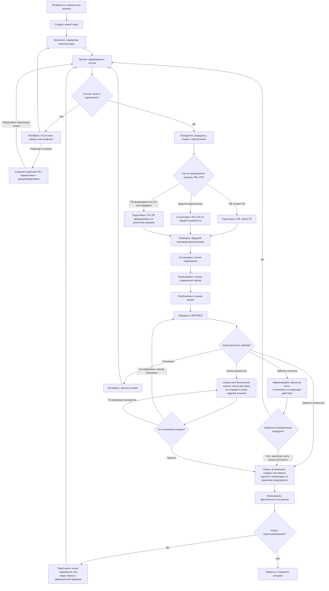
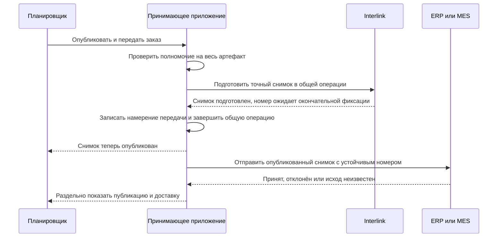

# Как пользователи ведут заказ от потребности до производства

## Зачем нужен единый сквозной путь

В заказном контуре легко смешать несколько близких понятий: заказ клиента, комплектацию изделия, производственную ведомость (ПВ), производственный заказ (ПЗ), точный состав передачи, партию и фактически изготовленный экземпляр. Тогда непонятно, что можно перепланировать, что уже нельзя менять и какой документ читает производство.

Interlink разделяет эти артефакты и связывает их происхождением. Пользователь работает в принимающем приложении; Interlink хранит версии, состав, решения и неизменяемые снимки.

## Ключевые артефакты

### Коммерческая или проектная потребность

Содержит требования заказчика, сроки, количество и ограничения. Она может находиться в системе управления взаимоотношениями с заказчиками (CRM), системе планирования ресурсов предприятия (ERP) или проектном контуре и не обязана полностью храниться в Interlink.

### Живой заказ

Версионируемый предметный объект, в котором развивается инженерно-производственное решение: позиции, количества, параметры комплектации, выбранные способы обеспечения и состояние подготовки.

Правки живого заказа сначала сохраняются в рабочей области. Сохранение не публикует их и не создаёт новую инженерную версию на каждое действие. Пакет изменения объединяет согласованный набор для публикации нового неизменяемого состояния выбранной версии. Новую инженерную версию заводят по отдельному предметному решению предприятия.

### Производственная ведомость

Самостоятельный версионируемый документ подготовки производства. Она имеет карточку, состав, рабочую и основную версии, согласование и формируемые представления. Ведомость не является синонимом заказа.

### Производственный заказ

Самостоятельный результат подготовки производственного состава. Рабочий ПЗ может содержать ещё не снятую вариантность, несколько маршрутов и предупреждения — такой путь нужен для воспроизведения IPS. Он становится готовым заданием не от самого формирования, а после проверки выбранной области выдачи и принятия по правилам предприятия. Его процессный жизненный цикл — подготовка, запуск, исполнение, приостановка и закрытие — принадлежит принимающему продукту, обычно ERP или MES. Interlink хранит инженерное содержание и точные основания, не заменяя этот производственный процесс.

### Снимок заказа

Долговечный неизменяемый снимок полного точного состава выбранной области передачи: все включённые позиции и точное содержание их версий. Производство получает его без повторного живого подбора. Необходимые нормы, маршруты, файлы и разрешения также входят в удерживаемое основание передачи; одних ссылок на современные документы недостаточно.

### Партия и экземпляр

Партия группирует производственный учёт, экземпляр представляет индивидуально учитываемую единицу. Их можно завести заранее как плановые носители, в том числе при формировании ПЗ. Отдельные принятые факты затем подтверждают изготовление, установленные компоненты, испытания и приёмку. Плановый серийный номер ещё не означает, что изделие физически существует.

## Кто участвует

| Роль | Основное решение |
|---|---|
| Менеджер заказа или проекта | Требования, количество, срок и согласованная комплектация |
| Специалист по конфигурации | Допустимые опции и конкретное изделие |
| Планировщик | Потребность, производственные ведомости, распределение и план |
| Подсистема расчёта потребности в материалах (MRP) | Расчёт валовой и обеспеченной потребности по согласованным правилам |
| Технолог | Маршрут, нормы, материалы, оснастка и допустимость изготовления |
| Специалист по снабжению | Поставщики, сроки, аналоги и способ обеспечения |
| Производственный диспетчер | Партии, экземпляры, запуск и фактическое исполнение |
| Контроль качества | Контрольные операции, отклонения и допуск результата |
| Производство | Исполнение точного переданного задания |
| ERP/MES | Финансово-ресурсный и оперативный контур, подтверждение передачи |

Названия ролей различаются между предприятиями. Важно не поглощать диспетчера планировщиком и не смешивать плановый заказ с фактическим экземпляром.

## Полный пользовательский путь

Путь начинается с рабочей подготовки, в которой разрешены нерешённые варианты. Для выдачи выделяется конкретная область, согласуется её точное содержание и публикуется снимок. Доставка и приём идут отдельно; неизвестный исход не превращается в отказ. После подтверждения производственных действий появляется фактическая история. ПВ включается в этот путь в том порядке, который принят предприятием.

## Шаг 1. Создание живого заказа

Пользователь начинает из подтверждённой потребности. Прикладное рабочее место переносит номер, клиента, проект, количество, сроки и ссылки на требования. Для каждой позиции заказа указывается предмет: изделие, комплект, услуга или другая разрешённая категория.

Если инженерная часть заказа ведётся в Interlink, создаются сам заказ, его первая инженерная версия и рабочее содержание. Пользователь может сохранить незавершённую карточку и вернуться к ней. Только отдельная проверенная публикация создаёт официальное неизменяемое состояние. Рабочий ПЗ, выделение количества к выдаче и обязательство перед производством создаёт принимающий продукт своими отдельными действиями.

Например, заказ на десять насосов можно сохранить, пока не выбран материал уплотнения. Но выдать производство всех десяти без обязательного решения нельзя. Если готовы первые четыре насоса другого исполнения, планировщик может выделить их область и подготовить именно её — не отрезать непонятную часть уже публикуемого дерева.

## Шаг 2. Комплектация

Менеджер выбирает понятные параметры: климат, напряжение, исполнение, производительность, дополнительные модули, нормативную базу, площадку и ограничения заказчика.

Система:

- подставляет разрешённые значения по умолчанию;
- показывает обязательные параметры;
- обнаруживает несовместимые сочетания;
- сохраняет происхождение требований;
- не разрешает скрытые персональные настройки состава.

### Пример

Для насосной станции выбираются расход 120 м³/ч, напор 60 м, северное исполнение, 400 В и резервный насос. Конфигуратор включает подогрев шкафа и утепление, а обычный шкаф исключает.

## Шаг 3. Пробное формирование состава

Живой расчёт проходит позиции, варианты, аналоги, применяемость и версии. Он показывает:

- включённые и исключённые позиции;
- выбранные объекты и замены;
- точные версии;
- причины выбора;
- отсутствие допустимой версии;
- предупреждения о резервном результате;
- изменения относительно предыдущего расчёта.

Это ещё не официальная передача. Пользователь может исправлять параметры и повторять расчёт.

Пробный расчёт использует явно подключённые [[контексты подбора|Selection-contexts]], а не текущие настройки другого окна. Рабочая область хранит правки; контекст хранит выборы; пакет определяет совместную публикацию. Правка самой общей подсборки сначала видна лишь тем расчётам, которые явно читают её рабочее содержание. После публикации её получают живые применения, чьи правила выбирают новое состояние; точные прежние привязки и снимки не меняются. Решение только для левого насоса конкретной станции сохраняется в области этого заказа и полного места использования, а не переписывает общую подсборку.

Жёстко выбранная инженерная версия не всегда означает неизменяемое содержание: у версии Б может появиться новое опубликованное состояние. Для точной передачи выбирается конкретное состояние. [[Мягкое предпочтение|Selection-soft-concretion]] — отдельное сохраняемое намерение, которое может быть перекрыто более приоритетным источником или временно выключено по известной причине. Оно не превращается в случайную настройку текущего пакета.

## Шаг 4. Разбор проблем

### Нет допустимой версии

Владелец позиции получает задачу: выпустить нужную версию, изменить срок или серию либо предложить аналог. Разовое исключение по заказу оформляется принимающим продуктом как отдельное решение с основанием и не называется автоматическим резервным подбором.

### Несовместимые опции

Менеджер видит конкретные параметры и правило. Он меняет комплектацию или передаёт запрос владельцу продукта.

### Резервный выбор

Система показывает, почему штатное правило не дало результата, какая версия предложена и какие риски существуют. Для производственной публикации исключение согласует уполномоченная роль.

### Неоднозначный аналог

Снабжение и инженер выбирают из квалифицированных вариантов для конкретного заказа. Решение не обязано становиться глобальным правилом предприятия.

Если разрешение относится к исходной версии двигателя, сначала устанавливают именно эту версию и читают её допуск. Потом выбирают заменитель, подбирают его версию и содержание и проверяют весь получившийся комплект. Допуск соседней исходной версии не используется «на всякий случай». Если выбранное содержание не прошло совместимость, система сообщает причину, а не молча берёт более старую версию.

### Неполный или конфликтующий комплект замены

[[Библиотека альтернатив|Allowed-replacements]] может предлагать вместо двигателя и муфты мотор-редуктор, плиту и крепёж. Заказ выбирает полный комплект и связывает его роли со своими позициями. Отсутствие плиты блокирует применение целиком. Другой заказ может выбрать стандартный комплект той же библиотеки, не меняя выбор первого.

Проверяются также сохраняемые узлы. Если два решения требуют один существующий контроллер, это не заказ двух контроллеров. Но третье решение не вправе снять общий контроллер, пока он необходим остальным. Ошибка показывается как конфликт выбранных действий, а не как запрет хранить несколько предложений в библиотеке.

## Шаг 5. Маршрут, нормы и обеспечение

Технолог определяет, как изготовить каждую производимую позицию: маршрут, операции, материалы, оборудование, оснастку, контроль и нормы. Планировщик и снабжение решают, что производить, покупать или получать по кооперации.

В заказе сохраняются точные ссылки на используемые версии процессов и нормативов либо правила их выбора. Изменение технологии после первой передачи не должно бесшумно переписать прежний снимок.

[[Справочные таблицы|Reference-tables]] позволяют искать сортамент по размерам и материалу, [[многомерные таблицы|Multidimensional-tables]] — читать норму или испытание по нескольким условиям, [[координатные карты|Coordinate-maps]] — получать кандидатов изделия либо покрытия. Таблица не выбирает за технолога, если результат неоднозначен. Отсутствующая точка не становится нулевой нормой. Для выпуска сохраняются точная редакция данных, использованные значения, единицы, формулы и округления.

Например, для партии из шести валов норма обработки составляет 12 минут на вал, а наладка — 40 минут на партию. Итог равен 112 минутам, а не шести полным наладкам. Если партия разделена между двумя площадками, расчёт учитывает отдельную наладку по каждой выбранной технологии и показывает причину изменения.

## Шаг 6. Производственная ведомость

Производственная ведомость имеет собственный номер, версии и согласование. Пользователь может сравнить рабочую ведомость с выбранной официальной, сформировать отчёт и связать её с заказом.

Универсальный порядок между ПВ и ПЗ пока не закреплён, потому что установки IPS используют разные процессы:

- ПВ может сначала собрать потребность и стать входом для подготовки ПЗ;
- ПВ и ПЗ могут развиваться параллельно и сверяться перед передачей;
- ПВ может формироваться из уже подготовленного ПЗ или из принятого снимка передачи.

Во всех вариантах ведомость отвечает на вопросы подготовки и потребности, а ПЗ сохраняет производственное решение — сначала рабочее, затем пригодное к конкретной выдаче. Приём и исполнение выделенного задания происходят отдельно. Точную связь ПВ, ПЗ и снимка предприятие подтверждает при обследовании; Wiki не выдаёт один вариант за обязательный для всех.

## Самостоятельный жизненный цикл производственного заказа

Независимо от места ПВ принимающий продукт ведёт ПЗ по полному процессу:

1. **Подготовка.** Создаётся задание, определяются количество, сроки и область исполнения.
2. **Расчёт.** Уточняются комплектация, потребность, маршрут, нормы и обеспечение.
3. **Проверка и согласование.** Ответственные видят один и тот же будущий результат и разбирают ошибки.
4. **Официальное содержание ПЗ.** Принимающий продукт фиксирует проверенный результат своей подготовки. Это ещё не ответ внешней системы о приёме задания.
5. **Снимок и передача.** Interlink строит точный инженерный состав для одной официальной передачи; ERP/MES принимает его как внешний потребитель.
6. **Исполнение.** Принимающий продукт ведёт запуск, партии, операции, остановки и фактическое завершение.
7. **Перепланирование.** Рабочая правка после согласования публикует новое состояние выбранной инженерной версии либо новой версии по предметному правилу. Новая деловая передача получает новое основание и снимок; повтор доставки прежней — не получает.
8. **Закрытие.** ПЗ закрывается в принимающем продукте; снимки Interlink остаются неизменяемыми свидетельствами прежних передач.

## Шаг 7. Предпросмотр производственного заказа

Перед согласованием рабочее место собирает будущее состояние:

- позиции и количества;
- точный многоуровневый состав;
- версии документов и процессов;
- маршруты и нормы;
- решения по обеспечению;
- влияние на сроки и ресурсы;
- предупреждения и исключения;
- разницу с прежней передачей, если это перепланирование.

Проверка проходит до листьев. Нельзя опубликовать «почти полный» заказ с потерянной глубокой позицией.

## Шаг 8. Согласование точного содержания

Принимающий продукт показывает один и тот же будущий результат инженерам, планированию, снабжению, производству и качеству. Решения относятся к точному отпечатку содержания.

Если в согласованный предмет подставляют другое количество крепежа или иное содержание маршрута, прежнее разрешение больше не подходит. Политика определяет, какие роли должны принять решение повторно. Само появление новой неиспользованной редакции справочника не переписывает старое согласование: отдельно проверяется, не отозван ли сегодня допуск к его применению.

## Шаг 9. Проведение живого заказа

Interlink повторно проверяет выбранный пакет и публикует новые неизменяемые состояния его участников целиком. Это могут быть следующие состояния уже существующих инженерных версий; новые версии возникают только по явному решению. Несвязанные рабочие правки не публикуются вслед за ними. Процессный статус ПЗ меняет принимающий продукт; Interlink не присваивает заказу статус «запущен в производство».

Проведение заказа ещё не означает передачу в производство. Оно создаёт официальную версию, из которой можно опубликовать снимок.

## Шаг 10. Публикация снимка заказа

Сначала принимающий продукт проверяет, имеет ли пользователь полномочие на весь публикуемый артефакт. Если нет, операция запрещается до построения снимка. Если да, Interlink проходит весь состав без построчной фильтрации по правам, выбирает точные версии и сохраняет полное дерево. Любой пропуск, запрещённый цикл или отсутствие обязательной версии останавливает публикацию целиком.

Снимок сохраняет точный корень, структуру, контекст и происхождение. Принимающий продукт связывает его с номером деловой передачи, получателем и назначением. Он не изменяется. При исправлении создаётся новое основание; повтор отправки прежнего основания не создаёт новый снимок.

Ядро снимка не копирует автоматически все документы, файлы и атрибуты объектов. Оно сохраняет точные позиции, содержание выбранных версий, существенные данные позиции, контекст и причины выбора. Для производственной передачи принимающий продукт обязан удержать все необходимые основания: использованные маршруты и нормы, количественные условия, допуски замен, нужные файлы и документы. Они включаются в точный состав либо в связанный неизменяемый комплект. Юридическая подпись и состав архивного пакета зависят от процесса предприятия, но ссылка на «нынешнюю таблицу норм» не заменяет обязательного исторического основания.

Одно опубликованное состояние заказа может иметь несколько снимков, если выполняется несколько самостоятельных передач без изменения инженерного содержания. Снимок сам не делит количество. Для передачи части количества принимающий продукт создаёт отдельную область и явное распределение либо публикует новое состояние с разделёнными областями; только после этого Interlink строит снимок для получившейся точной области.

## Шаг 11. Передача в ERP и MES

Схема показывает один способ согласованной локальной фиксации. Во всех поддержанных способах обязательные данные, подтверждение операции, аудит и задание отправки должны сохраниться вместе. Нельзя сначала объявить снимок опубликованным, а потом надеяться записать обязательное задание доставки. Если операция подтверждённо отменена, подготовленный номер не становится опубликованным. Если же потеряно подтверждение самой фиксации, исход сначала устанавливают: отсутствие ответа не доказывает откат.

После публикации внешняя передача имеет собственный исход. При потере ответа ERP/MES принимающий продукт сверяет результат по устойчивому номеру либо повторяет ту же доставку по доказанному договору защиты от дублей. Пользователь видит: ожидает отправки, отправляется, принят полностью, принят частично, отклонён, исход неизвестен или сверён. Новый номер не используется для обхода неизвестного результата.

При частичном приёме пользователь видит принятые и отклонённые позиции, причину и согласованное следующее действие: исправить справочник, подготовить исправляющую передачу, оформить явное распределение количества или выполнить сверку. Автоматический безопасный повтор возможен только при явно согласованном договоре с внешней системой; Interlink сам по себе не гарантирует, что любое внешнее действие можно повторить без дубликата.

## Шаг 12. Партии и экземпляры

Снимок заказа сам не создаёт партии и номерные экземпляры. Производственный процесс принимающего продукта создаёт или связывает их до начала исполнения либо уже во время изготовления и записи фактов — точный момент настраивается по правилам предприятия. Долговечный снимок заказа остаётся основанием, а фактический контур фиксирует:

- что действительно установлено;
- какие серийные номера компонентов использованы;
- какие допустимые отклонения оформлены;
- какие операции выполнены;
- результаты контроля;
- происхождение материалов и партий.

Фактический состав не должен переписывать плановый снимок. Он изменяется только по принятым подтверждениям реальных действий. Разрешение заменить двигатель, выдача двигателя со склада и подтверждённая установка не равны друг другу. Разница с нормативным основанием становится отдельным прослеживаемым фактом; сервисная доработка различает снятие, установку и изменение сохраняемого узла.

## Шаг 13. Перепланирование

Поводом может быть срыв поставки, изменение требования, производственный дефект или новая допустимая замена.

Пользователь открывает рабочее содержание от явно выбранного опубликованного основания и готовит пакет нужных правок. Будущий расчёт сравнивается с действующей передачей. После согласования публикуется новое состояние; необходимость новой инженерной версии определяется отдельно. Новая деловая передача получает снимок своего основания, а повтор доставки прежней использует прежний снимок.

Производство получает явное указание перейти на новую передачу. Уже выполненные операции и фактические экземпляры учитываются отдельно; система не предполагает, что весь заказ можно заменить без остатка. Частичное количество оформляется деловым артефактом принимающего продукта, а не скрытым изменением границы снимка.

Для повторяющихся подсборок решение указывает не только деталь, но и точную передачу, верхнее изделие в ней и полный путь до места установки. «Подшипник насоса» недостаточно, когда насосы есть в обеих очередях заказа. Перенос решения на изменённую структуру проверяется явно. Новое состояние заказа не обнуляет прежние распределения; количество с неизвестным внешним приёмом не считается свободным.

## Состояния, которые видит пользователь

### Живой заказ

Рабочие данные сохранены; выбранное содержание проверяется или согласовано; точное состояние опубликовано; готовится следующая правка. Закрытие, отмена и разрешение производства — отдельные процессные названия принимающего продукта, а не состояния каждого инженерного содержимого.

### Предметный пакет Interlink

Открыт, проводится, проведён или отменён. Эти состояния не смешиваются с заданиями согласования.

### Снимок заказа

Во время общей операции будущий снимок может быть только подготовлен и ещё не виден потребителям. После окончательной фиксации он опубликован и неизменяем. «Отклонена» относится к попытке публикации: при такой ошибке артефакт снимка не возникает.

### Внешняя передача

Ожидает отправки, отправляется, принята полностью, принята частично, отклонена, исход неизвестен или сверена. Для частичного приёма сохраняются принятые и отклонённые позиции, причина и следующее действие. Это состояние интеграции, а не заказа Interlink.

### Исполнение

Планируется, запущено, приостановлено, завершено либо закрыто с отклонением — принадлежит производственному контуру.

Для этих пяти этапов нужны отдельные статусы: готовность одного из них не подтверждает завершение остальных.

## Целевые рабочие места

### Карточка заказа

Требования, позиции, количество, текущая официальная версия, ответственные, связанные ведомости, передачи и фактическое исполнение.

### Комплектация

Параметры, ограничения, выборы по умолчанию, несовместимости и сравнение вариантов.

### Состав и проблемы

Многоуровневое дерево, причины выбора версий, отсутствие результата, аналоги, резерв и действия владельцев.

### Подготовка производства

Маршруты, нормы, обеспечение, ведомости и влияние на сроки.

### Публикации

Список снимков с различиями, решениями, статусом доставки и используемой внешней системой.

### Исполнение

Партии, экземпляры, фактический состав, отклонения и контроль.

## Пример 1. Серийный заказ на редукторы

Заказ содержит 50 редукторов РЦ-250 серии 145–194. Применяемость выбирает усиленный подшипниковый узел. На этом предприятии производственная ведомость сначала рассчитывает потребность и становится входом подготовки ПЗ. До первой публикации планировщик делит исполнение на очередь из 10 редукторов и остаток из 40. Принимающий продукт создаёт отдельный корень первой передачи либо явное распределение количества 10 и только затем публикует для этой области снимок №1.

Первые десять редукторов запускаются и изготавливаются по снимку №1. Через неделю меняется поставщик стандартного крепежа для ещё не запущенного остатка. Если новый объект является допустимым аналогом, планировщик готовит и публикует новое содержание заказа либо оформляет отдельное задание второй очереди. Принимающий продукт создаёт область и распределение оставшихся 40 и публикует для неё снимок №2. Первый снимок и фактический состав изготовленных десяти редукторов сохраняют прежний крепёж. Распределением количества владеет принимающий продукт — это может быть ERP, MES или другой производственный модуль предприятия; Interlink фиксирует уже определённую область и сам не вычисляет остаток строки.

## Пример 2. Заказной обрабатывающий центр

Заказ содержит механическую, электрическую и программную комплектации. Пробный расчёт выявляет конфликт напряжения привода и выбранной площадки. После исправления совместный пакет дисциплин выпускает совместимые версии. Долговечный снимок заказа фиксирует не только верхний станок, но полный точный состав до закупаемых компонентов.

MES принимает передачу, создаёт производственную партию и серийный экземпляр. Позднее замена датчика оформляется как отклонение экземпляра и, если решение должно стать типовым, отдельное инженерное изменение модели изделия.

## Пример 3. Сервисный заказ

Для ремонта пресса сначала открывается исторический снимок изготовленного изделия. Затем живой ремонтный расчёт предлагает современный гидрораспределитель и комплект перехода. После согласования публикуется отдельный снимок ремонтного заказа. Он не переписывает исходный состав пресса; фактическая установка обновляет историю конкретного экземпляра.

Перед новым применением проверяется действительность допуска комплекта, даже если такой комплект успешно применялся пять лет назад. История может объяснить прошлый выбор, но не даёт бессрочного разрешения на новый ремонт. Требуемые исторические файлы и средства их чтения удерживаются по срокам и обязательствам предприятия; недоступный старый файл не подменяется современным под тем же именем.

## Типовые ошибки

| Ошибка | Что видит пользователь | Действие |
|---|---|---|
| Неполная комплектация | Конкретные обязательные параметры | Заполнить или получить решение владельца продукта |
| Нет версии в глубине состава | Путь позиции и проверенные правила | Выпустить версию, изменить контекст или согласовать резерв |
| Снимок не опубликован | Причина и отсутствие частичного артефакта | Исправить заказ и повторить |
| ERP/MES не ответила | Публикация отделена от неизвестного исхода доставки | Выполнить сверку по устойчивому номеру |
| Производство уже начало работу | Разница между передачами и фактически выполненные операции | Согласовать переход или оформить отклонение |
| Живой расчёт устарел | Какие входы изменились после последней проверки | Пересчитать и повторить нужные решения |

## Что меняется относительно IPS

Interlink сохраняет функциональную потребность IPS в комплектациях, производственных ведомостях, заказах, точном составе, партиях и экземплярах. При этом:

- живой заказ явно отделён от неизменяемого снимка передачи;
- производственная ведомость и заказ не объединяются, а их порядок определяется процессом конкретного предприятия;
- подбор состава объясним и использует единый порядок;
- рабочая правка, публикация состояния и создание новой инженерной версии различаются; отдельные передачи неизменившегося содержания могут иметь разные снимки;
- плановое и фактическое состояния не переписывают друг друга;
- предметная публикация и внешняя доставка имеют разные состояния;
- интерфейс, маршрут и интеграция используют общие типизированные данные.

Точные границы ПВ, ПЗ, партий и экземпляров ещё необходимо подтвердить на нескольких установках IPS.

## Состояние реализации

Заказный контур является целевой продуктовой моделью. Базовая предметная модель Interlink развивается сейчас; полный подбор, применяемость, живой заказ, бизнес-снимок, фактические экземпляры, MRP/MES-интеграция и пользовательские рабочие места находятся на последующих этапах. Документ нужен для согласования требований и будущей приёмки, а не описывает готовую систему.

Связанные документы: [[Общая модель и границы заказного контура|Order-boundaries]], [[Жизненный цикл живого заказа|Order-lifecycle]], [[Точный состав и публикации заказа|Order-exact-publication]], [[Формирование производственного заказа|Order-production-composition]], [[Экземпляры, партии и фактический состав|Order-units-lots-as-built]], [[MRP, ERP/MES и длительные операции|Order-integration]].
