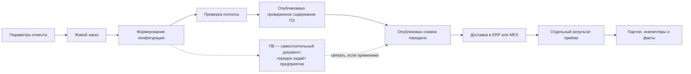

# Заказы и производство

## Почему заказа недостаточно представить одной карточкой

В машиностроении слово «заказ» может означать несколько разных вещей:

- коммерческую потребность клиента;
- набор параметров будущего изделия;
- живую инженерную конфигурацию;
- точное изделие с собственным обозначением;
- утверждённое задание производству;
- передачу в систему планирования ресурсов предприятия (ERP) или систему управления производством (MES);
- партию или набор физических экземпляров.

Interlink должен разделять эти смыслы и сохранять связи между ними.

## Живой заказ и официальная передача

Пока заказ прорабатывается, он может следовать за новыми допустимыми версиями, получать уточнённые параметры и ручные решения. Это живой предметный объект с историей инженерных версий и опубликованных состояний каждой версии. Рабочие правки можно сохранять многократно до публикации; новое сохранение не означает ни нового обозначения версии, ни нового задания производству.

Рабочий ПЗ разрешено сформировать с ещё не снятой вариантностью: например, оставить два допустимых двигателя и два маршрута для дальнейшего выбора. Незаданное количество или нерешённый вариант видны как проблемы подготовки. Строгая проверка однозначности относится к выделенной области официальной передачи, а не запрещает сохранять такой промежуточный результат.

После согласования публикуется проверенное содержание ПЗ. Для одной официальной передачи отдельным решением публикуется неизменяемый снимок точного состава. Затем принимающий продукт доставляет его получателю и отдельно ведёт результат приёма: полностью, частично, отказ или неизвестный исход. Эти четыре события нельзя объединять одним состоянием «опубликовано».

Схема показывает движение от потребности к точной передаче и подтверждённому исполнению. ПВ остаётся отдельным документом; её место задаёт предприятие. Успех публикации не доказывает приём ERP/MES, а приём задания не доказывает, что изделие уже собрано.

## Строки и количества

Количество в строке заказа не всегда равно количеству позиции состава. Заказ может включать десять редукторов, один общий комплект запасных частей и два срока поставки. Внутри каждого редуктора используются собственные количества компонентов.

Поэтому нужно отдельно определить:

- номер и устойчивость строки заказа;
- единицу измерения;
- количество и правила округления;
- частичную отмену;
- разделение поставки;
- комплектные позиции;
- связь с конкретной конфигурацией.

## Конфигурация и точное изделие

Набор параметров заказчика может остаться особенностью одного заказа либо стать повторно используемым точным изделием. Например, одинаковая насосная станция с определённым климатическим исполнением может поставляться нескольким заказчикам.

Перед созданием нового точного изделия полезно искать уже существующую эквивалентную конфигурацию. Решение о новом обозначении остаётся предметным действием ответственного специалиста.

## Формирование производственного состава

Производственный результат объединяет:

- выбранные версии деталей и узлов;
- окончательное присутствие позиций;
- развёрнутые количества;
- способы обеспечения: изготовление, закупка или кооперация;
- площадку и маршрут;
- нормы материала и труда;
- разрешённые отклонения;
- предупреждения и незакрытые проблемы.

Позиция, исключённая конфигуратором, отличается от обязательной позиции без подходящей версии. Первая не нужна в исполнении, вторая блокирует готовность или требует решения.

## Маршруты, нормы и правила

Технологические правила могут выбирать маршрут, оборудование, профессию и норматив. Важны не только итоговые числа, но и происхождение:

- какая версия правила использовалась;
- какие исходные данные были поданы;
- какое ручное исключение сделал технолог;
- как учтены наладка, отходы, размер партии и брак.

Interlink предоставляет объектное и версионное основание. Предметный модуль технологии владеет расчётами и объяснением результата.

## Производственная ведомость

ПВ является самостоятельным версионным документом и не обязана появляться после снимка. Она может готовить ПЗ, развиваться параллельно либо опираться на принятую передачу. Со снимком связывается конкретная версия ПВ только в применимом процессе предприятия. Для неё нужно уточнить:

- является ли она полным комплектом или ссылочным набором;
- сколько ведомостей создаётся на один заказ;
- кто её подписывает;
- какие документы обязательны;
- как оформляется добавочная передача;
- можно ли исправить только оставшееся количество.

Interlink должен сохранить точное основание ведомости, но форма документа и процесс согласования принадлежат прикладному продукту.

## Граница с планированием ресурсов предприятия и управлением производством

Для каждого факта назначается один владелец. Возможный вариант:

- Interlink владеет инженерной конфигурацией и точным снимком;
- ERP владеет коммерческим заказом, остатками и укрупнённым планом;
- MES владеет заданиями, ходом изготовления и частью фактической родословной.

Это не универсальное правило: граница уточняется для предприятия. При задержке, нарушении порядка, частичном отказе или неизвестном исходе принимающий продукт выполняет сверку. Защиту от дублей и автоматический повтор можно обещать только при явно согласованном договоре ERP/MES; без него слепой повтор запрещён.

## Экземпляры, партии и фактический состав

Физические единицы и партии могут появляться до запуска либо уже во время изготовления — в момент, установленный процессом предприятия. Проектный состав отвечает «как спроектировано», снимок производства — «что планировалось изготовить», фактическая родословная — «что действительно установлено».

Замена двигателя при монтаже не переписывает проектную версию. Она становится фактом с периодом действия, основанием и ответственным.

Разрешение заменить двигатель и подтверждение его установки записываются раздельно. Пока исполнитель не сообщил, что конкретный двигатель установлен, и этот факт не принят по правилам предприятия, фактический состав остаётся прежним. Плановые партии и экземпляры разрешено создать заранее, в том числе при формировании ПЗ, но они ещё не доказывают изготовление.

## Новые средства подготовки заказа

Для стандартного вала технолог выбирает строку сортамента по диаметру и материалу. Для серии валов он получает нормы по сочетанию материала, операции и размера партии. Для ответственного клапана проверяет таблицу испытаний по среде, температуре и давлению. Это разные формы [[табличных данных|Reference-tables]], а не один вложенный файл. В точную передачу включается использованная редакция и необходимые результаты, поэтому последующая правка нормы не меняет прежнее основание.

[[Библиотека допустимых замен|Allowed-replacements]] позволяет применять проверенный комплект в разных заказах независимо. Замена двигателя может одновременно требовать другую плиту и крепёж, но сохранять существующий контроллер. Система проверяет и добавляемые детали, и то, что требуемый контроллер не снимается другой выбранной заменой. [[Совместимость|Compatibility-matrices]] оценивается по всему комплекту и выбранному содержанию версий, а не только по названиям изделий.

Например, для северной очереди насосных станций выбирается морозостойкий комплект, для южной — стандартный. Оба решения могут опираться на одну библиотеку, не переключая общий «текущий вариант». Если допуск аналога относится только к определённой исходной версии двигателя, сначала устанавливают эту версию и читают её допуск; затем выбирают заменитель, его версию и проверяют итоговый комплект.

Открытые вопросы собраны на странице [[Технология, заказы и производство|Questions-orders]].

## Подробный пакет документов

Эта глава служит обзором. В [[подробном путеводителе по заказам|Orders-guide]] отдельно рассмотрены строки и количества, жизненный цикл живого заказа, точная публикация, производственный состав, маршруты и нормы, ведомости, экземпляры, перепланирование, обмен с другими системами, роли и сквозные сценарии.

Начать с полного пути пользователя удобнее на странице [[Как заказ проходит от потребности до производства|Order-user-operating-model]]. Она разделяет живой заказ, производственную ведомость, производственный заказ, снимок передачи, внешнюю доставку, партии и фактическое исполнение.

## Состояние реализации

Заказный контур является целевой продуктовой моделью. Живые заказы, полный подбор, бизнес-снимки, производственные ведомости, партии, экземпляры и ERP/MES-интеграция ещё не составляют готового модуля Interlink. Документы фиксируют требования, границы и будущие приёмочные сценарии.
