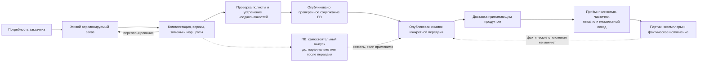

# Заказы в IPS и Interlink

## Назначение пакета

Этот комплект предназначен для продуктовых специалистов IPS, специалистов по конфигурации изделий, планировщиков производства, технологов и руководителей внедрения систем управления жизненным циклом изделия (PLM). Он объясняет весь заказной контур — от потребности заказчика до точной передачи состава в производство и последующей связи с партиями, экземплярами и внешними учётными системами.

Главный вопрос пакета:

> Как сохранить сильные возможности заказов IPS, но разделить живое планирование, точный переданный состав, производственные документы и фактическое исполнение так, чтобы каждое состояние было воспроизводимо и объяснимо?

Документы не утверждают, что весь описанный контур уже реализован в Interlink. Они описывают принятый целевой договор и будущую пользовательскую работу. При этом принципиальные заказные сценарии проверяются уже при опытной проверке фундамента: нельзя сначала окончательно построить подбор и хранение, а затем обнаружить, что они не допускают вариантный ПЗ, частичную передачу или комплектную замену. Полноценные рабочие места и производственные интеграции появятся позже.

## Короткий ответ

В Interlink **заказ остаётся живым версионируемым предметным объектом предприятия**. Он содержит позиции: что требуется изготовить или поставить, в каком количестве и в какой комплектации. Пока заказ планируется, он может читать актуальную конструкторскую и технологическую документацию, получать новые версии и контролируемые замены.

Рабочий производственный заказ (ПЗ) может быть сформирован ещё до окончательного выбора заменителей и маршрутов. Специалисты сохраняют его, видят нерешённые места и продолжают подготовку. Это воспроизводит важный путь IPS и не означает, что производство уже приняло задание.

Для официальной передачи сначала определяют конкретную область: например, первую очередь из десяти насосов. В ней уже необходим однозначный допустимый результат. После согласования публикуется инженерное содержание заказа и отдельным решением — **неизменяемый снимок точного состава**; затем принимающий продукт доставляет его во внешнюю систему и отдельно фиксирует результат приёма. Публикация содержания, публикация снимка, доставка и приём — четыре разных события. Одно опубликованное состояние заказа может иметь несколько снимков, а новый снимок не переписывает предыдущий.

Производственная ведомость (ПВ) также является самостоятельным версионным документом. В зависимости от процесса предприятия она может готовить ПЗ, развиваться параллельно с ним или формироваться из принятой передачи. Со снимком связывается конкретная версия ПВ только там, где такая связь действительно нужна.

Такой подход сохраняет важное поведение IPS: заказ можно развивать, но ранее переданный производственный результат остаётся неподвижным и доступным для разбора истории.

## Какие понятия нельзя смешивать

| Понятие | Что это | Чем не является |
|---|---|---|
| Комплектация | Переиспользуемый набор частично заданных параметров изделия | Не точный заказ и не физический экземпляр |
| Заказ | Живой предметный объект с позициями, количествами и выбранными условиями | Не неизменяемый снимок и не полный процесс ERP |
| Рабочий ПЗ | Подготавливаемый производственный состав, в том числе с ещё не выбранными вариантами | Не уже принятое задание; разрешённая незавершённость не равна готовности передачи |
| Точный состав передачи | Однозначный состав, опубликованный для конкретной официальной передачи | Не текущий живой вид заказа и ещё не подтверждение доставки |
| Точное изделие | Самостоятельное изделие, созданное из конфигурируемого прототипа и получившее собственную историю | Не обязательный побочный результат каждого заказа |
| Производственная ведомость | Самостоятельный версионный производственный документ с карточкой, составом, проверкой и подписью | Не синоним заказа и не просто печатная форма |
| Экземпляр | Конкретная индивидуально учитываемая физическая единица | Не версия проекта и не количество строки заказа |
| Партия | Совместно учитываемая группа изделий или материалов | Не одна версия объекта и не снимок состава |
| Как заказано | Точный нормативный результат, предназначенный для производства | Не подтверждение доставки и не доказательство того, что именно было изготовлено |
| Как изготовлено | Состав, подтверждённый принятыми фактами изготовления и установки | Не переписанный проектный состав и не одно разрешение будущей замены |

## Что подтверждено материалами IPS

Исследованная база IPS подтверждает следующие потребности:

- заказ может включать несколько верхнеуровневых изделий и комплекты запасных частей;
- количество хранится на позиции заказа;
- значения опций могут задаваться отдельно для разных позиций;
- производственный заказ формируется с учётом версий, контекстов, применяемости, аналогов, замен и маршрутов;
- трассировка показывает ошибки и неоднозначные решения;
- после формирования заказа возможны контролируемые замены изделия, версии или маршрута;
- производственные ведомости имеют собственные версии, состав, согласование и подпись;
- материалы, трудоёмкость и данные для 1С могут рассчитываться по составу заказа с учётом количеств;
- экземпляры и партии отделены от типового проектного изделия;
- последующее изменение нормативного изделия не должно незаметно менять ранее переданный результат.

Практика одной изученной установки IPS уточнила важную границу: заказ частично играет роль сбытовой потребности, но цен, сроков, складов и полноценного портфеля заказов в его стандартной предметной модели нет. Эти данные могут добавляться предприятием или жить во внешней производственной и учётной системе. Для других установок это необходимо проверить отдельно.

## Что принято в Interlink

Ключевые решения:

- заказ — обычный версионируемый тип объекта модели предприятия;
- его строки являются позициями состава заказа и могут включать изделия, отдельные поставочные комплекты и ЗИП;
- цены, сроки, статусы, отгрузка и портфель не являются встроенными понятиями ядра;
- опции и условия заказа входят в явные условия формирования состава;
- рабочая область хранит незавершённые правки; независимый контекст подбора хранит принятые предпочтения; пакет изменения определяет, что публикуется совместно;
- сохранение рабочей правки ещё не публикует её; новое опубликованное состояние может принадлежать той же инженерной версии заказа, а новую инженерную версию создают по отдельному предметному решению;
- выпуск версии ПЗ не равен публикации снимка конкретной передачи;
- для каждой существенной передачи создаётся отдельный неизменяемый снимок полного точного состава;
- доставку снимка и результат его приёма ведёт принимающий продукт как отдельное состояние интеграции;
- старый снимок не пересчитывается после выпуска новых версий, правил или конфигураций;
- производственная ведомость выпускается самостоятельно и связывается со снимком только при применимости; процесс согласования, подпись, MRP и обмен с ERP/MES остаются предметными модулями и функциями принимающей системы;
- экземпляры, партии и фактическая история относятся к будущему общему производственному слою, а не к текущему ядру Interlink.

## Что добавилось в новой модели

У заказа появляется собственный выбор из переиспользуемой библиотеки допустимых комплектов. Например, один заказ редукторов использует стандартный привод, второй — усиленный привод с другой плитой и крепежом. Выбор второго заказа не переключает общий состав для первого. Проверяется весь комплект, включая сохраняемые узлы, а не только попарная заменяемость деталей.

Табличная нормативно-справочная информация становится доступной для поиска и расчёта как данные, а не только как приложение к документу. Для заказа можно найти сортамент по размерам, норму по материалу и операции, а разрешённое покрытие — по материалу поверхности и условиям эксплуатации. Результат передачи сохраняет использованную редакцию справочника и основания выбора. Обновление справочника не пересчитывает вчерашнюю передачу.

Более сложные проверки могут учитывать сразу несколько участников: привод, контроллер, прошивку и режим работы. Совместимость каждой пары недостаточна, если комплект в целом превышает мощность питания. Проверка выполняется по фактически выбранному содержанию версий; ошибка не скрывается автоматической подстановкой другой версии.

Продолжение: [[Допустимые замены|Allowed-replacements]], [[Матрицы совместимости|Compatibility-matrices]], [[Справочные таблицы|Reference-tables]], [[Многомерные таблицы|Multidimensional-tables]], [[Координатные карты подбора|Coordinate-maps]].

## Состав пакета

### Основа заказа

- [[Общая модель и границы заказного контура|Order-boundaries]]
- [[Позиции заказа, количества и несколько изделий|Order-lines-and-quantities]]
- [[Комплектации, опции и точное изделие|Order-configuration]]
- [[Жизненный цикл живого заказа|Order-lifecycle]]
- [[Точный состав и публикации заказа|Order-exact-publication]]

### Подготовка производства

- [[Формирование производственного заказа|Order-production-composition]]
- [[Маршруты, нормы и решения о способе обеспечения|Order-routes-and-norms]]
- [[Производственные ведомости, документы и отчёты|Order-production-documents]]

### Исполнение и изменения

- [[Экземпляры, партии и фактический состав|Order-units-lots-as-built]]
- [[Перепланирование, замены и история изменений|Order-replanning]]
- [[MRP, ERP/MES и длительные операции|Order-integration]]
- [[Роли, согласование и права|Order-roles-and-approval]]

### Сквозная проверка

- [[Сквозные машиностроительные сценарии|Order-end-to-end]]
- [[Покрытие, открытые вопросы и состояние реализации|Order-coverage-and-status]]
- [[Как пользователи ведут заказ от потребности до производства|Order-user-operating-model]]

## Как читать пакет на продуктовой встрече

Рекомендуемый порядок:

1. Сначала пройти [[полный пользовательский путь|Order-user-operating-model]] и согласовать различие живого заказа, точного снимка, производственной ведомости, производственного заказа и фактического изделия.
2. На реальном заказе предприятия перечислить позиции, количества, комплектации и требуемые выходные документы.
3. Определить, какие решения принимаются автоматически, а какие требуют участия специалиста.
4. Отдельно отметить данные PLM и данные внешней производственной или учётной системы.
5. Проверить перепланирование: что меняется в живом заказе и что обязано остаться неизменным.
6. Согласовать момент появления серийных экземпляров и партий.
7. Зафиксировать ответы в профиле конкретной установки IPS и приёмочных сценариях.

## Состояние реализации

По состоянию проектных решений на 6 сентября 2026 года заказной контур является целевой продуктовой моделью. Его основные архитектурные ограничения и малые сквозные проверки входят в развитие фундамента; полный прикладной модуль строится поэтапно.

В Interlink уже приняты базовые понятия объекта, версии, позиции состава, явных условий подбора, адреса позиции и неизменяемого снимка. Сейчас развивается фундамент модели и типизированной прикладной поверхности. Запись предметных данных, многоуровневый подбор, применяемость, конфигуратор, бизнес-снимки заказа, производственные документы, экземпляры и партии относятся к последующим этапам.

Следовательно, этот пакет является продуктовой спецификацией, картой решений и основой будущей приёмки. Его нельзя использовать как утверждение о готовом пользовательском модуле заказов.

## Основные источники

- [[Функциональная база IPS|From-IPS-to-Interlink]]
- [[Формирование состава: IPS → Interlink|Versions-and-composition]]
- [[Версии, изменения и снимки|Changes-and-evidence]]
- [[Матрица функционального покрытия|Current-state-and-roadmap]]
- [[Глоссарий|Glossary]]
- [[Реестр источников|Trust-and-sources]]

Публичная книга передаёт выводы из рабочих материалов своими словами. Принципы проверки и ограничения публикации описаны в [[разделе об источниках и доверии|Trust-and-sources]].
