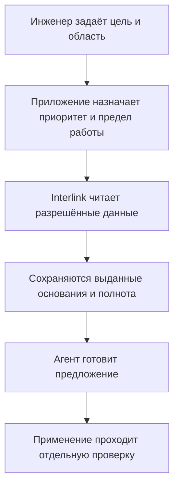
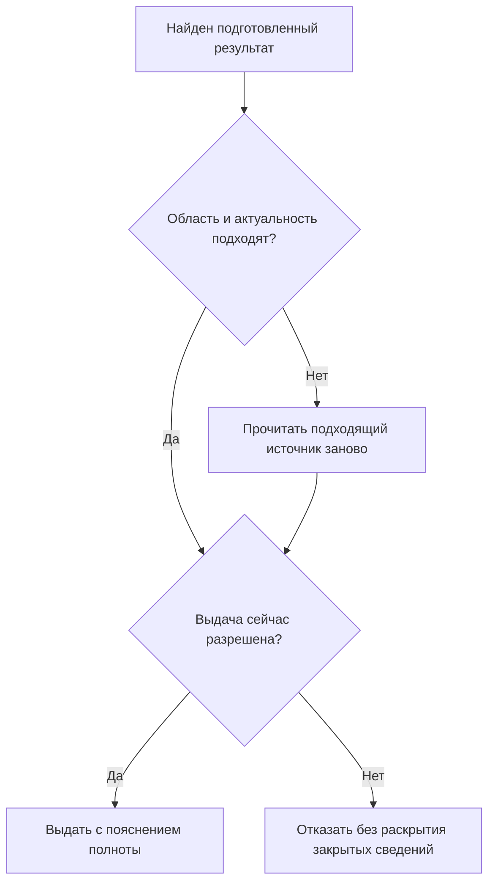

# Производительность: работа людей и агентских циклов

Interlink должен оставаться удобным для конструктора, когда рядом автоматические исполнители проверяют составы, ищут последствия изменений и готовят предложения. Цель — не максимальное число запросов любой ценой, а предсказуемое время работы при сохранении прав доступа, полноты результатов и объяснимой истории.

Здесь описан **целевой подход и программа его проверки**. Компоненты типизированного хранения уже разрабатываются в составе фундамента. Полный агентский режим и преимущество над IPS ещё не подтверждены сквозными нагрузочными испытаниями.

## Почему профиль нагрузки изменится

Конструктор открыл насос, изучил несколько позиций и обдумывает решение. Агент за то же время может раскрыть сотни составов, проверить применение подшипника в заказах, прочитать документы и вызвать помощников. При этом полезная работа включает не только поиск: требуется сохранить, какие именно данные были прочитаны и на чём основано предложение.

Быстрые карточки и команды людей будут соседствовать с длинными обходами, обработкой файлов и массовыми проверками. Если все операции получат одинаковый приоритет, фоновый анализ способен сделать рабочее место человека практически непригодным.

Поэтому принимающее приложение должно ограничивать число параллельных запусков, объём работы, повторные попытки и расходы на сохранение свидетельств. Interlink должен поддерживать ограниченные запросы, отмену и предсказуемые предметные операции. Будущий Alvatune рассматривается как отдельная система управления агентскими циклами: расписание, бюджеты и распределение исполнителей относятся к ней, а не становятся скрытыми обязанностями объектного ядра.

## Архитектурные предпосылки

### Предметные типы материализуются в реальные таблицы

Описание типа «насос» не остаётся только настройкой формы. В принятом подходе ему соответствует типизированная структура базы данных: числа хранятся как числа, даты — как даты, связи — как проверяемые ссылки. Для часто используемых условий подбираются индексы — вспомогательные структуры быстрого поиска.

Например, поиск насосов заданного диапазона подачи на определённой площадке может использовать соответствующие поля и индексы. Ему не требуется каждый раз собирать все свойства насоса из универсальных строк «объект — имя свойства — значение» и заново определять их смысл.

Это даёт базе данных больше информации для выбора эффективного способа выполнения запроса. Но реальные таблицы не означают «всё всегда быстро»: большое число связей, неудачный индекс или сложное условие всё равно имеют цену. Индексы занимают место и увеличивают стоимость записи; автоматически индексировать каждое свойство без проверки пользы не планируется.

Такой же подход нужен для индексируемых справочников и многомерных данных: система должна получать нужную область значений, а не обязательно выгружать всю таблицу как файл. Общая картина — в [[путеводителе по данным|Data-guide]].

### Ограниченная пакетная обработка

Если нужно получить характеристики ста подшипников, выгодно читать ограниченную группу сразу. При раскрытии состава можно совместно обрабатывать очередную часть обхода. Это сокращает накладные расходы отдельных обращений.

Пакетное выполнение не ослабляет проверки. Сохраняются права, точность ссылок, целостность и обязательная история операций. Массовая обработка не становится особым административным путём в обход обычных правил.

### Повторное чтение точного результата

Для выпущенного заказа следует читать точный сохранённый состав. Повторный подбор по сегодняшним основным версиям не только дорог, но и неправилен: он изменил бы смысл старого заказа.

Живой состав рассчитывается по объявленным условиям; исторический комплект читает зафиксированные основания. Если необходимый старый файл недоступен, система показывает ограничение сохранности, а не подставляет новый ради быстрого ответа.

### Потоковая обработка

Большой отчёт можно читать страницами и обрабатывать последовательно, ограничивая расход памяти. Но первые сто строк не доказывают, что других применений детали нет. Ошибка третьей страницы должна оставлять результат незавершённым.

Для официального полного результата нужны заявленная полнота и согласованный срез. Страницы, прочитанные в разные моменты, нельзя незаметно представить как одно неизменное наблюдение. Кроме того, получение первой страницы не гарантирует малую стоимость самого поиска: большие сортировки и обходы требуют самостоятельных ограничений.

## Как проходит безопасный массовый анализ

Чтение и предложение ещё не меняют изделие. В доказательном режиме прочитанный материал сохраняется до передачи агенту. Длительное рассуждение не должно удерживать открытую операцию записи в базе данных. Перед изменением заново проверяются действующие полномочия и те условия, актуальность которых требует выбранная команда.

Будущее рабочее место должно показывать разрешённую область анализа, прогресс, предел выдачи, допустимые к раскрытию ограничения и состояние предложения. Формулировка «проверено 100 из 800 позиций» полезнее общего зелёного индикатора, если все 800 позиций входят в известную и разрешённую для такого сообщения область. Число скрытых объектов, их названия и причины закрытия нельзя раскрывать через индикатор неполноты.

## Безопасное повторное использование результатов

Кэш — быстрое промежуточное хранение повторно используемых результатов. Поисковый индекс — подготовленное представление для поиска. Ни один не становится вторым независимым владельцем предметных данных.

Повторно использовать результат можно только при известной области его применимости: какие условия, данные и правила влияли на ответ. Даже неизменяемый чертёж может стать недоступен сотруднику после изменения полномочий. Старый ответ в кэше не отменяет запрет; это касается и фрагментов документов, числа найденных объектов и пояснений.

Индекс может отставать от источника. Для ознакомительного поиска это допустимо при понятной отметке актуальности. Для обязательной проверки «нет запрещающих замечаний» перед выпуском старого поискового ответа недостаточно: условие проверяется в авторитетных данных и защищается от конкурирующего изменения.

Ускорение не должно менять смысл ответа. Подготовленный результат проходит проверку применимости и текущего доступа; устаревшие или закрытые сведения не подмешиваются в решение ради скорости.

## У агента нет особых прав

Человек, внешняя система и агент должны использовать проверяемые предметные операции. Различаются самостоятельный агентский цикл, ручной запуск по поручению человека и запуск помощника другим агентом. Причинная связь с руководителем или родительским агентом сама по себе не передаёт все их полномочия.

Для каждого действия требуется установить фактического исполнителя, допустимую область, основание поручения и точный смысл операции. Подтверждение человеком нужно там, где его требует процесс; ограниченная автономная работа тоже возможна по явно заданной политике. Но ни автономность, ни наличие согласования не отменяют текущих запретов и проверок целостности.

## Три прикладных примера

### 1. Поиск применения подшипника перед заменой

Конструктор редуктора РЦ-250 получил извещение о снятии подшипника с производства. Он поручает агенту найти его применение в текущих изделиях и открытых заказах, а отдельно показать исторические поставки.

Interlink должен использовать обратную навигацию по связям, читать результаты ограниченными группами и сохранять основание анализа. Текущие применения определяются в заявленных условиях; исторические заказы читаются по своим точным комплектам. Один редуктор может встречаться по двум разным путям, и эти появления нельзя потерять простым удалением «дубликатов».

Конструктор получает сгруппированный перечень с объяснениями и отметкой полноты. Если часть заказов недоступна или обход остановлен по лимиту, агент не утверждает, что нашёл все применения. Создание пакета изменения остаётся отдельным действием. Польза измеряется временем анализа и отсутствием пропущенных применений.

### 2. Ночная проверка насосных станций

Ночью несколько агентов проверяют материалы, комплектность документов и совместимость приводов в серии насосных станций. Утром технологи начинают открывать составы и проводить изменения.

В целевом сценарии принимающее приложение снижает фоновую параллельность и отдаёт приоритет интерактивной работе. Interlink ограничивает поддерживаемые операции: размер чтения, разветвлённость обходов, время работы и объём выдачи. Если длинный анализ остановлен, его результат помечается как неполный: указывается, какие объекты и проверки обработаны, а какие ещё нет. Такой результат нельзя считать заключением по всей задаче.

Успешное испытание — не только число проверенных станций за ночь. Важно, чтобы утром карточки открывались в согласованное время, очереди не росли бесконечно, отменённые задания освобождали ресурсы, а прежний исполнитель не мог позднее применить результат после передачи задания другому.

### 3. Два агента изменяют один шкаф управления

Один агент предлагает заменить частотный преобразователь, другой — уменьшить охлаждение шкафа станка СТ-500. Каждый вариант по отдельности выглядит допустимым по прочитанному составу. Вместе они могут нарушить тепловые ограничения.

Предложения сохраняются раздельно. При применении проверяется не только отдельная карточка, но и общие условия затронутой конфигурации. Первое принятое изменение может потребовать повторной оценки второго. Инженер получает конфликт и сравнение, а не молча объединённый недопустимый состав.

Если связь оборвалась после применения, агент сначала выясняет исход прежней операции. Повторная отправка не должна создавать второе изменение. Отключение этих проверок ради красивого нагрузочного результата не считается улучшением системы.

## Что сохраняется и что меняется относительно IPS

Сохраняются пользовательские требования: корректный подбор версий, точная история заказа, объяснимые ограничения, контроль изменений и разграничение доступа. Для агента не создаётся упрощённая семантика, отличная от работы человека.

Изменяется предполагаемый способ достижения масштаба: типизированное физическое хранение, определённые формы запросов, пакетная обработка, повторно читаемые точные комплекты и управление машинной нагрузкой. Ожидаемое преимущество над универсальными подходами хранения — **архитектурная гипотеза**. Оно не доказывает превосходство над конкретной установкой IPS, её индексами, настройками и составом модулей.

Сопоставление производительности требует одинаковой предметной задачи, объёма данных, оборудования, прав доступа, полноты и сохранности. Нельзя сравнить полный доказательный анализ в одной системе с неполной быстрой выборкой в другой и назвать разницу свойством архитектуры.

## Программа нагрузочного подтверждения

Испытания учитывают размер базы, ширину и глубину составов, число исполнителей и стоимость документов. Измеряются не только среднее время, но и редкие медленные ответы, ожидание ресурсов, ошибки, расход памяти, отставание индексов и объём сохранённой истории.

Продуктовая приёмка требует, чтобы:

- разные способы ускоренного чтения давали тот же полный предметный результат;
- рост фоновой нагрузки не лишал людей согласованного уровня обслуживания;
- лимиты, отмены и недоступность источника оставались видимыми;
- отозванные права действовали для кэша, поиска, файлов и объяснений;
- конкурирующие изменения не нарушали общих ограничений;
- повтор после потери ответа не удваивал выполненную операцию;
- стоимость сохранения оснований входила в испытание, а не исключалась из него.

Численные обещания будут иметь смысл после исходных замеров и согласования сценариев предприятия. Ближайшие небольшие испытания подтверждают пригодность фундамента; они не означают готовность промышленного Alvatune или всей агентской PLM.

## Состояние реализации

В проекте существуют компоненты описания модели и материализации типизированного хранения. Единые гарантии чтения, действий, восстановления и смешанной нагрузки зафиксированы как целевые договоры и требуют последовательной реализации и испытаний. Публичного доказательства численного превосходства над IPS эта страница не заявляет.

Связанные объяснения: [[система типов и данные|Data-guide]], [[объектный фундамент|Object-foundation]], [[агенты и прослеживаемость|Agents-and-traceability]], [[безопасные действия агентов|Agent-safe-actions]], [[текущая готовность и план|Current-state-and-roadmap]]. Для обсуждения нагрузки предприятия — [[вопросы об агентах и испытаниях|Questions-agents]].
