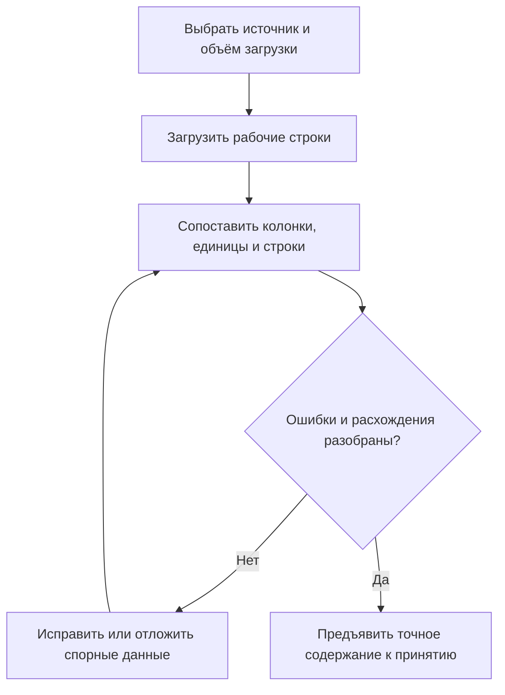
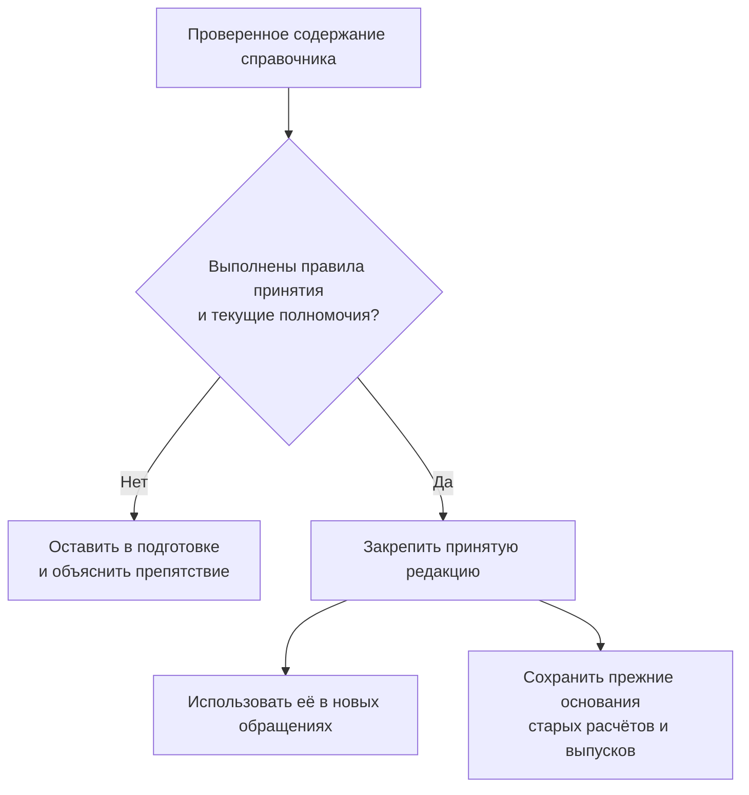

# Справочники и таблицы существующих строк

## Зачем таблице быть частью системы, а не только файлом

Конструктору нужны размеры стандартного крепежа, технологу — нормы расхода, снабжению — предложения поставщиков. Часто эти сведения представлены таблицей, в которой каждая строка имеет собственный предметный смысл. Пользователь хочет найти подходящую запись, понять её происхождение и использовать конкретное значение в детали, расчёте или заказе.

Interlink планирует вести такие сведения как структурированные справочники. Поиск по диаметру, материалу или диапазону массы должен обращаться к самим данным, а не к тексту вложенного файла. Файл исходного каталога сохраняется как источник, однако не становится единственной точкой доступа к каждой величине.

**Это принятый целевой подход, не заявление о готовой подсистеме.** Описанный процесс — требование к будущему продукту. Справочные функции конкретной установки IPS и IMBASE необходимо проверять на её реальных каталогах и правилах.

## Почему это не полная сетка

Пусть таблица содержит винты двух диаметров и трёх длин. Из этого не следует, что стандарт разрешает все шесть сочетаний. Справочник хранит именно существующие строки. Отсутствующий типоразмер не является ошибкой заполнения, если его нет в принятом источнике.

| Строка учебного каталога | Диаметр | Длина | Исполнение |
|---|---|---|---|
| Винт для крышки малого корпуса | 6 мм | 20 мм | С защитным покрытием |
| Винт для крышки среднего корпуса | 6 мм | 30 мм | С защитным покрытием |
| Винт для усиленной крышки | 8 мм | 30 мм | С защитным покрытием |

В этой таблице не возникает винт диаметром 8 мм и длиной 20 мм. Если его позднее добавит источник, это будет новая строка с происхождением. Если два изготовителя предлагают одинаковые размеры, строки могут оставаться разными: изготовитель, стандарт или исполнение входят в их предметное различие.

Полнота справочника означает соответствие объявленному источнику и объёму: например, «все строки выбранного раздела стандарта в данной редакции». Она не равна [[полноте многомерной сетки|Multidimensional-tables]].

## Что требуется определить перед наполнением

Ответственный за нормативно-справочную информацию определяет назначение каталога, владельца и источник. Затем выбирается форма строк: какие значения обязательны, где нужны единицы, что различает строки и какие ссылки разрешены. Колонки «длина» и «материал» не должны превращаться в произвольные текстовые пометки, если по ним предстоит фильтровать или проверять применение.

Общие свойства каталога можно хранить отдельно от размерного ряда. Например, наименование стандарта и его источник относятся ко всему ряду, а масса и присоединительный размер — к определённой строке. Один размерный ряд может использоваться несколькими связанными представлениями без ручного копирования каждой величины.

Для выбора детали часто нужны два основания вместе: **исполнение каталога и устойчивая строка размерного ряда**. Исполнение задаёт, например, материал и покрытие, строка — размеры. Одна и та же строка размеров может использоваться обычным и коррозионностойким исполнением. Поэтому нужно сохранять устойчивую ссылку на строку и выбранное исполнение с его содержанием: иначе размер окажется известен, а материал применённой детали — нет. Номер строки на экране эти основания не заменяет. В тех исходных сценариях, где объект связан только с разделом каталога без выбора размерной строки, такая связь также должна сохранять свой более общий смысл.

Таблица и карточка детали не обязаны совпадать один к одному. Нормативная строка может существовать до появления конкретной применяемой детали. Если предприятию нужна самостоятельная карточка с согласованием, файлами и связями, её создают или связывают со строкой осмысленно, а не автоматически ради хранения любого числа.

## Как будет проходить загрузка и принятие

Перед загрузкой пользователь различает полную замену объявленного раздела и поступление отдельных изменений. Если получены только исправленные строки, отсутствие остальных в файле не означает их удаление. Аналогично незаполненная колонка частичного сообщения не должна молча стирать прежнее значение.

Во время подготовки сохраняются источник, поступившие сведения, результат сопоставления и перечень расхождений. Ответственный видит, какие строки добавятся, какие изменятся и какие требуют решения. Поиск для обычных потребителей продолжает использовать принятую редакцию, если им не предоставлен явный доступ к рабочей подготовке.

Результат проверки относится к определённому содержанию. При параллельной правке или изменении источника система должна показать, что основание подготовки изменилось. Нельзя незаметно заменить проверенную строку новой и считать прежнее согласование действующим для неё.

Рабочее сохранение и официальное принятие различаются. Для инженерно управляемого справочника это подготовка и публикация содержания; для оперативных данных возможен иной установленный порядок записи. В любом случае точное потребление должно сохранять согласованное основание. Не требуется придумывать отдельную инженерную версию для каждой строки или правки числа.

## Как пользователь получает и применяет результат

Планируемое рабочее место должно показывать источник и содержание каталога, условия отбора, найденные строки, единицы и ограничения использования. Можно будет запросить одну строку, сразу несколько известных позиций или небольшой диапазон подходящих значений. Большая выдача разбивается на части с обозначением границ, а не притворяется целым каталогом.

Поиск сам по себе ничего не изменяет в карточках и составе. Если технолог решил перенести норму в операцию либо обновить связанные карточки из нового справочника, выполняется отдельное действие. Оно показывает перечень затрагиваемых объектов и сохраняет связь с источником. Это особенно важно, когда локальные поправки предприятия допустимы только в определённых полях.

Импорт нормативного источника не делает предприятие его автором. Interlink может быть местом согласованного чтения принятой копии, но не получает права менять исходный стандарт от имени издателя.

## Пример 1. Выбор крепежа для крышки редуктора

Конструктор прорабатывает крышку редуктора и задаёт диаметр, длину, покрытие и источник размерного ряда. Система возвращает две строки одинакового размера от разных изготовителей. Пользователь видит, что это не случайные дубли: у строк различаются происхождение и условия использования.

Он выбирает разрешённый предприятием ряд и связывает его с применяемой деталью. Размеры могут быть перенесены в карточку по явному действию; в истории остаётся источник. Если требуемой длины в ряду нет, результатом будет отсутствие строки в данном источнике, а не автоматически созданная деталь и не запрет такой детали во всём мире.

Позднее поставщик уточняет массу. Ответственный принимает новую редакцию каталога. Это позволяет оценить влияние на ещё готовящиеся изделия, но не меняет незаметно массу в уже выпущенном заказе. Обновление применённых сведений проводится отдельно.

## Пример 2. Нормы заготовок для двух производственных площадок

Технолог подготавливает таблицу припусков и норм расхода заготовок. Для площадки с одним способом раскроя действуют одни значения, для другой — иные. В справочнике явно различаются материал, типоразмер, способ обработки и область применения; совпадающее наименование заготовки не делает нормы одинаковыми.

Филиал присылает файл с исправлениями только своего раздела. При загрузке указывается именно этот объём. Строки другой площадки сохраняются. Если для одного ключа пришли два разных значения без объяснения, система предъявляет конфликт, а не выбирает последнюю строку файла.

После проверки технолог принимает обновлённый раздел и предлагает пересмотреть нормы конкретных незавершённых технологических процессов. Согласование относится к перечню затрагиваемых операций. Открыть новую таблицу недостаточно, чтобы автоматически изменить все производства предприятия.

## Пример 3. Формулы и общее размерное основание семейства насосов

Семейство насосов использует общий размерный ряд патрубков. Часть показателей введена из источника, часть вычисляется по принятой формуле. Несколько исполнений насоса ссылаются на один ряд; копировать его вручную в каждое исполнение не требуется.

Ответственный исправляет исходный размер в рабочем содержании. Система должна показать изменённые строки и зависимые расчётные показатели. Рассчитанное значение не выдаётся за измеренное: известны исходные величины и применённая процедура. Неподдержанная формула должна быть обозначена как требующая переноса или отдельной реализации, а не заменена прежним числом без предупреждения.

Для согласования выбирается точное содержание с проверенными результатами. Если формулу или входы изменили после проверки, необходима новая проверка. Старый расчёт насоса сохраняет прежние использованные данные и смысл вычисления в пределах принятой политики хранения. Утраченное историческое основание нельзя заменить современным и назвать расчёт воспроизведённым.

## Пример из другой отрасли: каталог пищевого сырья

Технолог пищевого производства может вести строки поставляемого сырья с содержанием компонентов, единицами, источниками и ограничениями применения. Две внешне одинаковые позиции разных поставщиков не сливаются автоматически. Копирование нового справочника не исправляет задним числом фактический состав уже выпущенной партии.

Такой каталог использует те же принципы поиска и происхождения, но правила пригодности для рецептуры задаёт отраслевой модуль. Наличие значения в строке само по себе не подтверждает разрешение для любого рынка или продукта.

## Что сохраняется от IPS и что меняется

Целевое покрытие сохраняет справочные каталоги, общие свойства, размерные таблицы, поиск, необходимые вычисляемые поля и управляемое использование сведений в объектных данных. Подбор заменителей материалов, клеёв и покрытий не откладывается вместе со сложными будущими вычислительными возможностями.

Новое основание делает явными форму таблицы, происхождение, точное использованное содержание и отдельное действие синхронизации. Оно должно позволить подключать разные предметные справочники без превращения каждого в особую, изолированную подсистему. Но это не доказательство буквальной совместимости со всеми формулами, макросами и настройками любой базы IPS: их перенос требуется проверить по реальным примерам.

При обновлении связанной карточки уже установленная исходная связь не должна подменяться новым поиском «похожей строки», если исходный процесс требует следовать именно этой связи. Для неоднозначного поиска необходимо сохранить подтверждённое правило выбора. При переносе формул важно воспроизвести и исходный порядок вычисления: одинаковая внешне запись после переноса может дать другой результат, если изменить правила её прочтения. Такие случаи проверяются на эталонных примерах, а не исправляются предположением о «более обычной» арифметике.

## Ограничения, развитие и приёмка

Структурированное хранение и индексы создают основу для быстрого адресного поиска и массовых обращений агентов. Конкретные индексы выбираются под реальные запросы. Не обещается, что любая фильтрация по любым колонкам будет одинаково быстрой или что объём таблицы не имеет пределов.

Приёмка должна подтвердить три вещи: загрузка отдельных изменений не уничтожает остальные строки; выбор из справочника не меняет объект без команды; прежний расчёт воспроизводится по своему основанию после обновления источника. Отдельно проверяются права доступа: скрытая строка не превращается в доказательство того, что типоразмер отсутствует.

Открытыми остаются конкретные диалекты формул, допустимые локальные переопределения, правила согласования и целевые объёмы каталогов. Они уточняются со специалистами предприятия. Связанные темы: [[общая картина таблиц|Tabular-data]], [[карты подбора|Coordinate-maps]], [[совместимость материалов и других участников|Compatibility-matrices]], [[перенос данных IPS|Data-IPS-migration-strategy]].
