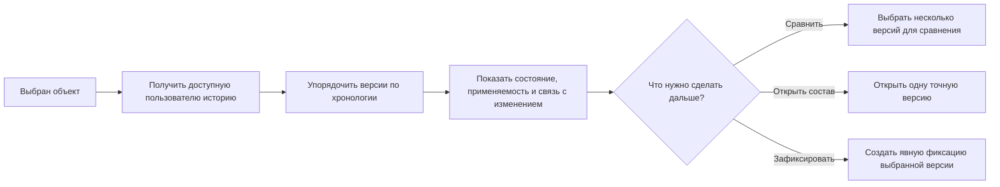

# Просмотр всех версий объекта

## Зачем пользователю нужны все версии

Большинство режимов подбора должны вернуть одну версию объекта: ту, которая действует для заказа, подходит по степени готовности или назначена основной. Однако бывают задачи, где специалисту нужен не готовый состав, а история изменения самого объекта.

В IPS для этого могло использоваться специальное правило «Все версии объектов», в том числе в портфельных и аналитических представлениях. Interlink сохраняет возможность увидеть все доступные версии, но отделяет её от обычного формирования состава.

**Просмотр всех версий — это историческое представление, а не способ автоматически выбрать одну версию для каждой позиции состава.**

Это различие защищает пользователя от неоднозначности. Если у редуктора двадцать деталей, а у каждой детали по пять версий, команда «показать все версии» не должна превращать один состав в сотни искусственных комбинаций, которые никогда не существовали как изделие.

## Что показывает историческое представление

Для выбранного объекта пользователь видит последовательность его версий и основные признаки, важные для понимания истории:

- обозначение и наименование объекта;
- номер или название версии;
- дату создания и дату фиксации изменения;
- степень готовности и состояние процесса согласования;
- применяемость по изделиям, серийным номерам или датам, если она задана;
- сведения об извещении или пакете изменения;
- отметку основной версии;
- причину снятия с применения или замены;
- доступность версии для текущего пользователя.

Рабочие версии показываются только участникам соответствующего изменения. Версия, находящаяся в чужой незавершённой работе, не должна становиться видимой лишь потому, что пользователь запросил «все версии».

## Пример 1. История зубчатого колеса после производственного дефекта

На партии редукторов обнаружен повышенный шум. Специалист по качеству открывает объект «Колесо зубчатое быстроходной ступени» и видит его историю:

| Версия | Содержание изменения | Состояние |
|---|---|---|
| Версия 01 | исходная геометрия зубьев | снята с применения |
| Версия 02 | изменён припуск после термообработки | утверждена |
| Версия 03 | изменён режим шлифования | утверждена, применяется серийно |
| Версия 04 | увеличена ширина венца | находится на согласовании |

Специалист сравнивает версии 02 и 03, проверяет дату выпуска проблемной партии и выясняет, какая технология действовала в этот момент. Для анализа важны все версии, но состав конкретного редуктора всё равно должен ссылаться только на одну из них.

Если требуется воспроизвести состояние изделия с конкретным заводским номером, пользователь не выбирает режим «все версии». Он открывает исторически зафиксированный состав или применяет условия по серийному номеру.

## Пример 2. Сравнение исполнений электродвигателя

Для электродвигателя `АИР180М4` накопилось несколько версий документации. Одна добавила нового поставщика подшипников, другая изменила схему подключения датчиков температуры, третья была отозвана после испытаний.

Конструктор насосного агрегата хочет понять, с какой версии появилась возможность подключения к новой системе диагностики. В историческом представлении он видит изменения по версиям и выбирает две из них для сравнения.

Это исследовательская операция. Она не означает, что дерево насосного агрегата должно одновременно содержать все версии двигателя. После анализа конструктор либо оставляет правило подбора без изменения, либо оформляет изменение и точно указывает требуемую версию.

## Пример 3. Расследование отказа гидроцилиндра

Сервисная служба получила рекламацию на течь гидроцилиндра. По заводскому номеру известно, что цилиндр был изготовлен в период перехода на новый материал манжеты.

История объекта «Комплект уплотнений ГЦ-180» позволяет увидеть:

- версию со старым материалом;
- переходную версию, действовавшую только для ограниченного диапазона номеров;
- текущую серийную версию;
- экспериментальную рабочую версию, которая никогда не передавалась в производство.

Специалист сопоставляет даты и применяемость. Экспериментальная версия может быть полезна для понимания развития решения, но она не должна ошибочно считаться установленной в рекламационном изделии. Ответ на вопрос «что фактически было изготовлено» берётся из зафиксированного производственного состава и учёта экземпляров, а не из простой хронологии версий.

## Пример 4. Очистка данных после переноса из старой системы

После переноса данных обнаружено, что у типового крепежа существует семь версий, хотя содержательно отличаются только две. Остальные возникли из-за старых административных операций.

Группа качества данных использует историческое представление, чтобы:

- увидеть все перенесённые версии;
- найти версии без понятной причины создания;
- сопоставить их с извещениями;
- определить, какие версии должны остаться доступными только для истории;
- проверить, правильно ли назначена основная версия.

Такое представление помогает исправить справочные данные, но само по себе не меняет составы и не объединяет версии. Любое исправление оформляется отдельной управляемой операцией.

## Почему нельзя использовать «все версии» как обычное правило состава

Представим сборочную единицу из трёх позиций. Для первой детали существует четыре версии, для второй — пять, для третьей — три. Механическое раскрытие всех вариантов даст уже шестьдесят сочетаний. В многоуровневом изделии число сочетаний растёт ещё быстрее.

Большинство таких комбинаций:

- никогда не выпускались вместе;
- нарушают применяемость по времени или серии;
- смешивают рабочие и утверждённые данные;
- не соответствуют ни одному заказу;
- не имеют самостоятельного продуктового смысла.

Поэтому Interlink показывает историю локально для выбранного объекта или для явно заданной области анализа. Если пользователю нужно сравнить два состояния всего изделия, правильным основанием являются две точные версии корневого изделия, два зафиксированных состава или два набора условий, а не бесконтрольное размножение каждого узла.

## Как перейти от истории к точному составу

Из исторического представления пользователь может выбрать конкретную версию и:

- открыть её собственный состав;
- сравнить её с другой версией;
- использовать её как исходную для управляемого изменения;
- при наличии полномочий создать точную фиксацию версии в определённой позиции;
- посмотреть, где эта версия применялась.

Переход всегда явный. Сам факт выделения строки в истории не меняет действующее правило подбора и не влияет на другие окна.

## Чем решение отличается от IPS

| Аспект | IPS | Interlink |
|---|---|---|
| «Все версии» | могло выглядеть как специальное правило подбора | отдельное историческое представление |
| Результат | набор версий в привычном интерфейсе | хронология объекта с состояниями и причинами изменений |
| Переход к составу | зависел от режима представления | пользователь явно открывает одну точную версию |
| Многоуровневое раскрытие | могло быть неоднозначным | не создаёт искусственные комбинации версий |
| Рабочие данные | показывались по правилам доступа и контекста | дополнительно подчёркивается принадлежность к конкретному изменению |

## Открытые продуктовые вопросы

- Какие столбцы исторического представления наиболее важны специалистам IPS?
- Нужно ли показывать версии, снятые с применения, по умолчанию или только по отдельной команде?
- Должна ли история включать только зафиксированные версии или также доступные пользователю рабочие версии?
- Нужна ли массовая история по группе объектов для задач качества данных?
- Как показывать ветвящиеся изменения, если две новые версии создавались параллельно от одной исходной?
- Какие сравнения — атрибутов, состава, геометрии, документов — должны запускаться прямо из истории?

## Критерии приёмки

1. Пользователь видит все доступные ему версии выбранного объекта в понятной последовательности.
2. Рабочая версия из чужого изменения не раскрывается без соответствующего доступа.
3. Основная, действующая, снятая с применения и рабочая версии визуально различаются.
4. Команда «все версии» не создаёт ложный многоуровневый состав из всех сочетаний.
5. Открытие конкретной версии выполняется явно и не меняет режим других представлений.
6. Для версии можно понять, когда и в связи с каким изменением она появилась.

## Состояние реализации

Interlink уже различает объект и его версии, что создаёт основу для исторического представления. Полный пользовательский вид истории, сравнение версий и отображение перенесённых данных ещё требуют отдельной продуктовой проработки.

## Связанные документы

- [Основная версия объекта](Selection-main-version)
- [Последняя допустимая версия](Selection-latest-version)
- [Жёсткая фиксация точной версии](Selection-exact-fixation)
