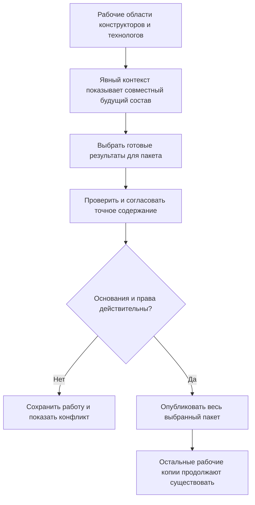

# Согласованный будущий состав: работа, контекст и пакет изменения

## Какую потребность IPS сохраняем

Замена подшипника редуктора затрагивает вал, крышку, спецификацию, чертёж и технологическую операцию. Конструктору и технологу нужно видеть изменения совместно, пока производство продолжает работать по утверждённому основанию. В IPS для этого используются контексты редактирования, в том числе связанные с извещениями.

В целевой модели Interlink эта возможность сохраняется, но **один контейнер больше не отвечает одновременно за всю работу, совместный просмотр и выпуск**. Пакет изменения не заменяет собой каждый контекст IPS.

## Три разных границы

| Понятие | На какой вопрос отвечает | Как долго существует |
|---|---|---|
| Рабочая область | Где команда хранит незавершённые правки? | Пока продолжается работа; часть правок может быть опубликована раньше остальных |
| Контекст подбора | Какие версии и какое их содержание нужно видеть вместе? | Самостоятельно; может сохраняться после завершения редактирования |
| Пакет изменения | Какие конкретные результаты и предметные решения нужно опубликовать целиком? | Для одной проверяемой публикации выбранного набора |

В контекст можно включить версию покупного двигателя, которую никто не редактирует. В рабочей области можно готовить несколько направлений развития корпуса. В пакет можно включить согласованные корпус и крышку, оставив экспериментальную оснастку в работе. Совместный будущий состав не требует выпустить абсолютно всё, что открыто у участников.

Контексты подразделений можно объединить для чтения без обязанности закончить одновременно. Если же вал и крышка не должны стать доступными по отдельности, их включают в один пакет либо в общий неделимый комплект публикации нескольких пакетов. **Совместный просмотр и совместная публикация — разные решения.**

## Версия, рабочая копия и опубликованное состояние

«Версия 04 вала» — инженерная версия, знакомая пользователю. В разрешённом процессе её можно отредактировать, сохранив обозначение 04. При завершении появится новое неизменяемое опубликованное состояние этой же версии. Создание версии 05 — отдельное действие, а не следствие каждого сохранения.

Правки находятся в рабочей копии. Команда «Сохранить» сохраняет работу, но не публикует её и не меняет производственный состав. Для точного согласования закрепляется проверяемое содержание: последующая правка не должна незаметно заменить то, что увидел рецензент.

Схема показывает путь публикации, а не полный порядок подбора каждой позиции. При чтении действуют объявленные правила конкретизации, применяемости и контекста. В совместимом профиле IPS применяемость может предшествовать контексту: его открытие не означает «показать назначенную версию вопреки всем ограничениям».

## Как пользователь выполняет работу

Руководитель открывает рабочую область и связывает её с извещением. Участники создают рабочие копии нужных инженерных версий. Контекст получает явные назначения: для корпуса показывать рабочую копию конструкторов, для двигателя — утверждённое состояние версии 03, для технологической карты — рабочую копию технолога.

У назначения сохраняется основание включения: ручное добавление, включённое автоматическое пополнение обычного контекста или состав извещения. Эти основания независимы. Удаление строки извещения не должно удалить ту же версию, отдельно добавленную инженером для справки.

Участники с необходимыми правами видят будущий состав через явно выбранный контекст. Обычный производственный просмотр не подхватывает чужие рабочие копии. Фоновая проверка получает собственные условия запуска; переключение окна их не меняет. Для воспроизводимого отчёта фиксируются также точное содержание входов и редакции правил, а не только имя контекста.

Когда работа готова, руководитель выбирает публикуемую часть, запускает проверки и согласование. Пакет включает рабочие копии, изменения позиций и необходимые решения о применяемости, готовности и назначении основных версий. После публикации появляется неизменяемое содержание затронутых инженерных версий. Предметные решения становятся действующими согласованно с ним.

## Пример 1. Вал и крышка редуктора

Изменение «Модернизация подшипникового узла РЦ-250» увеличивает посадочный диаметр. Конструктор правит вал версии 04 и крышку версии 06; технолог готовит карту обработки версии 03. В контекст включён также утверждённый подшипник другого исполнения.

Все четыре элемента видны вместе. Проверка обнаруживает, что новая крышка не подходит к старому валу. Вал и крышку нельзя публиковать независимо: они входят в один неделимый пакет. Технологическую карту процесс предприятия также требует включить в передачу. Подшипнику не нужна новая версия: его существующее точное состояние выступает основанием.

Если крышку исправили после согласования, пакет не публикуется под старой подписью. Пользователь видит изменённое содержание, повторяет подготовку и нужное согласование. До этого производство сохраняет прежнее основание.

## Пример 2. Механика и электрика заканчивают работу в разное время

Конструкторы ограждения станка СТ-500 и разработчики электрошкафа работают в отдельных областях. Их контексты объединены для проверки кабельных вводов и монтажных размеров.

Механическая часть готова первой. Если процесс допускает самостоятельную публикацию, конструкторы завершают свой пакет, а электрики продолжают работу. В общем контексте ссылка на рабочую копию ограждения заменяется опубликованным состоянием по заранее определённому правилу. Электрошкаф остаётся рабочим. Контекст не исчезает и не переключается на случайную основную версию.

Если внедрение допускается только совместно, самостоятельная публикация документа не становится разрешением на изготовление всего комплекта. Для общего выпуска создаётся точное согласованное основание либо неделимый комплект публикации. Граница определяется предметной зависимостью, а не самим объединением контекстов.

## Пример 3. Две команды исправляют один корпус

Сервисная служба устраняет дефект отверстия действующего корпуса насоса, а конструкторы развивают исполнение для следующей серии. У одного объекта могут существовать разные инженерные версии и независимые рабочие копии. Универсального запрета «объект принадлежит только одному открытому пакету» больше нет.

Если команды редактируют разные версии, они не обязаны ждать друг друга. Если обе правят одну версию и сервис публикует первым, вторая команда получает конфликт: её работа основана на прежнем содержании. Правки сохраняются и не перезаписывают исправление сервиса. Инженер сравнивает результаты, переносит свои изменения на новое основание или явно создаёт другую инженерную версию.

Предприятие может потребовать исключительное редактирование отдельных объектов. Ограничение устанавливается как правило процесса и полномочий, а не как неизбежное устройство Interlink.

## Пример 4. Длительная проверка насосной станции

Инженер запустил проверку материалов будущего состава, затем открыл другой заказ. Проверка продолжает использовать переданные условия и согласованный срез исходных данных.

Отчёт показывает, какие состояния документов, рабочие материалы и редакции правил проверены. Если работа исправлена позднее, отчёт остаётся объяснимым, но не выдаётся за проверку нового содержания. Повторная оценка запускается явно.

## Предпочтения не удаляются одним общим действием

Нужно различать сохраняемую мягкую конкретизацию позиции, долговечное назначение версии в контексте и явно временное предпочтение рабочей области. Закрытие работы может завершить срок только последнего. Оно не удаляет постоянный позиционный выбор и не уничтожает контекст.

Если заказу нужно неизменяемое содержание, создаётся точный состав передачи. Жёсткий выбор инженерной версии его не заменяет: у той же версии могут появиться новые опубликованные состояния в разрешённом процессе.

## Проверки и реакция на ошибку

Перед публикацией проверяются целостность комплекта, ожидаемое исходное содержание, текущие полномочия, обязательные ограничения и совместимость фактически выбранных состояний. Разрешённый аналог или правильная пара опций ещё не доказывают совместимость полного результата.

Если согласовано точное сохранённое основание, появление новой неиспользованной редакции справочника само по себе его не меняет. Если процесс требует актуальности на момент публикации, изменившаяся зависимость вызывает повторную оценку. В обоих случаях текущий обязательный запрет и изменение самого публикуемого содержания нельзя проигнорировать.

Пакет публикуется целиком либо не публикуется. При потере ответа сначала выясняется исход прежней операции; повтор наугад не должен создать второй выпуск. Доставка в производственную систему и подтверждение её приёма ведутся отдельно от публикации.

## Что увидит пользователь

Рабочее место объясняет: «Вал, версия 04, рабочая копия конструкторов», «Подшипник, версия 03, опубликованное состояние от указанной даты», «Карта обработки не включена в публикацию», «Конфликт: эта версия уже изменена другой командой».

При объединении контекстов проверяется не только обозначение версии, но и способ выбора содержания. Два контекста, закрепившие разные неизменяемые состояния версии 04, не считаются согласованными лишь из-за одинакового номера.

## Вопросы для проверки с заказчиком

Нужны реальные примеры связанных контекстов, автоматического пополнения и извещений: какие работы можно завершать независимо, какие обязаны выпускаться совместно, когда нужно исключительное редактирование и как показывать конфликт содержания одной версии. Отдельно сверяются приоритеты применяемости и контекста на используемой установке IPS.

## Приёмочные сценарии

1. Совместный будущий состав получается без раскрытия недоступных рабочих копий.
2. Контекст сохраняется после публикации, незавершённые работы не исчезают.
3. Совместное чтение не навязывает совместную публикацию; неделимый выпуск создаётся явно.
4. Параллельная работа не приводит к потере правок и скрытой перезаписи.
5. Сохранение не публикует данные и не увеличивает автоматически номер версии.
6. Согласование относится к точному содержанию; конфликт оставляет работу для разрешения.
7. Мягкая конкретизация и долговечные назначения не удаляются как временные настройки.

## Состояние реализации

Это принятая целевая модель, а не готовое рабочее место. Сквозная реализация рабочих областей, контекстов, публикации и восстановления запланирована и должна быть испытана на сценариях IPS. Формы, задания и маршруты согласования создаёт прикладная система поверх Interlink.

## Связанные документы

- [[Контексты подбора и совместная работа|Selection-contexts]]
- [[Мягкая конкретизация позиции|Selection-soft-concretion]]
- [[Последовательное проведение изменений|Selection-sequential-changes]]
- [[Итерации и восстановление|Selection-iterations]]
- [[Точный состав производственного заказа|Selection-order-snapshot]]
