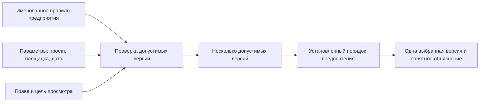

# Настраиваемое правило подбора версий

## Зачем нужны настраиваемые правила

Несколько стандартных режимов — «основная версия», «последняя версия» и «версия не ниже заданной степени готовности» — закрывают типовые случаи, но не всё разнообразие реального предприятия. В разных подразделениях действуют свои ограничения. Например, конструктор может работать с версиями, находящимися на согласовании, а технологу для выпуска маршрутной документации разрешены только утверждённые версии. Для изделия специального исполнения могут подходить лишь версии, допущенные для конкретного проекта, заказчика или климатического района.

В IPS для таких ситуаций применяются общие, системные и персональные правила подбора. Interlink сохраняет саму возможность описать особый способ отбора, но делает его более прозрачным. В документах Interlink такой способ называется **настраиваемым правилом подбора**. Во внутренних материалах разработки для него может встречаться английское слово `Policy` — то есть именованное и управляемое правило выбора.

Настраиваемое правило отвечает на три последовательных вопроса:

1. Какие версии вообще допустимо рассматривать?
2. Если допустимых версий несколько, какую из них предпочесть?
3. Что делать, если подходящей версии нет?

Третий вопрос не прячется внутри правила. Для него отдельно задаётся резервное поведение, подробно описанное в [следующем документе](Selection-no-match).

## Что сохраняется относительно IPS

Interlink должен сохранить следующие продуктовые возможности IPS:

- корпоративное правило может использоваться всеми сотрудниками;
- разные процессы могут применять разные правила к одному и тому же объекту;
- специалист может задавать разрешённые параметры правила, например проект, подразделение или требуемую степень готовности;
- из нескольких подходящих версий выбирается одна по заранее известному порядку;
- два открытых представления состава могут одновременно использовать разные правила;
- фоновый расчёт или отчёт не меняет результат из-за того, что пользователь переключил режим в другом окне;
- по результату можно объяснить, какое правило и какие значения параметров были применены.

При этом Interlink не переносит историческую внутреннюю конструкцию правила IPS буквально. Для продуктового специалиста важен не способ хранения логических условий, а управляемый и проверяемый смысл правила.

## Как правило работает в Interlink

Правило создаётся как самостоятельный управляемый объект. У него есть понятное название, назначение, владелец, область применения и собственные версии. Например:

> «Документация для подготовки производства: брать наиболее новую версию, достигшую степени готовности “Согласовано технологом”, если она относится к выбранной площадке».

Для каждого запуска система получает явные исходные данные: выбранное правило, требуемую площадку, проект, дату или другие предусмотренные значения. Эти данные относятся именно к текущему просмотру, расчёту или формированию состава. Они не считываются из незаметного общего состояния пользовательского окна.

Если само правило было изменено, это оформляется как новая версия правила. Старый зафиксированный состав продолжает ссылаться на прежний смысл правила и поэтому остаётся объяснимым.

## Пример 1. Подшипник для серийного редуктора

Предприятие выпускает цилиндрический редуктор `РЦ-250`. В узле быстроходного вала используется подшипник `3620`. У подшипника в системе существуют три версии описания:

| Версия | Состояние | Дополнительные сведения |
|---|---|---|
| Версия 01 | утверждена | базовый поставщик |
| Версия 02 | согласуется | добавлен второй поставщик с теми же присоединительными размерами |
| Версия 03 | разработка | экспериментальный сепаратор для нового проекта |

Для обычного серийного производства действует правило «брать наиболее новую утверждённую версию». Оно выберет версию 01.

Для подготовки производства по проекту модернизации применяется другое правило: «допускать утверждённые и согласуемые версии данного проекта, затем выбирать наиболее новую». Оно выберет версию 02.

Версия 03 не попадёт ни в один результат, потому что относится к экспериментальному проекту и ещё находится в разработке. Важно, что система не просто показывает версию 02, а сообщает: версия допущена правилом подготовки производства, относится к нужному проекту и является самой новой среди прошедших проверку.

## Пример 2. Электродвигатель для разных производственных площадок

Насосный агрегат выпускается на двух площадках. На первой площадке разрешены двигатели двух отечественных изготовителей, на второй — двигатель локального поставщика с отдельным комплектом сопроводительных документов.

Для объекта «Электродвигатель 30 кВт, исполнение У2» заведено несколько версий описания поставки. Геометрические и электрические характеристики совпадают, но отличаются утверждённые поставщики, упаковка и состав документов.

Правило подбора получает параметр «производственная площадка»:

- для площадки «Север» выбирается последняя утверждённая версия с перечнем поставщиков этой площадки;
- для площадки «Восток» выбирается последняя утверждённая версия, в которой присутствует местный поставщик;
- если площадка не указана, система не должна угадывать её по подразделению вошедшего пользователя — она сообщает о недостающем параметре.

Такой подход особенно важен для автоматического формирования заданий в нерабочее время. Ночной расчёт использует параметры конкретного заказа и не зависит от того, какое представление состава было последним открыто у диспетчера.

## Пример 3. Гидроцилиндр специального исполнения

Для карьерной техники применяется гидроцилиндр `ГЦ-180`. У него есть исполнения для умеренного, холодного и тропического климата. Версии отличаются материалом уплотнений, рабочей жидкостью и допустимым температурным диапазоном.

Предприятие вводит правило:

> Для проекта карьерного экскаватора выбирать наиболее новую утверждённую версию гидроцилиндра, допускающую заданный климатический район и рабочую жидкость. При равенстве предпочитать версию, уже применяемую на площадке сборки.

Заказ для Якутии указывает холодный климат и жидкость `ВМГЗ`. Правило исключает обычную и тропическую версии, затем выбирает самую новую из двух холодостойких. Если обе версии одинаково новы, предпочтение получает уже освоенная площадкой версия.

Этот пример показывает различие между **условиями допуска** и **порядком предпочтения**. Нельзя сначала выбрать самую новую версию вообще, а затем проверить климат: ею может оказаться заведомо неподходящее тропическое исполнение.

## Пример 4. Оснастка для конкретной операции

На нескольких заводах используется один типовой технологический процесс обработки корпуса редуктора. Для операции растачивания имеются разные версии установочного приспособления:

- старая утверждённая версия для станка первого поколения;
- новая утверждённая версия для обрабатывающего центра;
- согласуемая версия для роботизированной ячейки.

Правило получает номер операции, тип оборудования и цель работы. При выпуске сменного задания оно допускает только утверждённую оснастку. При моделировании будущей роботизированной ячейки может быть разрешена согласуемая версия. Одна и та же технологическая структура поэтому даёт разные, но закономерные результаты.

## Персональные настройки без персональной логики

Пользователю удобно сохранить часто применяемые значения: свою площадку, проект или тип расчёта. В IPS это могло выглядеть как персональный вариант правила. Interlink сохраняет удобство, но разделяет:

- корпоративный смысл правила — одинаковый и контролируемый;
- сохранённый набор значений пользователя — лишь быстрый способ заполнить параметры;
- фактические значения текущего запроса — часть объяснения результата.

Таким образом, личная настройка не превращается в незаметное ответвление корпоративной логики. Два специалиста, задавшие одинаковые параметры, должны получить одинаковый результат при одинаковых правах и исходных данных.

## Что увидит продуктовый специалист

Для каждой выбранной версии достаточно понятного объяснения, например:

> Выбрана версия 02. Применено правило «Подготовка производства по извещению». Версия относится к проекту модернизации, достигла требуемой степени готовности и является наиболее новой среди двух допустимых версий.

Если ничего не найдено, объяснение должно сообщать, какие существенные условия не были выполнены:

> Подходящая версия не найдена. Ни одна версия гидроцилиндра не сочетает утверждённое состояние, климатическое исполнение ХЛ1 и рабочую жидкость ВМГЗ.

Пользователю не требуется видеть техническое выражение правила. Для анализа достаточно его названия, делового описания, фактических параметров и причин допуска или исключения кандидатов.

## Чем решение отличается от IPS

| Аспект | IPS | Interlink |
|---|---|---|
| Способ задания | общее, системное или персональное правило | именованное управляемое правило и отдельно сохранённые значения пользователя |
| Параметры | могли зависеть от состояния конкретного окна | явно относятся к каждому просмотру, расчёту или заказу |
| Выбор из нескольких версий | условие и специальный критерий выбора | отдельно объясняются допуск кандидатов и порядок предпочтения |
| Отсутствие результата | могло смешиваться с поиском «не совсем подходящей» версии | резервное поведение задаётся отдельно и всегда заметно |
| История | важен факт использования правила | сохраняется точная версия правила и фактические параметры |

Это не отказ от возможностей IPS, а более явное разделение ответственности.

## Открытые продуктовые вопросы

- Кто на предприятии имеет право создавать и утверждать корпоративные правила?
- Какие параметры пользователю разрешено менять, а какие фиксируются процессом?
- Нужно ли показывать специалисту список исключённых версий или достаточно сводной причины?
- Какие правила допустимы в производственном заказе, а какие предназначены только для анализа?
- Как долго следует хранить старые версии правил для объяснения архивных составов?
- Должно ли изменение правила автоматически инициировать проверку затронутых живых заказов?

## Критерии приёмки

1. Два представления состава с разными правилами работают независимо друг от друга.
2. Отсутствующий обязательный параметр выявляется до формирования состава.
3. Одинаковые исходные данные дают одинаковый выбор и одинаковое объяснение.
4. Фоновый расчёт не меняется после переключения режима в пользовательском интерфейсе.
5. Старый зафиксированный состав остаётся объяснимым после выпуска новой версии правила.
6. Правило не может незаметно подменить отсутствие результата резервной версией.

## Состояние реализации

Единая основа для управляемых запросов уже предусмотрена архитектурой Interlink. Полный редактор корпоративных правил, порядок их утверждения и набор разрешённых продуктовых параметров ещё требуют проектирования и проверки на реальных правилах IPS.

## Связанные документы

- [Что делать, если подходящая версия не найдена](Selection-no-match)
- [Подбор по степени готовности](Selection-maturity)
- [Сквозное формирование многоуровневого состава](Selection-end-to-end)

