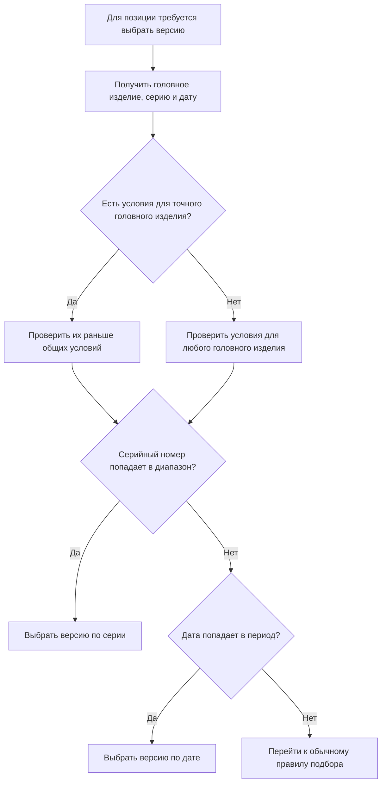

# Применяемость: выбор версии по изделию, серии и дате

## Зачем нужна применяемость

Новая версия детали или сборочной единицы редко начинает действовать одновременно для всей ранее выпущенной продукции. Изменение внедряется с определённой серии, серийного номера, даты или партии. Для разных головных изделий границы внедрения могут различаться.

Поэтому вопрос «какая версия последняя?» не равен вопросу «какая версия должна быть установлена на изделии с серийным номером 145?».

Применяемость отвечает именно на второй вопрос.

## Как механизм работает в IPS

IPS позволяет связать версию объекта с:

- конкретным головным изделием;
- диапазоном серий или серийных номеров;
- диапазоном дат;
- признаком аннулирования.

При формировании состава система получает параметры конкретного изделия или заказа и выбирает подходящую версию. Для одного объекта и одного головного изделия диапазоны разных версий не должны пересекаться.

Руководства IPS также требуют выявлять:

- пересечение диапазонов;
- разрыв, для которого не существует ни одной версии;
- смешение серий и дат;
- несогласованность диапазона извещения и версий, входящих в него.

Исторически данные применяемости хранились в сложной кодированной форме. Пользовательская функция при этом работала, но контроль целостности и поиск ошибок были затруднены.

## Как применяемость представлена в Interlink

Interlink хранит условия применяемости как самостоятельные проверяемые данные. Английское название механизма — `Effectivity`, но в продуктовых документах используется русское слово **применяемость**.

Для каждой версии можно указать:

- головное изделие;
- начало и окончание диапазона серийных номеров;
- начало и окончание периода действия;
- источник решения, например извещение;
- состояние записи: действует, заменена, аннулирована;
- комментарий или основание изменения.

При запросе состава передаются явные условия: какое головное изделие, какой серийный номер и какая дата рассматриваются.

## Какой приоритет принят в целевой модели

Для Interlink зафиксированы следующие правила:

1. Условие для конкретного головного изделия сильнее общего условия «для любых изделий».
2. Если одновременно переданы серийный номер и дата, серийный номер имеет приоритет над датой.
3. Два действующих диапазона разных версий одного объекта не должны давать однозначно одинаковое попадание.
4. Если условия не дали результата, система продолжает подбор по основному правилу только в соответствии с согласованным профилем.

Приоритет серии над датой должен быть подтверждён на целевой версии IPS конкретного заказчика. В документах IPS разных периодов порядок механизмов различается, поэтому перенос требует сравнительных испытаний.

## Пример 1. Подшипник выходного вала редуктора

Для редуктора `РЦ-250` установлены условия:

| Версия подшипника 3620 | Применяемость |
|---|---|
| версия 01 | редукторы с серийными номерами 001–100 |
| версия 02 | редукторы с серийными номерами 101–200 |
| версия 03 | редукторы начиная с номера 201 |

Для производственного заказа на редуктор с номером 100 выбирается версия 01. Для номера 101 — версия 02.

Попытка назначить версии 02 диапазон 090–150 должна быть отклонена, потому что она пересечётся с версией 01. Система не должна выбирать «более новую» или «первую найденную» версию при неоднозначных данных.

## Пример 2. Уплотнение гидроцилиндра по дате изготовления

В гидроцилиндре `ГЦ-80.50` применяется комплект уплотнений. Серийный учёт для ранних партий не вёлся, поэтому внедрение нового материала определено датой.

- комплект уплотнений, версия 04 — для цилиндров, изготовленных до 31.03.2031 включительно;
- комплект уплотнений, версия 05 — начиная с 01.04.2031.

Для заказа с датой изготовления 15.03.2031 система выбирает версию 04. Для заказа с датой 02.04.2031 — версию 05.

Если заказ одновременно содержит серийный номер, по которому действует отдельное решение, система использует подтверждённый приоритет серии и отражает это в объяснении выбора.

## Пример 3. Одна муфта в двух головных изделиях

Объект `Муфта упругая МУ-125` используется в приводе конвейера `ПК-12` и в насосном агрегате `АН-160`.

Для конвейера новая версия муфты 03 внедряется с серии 050. Для насосного агрегата та же версия внедряется только с серии 180 после дополнительных испытаний.

Одинаковый серийный номер 100 даст разные результаты:

- для `ПК-12` — версия 03;
- для `АН-160` — предыдущая версия 02.

Именно поэтому головное изделие является самостоятельной координатой применяемости.

## Пример 4. Извещение с согласованными диапазонами

Извещение `ИИ-АН160-044` меняет рабочее колесо, втулку и сборочный чертёж насосного агрегата начиная с серии 220.

Диапазон извещения и диапазоны новых версий всех трёх объектов должны совпадать. Если рабочему колесу ошибочно назначен диапазон с серии 210, система должна показать несогласованность до проведения изменения.

Такой контроль предотвращает состав, в котором часть новых деталей начала действовать раньше остальных.

## Как применяемость сочетается с рабочей версией

Участник изменения должен видеть будущую рабочую версию, даже если старая выпущенная версия всё ещё применима для текущей серии. Поэтому в Interlink явно выбранный пакет изменения проверяется раньше обычной применяемости.

Пример:

- версия 02 корпуса редуктора применяется для серий 101–200;
- в пакете изменения готовится рабочая версия 03 для серий начиная с 201;
- конструктор с открытым пакетом видит версию 03 и проверяет будущий состав;
- производственный заказ на серию 150 продолжает видеть версию 02.

Перед проведением изменения система обязательно проверит будущие диапазоны версии 03.

## Какие ошибки должны быть понятны продуктовому специалисту

Интерфейс должен различать:

- `Пересечение диапазонов` — одновременно подходят две версии;
- `Разрыв применяемости` — для части серий не подходит ни одна версия;
- `Не задано головное изделие` — невозможно выбрать более точное условие;
- `Смешаны серия и дата` — данные требуют решения согласно корпоративному правилу;
- `Версия аннулирована` — выбор запрещён или требует специального режима;
- `Применяемость не определила версию` — подбор продолжен другим правилом либо завершён отсутствием результата.

## Почему это решение закрывает требование IPS

Interlink сохраняет все необходимые возможности IPS:

- разные версии одного объекта для разных головных изделий;
- диапазоны серий и дат;
- выбор версии для конкретного производственного заказа;
- контроль пересечений и разрывов;
- согласование применяемости с извещением;
- объяснение, какое условие сработало.

При этом данные становятся явными и проверяемыми, а не скрытыми внутри кодированной строки.

## Что необходимо подтвердить с заказчиком

- Под «серией» понимается диапазон серийных номеров, номер серии или комплект?
- Как трактуются открытые границы диапазона?
- Всегда ли серия сильнее даты?
- Как обрабатывается аннулирование части диапазона?
- Допускаются ли намеренные разрывы?
- Может ли одно извещение задавать разные диапазоны для разных головных изделий?
- Какие пользовательские модули IPS меняют правила проверки?

## Приёмочные сценарии

1. На границе 100/101 выбираются разные версии.
2. Условие конкретного головного изделия сильнее общего.
3. Пересечение диапазонов не позволяет провести изменение.
4. Разрыв диапазона показывает понятную ошибку.
5. Рабочая версия видна участнику изменения, а производству — действующая версия.
6. Старый снимок заказа не меняется после исправления диапазонов применяемости.

## Состояние реализации

Целевая семантика применяемости принята. Полная реализация относится к последующим этапам развития Interlink и должна быть подтверждена на реальных выгрузках IPS.

## Связанные документы

- [Работа внутри пакета изменения](Selection-change-package)
- [Конфигуратор](Selection-position-presence)
- [Точный заказ](Selection-order-snapshot)
