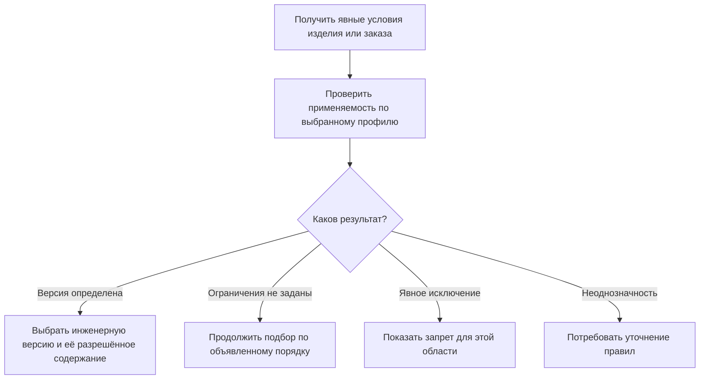

# Применяемость: какая версия действует для данного изделия

## Пользовательская потребность

Новая версия не обязана одновременно заменить старую во всей продукции. Изменение вводят с определённого серийного номера, для отдельного головного изделия, партии или периода. Поэтому «самая новая версия» и «версия для редуктора с номером 145» отвечают на разные вопросы.

Применяемость связывает инженерное решение с предметными условиями его использования. В Interlink эти условия должны быть явными и проверяемыми, а их применение — объяснимым.

## Что переносится из IPS

В IPS для подбора используются головное изделие, серии или серийные номера, даты и аннулирование применяемости. Важны не только сами диапазоны, но и контроль пересечений, разрывов, границ внедрения извещения.

Цель Interlink — воспроизвести обязательные пользовательские результаты. При этом нельзя объявить один предполагаемый порядок универсальным для всех сочетаний условий и всех установок IPS. Правила должны быть подтверждены на характерных примерах исходной системы.

## Что означают предметные координаты

Здесь координаты — не геометрическое положение в пространстве. Это именованные исходные условия: «головное изделие — насосный агрегат АН-160», «серийный номер — 220», «дата изготовления — 1 апреля».

Каждая координата имеет предметный смысл. Дата поставки не становится датой применяемости автоматически. Номер серии, заводской номер экземпляра и диапазон номеров заказа тоже нельзя смешивать.

Если заказ охватывает номера 195–205, а изменение вводится с 201, одного значения «200» для всего заказа недостаточно. Система должна разделить область на соответствующие группы или потребовать другое явно согласованное представление результата.

## Как будет работать применяемость

Владелец изменения задаёт диапазоны и основание их действия. Система показывает соседние правила, проверяет границы и возможные противоречия. Во время расчёта используются фактические условия изделия или заказа и конкретная редакция правил.

Результат проверки должен различать четыре ситуации:

- условий для этой области нет;
- выбрана определённая инженерная версия;
- применение явно исключено;
- данные или сочетание правил неоднозначны.

Это существенно: явный запрет нельзя трактовать как отсутствие настройки и затем обойти выбором последней версии.

Схема не разрешает переходить к запасному варианту после любого отрицательного результата. Допустимость продолжения зависит от смысла результата и цели операции.

Если переносимый сценарий IPS предусматривает показ версии вне точной применяемости, это должно быть отдельным явно настроенным совместимым режимом. Результат сохраняет отметку несоответствия; обычная производственная публикация блокируется, пока допустимое предметное исключение не оформлено отдельно. Такой показ не превращает запрет в отсутствие правила и не даёт права обходить неотменяемые ограничения.

## Почему порядок определяется профилем

Для подтверждённого совместимого режима IPS предусмотрен порядок, в котором применяемость проверяется раньше контекста и активной мягкой конкретизации. Для инженерной проработки Interlink может использовать другой явно названный режим — например, сначала показать назначение рабочего контекста, чтобы оценить будущее изменение.

Оба режима должны быть заметны пользователю. Простая фраза «участник пакета всегда видит рабочую версию раньше применяемости» была бы неверной.

Источники IPS подтверждают приоритет серии перед датой, но этого недостаточно для всех пересечений: например, специальная запись для головного изделия по дате одновременно с общей записью по серии. Для подобных сочетаний нужна полная согласованная таблица решений. Пока конкретный случай не определён, система сообщает неоднозначность или неподдерживаемый режим, а не выбирает порядок случайно.

## Пример 1. Граница внедрения подшипника

Для редуктора РЦ-250 предусмотрено:

| Инженерная версия подшипника | Серийные номера редукторов |
|---|---|
| 01 | 001–100 |
| 02 | 101–200 |
| 03 | Начиная с 201 |

Заказ на номер 100 выбирает 01, на 101 — 02. В используемом примере границы включаются, и это правило задаётся явно.

Если версия 02 ошибочно получает диапазон 090–150, она пересекается с 01. Для данной области, требующей однозначного выбора, публикация противоречащих условий должна остановиться. Выбор более новой версии не является исправлением данных.

Заказ на номера 195–205 содержит две области: 195–200 с версией 02 и 201–205 с 03. Он не должен получать одну случайно выбранную версию для всей партии.

## Пример 2. Уплотнение по дате изготовления

У ранних гидроцилиндров не было серийного учёта. Старый материал уплотнения разрешён до 31 марта включительно, новый — с 1 апреля.

При формировании ремонтного решения специалист указывает именно дату изготовления цилиндра. Дата сегодняшнего обращения не заменяет её. Если изготовление неизвестно, система показывает недостаток исходных данных.

Когда позднее появляется серийный номер с отдельным правилом внедрения, используется согласованное сочетание осей. В объяснении видно, какая дата и какой номер участвовали и почему сработало определённое условие.

## Пример 3. Муфта для двух головных изделий

Муфта МУ-125 применяется в приводе конвейера и насосном агрегате. Версия 03 введена на конвейере с номера 050, а на насосном агрегате только с 180 после испытаний.

Для номера 100 конвейер получает 03, насосный агрегат — 02. Сам номер 100 недостаточен: нужно головное изделие.

Если дополнительно введена общая запись «для любых изделий», предприятие должно определить её взаимодействие со специальными записями. Нельзя молча считать любую специальную запись сильнее общей независимо от оси, даты и запрета: проверяется утверждённая таблица решений.

## Пример 4. Извещение и будущий рабочий состав

Извещение меняет колесо, втулку и сборочный чертёж насосного агрегата с серии 220. Конструкторы готовят материалы в рабочих областях и проверяют будущее сочетание.

В рабочем режиме контекст может показывать новые версии до ввода их применяемости. Производственный профиль заказа на серию 210 продолжает выбирать действующее решение.

Перед совместной публикацией проверяется, что все предусмотренные изменения согласованы по области внедрения. Если втулка ошибочно начинает действовать с 210, система показывает предметный конфликт. Одного совпадения названия извещения недостаточно.

## Применяемость не заменяет совместимость и точность

После выбора инженерных версий нужно прочитать их содержание и проверить совместимость: например, диаметр вала и посадку муфты. Правильный диапазон внедрения сам по себе не доказывает совместимость фактически выбранных данных.

Жёсткая привязка может удержать версию, отличную от предложенной применяемостью. Система не переписывает привязку, но проверка операции может запретить новый выпуск. Точное состояние или старый снимок читается как сохранённое свидетельство, без повторного подбора по сегодняшним диапазонам.

## Как выглядит полезное объяснение

Пользователь должен видеть головное изделие, значение каждой значимой координаты, применённое условие, выбранную инженерную версию и её содержание. Для ошибки различаются пересечение, недостающие сведения, явное исключение и отсутствие настроенных ограничений.

Пробел в диапазоне не всегда одинаков: он может быть намеренным запретом либо незаполненными данными. Это определяется правилами области, а не догадкой программы.

## Вопросы и приёмка

Со специалистом IPS нужно согласовать смысл «серии», границы диапазонов, аннулирование части области, намеренные пробелы и сочетание специальных и общих записей. Спорные комбинации следует превратить в сравнительные испытания.

Приёмка:

1. Границы 100/101 и 200/201 дают ожидаемые версии.
2. Заказ, пересекающий границу внедрения, не получает произвольный единый результат.
3. Явный запрет не обходится общим или резервным правилом.
4. Неизвестная дата не подменяется датой поставки.
5. Два режима приоритета контекста и применяемости различимы и воспроизводимы.
6. Неопределённое пересечение специальных и общих условий диагностируется.
7. Снимок старого заказа не меняется после исправления применяемости.

## Состояние реализации

Описан принятый целевой подход. Полные проверки диапазонов, профили совместимости, интерфейс и автоматическое разбиение заказов требуют реализации и испытаний. Неподтверждённые сочетания правил остаются открытыми до проверки на данных IPS.

## Связанные документы

- [[Контексты подбора|Selection-contexts]]
- [[Мягкая конкретизация|Selection-soft-concretion]]
- [[Условия включения позиции|Selection-position-presence]]
- [[Точный состав заказа|Selection-order-snapshot]]
