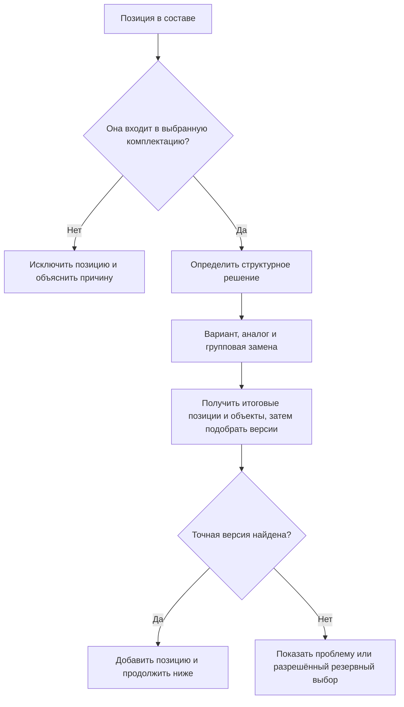
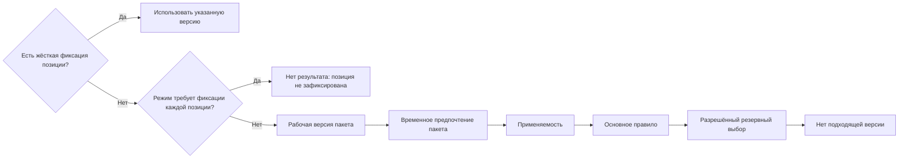

# Сквозное формирование многоуровневого состава

## Зачем нужен сквозной сценарий

Предыдущие документы рассматривают отдельные механизмы: точную фиксацию версии, пакет изменения, применяемость, правило по степени готовности, конфигуратор, аналоги и групповые замены. В реальном изделии они встречаются одновременно и на разных уровнях структуры.

Пользователь открывает не «механизм подбора», а редуктор, станок или насосную станцию и ожидает получить согласованное дерево. Поэтому главный продуктовый вопрос звучит так:

> Как Interlink последовательно применит все условия, не потеряет возможности IPS и сможет объяснить каждую строку результата?

Сквозной сценарий объединяет решения в один понятный порядок. Этот порядок одинаков по смыслу для просмотра отдельной позиции, полного дерева, фонового расчёта и подготовки производственного заказа. Отличаются только исходные условия и строгость допустимого результата.

## Какие исходные данные нужны

Для формирования состава недостаточно знать только головное изделие. Система получает явный набор условий:

- точную версию головного изделия либо ссылку на ранее зафиксированный состав;
- цель операции: просмотр, изменение, оценка, производство или сервис;
- пакет изменения, если специалист работает над изменением;
- головное изделие, серию, заводской номер и дату, если они влияют на применяемость;
- параметры комплектации;
- производственную площадку, проект или заказ;
- режим использования аналогов и групповых замен;
- правило подбора версий и разрешённое резервное поведение;
- права пользователя на живой просмотр либо отдельное полномочие выполнить операцию над всем деловым артефактом при публикации снимка.

Такой набор называется контекстом подбора: это все условия, определяющие результат данного запроса. Он обязателен для каждой операции, где Interlink должен выбрать версию. Рабочее место может заполнить его заранее, но всегда передаёт явно. Для открытия уже указанной точной версии, истории всех версий, неверсионируемого объекта или готового снимка новый подбор не выполняется, поэтому контекст подбора не требуется.

## Общий порядок обработки одной позиции

Для каждой позиции Interlink последовательно отвечает на несколько вопросов.

Таким образом, сначала определяется структура и объект, а потом версия объекта. Это защищает от смешения разных по смыслу решений.

Проверка условия присутствия до выбора версии закреплена нормативно. Богатая семантика структурных вариантов, глобальных аналогов и групповых замен пока остаётся целевой продуктовой моделью: их точный взаимный приоритет, адресация повторных вхождений и носитель решения заказа ещё не приняты окончательно. Схема показывает разделение вопросов, а не утверждённую очередь этих трёх механизмов.

## Порядок подбора версии

Сначала определяется режим. Готовый снимок читается напрямую: живой подбор, условия конфигуратора и применяемость повторно не запускаются. Если снимок повреждён, имеет неподходящий вид или относится к другому деловому артефакту, система отказывает в чтении. Она не подменяет исторический результат новым живым расчётом.

Когда строится живой состав и объект позиции уже определён, версия выбирается по следующей очередности:

1. **Жёсткая фиксация позиции.** Если связь явно закреплена на конкретной версии, более общие правила не применяются.
2. **Проверка строгого режима «только точные фиксации».** Если этот режим выбран, а фиксации нет, система немедленно сообщает, что версия не найдена. Рабочая версия, применяемость, основное и резервное правила уже не рассматриваются.
3. **Рабочая версия текущего пакета изменения.** Участник видит будущее содержание объекта только в явно указанном пакете.
4. **Временное предпочтение текущего пакета.** Оно действует только если пакет не содержит собственной рабочей версии объекта.
5. **Применяемость.** Учитываются головное изделие, серия, заводской номер и дата.
6. **Основное правило подбора.** Например, основная, последняя утверждённая или версия не ниже заданной степени готовности.
7. **Заранее разрешённый резервный алгоритм.** Ручное исключение заказа является отдельным решением и не выдаётся за автоматический резерв.
8. **Подходящая версия не найдена.** Позиция остаётся проблемной; система не угадывает результат.

Стрелки показывают не последовательное применение всех правил, а порядок приоритета: как только более сильный механизм дал точный ответ, нижестоящие уже не меняют его.

## Почему порядок именно такой

Готовый снимок находится вне живой очереди: его назначение — сохранить прошлый результат независимо от сегодняшних правил.

Жёсткая фиксация сильнее применяемости и общих правил, потому что она представляет осознанное решение использовать конкретную версию в конкретной позиции. Она не «проваливается» к более слабому правилу, даже если указанная версия отозвана: допустимость дальнейшей операции решает явная политика предприятия.

Строгий режим «только точные фиксации» используется там, где нельзя допустить ни одного плавающего выбора. Отсутствие фиксации в этом режиме является содержательным результатом «версия не найдена», а не поводом поискать рабочую, применимую или резервную версию.

Рабочая версия пакета изменения видна выше временного предпочтения и применяемости, чтобы участник изменения мог увидеть согласованный будущий состав целиком, даже пока новая версия ещё не действует для серийного производства.

Применяемость сильнее общего правила, потому что она выражает конкретное инженерное условие: для данного изделия или диапазона номеров нужна определённая версия.

Общее правило используется там, где специальных указаний нет. Резервный выбор стоит последним и никогда не маскируется под точное совпадение.

## Пример 1. Обычный просмотр серийного редуктора

Специалист открывает редуктор `РЦ-250` для заводского номера 1240. Пакет изменения не выбран. Комплектация стандартная, производственная площадка — основная.

В составе встречаются следующие ситуации:

| Позиция | Исходные данные | Результат |
|---|---|---|
| Корпус редуктора | общих специальных условий нет | последняя утверждённая версия 04 |
| Быстроходный вал | новая версия действует с номера 1200 | версия 03 по применяемости |
| Подшипник | для этого редуктора действует версия 02 | версия 02 по применяемости головного изделия |
| Табличка | для площадки задано отдельное правило | утверждённая версия 05 для данной площадки |
| Узел смазки | горизонтальное исполнение | включён стандартный вариант, вертикальный исключён |

Для каждой строки пользователь видит короткую причину. Например: «Версия 03 выбрана для заводских номеров начиная с 1200» или «Версия 04 — наиболее новая утверждённая версия».

Если тот же редуктор открыть без заводского номера, применяемость по диапазону может оказаться неопределённой. Система не должна молча считать номер 1240 или использовать последнее значение из другого окна. Она просит указать существенное условие либо работает в специально предусмотренном обзорном режиме.

## Пример 2. Работа конструктора над извещением

Конструктор готовит изменение узла быстроходного вала. В пакет изменения входят:

- новая рабочая версия вала;
- новая рабочая версия крышки подшипника;
- обновлённая версия сборочной единицы;
- неизменённый серийный подшипник.

При открытии состава внутри пакета изменения система показывает новые рабочие версии вала и крышки. Для подшипника, не изменяемого в этом пакете, продолжает действовать обычная применяемость. Остальные ветви редуктора также подбираются по своим правилам.

Получается цельное будущее состояние изделия, а не смесь случайных несогласованных рабочих данных.

Если другой пользователь открывает тот же редуктор вне этого пакета, он продолжает видеть утверждённые версии. Рабочий результат не становится новым общим составом до прохождения установленного процесса.

После согласования рабочие версии фиксируются как обычные версии и получают применяемость. Исторический пакет остаётся основанием изменения, но для будущих серийных заказов уже не требуется открывать его рабочий контекст.

## Пример 3. Заказной станок со сложной комплектацией

Для станка `СТ-500` заказчик выбрал полное ограждение, магазин на 60 инструментов, внутреннее охлаждение и автоматическую уборку стружки.

Сквозной проход выглядит так:

1. Конфигуратор исключает ручной лоток стружки и магазин на 30 инструментов.
2. Для привода магазина выбирается разрешённый на площадке вариант из двигателя, муфты и редуктора вместо покупного мотор-редуктора.
3. Для двигателя рассматривается утверждённый глобальный аналог локального изготовителя.
4. Для каждого объекта выбранного варианта подбирается версия.
5. Версия насоса внутреннего охлаждения определяется по дате заказа.
6. Версия защитного ограждения жёстко зафиксирована специальным требованием заказчика.
7. Для одного кабельного ввода подходящая версия не находится: требуется IP68, а утверждена только IP65.

В обзорном режиме система может показать почти всё дерево и выделить проблемный кабельный ввод. Но производственный снимок создать нельзя. После утверждения нужного кабельного ввода состав строится заново; только затем фиксируется точный результат.

Этот пример показывает, что успешный выбор корневой и большинства дочерних версий ещё не означает готовность всего изделия.

## Пример 4. Производственный заказ на насосную станцию

Насосная станция предназначена для северной площадки и имеет диапазон заводских номеров 501–508. Указаны холодный климат, наружная установка и резервирование двух насосов.

В процессе формирования:

- включаются подогрев шкафа и обогреваемый дренаж;
- стандартные уплотнения исключаются, морозостойкие включаются;
- для электродвигателя выбирается глобальный аналог, разрешённый на северной площадке;
- версия торцевого уплотнения выбирается по диапазону заводских номеров;
- будущая версия шкафа управления сначала проверяется внутри пакета изменения, а перед публикацией снимка пакет проводится и версия становится зафиксированной;
- для крепления навеса выбирается групповой вариант с литым кронштейном.

После проведения пакета полный расчёт повторяется по уже зафиксированным версиям, и только затем создаётся неизменяемый снимок. Снимок сохраняет происхождение решения, но не содержит рабочую версию. Через месяц меняется приоритет поставщиков и выпускается новая версия шкафа. Живой состав следующего заказа будет другим, но станции 501–508 продолжают ссылаться на ранее зафиксированный набор.

## Пример 5. Сервисный ремонт старого пресса

Сервисный инженер открывает зафиксированный состав пресса по заводскому номеру. Сначала система показывает историческое состояние без пересчёта. Затем инженер запускает отдельный режим подготовки ремонта на текущую дату.

В ремонтном режиме:

- снятый с производства насос получает рекомендуемый глобальный аналог;
- старый набор уплотнений заменяется утверждённым ремонтным комплектом;
- для датчика положения точного аналога нет, поэтому система показывает отсутствие подходящего решения;
- часть новых компонентов требует переходного кронштейна.

Исторический состав и проект ремонтного решения существуют рядом, но не смешиваются. Инженер может сравнить «как было зафиксировано» и «что предлагается установить». После согласования ремонта формируется новый точный сервисный комплект.

## Пример 6. Одинаковая сборочная единица в двух ветвях

В линии прокатного стана один типовой насосный модуль установлен дважды. Первая установка обслуживает горячую зону, вторая — обычную. Условия температуры передаются в каждую ветвь отдельно.

В горячей зоне включается дополнительный охладитель и выбираются высокотемпературные уплотнения. В обычной зоне эти позиции не нужны. Обозначение модуля одинаково, но результат в двух местах различается закономерно.

Interlink сохраняет путь каждой позиции в составе. Поэтому объяснение относится не только к объекту «Насосный модуль», но и к конкретному месту его установки. Локальные параметры первой ветви не влияют на вторую.

## Как читается уже зафиксированный состав

При открытии производственного или сервисного снимка система не выполняет правила заново. Она читает сохранённые точные версии и причины первоначального выбора.

Если снимок нельзя подтвердить как целостный, он имеет другой вид или не относится к выбранному заказу, пользователь получает отказ с причиной. Автоматически пересчитать вместо него сегодняшний живой состав нельзя: это уничтожило бы различие между историческим свидетельством и новой оценкой.

Это принципиально важно. Если старый заказ каждый раз пересчитывать по сегодняшней применяемости, он постепенно перестанет соответствовать тому, что было передано в производство.

Пользователь может отдельно запросить сравнение со свежим живым составом. Тогда система покажет различия, но не изменит исходный снимок.

## Что происходит при ошибке или неоднозначности

Система должна различать:

- позиция закономерно исключена комплектацией;
- не выбран обязательный параметр;
- одновременно подходят два конфликтующих структурных варианта;
- объект-аналог найден, но требует ручного подтверждения;
- версия объекта не найдена;
- применён разрешённый резервный выбор;
- принимающий продукт не разрешил пользователю операцию над полным деревом.

До обхода состава принимающий продукт проверяет право выполнить операцию над всем деловым артефактом и корнем передачи. Если такого полномочия нет, операция отклоняется целиком и обход не начинается. После разрешения Interlink строит полный граф до листьев без фильтрации ветвей по правам пользователя.

Для обычного просмотра может существовать явно неполное представление. Оно не становится кандидатом на производственный снимок. При публикации снимка обязательная позиция без версии или конфликт блокируют результат, а отсутствие права на весь артефакт блокирует сам запуск; «обрезанный по правам снимок» никогда не создаётся.

## Одинаковость результата в разных точках системы

В IPS некоторые режимы могли зависеть от конкретного окна Навигатора. В Interlink один и тот же смысл подбора должен использоваться:

- при открытии одной позиции;
- при раскрытии многоуровневого дерева;
- в отчёте «где применяется»;
- в фоновом расчёте;
- при формировании заказа;
- при последующем объяснении результата.

Это не означает, что все операции возвращают одинаковое представление. Например, история версий показывает много версий одного объекта, а состав — одну выбранную. Но если две операции решают один и тот же вопрос при одних условиях, они должны дать одинаковый ответ.

## Как пользователь получает объяснение

Для каждой строки результата полезна короткая причина первого уровня:

- «Точная версия закреплена в этой позиции»;
- «Показана рабочая версия текущего изменения»;
- «Версия действует для заводского номера 1240»;
- «Выбрана наиболее новая утверждённая версия»;
- «Использован глобальный аналог для площадки Восток»;
- «Включён вариант узла “Локальный привод”»;
- «Позиция исключена: внутреннее охлаждение не выбрано»;
- «Подходящая версия не найдена: требуется исполнение IP68».

Целевое рабочее место должно позволять раскрыть использованные параметры, значимых кандидатов и причины их отклонения. Текущий нормативный контракт уже требует показывать испробованные слои и предупреждения, но полный перечень каждого отклонённого кандидата ещё следует закрепить отдельно. Технические имена внутренних полей пользователю не нужны.

## Что меняется относительно IPS

| Область | IPS | Interlink |
|---|---|---|
| Общая цепочка | несколько механизмов работали внутри формирования состава | каждый механизм отвечает на отдельный продуктовый вопрос |
| Условия запроса | часть могла зависеть от режима окна | существенные условия явно относятся к операции |
| Конфигуратор | включён в общую обработку дерева | присутствие позиции определяется до выбора версии |
| Аналоги и замены | участвовали в подборе состава | отдельно выбираются объект или структурный вариант, затем версии |
| Приоритет версий | задавался поведением механизмов IPS | закреплён понятный единый порядок |
| Нет результата | могла использоваться «не совсем подходящая» версия | резервный выбор заметен, отсутствие результата честно показывается |
| Производственная фиксация | точный заказ сохранял результат | живой заказ отделён от неизменяемого снимка |
| Объяснение | зависело от конкретного режима и данных | причина выбора является частью результата каждой позиции |

## Что необходимо проверить вместе со специалистами IPS

Несмотря на целостность целевой схемы, продуктовая эквивалентность требует проверки на реальных данных. Особенно важны следующие вопросы:

- Есть ли в IPS скрытые исключения из указанного порядка приоритетов?
- Может ли контекст редактирования уступать применяемости в отдельных процессах?
- Как обрабатываются несколько одновременно открытых извещений?
- В какой момент рабочая версия становится видимой другим подразделениям?
- Какие виды «не совсем подходящего» выбора применяются на практике?
- Могут ли глобальный аналог и групповая замена одновременно претендовать на одну позицию?
- Как разрешаются перекрывающиеся диапазоны применяемости?
- Какие ветви необходимо раскрывать до листьев для разных видов заказов?
- Какие сведения IPS сохраняет для последующего объяснения точного заказа?

Ответы должны быть оформлены как отдельные продуктовые решения и приёмочные примеры, а не как неявные исключения в реализации.

## Критерии сквозной приёмки

1. Одинаковые исходные условия дают одинаковый выбор при просмотре позиции и полного дерева.
2. Для каждой строки можно назвать объект, точную версию и деловую причину выбора.
3. Исключение позиции, отсутствие версии и конфликт комплектации различаются.
4. Рабочие версии одного пакета изменения не просачиваются в обычный серийный просмотр.
5. Жёсткая фиксация не заменяется более новой версией по общему правилу.
6. Применяемость по серии имеет приоритет над общим правилом.
7. Аналог сначала меняет объект, после чего для него подбирается версия.
8. Групповая замена включает один целостный вариант без смешения участников.
9. Неоднозначность на любом вложенном уровне блокирует точную производственную передачу.
10. Зафиксированный снимок не пересчитывается после изменения правил и исходных данных.
11. Повторно используемый узел может законно дать разные результаты в разных ветвях.
12. Фоновая операция не зависит от последующих переключений пользовательского интерфейса.
13. В строгом режиме без точной фиксации система сразу возвращает отсутствие результата и не применяет более слабые уровни.
14. Повреждённый снимок не заменяется живым расчётом.
15. Публикация снимка сначала разрешается на весь артефакт, после чего Interlink строит полный граф без фильтрации по правам.

## Состояние реализации

Описанная схема является целевой продуктовой моделью Interlink. Базовые понятия объекта, версии, связи, управляемого изменения и запросов уже формируются в проекте. Полный сквозной механизм, включая конфигуратор, аналоги, групповые замены и производственные снимки, реализуется поэтапно. Поэтому документ описывает требуемое поведение и основу будущей приёмки, а не утверждает, что все сценарии уже доступны в готовом интерфейсе.

## Связанные документы

- [Общая картина изменений относительно IPS](Selection-overview)
- [Жёсткая фиксация точной версии](Selection-exact-fixation)
- [Работа внутри пакета изменения](Selection-change-package)
- [Применяемость по головному изделию, серии и дате](Selection-effectivity)
- [Настраиваемое правило подбора](Selection-custom-rule)
- [Условия включения позиций и конфигуратор](Selection-position-presence)
- [Глобальный аналог](Selection-global-analog)
- [Допустимые групповые замены](Selection-group-substitution)
- [Точный состав производственного заказа](Selection-order-snapshot)
