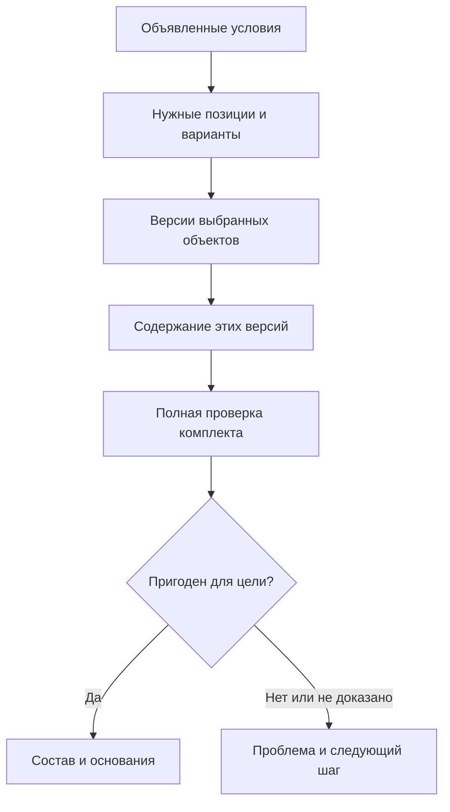
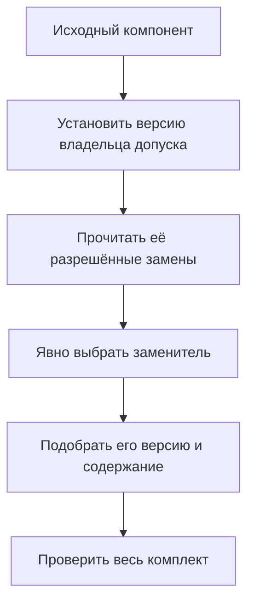

# Сквозное формирование многоуровневого состава

## Зачем нужен общий сценарий

В реальном изделии конкретизация, контексты, применяемость, правила, опции и замены встречаются вместе. Пользователь открывает станок или насосную станцию, а не отдельный механизм. Он ожидает согласованное дерево и ответ, почему выбрана каждая позиция.

Interlink должен применять один и тот же смысл выбора при просмотре позиции, раскрытии дерева, поиске «где используется», фоновом расчёте и подготовке заказа. Это не означает один неизменный порядок для всех задач. Одинаковые условия и профиль дают одинаковый ответ; другой явно выбранный профиль может обоснованно дать другой.

**Статус:** целевые сквозные сценарии архитектуры на 6 сентября 2026 года. Они задают будущую приёмку, а не объявляют готовый промышленный модуль.

## Сначала режим, затем условия

Готовая передача читается по сохранённому снимку: заново не выбираются ни версии, ни аналоги, ни применяемость. Если снимок повреждён или относится не к тому заказу, чтение завершается отказом, а не расчётом современного состава.

Для живого состава нужны корень и область структуры, цель, профиль, именованное правило с параметрами, контексты, разрешённые рабочие области, режим содержания, опции, применяемость и область решений о заменах. Не все параметры обязательны всегда; обязательность определяется задачей.

«Координаты» здесь — предметные условия, например серия, заводской номер и дата применяемости. Это не геометрические координаты САПР. Площадка или климат могут быть другими явными условиями; их смысл не угадывается из имени поля. Дата заказа не становится датой применяемости автоматически.

## Порядок зависимостей для живого состава

Схема выделяет обязанности. Нельзя трактовать её как запрет прочитать исходную версию до выбора аналога: некоторые допуски принадлежат именно версии. Тогда сначала устанавливается исходная версия и нужное содержание, затем читается её допуск, явно выбирается заменитель и обычным механизмом подбираются его версия и содержание.

Эта дополнительная зависимость нужна только там, где допуск привязан к исходной версии или точному состоянию. Каталог замен на уровне объекта не требует искусственного предварительного выбора версии. Ни один путь не разрешает взять допуск соседней версии, обойти жёсткую привязку или незаметно пройти цепочку аналогов.

## Как выбираются версия и содержание

В первую очередь проверяются заданные жёсткие ограничения и требуемая точность. Привязка к версии Б запрещает переход к В, но позволяет читать разрешённое содержание Б по режиму. Точная ссылка на опубликованное состояние закрепляет содержание полностью. Требование «только точные состояния» не удовлетворяется одной жёсткой привязкой версии.

При обычном выборе профиль совместимости IPS использует последовательность: **применяемость → контекст или группа → активная мягкая конкретизация → правило → явно разрешённый резерв**. Отдельный редакторский профиль Interlink может поставить контекст перед применяемостью. Это различие объявлено заранее, а не возникает от наличия рабочего пакета.

Источник может выбрать версию, не ограничивать выбор, явно исключить её или сообщить конфликт. Поэтому стрелки между источниками не означают «после любого отказа попробовать следующий». Жёсткая привязка, запрет и ошибка доступа не обходятся резервом.

Выбранная инженерная версия затем получает содержание: опубликованное, разрешённое рабочее или конкретное точное. Если контекст уже закрепил содержание, это уточнение сохраняется. Если содержание недоступно или несовместимо с режимом, система не возвращается к выбору другой инженерной версии.

После этого проверяются свойства всего набора: интерфейсы, геометрия, количества, квалификации, файлы и другие обязательные ограничения. Совпадение допустимых объектов не доказывает совместимость их новых состояний. Провал проверки не запускает скрытый перебор версий.

## Сценарий 1. Обычный просмотр серийного редуктора

Специалист открывает редуктор РЦ-250 для заводского номера 1240. Контекст опытного изменения не подключён, режим содержания — опубликованный, профиль — совместимый с IPS.

| Позиция | Условие | Выбор |
|---|---|---|
| Быстроходный вал | Версия В действует начиная с номера 1200 | В по применяемости |
| Корпус | Специального назначения нет | Назначенная основная Б |
| Уплотнение нагнетательного фланца | Сохранено активное предпочтение Г | Г по мягкой конкретизации |
| Защитный кожух | Задано точное состояние подписанного исполнения | Именно сохранённое содержание |
| Вертикальный узел смазки | Выбрано горизонтальное исполнение | Позиция не нужна |

У вала после выбора В читается опубликованное содержание В. У корпуса основная версия Б не превращается в последнюю экспериментальную В. Для уплотнения результат может измениться, если более приоритетный контекст явно назначит ему другую версию; сохранённое предпочтение при этом не исчезает.

Если номер не указан, система не подставляет 1240 из другого окна. Она требует обязательное условие либо применяет отдельно предусмотренный обзорный режим. Пользователь видит разницу между «ветвь не нужна» и «нужную версию невозможно определить».

## Сценарий 2. Конструкторы и технологи готовят модернизацию

Конструкторы ведут новую инженерную версию корпуса В и рабочую копию крышки Б. Технологи проверяют маршрут на опубликованном содержании крышки Б. Их контексты объединены для совместного анализа, но пакеты проведения остаются отдельными.

В редакторском профиле конструкторский контекст может поставить опытные версии выше серийной применяемости. Это помогает увидеть будущий состав. Но две несовместимые привязки содержания крышки Б дают конфликт группы — совпадения обозначения Б недостаточно.

Команды согласуют, какое содержание является общим основанием, и сохраняют итерацию «Перед испытанием усиленного корпуса». Конструктор завершает свой пакет; технолог продолжает работу. Контекст сохраняется, а ссылка на завершённую рабочую копию переходит к опубликованному результату по явной политике, не к случайной основной версии.

В производственном чтении новая проработка не появляется автоматически. Для следующей серии нужны отдельно утверждённые применяемость, состав и полный точный результат передачи.

## Сценарий 3. Заказной станок с групповым вариантом привода

Для станка СТ-500 выбраны магазин на 60 инструментов, полное ограждение и автоматическое удаление стружки. Условия комплектации исключают ручной лоток и магазин на 30 инструментов.

Вместо покупного мотор-редуктора выбран разрешённый комплект «двигатель, редуктор, муфта, переходная плита». Это решение относится к конкретной конфигурации заказа; оно не меняет библиотеку допуска для всех станков.

Система проверяет полноту комплекта и сохранность участников, которые должны оставаться для других выбранных решений в этом комплекте. Невыбранные предложения библиотеки сами по себе не запрещают пересечение альтернатив. Затем подбираются инженерные версии и их содержание. У выбранного двигателя изменена высота оси, но плита ещё соответствует прежнему содержанию. Идентичность двигателя и наличие допуска не отменяют несовместимость.

Пользователь получает проблему комплекта и выбирает новое допустимое решение. Система не удаляет плиту и не выбирает старый двигатель скрыто. Если отдельно запрошен поиск альтернатив, он рассматривает объявленных кандидатов и возвращает предложение с основаниями; решение применяется отдельным действием.

## Сценарий 4. Северная насосная станция на номера 501–508

Заказ содержит восемь станций. С номера 505 вводится другое уплотнение, а шкаф должен соответствовать новой защите от конденсата. Диапазон пересекает границу применяемости, поэтому планирование различает станции 501–504 и 505–508.

Будущий шкаф сначала проверяют с рабочими материалами. При подготовке передачи его публикация может войти в согласованный комплект вместе с другими изменениями. Снимок получает реальные опубликованные состояния, а не ссылки на продолжающие меняться рабочие копии.

Полный результат включает нужные ветви, нормы и основания проверки в объявленной области. Если один кабельный ввод не имеет допустимого содержания, обычная производственная публикация блокируется целиком. Отдельная выдача самостоятельной части возможна только после явного выделения её области, а не путём обрезания проблемной ветви.

Через месяц появляются новый шкаф и другие приоритеты поставщиков. Следующий живой расчёт может измениться. Прежние передачи остаются точными; состояние доставки и приёма также учитывается отдельно от содержания.

## Сценарий 5. Ремонт старого пресса и версия-владелец допуска

Сервис открывает прежний снимок передачи пресса и подтверждённые события установки. Это разные основания: переданная комплектация не всегда тождественна фактической после ремонтов.

В прессе стоит распределитель версии Б. Разрешённый аналог для Б требует переходной плиты. У версии В того же исходного распределителя есть другой допуск без плиты. Нельзя искать аналоги только по имени объекта и взять более удобное правило В.

Сначала устанавливается правильный исходный предмет, затем читается его допуск. Инженер выбирает полный заменяющий комплект. Подбор новых участников и проверка их точного содержания дают основание ремонта. Само разрешение замены ещё не меняет факт установки; после монтажа регистрируется отдельное событие.

## Сценарий 6. Один насосный модуль в двух местах

Типовой модуль установлен в горячей и обычной зонах прокатного стана. Его внутренний подшипник — одна локальная позиция в содержании модуля. Изменение локальной мягкой конкретизации этой позиции относится ко всем чтениям того же содержания.

Чтобы использовать разные решения в двух установках, нужно явно задать область конкретной конфигурации по месту установки либо создать разные инженерные исполнения. Два пути в дереве обозначают разные использования одной позиции. Пока для них не заданы отдельные условия выбора, изменение общей позиции действует на оба использования; сами пути не создают независимых настроек.

При массовой локальной команде два несовместимых пожелания дают конфликт. После выбора правильной области каждая ветвь получает собственное объяснение. Это расширение Interlink на конфигурационном уровне, а не предположение о внутреннем хранении конкретизации IPS.

## От расчёта к официальному результату

Успешный просмотр не является выпуском. Пользователь выбирает, что сохранить: контекст, позиционные предпочтения, вариант заказа, итерацию или точный комплект передачи.

Перед согласованием закрепляется точный предмет решения. Одобрение правок корпуса не равнозначно одобрению всей конфигурации. Для полного комплекта учитываются неизменённые участники, точные правила и существенные основания.

Если выбран договор «выпустить одобренное точное содержание», новая неиспользованная редакция правила или чужая смена основной версии не переписывает его. Если процесс требует также текущей актуальности объявленных зависимостей, их изменение вызывает конфликт. Обязательные нынешние запреты, права и защита записываемых материалов проверяются в обоих случаях.

Снимок сохраняет точные состояния и причины первоначального выбора. Для воспроизводимых файлов недостаточно одного имени или адреса: нужное содержание удерживается по установленной политике хранения. Позднее допустимое выбытие исторических данных не разрешает подставить вместо них современные.

## Ошибки не превращаются в удобный ответ

Нужно различать отсутствие нужной позиции по комплектации, отсутствие подходящей версии, конфликт назначений, несовместимость, недоказанность и отказ доступа. Это разные задачи для разных ответственных.

Локальная разрешающая строка не отменяет общий обязательный запрет. Отсутствие записи в неполной матрице не доказывает совместимость. Допустимость каждой пары не всегда доказывает совместимость трёх и более участников сразу. Поэтому полный комплект проверяется совместно по всем обязательным основаниям.

При обычном просмотре разрешённая неполная картина может быть полезна. Но фильтр экрана, ограниченная глубина и скрытая ветвь не определяют полноту производственной передачи. Если разрешения и данные не позволяют получить обязательный полный результат, операция останавливается.

## Критерии сквозной приёмки

1. Одинаковые условия и профиль дают одинаковые версии, содержание и причины в позиции, дереве и фоновом расчёте.
2. Версия и её точное содержание различаются; жёсткая привязка Б не становится ссылкой на В.
3. Долговечный контекст и мягкие предпочтения переживают завершение пакета.
4. Рабочие материалы видны только в объявленной разрешённой области.
5. Профиль IPS и редакторский профиль не заменяют друг друга скрыто.
6. Исключение, конфликт и отказ доступа не превращаются в резервный подбор.
7. Допуск аналога читается у правильной исходной версии, если он ей принадлежит.
8. Групповая замена сохраняет полный набор, количества и обязательных соседних участников.
9. После выбора содержания проверяется совместимость; скрытого отката к другой версии нет.
10. Повторная подсборка различает локальное решение и область конкретного использования.
11. Согласованный точный комплект не пересчитывается незаметно перед публикацией.
12. Готовый снимок не меняется при новой публикации или правиле; повреждённый снимок не заменяется живым расчётом.
13. Полная производственная выдача не сокращается до видимой либо успешно обработанной части.
14. История передачи, разрешение замены и фактическая установка остаются различимыми.

Для конкретной установки IPS нужны реальные данные и ожидаемые результаты: порядок источников, диапазоны применяемости, связанные контексты, синхронное завершение, автоматическая конкретизация и замены. Открытые детали сохраняются в профиле и вопросах, а не превращаются в скрытые исключения алгоритма.

## Дальнейшее чтение

- [[Общая картина изменений|Selection-overview]]
- [[Как работают пользователи|Selection-user-work]]
- [[Жёсткая привязка и точное состояние|Selection-exact-fixation]]
- [[Мягкая конкретизация|Selection-soft-concretion]]
- [[Контексты и группы|Selection-contexts]]
- [[Итерации и восстановление|Selection-iterations]]
- [[Применяемость|Selection-effectivity]]
- [[Допустимые замены|Allowed-replacements]]
- [[Совместимость|Compatibility-matrices]]
- [[Точный состав заказа|Selection-order-snapshot]]
