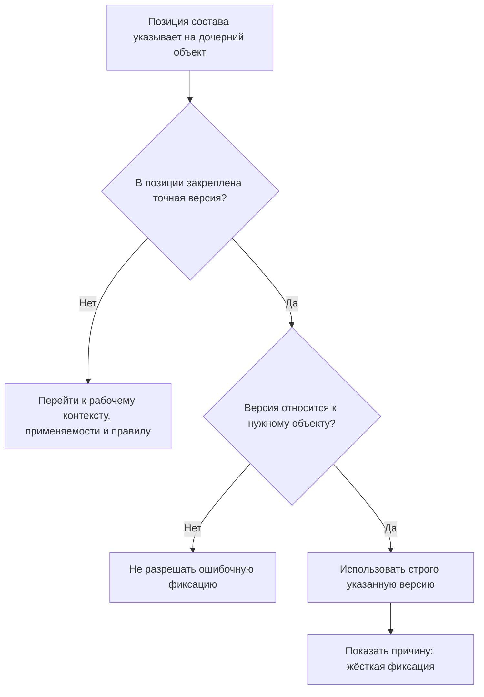

# Точная фиксация версии в конкретной позиции состава

## Суть сценария простыми словами

Большинство позиций состава можно оставить «плавающими»: система сама выберет подходящую версию дочернего объекта по применяемости или правилу. Но некоторые позиции должны указывать на строго определённую версию. Появление новых версий, изменение правила подбора и переключение рабочего контекста не должны менять этот выбор.

В IPS это называется **жёсткой конкретизацией**. В Interlink используется термин **жёсткая фиксация версии**, или `Pin` — английское название механизма, буквально «закрепление».

## Какую потребность машиностроительного предприятия решает механизм

Жёсткая фиксация нужна, когда инженерный смысл связи относится именно к конкретному состоянию дочернего объекта.

Наиболее характерные случаи:

- версия сборочной единицы должна быть связана с конкретной версией своей спецификации;
- извещение об изменении содержит точные версии документов, которые меняются;
- расчёт, протокол испытаний или сертификат относится к конкретной версии изделия;
- утверждённый комплект конструкторской документации не должен автоматически перейти на более новую версию одного документа;
- закупленное и сертифицированное исполнение комплектующего должно оставаться тем же до отдельного решения об изменении.

Без жёсткой фиксации новая версия дочернего объекта могла бы незаметно изменить смысл уже согласованной связи.

## Как этот сценарий работает в IPS

В IPS на связи состава сохраняется идентификатор конкретной дочерней версии. Такая конкретизация обычно назначается ядром или прикладным модулем в предусмотренном сценарии.

При чтении состава IPS сначала проверяет, есть ли точная конкретизация. Если она есть, остальные способы подбора для этой позиции не должны заменить выбранную версию. В дереве пользователь видит соответствующий статус.

Например, если версия сборочной единицы связана с версией 05 спецификации, выпуск версии 06 спецификации не меняет уже существующую связь. Чтобы использовать версию 06, нужно отдельно изменить состав родительского объекта.

## Как тот же результат достигается в Interlink

Позиция состава хранит два разных факта:

1. какой дочерний объект используется, например `Подшипник 3620`;
2. требуется ли в этой позиции строго определённая версия, например `версия 02 от 14.03.2031`.

Если точная версия закреплена, Interlink:

- проверяет, что она действительно относится к указанному дочернему объекту;
- возвращает именно её;
- указывает причину: «версия жёстко зафиксирована»;
- не применяет к этой позиции общие правила выбора последней, базовой или выпущенной версии.

## Пример 1. Спецификация сборочной единицы

Выпущена сборочная единица `Редуктор РЦ-250`, версия 05. Для неё утверждена конструкторская спецификация `РЦ-250 СБ`, версия 05.

Позже конструктор начинает подготовку версии 06 спецификации. В ней появятся новые крепёжные элементы и изменится материал прокладки. Пока новая спецификация не включена в новую версию редуктора и не проведена установленным процессом, редуктор версии 05 должен продолжать ссылаться на спецификацию версии 05.

Жёсткая фиксация обеспечивает это поведение. Обычное правило «показывать последнюю версию» не сможет подменить спецификацию.

## Пример 2. Состав извещения об изменении

Извещение `ИИ-РЦ250-031` выпущено для изменения:

- вала выходного `РЦ-250.02.003`, версия 02;
- крышки подшипника `РЦ-250.02.011`, версия 04;
- сборочного чертежа `РЦ-250 СБ`, версия 05.

Извещение должно хранить именно эти исходные версии. Если параллельно выпущена версия 05 крышки для другого изменения, она не должна автоматически заменить версию 04 в старом извещении. Иначе станет непонятно, какая документация фактически была предметом решения и подписей.

В Interlink позиции состава извещения или ссылки его предметной модели закрепляются за точными версиями. История изменения остаётся однозначной.

## Пример 3. Сертифицированный тормозной модуль подъёмного механизма

В составе подъёмного механизма используется тормозной модуль `ТМ-400`. Для версии 03 имеется протокол испытаний, действующий для конкретного исполнения механизма. Производитель модуля выпускает версию 04 с изменённым фрикционным материалом.

До завершения повторной оценки безопасности версия 04 не должна автоматически попасть в ранее утверждённый состав. Позиция тормозного модуля остаётся жёстко связанной с версией 03.

Даже если версия 04 является более новой и уже выпущена поставщиком, это не отменяет конкретного решения по составу подъёмного механизма.

## Как изменить жёстко зафиксированную версию

Жёсткая фиксация не означает, что позицию невозможно изменить. Она означает, что изменение должно быть явным и управляемым.

Обычный порядок:

1. Создать пакет изменения для родительской сборки.
2. Создать её рабочую версию.
3. Заменить точную версию в нужной позиции.
4. Проверить совместимость, применяемость и влияние на нижестоящий состав.
5. Согласовать новую версию родителя.
6. Провести пакет изменения.

Старая версия родительской сборки продолжит содержать прежнюю фиксацию. Новая версия будет содержать новую. История не переписывается.

## Почему общая применяемость не должна самовольно отменять фиксацию

Возможна ситуация, когда общая применяемость говорит «для серии 150 использовать версию 02», а в конкретной позиции закреплена версия 01.

Interlink выбирает версию 01, потому что точное инженерное решение сильнее общего правила. При этом система может показать предупреждение о противоречии, чтобы специалист проверил, не устарела ли фиксация.

Важно различать:

- **результат подбора** — версия 01, потому что она закреплена;
- **проверку допустимости** — можно ли применять версию 01 в данной серии по правилам предприятия.

Механизм выбора версии не должен молча переписывать точную ссылку. Контроль допустимости выполняется отдельно и может запретить выпуск нового состава.

## Чем жёсткая фиксация отличается от снимка состава

Жёсткая фиксация действует на одну позицию. Остальные позиции той же сборки могут оставаться плавающими.

Снимок состава фиксирует всё многоуровневое дерево от головного изделия до нижних уровней. Он применяется для выпуска, производственного заказа, обмена или доказательства исторического состояния.

Пример:

- в редукторе жёстко закреплена версия спецификации;
- версии стандартных подшипников выбираются по применяемости;
- версии крепежа выбираются по правилу «последняя выпущенная»;
- после полного выбора для производственного заказа создаётся снимок всего состава.

## Что пользователь увидит в интерфейсе

Вместо технического идентификатора рекомендуется показывать:

- объект: `Крышка подшипника РЦ-250.02.011`;
- выбранная версия: `версия 04 от 18.11.2030`;
- причина: `Версия жёстко зафиксирована в этой позиции`;
- источник решения: `Редуктор РЦ-250, версия 05` или `Извещение ИИ-РЦ250-031`;
- предупреждение, если общая применяемость противоречит фиксации.

## Почему сценарий функционально эквивалентен IPS

Interlink сохраняет все существенные свойства механизма IPS:

- точная версия не меняется при появлении новых версий;
- точная фиксация имеет приоритет над общим правилом;
- зафиксированная версия обязана принадлежать нужному объекту;
- пользователь видит причину выбора;
- изменение выполняется через новую версию родительского состава;
- исторические версии и ранее опубликованные снимки остаются неизменными.

## Что необходимо проверить на данных заказчика

- Какие типы связей IPS получают жёсткую конкретизацию автоматически?
- Может ли пользователь назначать её вручную и в каких случаях?
- Какие проверки выполняются при конфликте с применяемостью?
- Используют ли доработки заказчика собственные атрибуты конкретизации?
- Какие документы и расчёты должны ссылаться на точную версию состава?

## Приёмочные сценарии

1. Выпущена новая версия дочернего объекта — жёстко зафиксированная позиция не изменилась.
2. Пользователь выбрал правило «последняя версия» — зафиксированная позиция осталась прежней.
3. Указана версия другого объекта — система не разрешила ошибочную фиксацию.
4. В новой рабочей версии родителя выполнена перепривязка — старая версия родителя сохранила старую ссылку.
5. Опубликованный производственный снимок сохранил точную версию после дальнейших изменений.

## Состояние реализации

Жёсткая фиксация является принятым механизмом Interlink. Полная работа с составом, команды изменения и выполнение подбора реализуются поэтапно. Документ задаёт ожидаемое продуктовое поведение и набор будущих испытаний.

## Связанные документы

- [Временное предпочтение версии](Selection-temporary-preference)
- [Применяемость](Selection-effectivity)
- [Точный состав производственного заказа](Selection-order-snapshot)

