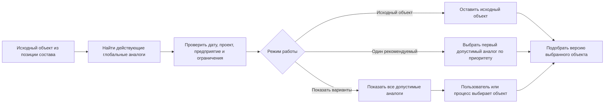

# Глобальный аналог объекта

## Что такое глобальный аналог

Глобальный аналог — это другой объект, который в установленной области применения может заменить исходный объект. Такой аналог задаётся не для одной строки одного состава, а для объекта в целом. Поэтому он может быть предложен во многих изделиях, где используется исходный объект, если местные ограничения не запрещают замену.

Например, подшипник одного изготовителя может иметь утверждённый аналог другого изготовителя с теми же основными характеристиками. Насос определённой модели может заменяться новой моделью после прекращения поставок. При этом у каждого объекта-аналога существуют собственные версии документации.

Отсюда следует важное разделение:

1. сначала выбирается **какой объект** использовать — исходный или один из аналогов;
2. затем обычный механизм Interlink выбирает **какую версию выбранного объекта** применить.

Аналог не является «ещё одной версией» исходного объекта.

## Что сохраняется относительно IPS

В IPS глобальные аналоги могут иметь период действия, приоритет и режим показа одного или нескольких кандидатов. Interlink должен сохранить:

- связь исходного объекта с разрешёнными аналогами;
- условия действия такой связи;
- приоритет кандидатов;
- возможность отключить автоматический учёт аналогов;
- режим показа одного рекомендуемого или всех допустимых аналогов;
- последующий подбор версии уже для выбранного объекта;
- объяснение, почему система предложила именно этот аналог.

Дополнительно Interlink должен явно отделить рекомендованный аналог от окончательно принятой замены в производственном составе.

## Общая последовательность

Выбор версии начинается только после выбора объекта. Поэтому правила применяемости версий, степени готовности и точной фиксации не приходится дублировать в механизме аналогов.

## Пример 1. Подшипники разных изготовителей

В редукторе указан подшипник `3620` изготовителя А. После квалификационных испытаний предприятие разрешило использовать подшипник того же типоразмера изготовителя Б как глобальный аналог.

Для связи указано:

- аналог допустим на площадке серийной сборки;
- действие начинается с 1 марта 2031 года;
- для редукторов морского исполнения требуется отдельное согласование;
- исходный подшипник остаётся первым предпочтением, пока доступен на складе.

В обычном конструкторском составе система продолжает показывать исходный объект. В режиме обеспечения заказа при дефиците она предлагает аналог изготовителя Б. После выбора аналога Interlink определяет его версию: например, последнюю утверждённую версию с актуальным перечнем смазок и сертификатов.

Если позже у аналога появляется новая версия документации, это не создаёт новый аналог. Меняется только результат второго шага — подбора версии уже выбранного подшипника.

## Пример 2. Замена снятого с производства электродвигателя

В насосной установке используется электродвигатель старой серии, снятый изготовителем с производства. Инженерная служба утвердила двигатель новой серии как глобальный аналог при выполнении трёх условий:

- мощность и частота вращения совпадают;
- требуется переходная плита;
- шкаф управления должен иметь новую настройку защиты.

Для сервисного специалиста система может предложить новый двигатель, но обязана вместе с ним показать сопутствующие условия. Простая строка «аналог найден» недостаточна, потому что физическая замена затрагивает монтаж и электрическую часть.

После принятия решения точный сервисный комплект включает конкретные версии двигателя, переходной плиты и изменённой документации шкафа. Исторический состав ранее выпущенной установки при этом не переписывается.

Этот пример также показывает границу глобального аналога. Если замена одного двигателя всегда требует добавить две другие позиции, одной связи «объект заменяет объект» может быть недостаточно. Тогда решение оформляется как групповая замена, описанная в [следующем документе](Selection-group-substitution).

## Пример 3. Аналог материала для корпуса насоса

Для отливки корпуса насоса задана сталь определённой марки. Из-за ограничений поставок предприятие квалифицировало другую марку стали как аналог, но только:

- для температур не ниже −20 °C;
- после дополнительной термообработки;
- не для оборудования, работающего с сероводородом;
- на ограниченный период действия решения.

Для обычного промышленного насоса аналог допустим. Для северного или химического исполнения — нет. Следовательно, «глобальный» не означает «безусловный»: связь принадлежит объекту в целом, но имеет управляемую область применимости.

После выбора марки материала подбирается версия соответствующего нормативного или материального объекта. Версия может определять актуальные требования к сертификатам и контролю качества.

## Пример 4. Временный аналог при дефиците комплектующих

На три месяца утверждён подшипниковый узел другого поставщика для выполнения крупного заказа. Он имеет более высокий приоритет только в пределах конкретного проекта и периода поставки.

При формировании заказа проекта система предлагает временный аналог первым. Для других проектов продолжает использоваться исходный объект. После окончания периода временная связь перестаёт участвовать в живом подборе, но ранее зафиксированные заказы сохраняют выбранный аналог и основание его применения.

Это позволяет не удалять историческую связь и не менять старые заказы задним числом.

## Пример 5. Безопасностно значимый тормозной модуль

Для тормозного модуля подъёмного механизма зарегистрирован технически совместимый аналог. Однако из-за требований сертификации его нельзя выбирать автоматически.

Система может показать аналог специалисту и указать, какие испытания и разрешения требуются. Автоматический режим «взять первый по приоритету» для этой категории запрещён. Окончательное решение принимается ответственным сотрудником и после согласования превращается в точную фиксацию.

Таким образом, приоритет аналога — не безусловная команда. Правила конкретной категории объекта могут требовать ручного подтверждения.

## Режимы работы с аналогами

В зависимости от задачи пользователю могут понадобиться разные режимы:

- **не учитывать аналоги** — показать исходный проектный состав;
- **показать рекомендуемый аналог** — использовать установленный приоритет и условия;
- **показать все допустимые аналоги** — дать специалисту выбор;
- **применить заранее утверждённое решение заказа** — использовать уже выбранный объект без повторного поиска;
- **проверить доступность аналогов** — аналитический режим без изменения состава.

Выбранный режим является частью условий конкретного просмотра или заказа. Переключение режима в одном окне не должно менять результат другого расчёта.

## Чем глобальный аналог отличается от локальной замены

| Глобальный аналог | Локальная или групповая замена |
|---|---|
| относится к объекту в целом | относится к конкретному составу, узлу или пути в структуре |
| обычно заменяет один объект другим | может заменять несколько позиций другим набором позиций |
| может предлагаться во многих изделиях | действует только там, где явно определена |
| выбирает объект-кандидат | выбирает целый вариант структуры |
| после выбора объекта отдельно подбирается его версия | после выбора варианта версии подбираются для каждого его участника |

Не следует автоматически превращать все локальные замены IPS в глобальные аналоги. Это расширило бы их область действия и могло бы предложить опасную замену в изделии, для которого она никогда не утверждалась.

## Что должно входить в объяснение результата

Продуктовому специалисту полезно видеть:

- какой исходный объект стоял в позиции;
- какой аналог предложен или выбран;
- на каком основании связь считается действующей;
- какие ограничения и сопутствующие действия существуют;
- был ли выбор автоматическим или подтверждён специалистом;
- какое правило затем выбрало версию аналога.

Пример:

> Вместо электродвигателя серии ДА выбран утверждённый глобальный аналог серии ДБ. Исходная серия снята с поставки. Замена разрешена для сервисного ремонта при установке переходной плиты. Для двигателя ДБ выбрана утверждённая версия 03, действующая на дату ремонта.

## Открытые продуктовые вопросы

- Какие условия действия глобальных аналогов фактически используются в IPS?
- Приоритет един для всего предприятия или зависит от площадки, проекта и процесса?
- Какие категории объектов запрещено заменять автоматически?
- Должна ли система учитывать складскую доступность или это ответственность внешней системы снабжения?
- Как показывать пользователю обязательные сопутствующие изменения?
- Когда предложение аналога должно превращаться в точное решение заказа?
- Требуется ли отдельное согласование временных аналогов после окончания их периода действия?

## Критерии приёмки

1. Система различает исходный объект, объект-аналог и версии каждого из них.
2. Аналог предлагается только в разрешённой области действия.
3. При нескольких кандидатах порядок выбора однозначен и объясним.
4. Для выбранного аналога применяется обычный механизм подбора версии.
5. Исторический состав не меняется после окончания действия или удаления рекомендации аналога.
6. Безопасностно значимая замена не выполняется автоматически, если требуется подтверждение.
7. Пользователь видит сопутствующие ограничения, а не только наименование заменяющего объекта.

## Состояние реализации

Двухшаговая схема «сначала объект, затем его версия» принята как целевой принцип. Полная предметная модель глобальных аналогов, их ограничений и согласования ещё должна быть согласована с данными и процессами IPS.

## Связанные документы

- [Допустимые групповые замены](Selection-group-substitution)
- [Настраиваемое правило подбора версий](Selection-custom-rule)
- [Точный состав производственного заказа](Selection-order-snapshot)
