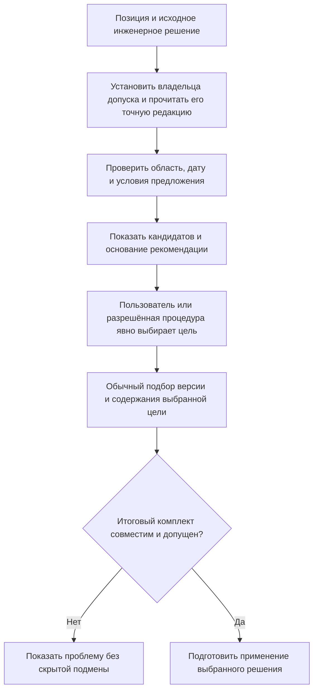
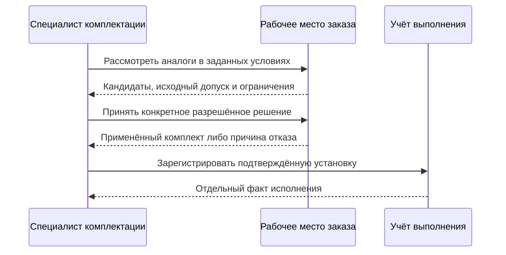

# Глобальный аналог объекта

## Что такое глобальный аналог

Глобальный аналог — это другой объект, который в установленной области применения может заменить исходный объект. Слово «глобальный» означает, что допуск не ограничен одной строкой одного состава: он может использоваться в разных изделиях. Оно не означает безусловную замену на всех предприятиях, во всех версиях и назначениях.

Для переноса IPS существенно, что описание аналогов в руководстве относится к **версии исходного объекта**. Поэтому разрешённые аналоги версии 02 двигателя нельзя автоматически объявить аналогами всех его версий. Interlink допускает разные области декларации, но сохраняет исходную версионную привязку при миграции.

Например, подшипник одного изготовителя может иметь утверждённый аналог другого изготовителя с теми же основными характеристиками. Насос определённой модели может заменяться новой моделью после прекращения поставок. При этом у каждого объекта-аналога существуют собственные версии документации.

Отсюда следует важное разделение:

1. определяется, к какому исходному объекту, версии и при необходимости точному содержанию относится допуск;
2. явно решается, **какой объект** использовать — исходный или разрешённый аналог;
3. обычный механизм выбирает **какую инженерную версию и какое её содержание** применить;
4. проверяется совместимость итогового комплекта и обязательные допуски назначения.

Аналог не является «ещё одной версией» исходного объекта. А подбор версии аналога не выдаёт автоматически разрешение на его применение.

## Что сохраняется относительно IPS

В IPS глобальные аналоги имеют периоды действия, признак приоритетного аналога и три различающихся режима подбора: **«Не подбирать аналоги», «Подобрать действующий аналог», «Подобрать один аналог»**. Их нельзя заменить общей формулировкой «показать рекомендуемый или все варианты». Interlink должен сохранить:

- связь исходного объекта или его версии с разрешёнными аналогами без расширения исходной области;
- условия действия такой связи;
- исходный признак приоритетного аналога без придуманной числовой шкалы;
- выключенный подбор, подбор только однозначного действующего результата и отдельный режим выбора одного аналога;
- различие множественного списка кандидатов и одного объекта, выбранного для данного расчёта состава;
- последующий подбор версии уже для выбранного объекта;
- объяснение, почему система предложила именно этот аналог.

Дополнительно Interlink должен явно отделить предложение, результат подбора для просмотра, разрешение применения и окончательно принятую замену в производственной передаче. Просмотр всех кандидатов может быть полезным отдельным представлением, но не подменяет ни один из трёх исходных режимов.

## Общая последовательность

Когда допуск принадлежит исходной версии, сначала нужно установить именно эту версию и требуемое содержание: прочитать уже точное основание либо воспользоваться обычным подбором. Для каталога, действительно заданного на уровне объекта, искусственный предварительный подбор не нужен. После выбора аналога тот же механизм работает уже с новой целью. Это зависимость исходных данных, а не второй произвольный алгоритм версий.

Если у выбранной исходной версии нет нужного допуска, система не берёт его у соседней версии. Если итоговая совместимость не пройдена, она не переключается незаметно на более старую версию аналога. Другой вариант можно исследовать отдельным объяснимым действием с соблюдением жёстких ограничений. Точный порядок совместимого режима IPS, включая взаимодействие с конкретизацией, проверяется на данных используемой установки.

## Пример 1. Подшипники разных изготовителей

В редукторе указан подшипник `3620` изготовителя А. После квалификационных испытаний предприятие разрешило использовать подшипник того же типоразмера изготовителя Б как глобальный аналог.

Для связи указано:

- аналог допустим на площадке серийной сборки;
- действие начинается с 1 марта 2031 года;
- для редукторов морского исполнения требуется отдельное согласование;
- исходный подшипник остаётся первым предпочтением, пока доступен на складе.

В обычном конструкторском составе система продолжает показывать исходный объект. В режиме обеспечения заказа при дефиците она предлагает аналог изготовителя Б. После выбора аналога Interlink определяет его версию: например, последнюю утверждённую версию с актуальным перечнем смазок и сертификатов.

Если у аналога появляется новая версия или новое опубликованное содержание существующей версии, связь между объектами не обязана меняться. Однако допуск может быть ограничен ранее испытанными версиями и состояниями. Новизна сама не даёт права применить новую документацию: ограничения проверяются заново для живого решения. Старый опубликованный заказ сохраняет своё точное основание.

## Пример 2. Замена снятого с производства электродвигателя

В насосной установке используется электродвигатель старой серии, снятый изготовителем с производства. Инженерная служба утвердила двигатель новой серии как глобальный аналог при выполнении трёх условий:

- мощность и частота вращения совпадают;
- требуется переходная плита;
- шкаф управления должен иметь новую настройку защиты.

Для сервисного специалиста система может предложить новый двигатель, но обязана вместе с ним показать сопутствующие условия. Простая строка «аналог найден» недостаточна, потому что физическая замена затрагивает монтаж и электрическую часть.

После принятия решения точный сервисный комплект включает конкретные опубликованные состояния версий двигателя, переходной плиты и изменённой документации шкафа. Исторический состав ранее выпущенной установки при этом не переписывается.

Этот пример также показывает границу глобального аналога. Если замена одного двигателя всегда требует добавить две другие позиции, одной связи «объект заменяет объект» может быть недостаточно. Тогда решение оформляется как [[групповая замена|Selection-group-substitution]].

## Пример 3. Аналог материала для корпуса насоса

Для отливки корпуса насоса задана сталь определённой марки. Из-за ограничений поставок предприятие квалифицировало другую марку стали как аналог, но только:

- для температур не ниже −20 °C;
- после дополнительной термообработки;
- не для оборудования, работающего с сероводородом;
- на ограниченный период действия решения.

Для обычного промышленного насоса аналог допустим. Для северного или химического исполнения — нет. Следовательно, «глобальный» не означает «безусловный»: связь имеет управляемую область применения и сохраняет ограничения исходной версии, если разрешение дано именно ей.

После выбора марки материала подбирается версия соответствующего нормативного или материального объекта. Версия может определять актуальные требования к сертификатам и контролю качества.

## Пример 4. Временный аналог при дефиците комплектующих

На три месяца утверждён подшипниковый узел другого поставщика для выполнения крупного заказа. Он имеет более высокий приоритет только в пределах конкретного проекта и периода поставки.

При формировании заказа проекта система предлагает временный аналог первым. Для других проектов продолжает использоваться исходный объект. После окончания периода временная связь перестаёт участвовать в живом подборе, но ранее зафиксированные заказы сохраняют выбранный аналог и основание его применения.

Это позволяет не удалять историческое основание и не менять старые заказы задним числом. Дата запроса, срок разрешения, применяемость конструкции и фактическая дата установки — разные сведения. Корпоративное правило должно явно назвать, какую дату проверяют; системные часы не подменяют условия заказа.

## Пример 5. Безопасностно значимый тормозной модуль

Для тормозного модуля подъёмного механизма зарегистрирован технически совместимый аналог. Однако из-за требований сертификации его нельзя выбирать автоматически.

Система может показать аналог специалисту и указать, какие испытания и разрешения требуются. Автоматический режим «взять первый по приоритету» для этой категории запрещён. Окончательное решение принимает ответственный сотрудник; после проверки оно применяется в разрешённом заказе или рабочем составе. Для официальной передачи отдельно фиксируется точное опубликованное содержание. Факт применения решения ещё не означает, что тормоз физически установлен: это отдельная запись исполнения.

Таким образом, приоритет аналога — не безусловная команда. Правила конкретной категории объекта могут требовать ручного подтверждения. По умолчанию разрешение заменить тормоз А тормозом Б не доказывает обратную замену; цепочка А → Б → В также не создаёт автоматически разрешения А → В.

## Пример 6. Разные версии двигателя имеют разные аналоги

Версия 02 привода насосной станции использует фланец старого размера, а версия 03 — усиленный фланец. Для версии 02 после испытаний разрешён двигатель изготовителя Б. Для версии 03 разрешён двигатель изготовителя В с другим креплением.

Сервисный заказ указывает версию 02 исходного привода. Система сначала устанавливает это исходное основание, читает относящийся к нему допуск и предлагает изготовителя Б. Она не объединяет оба списка лишь потому, что обозначение исходного объекта совпадает. После выбора подбираются версия двигателя Б и её разрешённое содержание, а затем проверяются крепление, питание и совместимость с соседними участниками.

Если изготовитель Б недоступен, двигатель В не становится разрешённым запасным вариантом автоматически. Требуется отдельное инженерное решение: например, испытать новый монтажный комплект и оформить дополнительный допуск. Пользователь видит именно отсутствие подтверждённой замены в данной области, а не произвольный следующий результат поиска.

## Режимы работы с аналогами

### Три исходных режима IPS

| Режим IPS | Пользовательский результат | Существенная граница |
|---|---|---|
| Не подбирать аналоги | Исходный объект остаётся в составе; поиск замены не выполняется | Наличие назначенных аналогов само не включает подмену |
| Подобрать действующий аналог | Замена происходит только при однозначном действующем варианте на дату запроса | Если однозначность не установлена, нельзя незаметно выбрать первый результат или заменить проверку рекомендацией |
| Подобрать один аналог | Для объекта с назначенными аналогами исходный режим выбирает один аналог, а не только показывает список | Полный порядок выбора, включая приоритет и случаи отсутствия единственного действующего кандидата, подтверждается примерами исходной установки |

В режиме «подобрать действующий» два одновременно действующих кандидата не превращаются в однозначную замену лишь потому, что один стоит первым в выдаче. Система сохраняет объяснение множественности; результат исходного просмотра воспроизводится по проверенному профилю IPS. Другой режим — «подобрать один» — нельзя свести к сообщению об этой же неоднозначности: его задача состоит именно в выборе одного аналога по исходной семантике. Но неизвестную часть этого порядка нельзя выдумать, например назначив победителя по имени, порядку загрузки или случайному признаку.

Руководство IPS различает также состояния результата: действующий, приоритетный или единственный, просто назначенный аналог. Поэтому «подобран один аналог» не равнозначно «найден единственный действующий аналог». Тем более это не универсальное разрешение применять выбранный компонент в производстве. Interlink сохраняет результат исходного подбора и его основание отдельно от последующих проверок совместимости, квалификации и текущих обязательных запретов.

Для режима, зависящего от даты, сохраняется именно дата запроса. В описанном руководством IPS поведении по умолчанию используется текущая дата, а при включённом подборе по сериям и датам с заданной датой — это заданное значение. При переносе проверяется соответствие целевой установке; плановая дата поставки не объявляется такой датой автоматически.

### Дополнительные представления и действия Interlink

Специалисту могут понадобиться показ всех кандидатов, рекомендация с объяснением, проверка снабжения или применение ранее утверждённого решения заказа. Это самостоятельные представления и действия. Показ всех кандидатов не заменяет исходный режим «подобрать один», а рекомендация ещё не означает принятую замену. Если пользователь выбрал вариант из списка, это отдельное явное решение со своей областью и проверками.

Например, для подшипника редуктора на дату запроса назначены два действующих аналога — изготовителей Б и В. В выключенном режиме остаётся исходный подшипник. В режиме только однозначного действующего результата множественность не маскируется выбором Б по порядку строк. В режиме «подобрать один» результат определяется подтверждённым исходным правилом; при недостатке сведений о нём перенос остаётся непроверенным в этой части. Отдельное аналитическое представление может показать и Б, и В, но это не доказывает, что какой-либо из них уже выбран или разрешён для производственного заказа.

Выбранный режим является частью условий конкретного просмотра или заказа. Переключение режима в одном окне не должно менять результат другого расчёта.

Схема показывает границу между предложением, применением решения и физическим фактом. Последний шаг возникает только после подтверждённых работ. Само нажатие «применить аналог к заказу» не доказывает, что компонент уже установлен, а запись факта не выдаёт задним числом отсутствовавший инженерный допуск.

## Чем глобальный аналог отличается от локальной замены

| Глобальный аналог | Локальная или групповая замена |
|---|---|
| действует в объявленном каталоге для объекта или его версии | применяется к конкретному составу, узлу или пути в структуре |
| обычно заменяет один объект другим | может заменять несколько позиций другим набором позиций |
| может предлагаться во многих изделиях | действует только там, где явно определена |
| выбирает объект-кандидат | выбирает целый вариант структуры |
| после выбора объекта отдельно подбирается его версия | после выбора варианта версии подбираются для каждого его участника |

Не следует автоматически превращать все локальные замены IPS в глобальные аналоги. Это расширило бы их область действия и могло бы предложить опасную замену в изделии, для которого она никогда не утверждалась.

## Что должно входить в объяснение результата

Продуктовому специалисту полезно видеть:

- какой исходный объект и какая его версия были основанием допуска;
- какой аналог предложен или выбран;
- на каком основании связь считается действующей;
- какие ограничения и сопутствующие действия существуют;
- был ли выбор автоматическим или подтверждён специалистом;
- какое правило выбрало версию аналога и какое содержание этой версии проверено;
- какие ограничения итогового комплекта проверены, что уже применено и что пока остаётся предложением.

Пример:

> Вместо электродвигателя серии ДА выбран утверждённый глобальный аналог серии ДБ. Исходная серия снята с поставки. Замена разрешена для сервисного ремонта при установке переходной плиты. Для двигателя ДБ выбрана утверждённая версия 03, действующая на дату ремонта.

## Открытые продуктовые вопросы

- Какие условия действия глобальных аналогов фактически используются в IPS?
- Приоритет един для всего предприятия или зависит от площадки, проекта и процесса?
- Какие категории объектов запрещено заменять автоматически?
- Должна ли система учитывать складскую доступность или это ответственность внешней системы снабжения?
- Как показывать пользователю обязательные сопутствующие изменения?
- Когда предложение аналога должно превращаться в точное решение заказа?
- Требуется ли отдельное согласование временных аналогов после окончания их периода действия?

## Критерии приёмки

1. Система различает исходный объект, объект-аналог и версии каждого из них.
2. Аналог предлагается только в разрешённой области, включая исходную версию, если к ней привязан допуск.
3. При нескольких кандидатах режим рекомендации и критерии однозначности явны; неопределённость не скрывается случайным выбором первого.
4. Для выбранного аналога применяется обычный механизм подбора версии.
5. Исторический состав не меняется после окончания действия или удаления рекомендации аналога.
6. Безопасностно значимая замена не выполняется автоматически, если требуется подтверждение.
7. Пользователь видит сопутствующие ограничения, а не только наименование заменяющего объекта.
8. Проверяется совместимость выбранного содержания; отказ не запускает скрытую замену версии или обход жёсткой конкретизации.
9. Разрешение, выбор, применение и физическая установка остаются разными фактами.

## Состояние реализации

Разделение допуска, выбора альтернативы, обычного подбора версии и проверки итогового содержания принято как целевой контракт. Зависимость допуска от исходной версии также учтена. Сквозная подсистема пока не является готовой пользовательской функцией; точный профиль переноса проверяется на реальных списках аналогов, настройках дат, приоритетов и конкретизации IPS.

## Связанные документы

- [[Допустимые замены: от разрешения до применения|Allowed-replacements]]
- [[Допустимые групповые замены|Selection-group-substitution]]
- [[Матрицы совместимости|Compatibility-matrices]]
- [[Настраиваемое правило подбора версий|Selection-custom-rule]]
- [[Точный состав производственного заказа|Selection-order-snapshot]]
