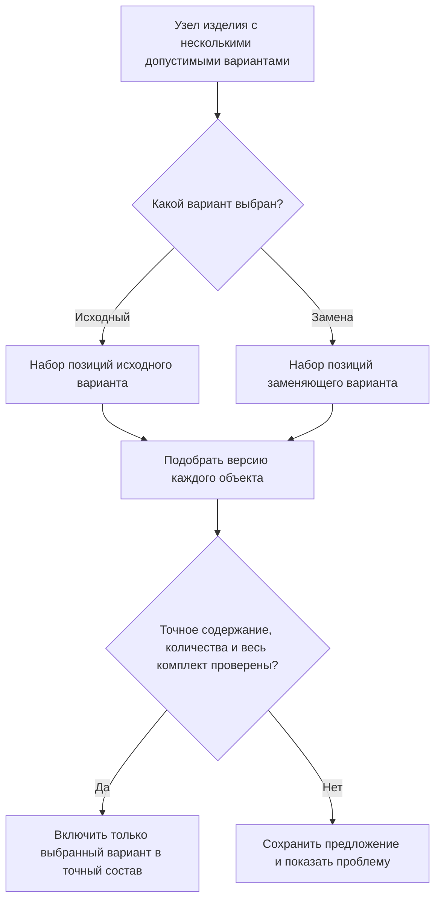

# Допустимые групповые замены в составе

## Что такое групповая замена

Иногда один объект можно заменить одним аналогом. Но в машиностроительном составе часто встречается более сложная ситуация: несколько позиций исходного решения заменяются другим набором позиций.

Например, отдельный кронштейн и четыре крепёжных болта могут заменяться единым литым кронштейном со встроенными креплениями. Два раздельных гидравлических клапана — одним комбинированным блоком. Покупной мотор-редуктор — комплектом из электродвигателя, муфты и редуктора.

В IPS такие случаи поддерживаются механизмами допустимых замен вида N:M, где один набор из N позиций заменяется другим набором из M позиций. Interlink сохраняет этот продуктовый смысл и называет его **групповой заменой**. Это не просто семейство версий одной детали: меняется полный набор участников и их количеств.

Применение групповой замены относится не только к объектам, но и к определённому месту в структуре. Один и тот же кронштейн может иметь замену в станке новой серии и не иметь её в старом из-за другого монтажного пространства. При этом само описание проверенного комплекта может храниться в библиотеке и использоваться повторно с явной привязкой к подходящим позициям.

## Основной принцип

Формирование состава разделяет структурное решение и подбор содержания его участников:

1. определяется разрешённое описание замены, его точная редакция и соответствие конкретным позициям;
2. пользователь или разрешённая процедура выбирает полный вариант для данного заказа и места применения;
3. для каждой позиции выбранного варианта обычные правила подбирают инженерную версию и нужное её содержание;
4. проверяется полный результат: количества, единицы, совместимость выбранных состояний, обязательные допуски и отсутствие противоречащих действий.

Само описание групповой замены не содержит второго алгоритма версий болта или клапана. Оно определяет допустимую структуру и ограничения участников, а подбор выполняется общим механизмом. Если допуск принадлежит исходной версии, её основание устанавливается до чтения этого допуска; это не разрешает искать удобное правило у произвольной другой версии.

Отказ итоговой проверки не переключает состав незаметно на другую версию и не выбрасывает проблемную позицию. Можно предложить другое решение, но оно должно быть выбрано, проверено и объяснено отдельно.

## Пять разных предметных действий

| Действие | Что получает предприятие | Что ещё не произошло |
|---|---|---|
| Описать допустимый комплект | Повторно используемое инженерное разрешение с ограничениями | Ничего не заменено в заказе |
| Привязать роли к позициям | Понятно, какой двигатель, фланец и крепёж заменяются здесь | Вариант ещё может быть не выбран |
| Выбрать вариант для контекста | Решение для определённого заказа, корня и ветви | Общая конструкторская структура не обязана измениться |
| Применить решение | Проверенное изменение рабочего состава или официальной передачи | Физическая установка ещё не подтверждена |
| Зарегистрировать исполнение | Свидетельство, что действительно сняли и установили | Отклонение не становится автоматически разрешённым |

Например, библиотека содержит комплект «Локальный привод вместо покупного мотор-редуктора». В одном конвейере роль «исходный привод» связывается с приводом головной секции, в другом — с приводом наклонного участка. Привязка проверяет конкретные позиции и требования, а не только совпадение типа объекта. Каждый заказ выбирает вариант независимо; не требуется переключать одну общую отметку актуальности перед каждым расчётом.

Это намеренное развитие относительно внутреннего устройства IPS. Совместимый профиль сохраняет исходные группы, актуальный и допустимые варианты и привычные результаты просмотра. Но правило «в группе ровно один актуальный вариант» не превращается в запрет всем заказам предприятия выбрать разные разрешённые комплекты.

Применение — отдельная управляемая команда. Она показывает изменения до и после, проверяет полномочия, ожидаемое состояние позиций и полный набор обязательных ограничений. Заказный выбор не переписывает общую конструкторскую структуру без отдельного намерения. Если за время подготовки другой инженер изменил затрагиваемую позицию, план не перезаписывает его правку: пользователь получает конфликт и сохраняет свой подготовленный результат для сравнения.

## Что сохраняется относительно IPS

Interlink должен сохранить:

- возможность объединить несколько связанных позиций в один заменяемый узел;
- несколько разрешённых вариантов этого узла;
- один исходный или предпочтительный вариант;
- условия, период и область допустимости каждого варианта;
- количества и единицы для каждой позиции;
- выбор варианта для конкретного заказа;
- воспроизводимость ранее выбранного варианта;
- объяснение, почему один набор позиций исчез, а другой появился.

При этом новая система должна исключить неоднозначность, возникающую, если групповой вариант пытаются представить как обычную замену одной версии другой.

## Пример 1. Кронштейн с отдельным крепежом

В исходной конструкции защитного ограждения станка применяются:

- сварной кронштейн — 1 штука;
- болт М10×30 — 4 штуки;
- шайба 10 — 4 штуки;
- гайка М10 — 4 штуки.

Для новой площадки утверждён литой кронштейн со встроенными резьбовыми втулками. В заменяющем варианте используются:

- литой кронштейн — 1 штука;
- болт М10×25 — 4 штуки.

Нельзя просто назвать литой кронштейн аналогом сварного. Если заменить только кронштейн, в составе останутся лишние шайбы и гайки, а длина болта будет неверной. Поэтому оба набора описываются как два целостных варианта одного монтажного решения.

После выбора литого варианта Interlink отдельно подбирает версии литого кронштейна и болта М10×25 и определяет точное содержание для передачи. Исходные позиции в точный состав заказа не входят. Если подходящий кронштейн есть, а обязательный болт не выбран или не допущен, половина замены не применяется: пользователь видит неготовый комплект и недостающего участника.

## Пример 2. Два клапана или комбинированный гидроблок

В гидросистеме пресса исходный вариант состоит из клапана ограничения давления и клапана разгрузки, соединённых трубопроводом. Новый поставщик предлагает комбинированный гидроблок, выполняющий обе функции.

Исходный вариант включает:

- клапан ограничения давления;
- клапан разгрузки;
- трубку;
- два соединительных штуцера;
- крепёжную плиту.

Заменяющий вариант включает:

- комбинированный гидроблок;
- другой комплект крепежа;
- изменённый рукав высокого давления.

Вариант с гидроблоком разрешён только начиная с определённой серии прессов, потому что у старой рамы недостаточно места. Выбор по серийному номеру относится к варианту узла. После выбора для гидроблока, крепежа и рукава подбираются версии, действующие на дату заказа.

Если позднее меняется версия рукава, это не обязано создавать третий структурный вариант. Но допуск комплекта может ограничивать его характеристики или конкретное испытанное содержание. Новая версия проходит эти ограничения; сам факт принадлежности к прежнему объекту не доказывает совместимость с гидроблоком.

## Пример 3. Мотор-редуктор или комплектный привод

Конвейер может оснащаться:

- покупным мотор-редуктором как одной поставочной позицией;
- либо комплектом из электродвигателя, упругой муфты, редуктора, защитного кожуха и монтажной рамы.

Первый вариант проще для сборки, второй используется при недоступности импортного мотор-редуктора и позволяет применять локальные комплектующие. Это замена одной позиции пятью, то есть классический случай 1:5.

Для выбора локального комплекта требуется проверить:

- передаточное отношение и выходной момент;
- размеры монтажной рамы;
- напряжение и исполнение двигателя;
- наличие защитного кожуха;
- соответствие требованиям безопасности.

После инженерного утверждения система фиксирует выбранный вариант и точные опубликованные состояния всех пяти объектов. Если поставки импортного мотор-редуктора восстановятся, ранее выданный заказ не переключается назад автоматически. Складская доступность помогает ранжировать уже разрешённые варианты, но не заменяет инженерный допуск.

## Пример 4. Замена в конкретной ветви многоуровневого изделия

Один и тот же фильтр используется дважды в маслостанции: в линии смазки подшипников и в отдельной линии управления. Для линии смазки разрешена замена «один большой фильтр» на «два параллельных фильтра меньшего размера». Для линии управления такая замена запрещена из-за ограниченного пространства.

Связь только по обозначению фильтра была бы недостаточна: система предложила бы замену в обеих ветвях. Поэтому групповая замена привязана к конкретному месту и пути в структуре маслостанции.

Пользователь видит понятную область действия:

> Вариант с двумя параллельными фильтрами разрешён только в узле «Контур смазки подшипников» маслостанции МС-40. В контуре управления используется исходный вариант.

## Пример 5. Ремонтный комплект вместо отдельных деталей

При заводской сборке торцевое уплотнение насоса состоит из отдельных колец, пружин и прокладок. Для сервисного ремонта поставщик разрешает использовать готовый ремонтный комплект.

Это не обязательно означает изменение проектного состава нового насоса. Групповая замена может быть допустима только в сервисном процессе. В производственном заказе остаются отдельные детали, а в ремонтном заказе выбирается один комплект.

Следовательно, область действия варианта должна учитывать не только изделие и дату, но и назначение состава: производство, ремонт, модернизация или оценка.

## Как определяется область действия

Для групповой замены могут быть существенны:

- конкретная сборочная единица;
- точная ветвь или место повторного использования узла;
- серия или диапазон заводских номеров;
- производственная площадка;
- проект или заказ;
- дата действия решения;
- вид процесса — производство, ремонт или сервис;
- выбранные параметры комплектации;
- состояние согласования варианта.

Несколько допустимых вариантов — нормальное состояние библиотеки предложений, а не ошибка. Для точной передачи необходимо однозначное решение: явный выбор пользователя либо объявленная разрешённая процедура. Если процедура не может однозначно выбрать, система сообщает, что структурное решение не определено. Отсутствие нужных сведений также не выдаётся за доказанный запрет.

## Пересекающиеся предложения и общий крепёж

В библиотеке могут существовать две альтернативы для одного привода: заменить его локальным комплектом либо полностью заменить приводную секцию. Пока они только предложения, пересечение не мешает хранению. Ошибка возникает, если в одном результате обе операции пытаются независимо удалить или по-разному заменить одну и ту же исходную позицию.

Другой случай: замена фильтра и замена насоса обе требуют сохранить существующую монтажную плиту. Это не двойное потребление плиты; два требования «оставить её» могут быть совместимы. Но если третья выбранная замена удаляет плиту, общий комплект противоречив. Проверка должна учитывать не только изменяемые строки, но и требуемых остающихся участников.

Поэтому Interlink проверяет совокупное действие выбранных решений. Совместимые независимые замены могут применяться вместе; конфликтующие требуют переработки плана или явно поддержанной композиции. Узкие ограничения исходного интерфейса IPS сохраняются в его профиле, но не запрещают заранее все полезные предложения нейтральной библиотеки.

## Почему это не обычный подбор версии

Выбор инженерной версии отвечает на вопрос: «Какую версию одного объекта использовать?». Следующий шаг определяет содержание этой версии: доступную рабочую копию для проработки или опубликованное состояние для соответствующей цели.

Групповая замена отвечает на другой вопрос: «Какой набор позиций представляет данный узел?»

Если смешать эти вопросы, возникают ошибки:

- исчезает только одна из нескольких исходных позиций;
- теряются количества и единицы;
- в составе одновременно оказываются детали двух несовместимых вариантов;
- локальная замена начинает действовать во всех изделиях;
- невозможно объяснить, почему изменилась сама структура узла.

Поэтому структурное решение и подбор содержания участников разделены. После них выполняется итоговая проверка: даже попарно совместимые двигатель, преобразователь и режим работы могут вместе превысить мощность блока питания.

## Что увидит пользователь

В живом составе полезно показывать границу вариантного узла и название выбранного решения. Например:

> Узел привода конвейера: выбран вариант «Локальный комплектный привод» вместо варианта «Импортный мотор-редуктор». Основание — утверждённое решение для площадки Восток и заказа КН-204. В состав включены электродвигатель, муфта, редуктор, кожух и рама.

Пользователь может раскрыть вариант и увидеть версии участников, выбранные состояния, количества, основание допуска и результаты совместимости. Для невыбранного варианта показывается, что он допустим, но не входит в текущий состав. Предложение, выбранное решение и подтверждённая установка должны иметь разные отметки.

## Чем решение отличается от глобального аналога

| Глобальный аналог | Групповая замена |
|---|---|
| обычно один объект заменяется другим объектом | один набор позиций заменяется другим набором |
| допуск относится к объекту или его версии в объявленном каталоге | библиотечное описание применяется через точную привязку к структуре |
| сохраняется одна строка позиции | меняются число строк, количества и связи |
| сначала выбирается объект | сначала выбирается целостный вариант узла |

Механизмы могут взаимодействовать. В выбранном варианте один из участников может, в свою очередь, иметь глобальный аналог. Но каждое решение должно оставаться отдельно объяснимым.

## Открытые продуктовые вопросы

- Какими объектами IPS представлены группы, варианты и участники замен?
- Может ли один участник входить сразу в две перекрывающиеся группы?
- Как IPS разрешает конфликт нескольких подходящих вариантов?
- Какие виды области действия реально используются: состав, ветвь, серия, заказ, процесс?
- Нужно ли показывать невыбранные варианты в обычном дереве или только по команде?
- Кто и на каком шаге утверждает вариант для производственного заказа?
- Как переносить исторические замены, у которых область действия задана неполно?

## Критерии приёмки

1. Для каждого требующего выбора узла в точной передаче определён целостный вариант; разные заказы могут выбирать разные разрешённые варианты.
2. Вместе с вариантом сохраняются все его позиции, количества и единицы.
3. Версия подбирается отдельно для каждого участника выбранного варианта.
4. Локальная замена не появляется в другой ветви только из-за совпадения объекта.
5. Старый заказ сохраняет выбранный вариант после изменения предпочтений или сроков действия.
6. Несколько предложений не считаются ошибкой; при необходимости точного решения неопределённость или конфликт выбранных действий останавливают применение.
7. Пользователь может понять, какой набор заменён, каким набором и на каком основании.
8. Итоговая проверка учитывает выбранные состояния и участников, которые должны сохраниться для других замен.
9. Допуск, его привязка, выбор, применение и факт установки не подменяют друг друга.

## Состояние реализации

Библиотечные описания, привязка участников, независимый выбор контекста и совокупная проверка применения приняты как целевой контракт. Это ещё не готовая подсистема. Реализация и перенос должны пройти проверки полных N:M-комплектов, режимов состава IPS, актуализации вариантов, общей и переменной части исполнений и подтверждённых ограничений повторного участия позиций.

## Связанные документы

- [[Допустимые замены: от разрешения до применения|Allowed-replacements]]
- [[Глобальный аналог объекта|Selection-global-analog]]
- [[Матрицы совместимости|Compatibility-matrices]]
- [[Условия включения позиций и конфигуратор|Selection-position-presence]]
- [[Точный состав производственного заказа|Selection-order-snapshot]]
