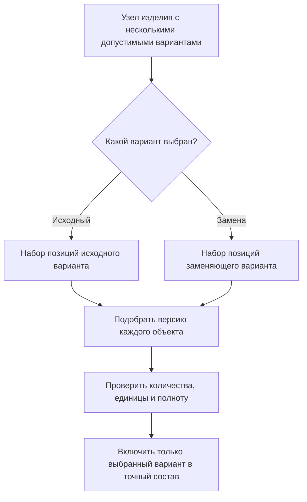

# Допустимые групповые замены в составе

## Что такое групповая замена

Иногда один объект можно заменить одним аналогом. Но в машиностроительном составе часто встречается более сложная ситуация: несколько позиций исходного решения заменяются другим набором позиций.

Например, отдельный кронштейн и четыре крепёжных болта могут заменяться единым литым кронштейном со встроенными креплениями. Два раздельных гидравлических клапана — одним комбинированным блоком. Покупной мотор-редуктор — комплектом из электродвигателя, муфты и редуктора.

В IPS такие случаи поддерживаются механизмами допустимых замен вида N:M, где один набор из N позиций заменяется другим набором из M позиций. Interlink сохраняет этот продуктовый смысл и называет его **групповой заменой** или **вариантами узла**.

Групповая замена относится не только к объектам, но и к определённому месту в структуре. Один и тот же кронштейн может иметь допустимую замену в станке новой серии и не иметь её в старом станке из-за другого монтажного пространства.

## Основной принцип

Формирование состава проходит в два этапа:

1. система определяет, какой разрешённый вариант узла действует в данном заказе;
2. для каждой позиции выбранного варианта обычные правила Interlink подбирают точную версию объекта.

Сам механизм групповой замены не решает, какая версия болта или клапана является действующей. Он сначала определяет структуру выбранного варианта.

## Что сохраняется относительно IPS

Interlink должен сохранить:

- возможность объединить несколько связанных позиций в один заменяемый узел;
- несколько разрешённых вариантов этого узла;
- один исходный или предпочтительный вариант;
- условия, период и область допустимости каждого варианта;
- количества и единицы для каждой позиции;
- выбор варианта для конкретного заказа;
- воспроизводимость ранее выбранного варианта;
- объяснение, почему один набор позиций исчез, а другой появился.

При этом новая система должна исключить неоднозначность, возникающую, если групповой вариант пытаются представить как обычную замену одной версии другой.

## Пример 1. Кронштейн с отдельным крепежом

В исходной конструкции защитного ограждения станка применяются:

- сварной кронштейн — 1 штука;
- болт М10×30 — 4 штуки;
- шайба 10 — 4 штуки;
- гайка М10 — 4 штуки.

Для новой площадки утверждён литой кронштейн со встроенными резьбовыми втулками. В заменяющем варианте используются:

- литой кронштейн — 1 штука;
- болт М10×25 — 4 штуки.

Нельзя просто назвать литой кронштейн аналогом сварного. Если заменить только кронштейн, в составе останутся лишние шайбы и гайки, а длина болта будет неверной. Поэтому оба набора описываются как два целостных варианта одного монтажного решения.

После выбора литого варианта Interlink отдельно подбирает версии литого кронштейна и болта М10×25. Исходные позиции в точный состав заказа не входят.

## Пример 2. Два клапана или комбинированный гидроблок

В гидросистеме пресса исходный вариант состоит из клапана ограничения давления и клапана разгрузки, соединённых трубопроводом. Новый поставщик предлагает комбинированный гидроблок, выполняющий обе функции.

Исходный вариант включает:

- клапан ограничения давления;
- клапан разгрузки;
- трубку;
- два соединительных штуцера;
- крепёжную плиту.

Заменяющий вариант включает:

- комбинированный гидроблок;
- другой комплект крепежа;
- изменённый рукав высокого давления.

Вариант с гидроблоком разрешён только начиная с определённой серии прессов, потому что у старой рамы недостаточно места. Выбор по серийному номеру относится к варианту узла. После выбора для гидроблока, крепежа и рукава подбираются версии, действующие на дату заказа.

Если позднее меняется версия рукава, это не создаёт третий структурный вариант. Это обычное развитие объекта внутри уже существующего варианта.

## Пример 3. Мотор-редуктор или комплектный привод

Конвейер может оснащаться:

- покупным мотор-редуктором как одной поставочной позицией;
- либо комплектом из электродвигателя, упругой муфты, редуктора, защитного кожуха и монтажной рамы.

Первый вариант проще для сборки, второй используется при недоступности импортного мотор-редуктора и позволяет применять локальные комплектующие. Это замена одной позиции пятью, то есть классический случай 1:5.

Для выбора локального комплекта требуется проверить:

- передаточное отношение и выходной момент;
- размеры монтажной рамы;
- напряжение и исполнение двигателя;
- наличие защитного кожуха;
- соответствие требованиям безопасности.

После инженерного утверждения заказа система фиксирует выбранный вариант и точные версии всех пяти объектов. Если поставки импортного мотор-редуктора восстановятся, ранее выданный заказ не переключается назад автоматически.

## Пример 4. Замена в конкретной ветви многоуровневого изделия

Один и тот же фильтр используется дважды в маслостанции: в линии смазки подшипников и в отдельной линии управления. Для линии смазки разрешена замена «один большой фильтр» на «два параллельных фильтра меньшего размера». Для линии управления такая замена запрещена из-за ограниченного пространства.

Связь только по обозначению фильтра была бы недостаточна: система предложила бы замену в обеих ветвях. Поэтому групповая замена привязана к конкретному месту и пути в структуре маслостанции.

Пользователь видит понятную область действия:

> Вариант с двумя параллельными фильтрами разрешён только в узле «Контур смазки подшипников» маслостанции МС-40. В контуре управления используется исходный вариант.

## Пример 5. Ремонтный комплект вместо отдельных деталей

При заводской сборке торцевое уплотнение насоса состоит из отдельных колец, пружин и прокладок. Для сервисного ремонта поставщик разрешает использовать готовый ремонтный комплект.

Это не обязательно означает изменение проектного состава нового насоса. Групповая замена может быть допустима только в сервисном процессе. В производственном заказе остаются отдельные детали, а в ремонтном заказе выбирается один комплект.

Следовательно, область действия варианта должна учитывать не только изделие и дату, но и назначение состава: производство, ремонт, модернизация или оценка.

## Как определяется область действия

Для групповой замены могут быть существенны:

- конкретная сборочная единица;
- точная ветвь или место повторного использования узла;
- серия или диапазон заводских номеров;
- производственная площадка;
- проект или заказ;
- дата действия решения;
- вид процесса — производство, ремонт или сервис;
- выбранные параметры комплектации;
- состояние согласования варианта.

Если ни один вариант не подходит или одновременно подходят несколько равноприоритетных вариантов, система не должна угадывать. Она сообщает, что структурное решение не определено.

## Почему это не обычный подбор версии

Версия отвечает на вопрос: «Какое состояние документации одного объекта использовать?»

Групповая замена отвечает на другой вопрос: «Какой набор позиций представляет данный узел?»

Если смешать эти вопросы, возникают ошибки:

- исчезает только одна из нескольких исходных позиций;
- теряются количества и единицы;
- в составе одновременно оказываются детали двух несовместимых вариантов;
- локальная замена начинает действовать во всех изделиях;
- невозможно объяснить, почему изменилась сама структура узла.

Поэтому сначала выбирается вариант структуры, а затем для его участников подбираются версии.

## Что увидит пользователь

В живом составе полезно показывать границу вариантного узла и название выбранного решения. Например:

> Узел привода конвейера: выбран вариант «Локальный комплектный привод» вместо варианта «Импортный мотор-редуктор». Основание — утверждённое решение для площадки Восток и заказа КН-204. В состав включены электродвигатель, муфта, редуктор, кожух и рама.

Пользователь может раскрыть вариант и увидеть точные версии участников. Для невыбранного варианта достаточно показать, что он допустим, но не входит в текущий состав.

## Чем решение отличается от глобального аналога

| Глобальный аналог | Групповая замена |
|---|---|
| обычно один объект заменяется другим объектом | один набор позиций заменяется другим набором |
| связь применима к объекту в разных составах | связь ограничена конкретным структурным контекстом |
| сохраняется одна строка позиции | меняются число строк, количества и связи |
| сначала выбирается объект | сначала выбирается целостный вариант узла |

Механизмы могут взаимодействовать. В выбранном варианте один из участников может, в свою очередь, иметь глобальный аналог. Но каждое решение должно оставаться отдельно объяснимым.

## Открытые продуктовые вопросы

- Какими объектами IPS представлены группы, варианты и участники замен?
- Может ли один участник входить сразу в две перекрывающиеся группы?
- Как IPS разрешает конфликт нескольких подходящих вариантов?
- Какие виды области действия реально используются: состав, ветвь, серия, заказ, процесс?
- Нужно ли показывать невыбранные варианты в обычном дереве или только по команде?
- Кто и на каком шаге утверждает вариант для производственного заказа?
- Как переносить исторические замены, у которых область действия задана неполно?

## Критерии приёмки

1. В точный состав входит только один целостный вариант узла.
2. Вместе с вариантом сохраняются все его позиции, количества и единицы.
3. Версия подбирается отдельно для каждого участника выбранного варианта.
4. Локальная замена не появляется в другой ветви только из-за совпадения объекта.
5. Старый заказ сохраняет выбранный вариант после изменения предпочтений или сроков действия.
6. При неоднозначном выборе система останавливается и показывает конфликт.
7. Пользователь может понять, какой набор заменён, каким набором и на каком основании.

## Состояние реализации

Целевая модель Interlink отделяет выбор структурного варианта от подбора версий. Детальная форма групп, вариантов, областей действия и согласования ещё требует сопоставления с реальными данными N:M-замен IPS.

## Связанные документы

- [Глобальный аналог объекта](Selection-global-analog)
- [Условия включения позиций и конфигуратор](Selection-position-presence)
- [Точный состав производственного заказа](Selection-order-snapshot)
