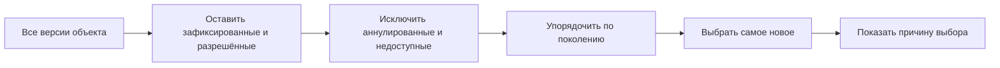

# Подбор последней версии: самое новое допустимое состояние объекта

## Пользовательская потребность

Во многих рабочих ситуациях пользователю нужна самая новая версия объекта. В IPS системное правило «Последние версии объектов» часто используется по умолчанию, если пользователь не выбрал другой режим фильтрации состава.

На первый взгляд этот сценарий прост. Но для инженерной системы нужно уточнить: последняя среди каких версий?

- только зафиксированных или вместе с рабочими;
- только доступных пользователю;
- с учётом аннулированных;
- среди выпущенных или среди всех допустимых состояний;
- до или после применения пользовательского фильтра.

Interlink определяет эти границы явно.

## Как сценарий работает в IPS

IPS группирует версии дочернего объекта и выбирает последнюю. В руководстве показан пример, где для объектов с версиями 0, 1 и 2 в состав попадает версия с наибольшим номером.

При этом более сильные механизмы сохраняют приоритет:

- жёсткая конкретизация выбирает точную версию;
- контекст редактирования показывает рабочую версию;
- применяемость может выбрать версию для серии или даты;
- только после этого действует текущее правило.

## Что означает «последняя допустимая версия» в Interlink

Внутреннее название правила — `Latest`, но в пользовательском языке это **последняя допустимая зафиксированная версия**.

Система:

1. рассматривает версии одного объекта;
2. исключает рабочие версии, если не указан соответствующий пакет изменения;
3. исключает состояния, которые нельзя использовать в этом режиме, например аннулированные;
4. учитывает права доступа;
5. выбирает самое новое поколение среди оставшихся;
6. показывает причину «последняя допустимая версия».

## Пример 1. Стандартная шайба в составе редуктора

Объект `Шайба стопорная РЦ-250.00.021` имеет:

- версию 01 — первоначальный материал;
- версию 02 — уточнённая твёрдость;
- версию 03 — изменённое защитное покрытие.

Все три версии зафиксированы, версия 03 не аннулирована и доступна пользователю. Правило последних версий выбирает 03.

Если в конкретной позиции редуктора жёстко закреплена версия 02, выбирается 02. Последняя версия действует только тогда, когда более сильное решение отсутствует.

## Пример 2. Новая, но ещё рабочая версия корпуса

У корпуса насоса есть выпущенная версия 07 и рабочая версия 08, созданная в пакете изменения.

- обычный пользователь выбирает «последняя версия» и видит версию 07;
- участник пакета изменения видит рабочую версию 08 по рабочему контексту;
- правило последних версий не раскрывает рабочую версию всем пользователям.

Так система сохраняет привычное удобство IPS и одновременно защищает незавершённую работу.

## Пример 3. Аннулированная последняя версия

Для зубчатого колеса выпущены версии 04, 05 и 06. После обнаружения ошибки термообработки версия 06 аннулирована.

Простое сравнение номеров выбрало бы 06. Interlink исключает аннулированную версию из обычного правила и выбирает версию 05, если она остаётся допустимой.

Для расследования качества пользователь может открыть историю и увидеть версию 06, но она не должна незаметно попасть в рабочий состав.

## Пример 4. Пользовательский фильтр не должен возвращать старую версию

У электродвигателя:

- версия 05 имеет степень защиты IP54;
- версия 06 — более новая, IP55.

Пользователь открывает состав с правилом «последняя версия» и дополнительно фильтрует строки по значению IP54.

Правильное поведение:

1. сначала для объекта выбирается последняя допустимая версия 06;
2. затем проверяется фильтр;
3. строка не попадает в результат, потому что версия 06 не соответствует IP54.

Система не должна возвращать историческую версию 05 только потому, что она удобна для фильтра. Иначе один и тот же объект незаметно «откатывается» назад при изменении условий списка.

Если пользователю действительно нужна «самая новая версия с IP54», это должно быть отдельное явно названное правило.

## Чем последняя версия отличается от выпущенной

Последняя допустимая версия может находиться на стадии согласования, если профиль предприятия разрешает её использование в конкретном представлении. Для производства обычно требуется правило «последняя выпущенная».

Пример:

- версия 03 — выпущена;
- версия 04 — зафиксирована и находится на согласовании;
- правило «последняя допустимая для инженерной проверки» может выбрать 04;
- правило «выпущенная для производства» выбирает 03.

Эти режимы должны иметь разные названия в интерфейсе.

## Почему решение закрывает требование IPS

Interlink сохраняет привычную функцию:

- выбирает одну самую новую версию каждого объекта;
- учитывает более сильные конкретизации и рабочий контекст;
- показывает причину выбора;
- позволяет использовать правило как обычный режим просмотра.

Дополнительно уточняются допустимость, аннулирование и порядок применения пользовательских фильтров.

## Что изменится для пользователя

Пользователь увидит не просто значок, а пояснение:

- `Выбрана последняя допустимая версия 03 от 12.02.2031`;
- `Более новая версия 04 является рабочей и доступна только в пакете ИИ-...`;
- `Версия 06 исключена, потому что аннулирована`;
- `В позиции используется версия 02 из-за жёсткой фиксации`.

## Вопросы для проверки с заказчиком

- Что считается последней версией в каждой предметной области?
- Участвуют ли версии на согласовании?
- Как обрабатываются аннулированные и хранящиеся версии?
- Используется ли правило по умолчанию во всех модулях одинаково?
- Какие пользовательские атрибуты влияют на допустимость?
- Должен ли пользователь видеть, почему более новая версия исключена?

## Приёмочные сценарии

1. Среди версий 01, 02 и 03 выбирается 03.
2. Рабочая версия не видна без пакета изменения.
3. Аннулированная самая новая версия не выбирается обычным правилом.
4. Жёсткая фиксация сильнее правила последней версии.
5. Пользовательский фильтр не возвращает более старую версию вместо уже выбранной новой.
6. Старый снимок заказа не меняется после появления новой версии.

## Состояние реализации

Правило последней версии входит в целевой расширенный механизм подбора. Полное выполнение и объяснение причин реализуются в последующих этапах.

## Связанные документы

- [Назначенная основная версия](Selection-main-version)
- [Подбор по степени готовности](Selection-maturity)
- [Просмотр всех версий](Selection-all-versions)
