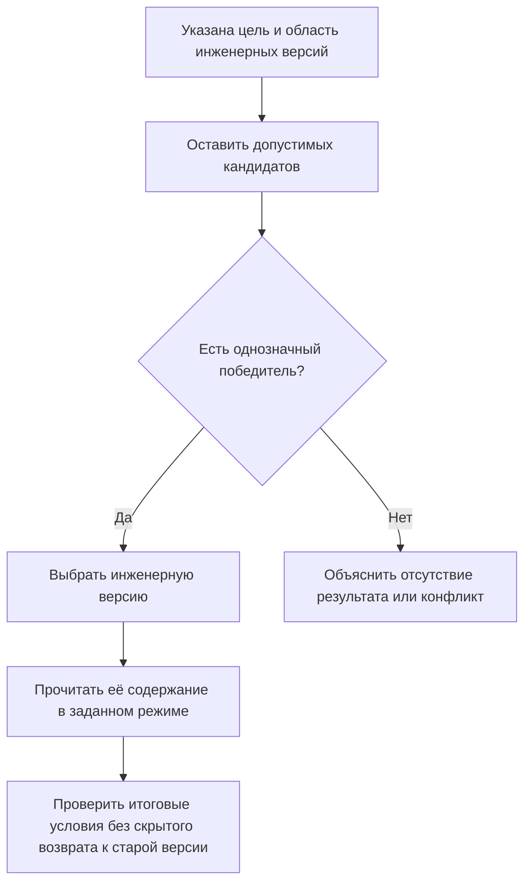

# Последняя допустимая версия: новизна внутри объявленной области

## Почему недостаточно наибольшего номера

Пользователю часто нужно самое новое инженерное решение. В IPS для этого служит правило последних версий. В простой последовательности «01, 02, 03» результат кажется очевидным. Но рядом могут развиваться серийная линия, опытная модификация и восстановление старого исполнения для ремонта. Последняя созданная версия не обязательно подходит всем этим задачам.

В Interlink правило должно отвечать на два разных вопроса: **среди каких инженерных версий искать последнюю** и **какое содержимое выбранной версии читать**. Эти вопросы не заменяют друг друга.

## Какой смысл переносится из IPS

Сохраняется удобный режим, который выбирает одну новейшую допустимую инженерную версию объекта. Жёсткая привязка, применяемость, контексты и мягкая конкретизация участвуют согласно явно выбранному порядку. Сравнение с IPS должно подтвердить этот порядок для конкретной установки, а не только совпадение названия правила.

Новый подход не предполагает единственной линейной цепочки: от исторической версии разрешается создать отдельную ветвь развития. Поэтому область поиска — обязательная часть правила. Это может быть серийное семейство, проект модернизации или иное объявленное множество кандидатов.

## Как будет выполняться подбор

Пользователь выбирает цель работы: например, «Актуальный серийный состав». Профиль определяет допустимую область версий, требования к готовности и порядок сравнения. Система не сравнивает обозначения как обычные строки и не считает более позднюю публикацию содержимого старой версии новой инженерной версией.

Когда общий подбор доходит до этого правила, он выбирает победителя внутри объявленной области. После этого читается содержание выбранной инженерной версии: действующее опубликованное, явно доступное рабочее либо точное — по условиям операции.

Новизна не отменяет требований безопасности и доступа. Отсутствие полномочий нельзя маскировать как отсутствие версии, а объяснение не должно раскрывать сведения о скрытых объектах.

## Пример 1. Шайба в обычной последовательности версий

У стопорной шайбы редуктора версии 01, 02 и 03 последовательно уточняют материал, твёрдость и защитное покрытие. Все относятся к серийному семейству; версия 03 допустима для операции.

Правило «Последняя серийная» выбирает 03. Если в позиции имеется жёсткая привязка к инженерной версии 02, обычное правило не заменяет её. При чтении действующего опубликованного содержимого система возьмёт состояние версии 02, а не произвольное состояние версии 03.

Так сохраняется привычный результат IPS, но становится видно, где закончился выбор инженерной версии и начался выбор её содержимого.

## Пример 2. Рабочее исправление не является новой инженерной версией

Выпущен корпус насоса версии 07. Конструктор исправляет обозначение резьбы в рабочей копии **той же версии 07**. Нажатие «Сохранить» не меняет опубликованную документацию и не создаёт версию 08.

Обычный просмотр продолжает читать опубликованное содержание версии 07. Допущенный участник с явно выбранным рабочим контекстом может увидеть исправляемое содержание 07. После разрешённой публикации появится новое неизменяемое состояние той же инженерной версии.

Если же конструктор выполняет отдельную команду «Создать новую инженерную версию», возникнет 08. Пока у неё нет допустимого опубликованного содержания, производственный профиль не должен случайно включить её лишь из-за нового номера.

## Пример 3. Опытная ветвь и серийный заказ

От версии 05 корпуса станка созданы серийная версия 06 и опытная версия «Облегчённая рама». Опытная зарегистрирована позже и уже имеет опубликованные материалы для расчётов, но не допущена в серийную программу.

Диспетчер формирует серийный заказ. Правило ограничено серийной областью и выбирает 06. Расчётчик открывает проект облегчённой рамы и получает опытную версию по другому явному профилю.

Если правило не определяет, как сопоставлять две ветви, система не угадывает по времени создания. Такое правило следует уточнить до использования в однозначном составе.

## Пример 4. Аннулированная версия и экранный фильтр

У зубчатого колеса версия 06 исключена из обычного применения из-за ошибки термообработки. Если профиль допускает поиск среди оставшихся серийных версий, последней может оказаться 05. Исторический просмотр продолжает показывать 06 с её статусом; это не разрешение на новый выпуск.

Теперь рассмотрим другой объект: двигатель версии 05 имеет защиту IP54, а версии 06 — IP55. Общее правило «Последняя серийная» выбирает 06. Добавленный после подбора экранный фильтр IP54 скрывает строку, но не возвращает 05.

Если пользователю нужна «последняя версия с IP54», требование IP54 должно быть объявлено частью самого правила допуска кандидатов. Фильтрация уже выбранного результата и определение области поиска — разные действия.

## Чем правило отличается от близких механизмов

| Механизм | Что именно он решает |
|---|---|
| Назначенная основная версия | Какую инженерную версию ответственный назначил для данной области |
| Последняя допустимая | Какая версия новее в объявленном множестве кандидатов |
| Последняя выпущенная | Какая из допустимых версий достигла нужной готовности и новее остальных |
| Режим рабочих материалов | Можно ли читать незавершённое содержание уже выбранной версии |
| Точное состояние | Какие неизменяемые данные должны быть прочитаны без нового выбора |
| Снимок состава | Какой точный многоуровневый результат уже сохранён для конкретной цели |

## Что увидит пользователь

Полезное объяснение выглядит так: «Выбрана версия 06 в серийной области; прочитано опубликованное состояние после исправления от 12 мая. Опытная ветвь в это правило не входит». Подробность исключённых кандидатов ограничивается правами доступа.

Если выбранная версия не проходит итоговую проверку совместимости, система показывает предметную проблему. Она не перебирает старые состояния или другие версии скрытно до получения удобного ответа.

## Проверка с предприятием

Нужно согласовать способ определения новизны, доступные ветви и проекты, отношение к согласуемым и аннулированным версиям. Отдельный вопрос — какие пользовательские условия являются частью правила, а какие только фильтруют экран.

Приёмочные случаи:

1. В простой серийной последовательности выбирается последняя допустимая версия.
2. Опытная ветвь не проникает в серийный состав.
3. Сохранение рабочей копии не меняет опубликованный результат.
4. Жёсткая привязка сохраняет выбранную инженерную версию.
5. Поздний фильтр не возвращает исторического кандидата.
6. Неопределённый порядок между ветвями выявляется до выпуска.
7. Старый снимок остаётся неизменным после новых версий и новых состояний.

## Состояние реализации

Это целевое поведение расширенного подбора. Полное выполнение, интерфейс, объяснение и испытания правил ещё должны быть реализованы. Упоминание области версий не означает готового универсального редактора ветвлений.

## Связанные документы

- [[Назначенная основная версия|Selection-main-version]]
- [[Содержание и итерации версии|Selection-iterations]]
- [[Степень инженерной готовности|Selection-maturity]]
- [[Настраиваемые правила|Selection-custom-rule]]
