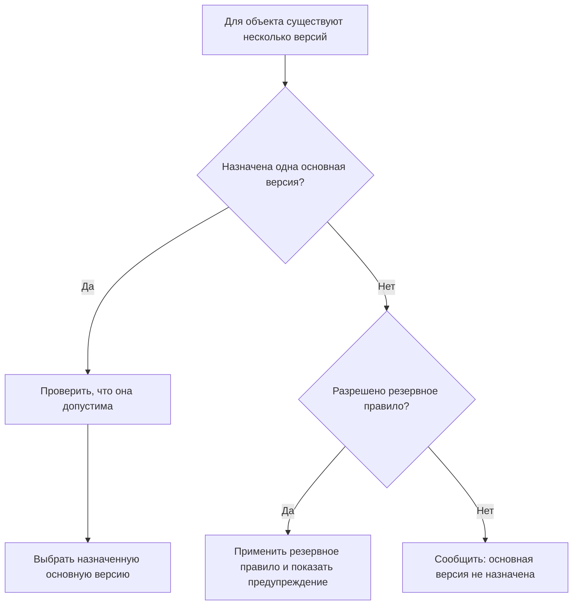

# Подбор базовой версии: назначенная основная версия объекта

## Почему термин «базовая версия» требует особого внимания

В IPS у объекта может существовать несколько версий, но одна из них назначается базовой. Первая версия становится базовой автоматически, позднее базовой можно сделать другую версию вручную или при переводе на специальный шаг жизненного цикла.

Для продуктового специалиста важно определить, какую именно роль базовая версия выполняет на предприятии. В разных процессах под этим словом могут понимать:

- версию, которую нужно показывать по умолчанию;
- версию, принятую производством;
- исходную версию для следующего изменения;
- версию, закреплённую при актуализации извещения;
- юридически значимую базовую линию;
- просто исторический системный признак IPS.

Interlink не должен объединять все эти смыслы в один флаг.

## Как базовая версия используется в IPS

Системное правило «Подбор базовых версий» находит базовую версию каждого дочернего объекта. Версия из активного контекста редактирования может иметь более высокий приоритет, потому что участник изменения должен видеть будущий состав.

Базовая версия может отличаться от последней:

- версия 03 выпущена позже версии 02;
- но базовой по-прежнему назначена версия 02;
- правило базовых версий возвращает 02;
- правило последних версий возвращает 03.

Это различие необходимо сохранить.

## Решение Interlink

В основном профиле Interlink используется понятие **назначенная основная версия**. Во внутренней спецификации оно называется `Current`, то есть «версия, явно назначенная текущей для выбора по умолчанию».

Для одного объекта может быть назначена не более чем одна такая версия. Назначение выполняется отдельным управляемым действием и сохраняется в истории.

При выборе по правилу «назначенная основная» система:

1. находит версию, которой явно присвоен этот статус;
2. проверяет, что версия зафиксирована и не находится в запрещённом состоянии;
3. возвращает её с объяснением «назначенная основная версия»;
4. не подменяет её последней версией, если основная не найдена.

## Почему Interlink не переносит слово «базовая» автоматически

Прямое переименование базовой версии IPS в основную версию Interlink допустимо только после подтверждения предметного смысла.

Если на предприятии базовая версия одновременно означает «версия для обычного состава» и «неизменяемое свидетельство выпуска», потребуются два механизма:

- назначенная основная версия — для текущего динамического выбора;
- зафиксированный снимок состава — для исторического доказательства.

Если базовая версия служит только исходником копирования при создании новой версии, это тоже отдельная операция. Источник копирования не обязан становиться основной версией для всех составов.

## Пример 1. Основная версия корпуса редуктора

У объекта `Корпус редуктора РЦ-250.01.001` существуют:

- версия 01 — исходная, снята с производства;
- версия 02 — серийная производственная;
- версия 03 — выпущена для опытной партии;
- рабочая версия 04 — готовится для модернизации.

Предприятие назначает версию 02 основной, потому что большинство действующих заказов относится к серийному исполнению. Правило основной версии возвращает 02, хотя версия 03 новее.

Для опытной партии версия 03 выбирается не сменой общей основной версии, а применяемостью или точной фиксацией заказа.

## Пример 2. Основная версия типового технологического процесса

Для операции цементации зубчатого колеса существуют:

- технологический процесс версии 05 — действующий для основного цеха;
- версия 06 — адаптация для внешнего подрядчика;
- версия 07 — рабочая версия с новым режимом нагрева.

Если основной технологический процесс выбирается по назначенной основной версии, обычные производственные маршруты продолжают использовать версию 05. Подрядчик получает версию 06 по отдельной области применимости. Технолог в пакете изменения видит рабочую версию 07.

Один механизм «последняя версия» не сможет корректно выразить эти три ситуации.

## Пример 3. Базовая версия и архивное свидетельство

В момент выпуска станка `СТ-500`, версия 12, был опубликован точный состав. Через месяц основная версия электрошкафа изменена с 08 на 09.

Живой состав новых заказов может начать использовать версию 09. Но архивный состав станка версии 12 и уже переданные заказы должны по-прежнему содержать версию 08.

Следовательно:

- назначение основной версии управляет будущим динамическим подбором;
- снимок состава сохраняет прошлое решение;
- это разные функции, даже если в разговоре обе называют «базой».

## Пример 4. Отсутствующая основная версия

После миграции объекта `Муфта зубчатая МЗ-6` в данных обнаружены три зафиксированные версии, но признак базовой версии не перенесён.

Interlink не должен молча выбрать последнюю. Пользователь получает понятную проблему: «Для объекта не назначена основная версия».

Если предприятие хочет временно использовать последнюю допустимую версию, это оформляется как явное резервное правило и сопровождается предупреждением. После очистки данных резервное правило можно отключить.

## Как меняется назначение основной версии

Назначение не изменяет содержимое самой версии. Оно меняет только решение, какая зафиксированная версия считается основной.

Обычный процесс:

1. ответственное лицо выбирает новую версию;
2. система проверяет её состояние и права;
3. фиксируется причина назначения;
4. прежняя версия перестаёт быть основной;
5. зависимые актуальные представления пересчитываются;
6. ранее опубликованные снимки не изменяются.

Рабочую или аннулированную версию нельзя назначить основной без явно разрешённой специальной политики.

## Как отличать похожие термины

| Термин | Вопрос, на который он отвечает |
|---|---|
| Основная версия | Какая версия явно назначена для выбора по умолчанию? |
| Последняя версия | Какая допустимая версия создана позже остальных? |
| Выпущенная версия | Какая версия достигла требуемой степени готовности? |
| Применимая версия | Какая версия действует для данного изделия, серии и даты? |
| Рабочая версия | Какое будущее состояние редактируется в текущем пакете изменения? |
| Снимок состава | Какой точный состав был опубликован в конкретный момент? |

## Почему решение закрывает требование IPS

Interlink сохраняет ключевые свойства базовой версии IPS:

- для объекта назначается одна основная версия;
- она может отличаться от последней;
- рабочий контекст имеет более высокий приоритет;
- переназначение является управляемым действием;
- причина выбора видна пользователю.

Дополнительно система не смешивает основную версию с историческим снимком или процессом согласования.

## Вопросы для специалиста IPS

- Как базовая версия используется в составах, списках, отчётах и обмене?
- Всегда ли она соответствует производственной версии?
- Что происходит при переводе версии на шаг с фиксацией базовой версии?
- Может ли базовая версия быть на хранении или аннулирована?
- Используется ли она как источник новой версии?
- Какие модули предприятия изменяют базовую версию автоматически?

## Приёмочные сценарии

1. Основная версия отличается от последней — выбирается именно основная.
2. Основная версия отсутствует — система сообщает проблему, а не угадывает.
3. Попытка назначить рабочую или аннулированную версию отклоняется.
4. Участник пакета изменения видит свою рабочую версию выше основной.
5. Переназначение основной версии не меняет старый производственный снимок.

## Состояние реализации

Поддержка назначенной основной версии предусмотрена целевой моделью. Чтение и полный механизм выбора внедряются поэтапно. Сопоставление с базовой версией конкретной установки IPS требует продуктового подтверждения.

## Связанные документы

- [Последняя версия](Selection-latest-version)
- [Подбор по степени готовности](Selection-maturity)
- [Точный состав производственного заказа](Selection-order-snapshot)
