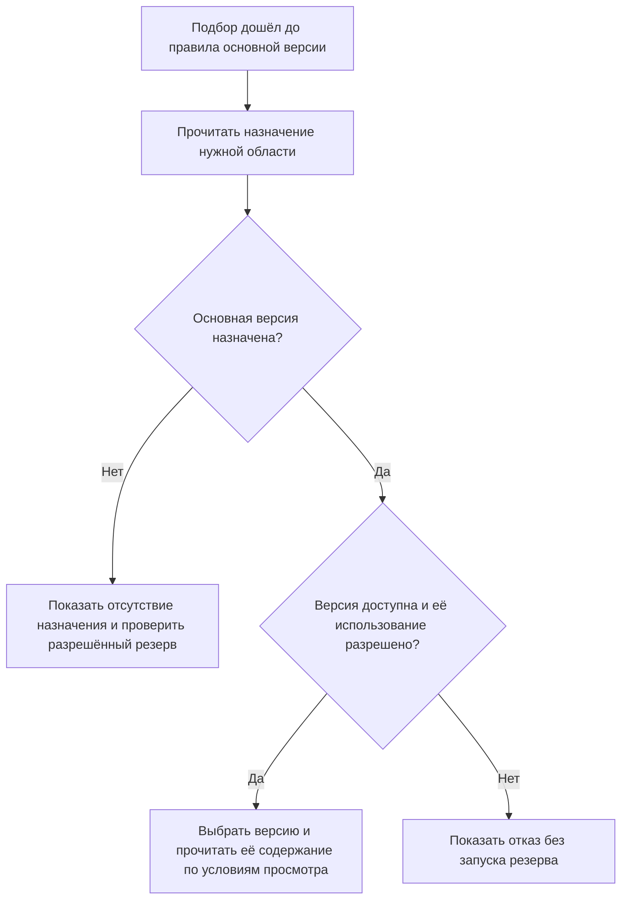

# Назначенная основная версия: что означает «базовая» в новом устройстве

## Пользовательская задача

Предприятию нужна версия, которую следует брать для обычной работы, даже если уже появились более новые опытные разработки. В IPS эту роль часто выполняет базовая версия. Но слово «базовая» также используют для исходника копирования, утверждённого комплекта документов и исторического свидетельства выпуска. Эти значения нельзя объединять: сменить обычную версию для новых расчётов и переписать ранее утверждённый комплект — принципиально разные действия.

В целевой модели Interlink основная версия — явное назначение **инженерной версии объекта**. Оно не является ни выбором самого нового содержимого среди всех версий, ни снимком состава.

## Сначала различим версию и её содержимое

Например, «Корпус редуктора РЦ-250, версия 02» — устойчивая инженерная версия. У неё могут последовательно появляться опубликованные состояния: до исправления шероховатости и после него. Оба относятся к версии 02, но содержат разные данные. Каждое опубликованное состояние неизменяемо. Незавершённые правки находятся отдельно, в рабочей области.

Назначение «основная — версия 02» отвечает только на первый вопрос: какую инженерную версию брать. Затем условия просмотра определяют, читать ли её действующее опубликованное содержимое, разрешённую рабочую копию или заранее указанное точное состояние. Подробнее — [[версии и их состояния|Versions-and-composition]].

## Что сохраняется из IPS

Правило базовых версий в IPS позволяет выбирать назначенную версию, а не обязательно последнюю. Назначение может меняться вручную или как часть перехода жизненного цикла. Именно этот управляемый пользовательский результат должен сохраняться в Interlink.

Для обычного назначения у одного объекта может быть не более одной основной инженерной версии. Дополнительно архитектура предусматривает именованные назначения — например, отдельную опорную версию для серийного производства и для программы модернизации. Они не становятся несколькими одновременно «базовыми по умолчанию»: операция должна явно назвать, какое назначение ей требуется.

## Как будет действовать пользователь

Ответственный за изделие открывает объект, выбирает назначение «Для серийного производства» и предлагает инженерную версию. Система показывает, какие живые представления начнут выбирать её вместо прежней, проверяет полномочия и требования к готовности. После принятия решения меняется назначение; содержимое версий и опубликованные снимки не редактируются.

При формировании состава правило основной версии выполняется только тогда, когда до него дошёл выбранный порядок подбора. Жёсткая привязка, применяемость, контекст и мягкая конкретизация могут определить результат раньше. Их взаимный порядок задаётся явно: нельзя обещать, что рабочая область всегда сильнее применяемости во всех режимах IPS.

Схема показывает участок общего подбора, а не отменяет более сильные решения. Отсутствующее назначение не означает «взять последнюю». Если резерв предусмотрен для этой операции, его результат отдельно отмечается. Явный запрет использования назначенной версии или отказ доступа — другой исход: они не запускают резерв и не подменяются отсутствием назначения.

## Пример 1. Серийный корпус и опытная модернизация

У корпуса редуктора существуют версии 01, 02 и 03. Версия 01 выведена из применения, 02 выпускается серийно, 03 подготовлена для опытной партии с усиленными рёбрами.

Служба главного конструктора назначает версию 02 основной для серийного производства. Обычный живой состав редуктора выбирает 02, хотя 03 создана позже. Опытная партия получает 03 через явную конфигурацию проекта или применяемость. Ради десяти опытных редукторов не требуется менять обычное назначение для всех заказов.

Если в версии 02 позднее опубликовано разрешённое исправление надписи на чертеже, живой просмотр её действующего содержимого увидит исправление. Протокол испытаний, закреплённый за прежним точным состоянием, останется прежним. Назначение инженерной версии само по себе не фиксирует файл.

## Пример 2. Технологический процесс для двух площадок

Типовой процесс цементации имеет версию 05 для основного цеха и 06 для подрядчика. У подрядчика другое оборудование и иной режим загрузки печи; выбор версии 06 не должен менять серийные маршруты основного цеха.

Предприятие использует две явно названные области назначения. При подготовке задания технолог указывает площадку; профиль операции выбирает соответствующее назначение. Если обязательная площадка не задана, система просит её указать, а не выводит её из последнего открытого окна.

Допущенный технолог может открыть рабочие материалы версии 06. Производственная выдача использует только допустимое опубликованное содержание. Наличие доступа к рабочей копии ещё не разрешает передать её в производство.

## Пример 3. Старый заказ после смены основной версии

При передаче станка СТ-500 в производство создан снимок с электрошкафом версии 08 и точным состоянием его документов. Через месяц основной становится версия 09.

Новый живой расчёт может выбрать 09. Уже переданный заказ продолжает открываться по сохранённому снимку с прежними документами. Чтобы изменить заказ, требуется отдельное решение и новый зафиксированный результат. Смена основной версии не является таким решением.

Важно: неизменяемость одного состояния родительской сборки ещё не делает точным всё её дерево, если дочерние связи остаются плавающими. Для доказательства полного ранее использованного состава нужен именно снимок.

## Пример 4. Назначение потеряно при переносе

У муфты перенесены три инженерные версии, но сведения о базовой версии противоречат друг другу. Система не назначает основную по наибольшему номеру. Ответственный получает задачу проверить назначение.

Для предварительного просмотра можно отдельно разрешить резерв «последняя допустимая в серийной ветви». В объяснении сохраняется, что основная версия не была установлена. Производственная приёмка миграции не считается завершённой только потому, что резерв позволил показать состав.

## Что увидит пользователь и как проверить результат

В пояснении нужны название назначения, выбранная инженерная версия, способ чтения её содержимого и причина отклонения более сильного или основного решения — в пределах доступных пользователю сведений.

Приёмка должна проверить:

1. Более новая опытная версия не вытесняет назначенную серийную.
2. Две именованные области не подменяют друг друга.
3. Отсутствующее назначение не приводит к скрытому выбору последней.
4. Изменение содержимого той же инженерной версии отличается от переназначения.
5. Старый снимок не меняется ни при переназначении, ни при новой публикации содержимого.
6. Переход жизненного цикла, назначающий основную версию, выполняет все связанные обязательные действия согласованно.

## Что уточнить у специалиста IPS

Нужно выяснить, где базовая версия означает выбор по умолчанию, а где служит источником копирования или признаком процесса. Отдельно проверяются автоматическое назначение первой версии, действия шагов жизненного цикла, допустимость аннулированной версии и различия между модулями предприятия.

## Состояние реализации

Описан принятый целевой подход, а не готовое рабочее место. Полный подбор, управление назначениями, объяснение результата и сопоставление с конкретной установкой IPS требуют реализации и испытаний.

## Связанные документы

- [[Последняя допустимая версия|Selection-latest-version]]
- [[Степень инженерной готовности|Selection-maturity]]
- [[Контексты подбора|Selection-contexts]]
- [[Точный состав заказа|Selection-order-snapshot]]
