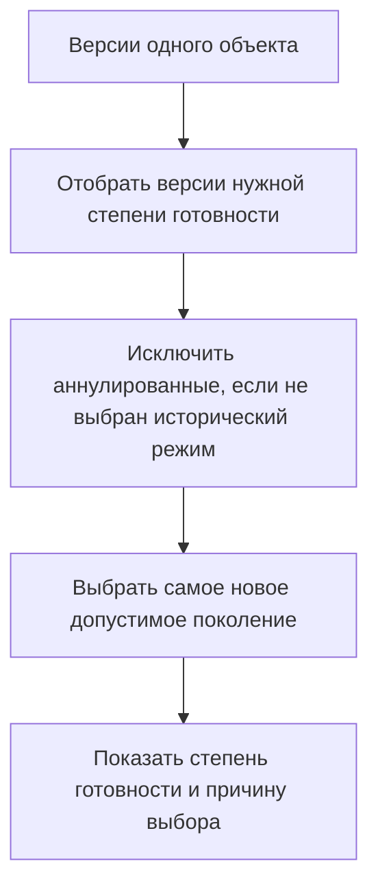

# Подбор по уровню продвижения: выбор версии по степени готовности

## Для чего нужен сценарий

Один и тот же объект проходит несколько состояний:

- создаётся и редактируется;
- проверяется;
- согласуется и утверждается;
- выпускается для производства;
- переносится на хранение;
- аннулируется или выводится из применения.

Разным пользователям требуется разный состав. Конструктор анализирует рабочие версии, рецензент — версии на согласовании, производство — выпущенные, архивист — исторические.

## Как сценарий реализован в IPS

IPS использует уровни продвижения, которые объединяют сходные шаги разных схем жизненного цикла. Для каждого уровня могут существовать системные правила подбора.

Например, пользователь выбирает правило `Уровень продвижения «Производство и эксплуатация»`, и система ищет версии на соответствующем уровне. Если подходящей версии нет, дополнительный критерий исторического правила может вернуть «не совсем подходящую» версию, выделенную специальным статусом.

## Как понятие организовано в Interlink

В Interlink используется **степень инженерной готовности**. Именно эта русская формулировка должна быть основной для пользователя.

Степень готовности отвечает на вопросы:

- закончено ли редактирование версии;
- прошла ли она проверку;
- допустима ли для выпуска;
- может ли участвовать в производственном подборе;
- выведена ли из применения.

Отдельно существует процесс согласования, который назначает задания, рецензентов и решения. Маршрут согласования описывает движение работы между людьми, а не степень готовности самой версии.

## Почему степень готовности и процесс нельзя смешивать

Представим, что версия чертежа находится на стадии `Согласование`, а задача одного из рецензентов временно просрочена.

Степень готовности версии остаётся той же. Просрочка относится к процессу и не должна менять алгоритм выбора версии в составе.

И наоборот: завершение задачи не должно автоматически считать версию выпущенной, пока не выполнено отдельное управляемое действие перевода версии в выпущенное состояние.

## Основные режимы выбора

В продуктовой терминологии полезно различать:

- **последняя выпущенная версия** — самое новое состояние, разрешённое для выпуска и производства;
- **версия не ниже заданной степени готовности** — например, проверенная или более зрелая;
- **версия строго на выбранной стадии** — например, только на согласовании;
- **корпоративное правило нескольких стадий** — например, «создание или согласование» для процесса изменения.

Внутренняя спецификация различает эти режимы, но интерфейс должен показывать их русскими самообъясняющими формулировками.

## Пример 1. Чертёж зубчатого колеса

У объекта `Колесо зубчатое РЦ-250.02.020` существуют:

- версия 03 — выпущена для производства;
- версия 04 — прошла конструкторскую проверку и находится на согласовании;
- рабочая версия 05 — редактируется по новому извещению.

Результаты:

- производственный состав выбирает версию 03;
- рецензент изменения видит версию 04 по правилу согласования;
- участник пакета с версией 05 видит свою рабочую версию;
- обычный пользователь не должен случайно получить версию 05.

## Пример 2. Аннулированная отливка корпуса

Версия 08 литой заготовки корпуса насоса была выпущена, но затем аннулирована из-за недопустимой толщины стенки. Позже выпущена исправленная версия 09.

Правило «последняя выпущенная» выбирает версию 09. Версия 08 остаётся доступной в истории и в документах расследования, но не участвует в обычном производственном составе.

Это требует не просто сравнения порядковых номеров стадий. Аннулированное состояние может быть хронологически поздним, но не является более подходящим.

## Пример 3. Разные схемы жизненного цикла

У чертежа, технологического процесса и покупного изделия могут быть разные названия шагов:

- чертёж: `Разработка → Нормоконтроль → Утверждение → Производство`;
- техпроцесс: `Проектирование → Проверка → Введён в действие`;
- покупное изделие: `На рассмотрении → Разрешено к применению → Запрещено`.

Interlink сопоставляет их с общей шкалой инженерной готовности. Благодаря этому правило «разрешено для производства» может работать с разными типами объектов, не требуя одинакового процесса.

Точное сопоставление утверждает предприятие. Оно не должно определяться автоматически по похожим названиям.

## Пример 4. Версия для предварительного расчёта

Расчётчик прочности должен выполнить оценку по версии рамы, которая прошла внутреннюю проверку, но ещё не выпущена. Для такого рабочего места можно определить правило «не ниже проверенной».

Это правило нельзя использовать в производственном заказе. Один и тот же объект может законно иметь разные выбранные версии в разных явно заданных целях.

## Как обрабатывается отсутствие версии нужной степени

Есть два режима:

1. строгий — сообщить, что подходящая версия отсутствует;
2. диагностический — применить заранее разрешённое резервное правило и показать предупреждение.

Для производства предпочтителен строгий режим. Для аналитического просмотра может быть полезен резервный результат.

## Почему решение закрывает требование IPS

Interlink сохраняет:

- выбор по уровню инженерной готовности;
- общую семантику для разных типов объектов;
- выбор самой новой версии среди подходящих;
- возможность показывать рабочие, согласуемые и выпущенные представления;
- специальное отображение отсутствия точного совпадения.

Дополнительно отделяется процесс согласования от состояния самой версии.

## Что необходимо согласовать с заказчиком

- Какие уровни продвижения используются фактически?
- Какие шаги разных схем соответствуют одной степени готовности?
- Что означает уровень `Хранение` для подбора?
- Могут ли аннулированные версии участвовать в специальных правилах?
- Где требуется выбор строго одного уровня, а где «не ниже» уровня?
- Какие правила используются производством, архивом, технологами и расчётчиками?

## Приёмочные сценарии

1. Из двух выпущенных версий выбирается более новая.
2. Версия на согласовании не попадает в производственный состав.
3. Аннулированная версия доступна в истории, но исключена из обычного подбора.
4. Разные схемы жизненного цикла сопоставляются одной предметной степени готовности.
5. Изменение состояния задачи согласования само по себе не меняет степень готовности версии.
6. При отсутствии нужной стадии система выполняет только явно выбранный строгий или резервный сценарий.

## Состояние реализации

Шкала готовности и основные правила входят в целевую модель Interlink. Полный механизм выбора реализуется поэтапно. Карта уровней IPS должна быть подтверждена для каждого заказчика.

## Связанные документы

- [Последовательное проведение изменений](Selection-sequential-changes)
- [Резервный выбор](Selection-no-match)
- [Назначенная основная версия](Selection-main-version)

