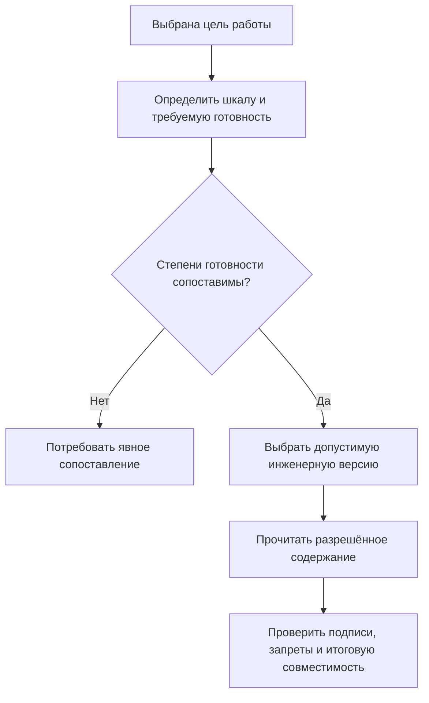

# Подбор по степени инженерной готовности

## Какая задача решается

Конструктор, рецензент и производство работают с одним изделием, но им нужен разный допустимый состав. Проверенная для расчётов версия ещё не обязательно разрешена к изготовлению. Просроченное задание рецензента не означает, что чертёж изменил свои инженерные свойства. Аннулированная документация нужна для расследования, но не должна попадать в новый производственный заказ.

В IPS уровни продвижения позволяют сопоставлять шаги разных жизненных циклов и подбирать версии по нужному уровню. Interlink сохраняет этот результат, разделяя понятия, которые влияют на него.

## Четыре разных вопроса

| Вопрос | Пример |
|---|---|
| Где находится версия в жизненном цикле? | «Нормоконтроль», «Утверждение», «Введена в действие» |
| Какова её инженерная готовность? | Проверена, согласована, разрешена для производства |
| Что происходит с заданиями людей? | Рецензент получил задачу, запросил исправление или просрочил ответ |
| Можно ли использовать данные для данной операции? | Версия отозвана, доступ ограничен либо требуется действующая подпись |

Ни один столбец не заменяет остальные. Отдельно существует различие опубликованного и рабочего содержания версии. Рабочая копия не становится официальной только потому, что у её инженерной версии сохранена высокая степень готовности.

## Как это устроено в целевой модели

Жизненный цикл относится к инженерной версии. Его шаги, переходы и права задаёт прикладной продукт. Для подбора может использоваться шкала инженерной готовности с явно определённым порядком.

У разных предметных областей могут быть разные шкалы. Готовность конструкторского документа и квалификация поставщика не обязаны сравниваться одним числом. Если общее правило охватывает несколько шкал, предприятие должно определить сопоставление. Без него система сообщает, что готовности несопоставимы, а не решает, что одинаково пронумерованные стадии означают одно и то же.

Типовые правила:

- последняя версия, разрешённая для производства;
- версия не ниже согласованной степени готовности;
- версия строго на выбранной стадии;
- версия из явно перечисленного набора стадий для конкретной работы.

Правило определяет допустимые инженерные версии и порядок выбора среди них. Затем читается нужное содержание выбранной версии, проверяются обязательные условия операции и совместимость итогового состава.

Схема не означает, что выполнение задания автоматически меняет готовность. Для перехода требуется отдельное управляемое действие со всеми предусмотренными проверками.

## Пример 1. Чертёж зубчатого колеса

У колеса редуктора версия 03 разрешена для производства, версия 04 проходит согласование, а в рабочей области готовятся материалы версии 05.

Диспетчер выбирает производственный профиль и получает допустимое опубликованное содержание версии 03. Рецензент получает точный комплект материалов версии 04, представленный на проверку. Конструктор в своём рабочем контексте видит незавершённую 05.

Эти различия не должны зависеть от случайно открытого окна. У каждого действия задана цель и явные исходные условия. Если рецензент подписал определённое состояние версии 04, следующая публикация исправленного состояния 04 не наследует подпись автоматически: решение относится к прежним данным.

## Пример 2. Аннулированная отливка

Версия 08 литой заготовки корпуса была разрешена к применению, но затем отозвана из-за недостаточной толщины стенки. Исправленная версия 09 ещё проходит испытания.

Обычное производственное правило не считает 08 «наиболее зрелой» только потому, что аннулирование произошло после выпуска. Оно учитывает запрет. Если другой допустимой версии нет, состав остаётся неразрешённым для производства.

Расследование качества при этом должно читать сохранённые данные 08 и документы, которые действовали при изготовлении партии. Историческая читаемость и разрешение на новый выпуск разделены.

## Пример 3. Чертёж, техпроцесс и покупной двигатель

На предприятии действуют три схемы:

- чертёж: «Разработка → Нормоконтроль → Утверждение → Производство»;
- техпроцесс: «Проектирование → Проверка → Введён в действие»;
- покупной двигатель: «На рассмотрении → Квалифицирован → Запрещён».

Методист определяет, какие состояния разрешают участие в производственном составе. Соответствие утверждается предметно: сходство названий не является доказательством.

Для двигателя квалификация может дополнительно зависеть от площадки и назначения. Универсальная ступень «выше утверждённого» не должна обходить такую область допуска. Перед выпуском заказ проверяется по всей совокупности обязательных условий.

## Пример 4. Предварительный расчёт сварной рамы

Расчётчику нужна рама, прошедшая внутреннюю проверку, но ещё не выпущенная. Он выбирает профиль «Предварительная оценка: не ниже проверенной». В протоколе сохраняется, какое точное содержание использовано и что это не производственное основание.

После расчёта конструктор изменяет толщину стенки в той же инженерной версии. Ранее полученный расчёт не становится доказательством для нового содержания. Требуется оценить изменение и при необходимости повторить расчёт и согласование.

## Если нужной готовности нет

Строгий профиль завершает подбор без допустимого результата. Исследовательский профиль может использовать заранее разрешённое резервное правило — например, показать согласуемую версию вместо отсутствующей выпущенной. Предупреждение сохраняется и не превращается в разрешение на производство.

Нельзя резервом обходить отказ доступа, явное аннулирование для данной операции или обязательное ограничение безопасности. Разовое разрешённое исключение оформляется отдельным предметным решением; существуют и ограничения, для которых исключения запрещены.

## Что увидит пользователь

Пояснение должно называть выбранную инженерную версию, её готовность, прочитанное содержание, цель операции и сработавшие ограничения. Формулировка «уровень 4 выше уровня 3» недостаточна: читатель должен понимать, что именно разрешено.

## Что проверить с IPS

Нужно подтвердить действительные уровни продвижения и их связь с шагами жизненного цикла, значение «Хранение», поведение аннулированных версий и специальные правила модулей. Отдельно следует разобрать, где нужны одна шкала, несколько шкал или простое перечисление допустимых стадий.

Приёмка:

1. Производственный профиль не принимает согласуемую версию вместо выпущенной.
2. Аннулирование не считается повышением готовности.
3. Задание согласования не меняет готовность самостоятельно.
4. Несопоставимые шкалы не сравниваются по номеру.
5. Подпись одного состояния не распространяется на исправленное содержание той же версии.
6. Рабочие материалы не становятся официальными из-за высокой стадии версии.
7. Резерв явно отмечен и допускается только для разрешённой цели.

## Состояние реализации

Разделение жизненного цикла, готовности, рабочих материалов и точных свидетельств принято как целевой договор. Полные механизмы, настройка шкал и продуктовые рабочие места реализуются поэтапно; их эквивалентность конкретным сценариям IPS ещё требует испытаний.

## Связанные документы

- [[Последняя допустимая версия|Selection-latest-version]]
- [[Резерв и отсутствие результата|Selection-no-match]]
- [[Точные привязки|Selection-exact-fixation]]
- [[Версии и их содержание|Versions-and-composition]]
- [[Именованные итерации и восстановление|Selection-iterations]]
