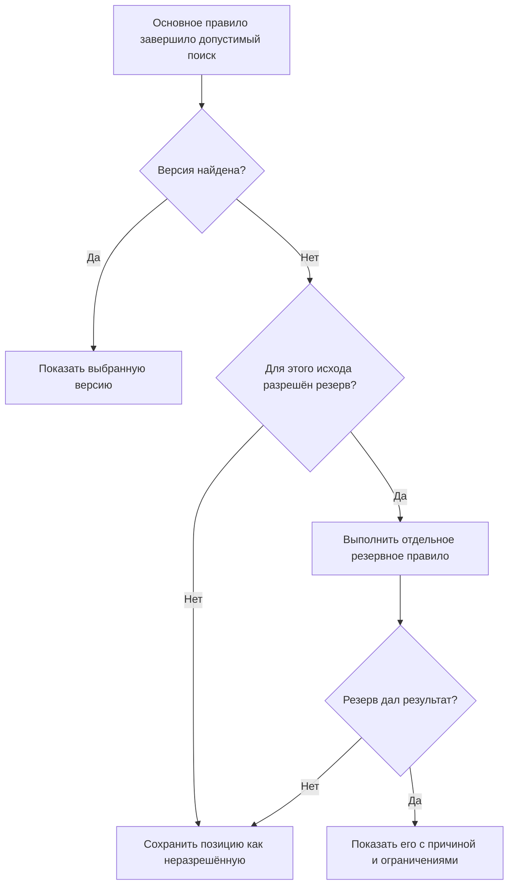

# Если подходящая версия не найдена: резерв, отказ и неизвестность

## Почему отсутствие результата нужно объяснять

Для обязательной позиции может не быть допустимой версии: документ ещё не утверждён, диапазон применяемости имеет разрыв или ни одна версия не удовлетворяет условиям заказа. В IPS возможность показать «не совсем подходящую» версию помогает исследованию, но не должна скрывать нерешённую производственную проблему.

Interlink сохраняет такой полезный режим как **явно разрешённый резервный выбор**. Вместе с ним отдельно сохраняется исход «подходящая версия не найдена». Ни один из этих исходов нельзя использовать как общее название любой ошибки.

## Что именно различается

| Ситуация | Смысл для пользователя |
|---|---|
| Позиция не нужна в выбранной комплектации | Это нормальное исключение позиции |
| Подходящая версия не найдена | Позиция нужна, но известные кандидаты не удовлетворяют правилу |
| Применён резерв | Заранее разрешённое другое правило дало условный результат |
| Выбранные данные несовместимы | Версии найдены, но их сочетание нарушает предметные ограничения |
| Есть конфликт выбора | Два обязательных назначения или исходных решения противоречат друг другу |
| Не хватает сведений или режим не поддержан | Система пока не может доказать нужный результат |
| Отказ доступа или технический сбой | Выполнение не состоялось; это не доказательство отсутствия подходящей версии |

Нельзя считать пустой результат запроса разрешением на замену или доказательством несовместимости. Объяснение должно сохранять смысл исхода и не раскрывать недоступные пользователю сведения.

## Как работает резерв

Резерв — часть утверждённого профиля операции. Например, для предварительного анализа разрешено показать последнюю согласуемую версию, если выпущенной нет. Для производственной выдачи такое ослабление может быть запрещено.

Схема начинается только после корректно выполненного поиска. Ошибка доступа, неизвестность, конфликт или явное исключение применяемости не превращаются в приглашение ослабить требования.

Для подтверждённого сценария IPS может быть явно задан специальный показ результата, не соответствующего применяемости. Это не скрытый резерв: причина несоответствия сохраняется, а производственный выпуск требует отдельного допустимого решения. Универсального правила «при любом отказе всё равно что-нибудь показать» нет.

В строгом режиме точных состояний отсутствие точного адреса завершает проверку сразу. Рабочий контекст, применяемость и резерв не делают неточную позицию точной задним числом.

## Пример 1. Корпус ещё не утверждён

У корпуса редуктора версия 04 ранее применялась серийно, но выведена из допустимой области после дефекта. Версия 05 содержит усиленные рёбра и находится на согласовании.

Производственный профиль не находит допустимой версии и останавливает выдачу. Инженерный профиль может, если это заранее разрешено, показать 05 для оценки с пояснением:

> Выпущенной допустимой версии нет. Для предварительного анализа показана согласуемая версия 05. Этот результат не является основанием производственной выдачи.

Одинаковые данные могут давать разные разрешённые действия в зависимости от цели. Само наличие прав на просмотр версии 05 не делает её пригодной для производства.

## Пример 2. Уплотнение не выдерживает требуемую температуру

Заказ требует работу при −55 °C. Для одного семейства уплотнений утверждены версии до −40 °C и до −50 °C. Ни одна не соответствует требованию.

В предварительной оценке стоимости разрешено показать наиболее близкий из имеющихся вариантов — до −50 °C. Это **менее холодостойкое решение, чем требуется**, а не «более холодостойкий подходящий аналог». В расчёте отмечают нехватку пяти градусов и необходимость новой разработки или квалификации.

Конструкторское утверждение не допускает такой резерв. Сохранённый протокол оценки полезен для обсуждения, но не устраняет несоответствие.

## Пример 3. Насос заменён комплектом с переходной плитой

Сервисная служба ремонтирует старый станок. Исходный насос смазки больше не поставляется. Современный насос требует переходной плиты и других крепёжных элементов.

Это не резервный выбор версии того же насоса. Здесь меняется объект и состав устанавливаемого комплекта. Система должна отдельно показать допустимую замену, её область и полный набор участников. Инженер принимает явное решение, после чего обычный подбор выбирает версии всех новых целей.

Если разрешение замены зависит от версии исходного насоса, сначала устанавливается именно эта исходная версия и читается относящийся к ней допуск. Нельзя заимствовать разрешение у другой версии того же объекта.

Исторический состав станка не меняется от предложения. Разрешённый комплект, оформленное решение ремонта и фактическая установка остаются разными событиями.

## Пример 4. Проблема глубоко в насосной станции

При подготовке заказа корневая сборка и основные узлы определены. На четвёртом уровне кабельный ввод не имеет версии с нужной защитой и климатическим исполнением.

В исследовательском просмотре система сохраняет путь до позиции, показывает остальные доступные ветви и помечает состав как неполный. Она не удаляет неудобную строку.

Точный однозначный производственный результат не публикуется, пока обязательная позиция не разрешена. При этом плановый вариантный заказ может по своему явному процессу сохранять неразрешённые альтернативы и предупреждения. Он не выдаётся за готовую производственную передачу.

Публикация самого изменения и публикация полного состава тоже различаются: пакет может выпускать недостающую версию, чтобы затем устранить проблему при формировании состава. Блокировки задаются целью операции, а не одним универсальным флагом.

## Пример 5. Версии найдены, но сочетание не работает

Контроллер, привод и прошивка имеют допустимые версии по отдельности. Однако выбранное точное содержание не поддерживает требуемый совместный протокол.

Результат — несовместимое сочетание, а не «не найдена версия привода». Система не возвращает старую прошивку скрытно, особенно если задана жёсткая или точная привязка.

Можно отдельно запустить разрешённый поиск альтернативного комплекта в объявленной области. Такой поиск должен показать предложенные изменения и полное основание совместимости. Если не хватает предметных данных или исчерпан заранее объявленный предел проверки вариантов, совместимость остаётся недоказанной. Это не доказанный запрет и не отсутствие версии одной позиции.

Технический тайм-аут или отмена операции — другой исход: выполнение прервано. Их нельзя выдавать за предметный вывод «совместимость неизвестна», скрывая проблему исполнения. Пользователь должен понимать, нужно ли дополнить сведения, расширить разрешённый поиск или повторить корректное выполнение.

## Когда ручное исключение допустимо

Решение ответственного по конкретному заказу не превращается в общее резервное правило. Оно имеет область, основание, согласующих и точные данные.

При этом полномочие на исключение должно существовать заранее. Некоторые требования безопасности и регуляторные ограничения не допускают обхода. Нельзя разрешить всё, просто назвав действие «ручным решением».

## Что сохраняется в объяснении

Пользователю нужны исходное требование, причина его невыполнения, применённый резерв, выбранные инженерная версия и содержание, а также разрешённые дальнейшие действия.

Для многоуровневого состава предупреждение должно быть видно и на верхнем уровне. Сотня повторяющихся проблем может группироваться, но не исчезать из итоговой оценки.

Если результат использован в расчёте как допущение, сохраняется точное основание и предупреждение. Позднее сохранение документа не превращает условный выбор в полностью допустимый.

## Проверка с IPS и критерии приёмки

Нужно собрать реальные случаи «не совсем подходящей» версии: где они полезны, какие критерии близости применяются и какие операции запрещены до устранения проблемы. Отдельно следует проверить, не назывались ли тем же словом аналоги и групповые замены.

Приёмка:

1. Резерв применяется только для предусмотренного исхода и цели.
2. Отказ доступа, сбой и неизвестность не маскируются как отсутствие версии.
3. Позиция без результата сохраняет путь и предметное объяснение.
4. Строгий точный режим не дополняется более слабыми правилами.
5. Замена объекта или комплекта не скрывается внутри резервного выбора версии.
6. Несовместимость выбранных состояний не вызывает скрытого возврата к старым.
7. Производственный результат не объявляется полным при неразрешённой обязательной позиции.
8. Плановый вариантный заказ явно отличается от готовой передачи.

## Состояние реализации

Различимые исходы, объяснение, ограничения резерва и отдельное управление заменами входят в целевой договор. Полный исполнитель и рабочие места ещё требуют реализации; конкретные резервные правила согласуются с предприятием и проверяются испытаниями.

## Связанные документы

- [[Настраиваемые правила|Selection-custom-rule]]
- [[Глобальные аналоги|Selection-global-analog]]
- [[Групповые замены|Selection-group-substitution]]
- [[Точные привязки|Selection-exact-fixation]]
- [[Производственный состав заказа|Selection-order-snapshot]]
