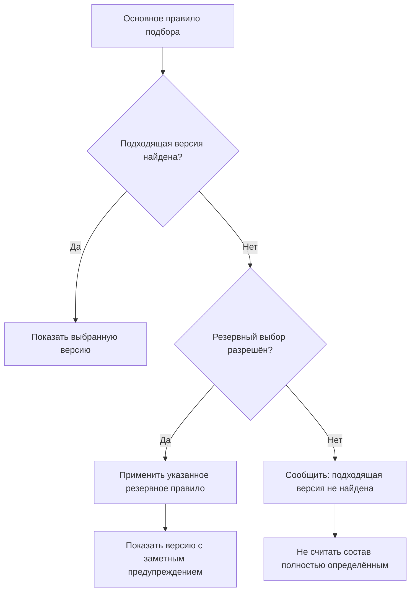

# Если подходящая версия не найдена

## Почему это отдельный продуктовый сценарий

Подбор версии может закончиться без результата. Например, для новой детали ещё нет утверждённой версии, ни одна версия не действует для требуемого серийного номера или в комплектации указано сочетание условий, которое раньше не встречалось.

В IPS существовало понятие «не совсем подходящей» версии. Оно позволяло всё же показать пользователю полезный вариант, даже если точное правило не сработало. Такая возможность удобна для исследования и подготовки изменений, но опасна, если система выдаёт приблизительный результат без заметного предупреждения.

Interlink разделяет два исхода:

- **резервный выбор** (`Fallback`) — заранее разрешённый переход к менее строгому правилу с обязательным предупреждением;
- **подходящая версия не найдена** (`NoMatch`) — позиция требуется, но выбрать её версию по заданным условиям невозможно.

Это не технические ошибки. Оба исхода имеют ясный деловой смысл и должны по-разному обрабатываться в зависимости от цели работы.

Резервный выбор — заранее утверждённая часть алгоритма. Он не равен ручному исключению для одного заказа. Если планировщик и инженер разрешают разовое отклонение, принимающий продукт хранит его как отдельное решение с основанием и полномочиями; Interlink не выдаёт его за срабатывание общего резервного правила.

## Основной принцип

Система никогда не должна молча ослаблять требования. Резервное правило применяется только тогда, когда оно заранее разрешено для данного режима работы.

Например, режим анализа может разрешить показать последнюю согласуемую версию вместо отсутствующей утверждённой. Режим формирования производственного задания при тех же данных обязан остановиться.

Особый случай — строгий режим «только точные фиксации». Если на позиции нет фиксации, он немедленно возвращает отсутствие результата и вообще не запускает рабочий контекст, применяемость, основное или резервное правило.

## Что сохраняется относительно IPS

Interlink сохраняет полезную сторону поведения IPS:

- специалист не теряет позицию и понимает, для какого объекта не найдено точное соответствие;
- в исследовательском режиме можно увидеть ближайший разрешённый вариант;
- система отличает полностью подходящий результат от приблизительного;
- правило поведения может зависеть от делового процесса;
- проблема видна не только в отдельной позиции, но и в итоговом состоянии всего дерева.

Изменение состоит в том, что приблизительный выбор больше не является скрытым продолжением основного правила. Он задаётся и объясняется отдельно.

## Пример 1. Корпус редуктора ещё не утверждён

Конструктор модернизирует корпус редуктора `РЦ-250`. Версия 04 выпущена и применяется серийно. Версия 05 содержит усиленные рёбра и уже передана на согласование, но ещё не утверждена.

Для обычного производственного состава действует требование «только утверждённая версия». Оно найдёт версию 04, поэтому резервное правило не понадобится.

Теперь предположим, что версия 04 снята с применения из-за обнаруженного дефекта, а версия 05 ещё согласуется. Точного результата нет.

В конструкторском режиме система может показать версию 05 как резервный вариант:

> Точное условие не выполнено: утверждённой действующей версии нет. Показана версия 05, находящаяся на согласовании, потому что для режима анализа разрешён резервный выбор «последняя согласуемая версия». Результат нельзя использовать для передачи в производство.

В режиме выпуска производственного задания система не показывает версию 05 как допустимую и сообщает:

> Подходящая версия корпуса редуктора не найдена. Формирование точного состава невозможно.

Одинаковые данные приводят к разному поведению не из-за прав пользователя, а из-за разной цели операции.

## Пример 2. Уплотнение гидроцилиндра для новой температуры

Для гидроцилиндра есть утверждённые комплекты уплотнений до −40 °C и до −50 °C. Новый заказ требует эксплуатацию при −55 °C. Ни одна версия полностью не соответствует требованию.

Для предварительной оценки стоимости разрешено резервное правило «выбрать наиболее близкое более холодостойкое исполнение». Система показывает комплект до −50 °C, но явно указывает разницу в пять градусов и запрещает считать выбор окончательным.

Для конструкторского утверждения такого заказа резервное правило недопустимо: необходима разработка или квалификация нового комплекта. Результат — «подходящая версия не найдена».

Этот пример показывает, что резервный выбор не означает «система считает версию подходящей». Это лишь полезная подсказка в строго определённом процессе.

## Пример 3. Запасная часть для снятого с производства станка

Сервисная служба подбирает насос смазки для станка, выпущенного пятнадцать лет назад. Исходная версия насоса больше не поставляется. Утверждён современный аналог, но его присоединение требует переходной плиты.

В сервисном режиме резервное правило может предложить новый насос вместе с предупреждением:

> Исходная версия недоступна. Предложен современный утверждённый аналог. Для установки требуется переходная плита и проверка монтажного пространства.

Такое предложение не должно автоматически менять исторический состав станка и не должно становиться производственным решением без подтверждения сервисного инженера. После подтверждения формируется отдельное решение о замене с точными версиями насоса и переходной плиты.

## Пример 4. Проблема глубоко во вложенной сборке

При формировании заказа на насосную станцию корневая сборка и большинство узлов выбираются успешно. На четвёртом уровне вложенности обнаруживается кабельный ввод, для которого нет версии с требуемой степенью защиты и климатическим исполнением.

В дереве просмотра система должна:

- сохранить путь от насосной станции до проблемного кабельного ввода;
- показать, что сама позиция требуется комплектацией;
- объяснить, какие условия не выполнены;
- пометить весь состав как неполный.

В режиме анализа остальные ветви можно продолжить показывать. При публикации точного состава наличие хотя бы одной такой позиции останавливает операцию целиком. Нельзя создать «почти полный» производственный снимок и оставить цеху задачу догадаться, чего в нём не хватает. Проведение самого пакета изменения блокируется только тогда, когда это требует политика предприятия: например, пакет может выпускать недостающую версию и тем самым устранять проблему до последующего построения снимка.

## Не путать три разных результата

В общей картине формирования состава рядом встречаются три внешне похожие ситуации:

| Результат | Что произошло | Пример |
|---|---|---|
| Позиция исключена условиями комплектации | деталь в данном исполнении не нужна | нагреватель не ставится в умеренном климате |
| Подходящая версия не найдена | деталь нужна, но ни одна версия не удовлетворяет условиям | нужен кабельный ввод IP68, а есть только IP65 |
| Применён резервный выбор | точного совпадения нет, но процесс разрешил показать приближённый вариант | для оценки показан комплект уплотнений до −50 °C вместо требуемых −55 °C |

Исключённая позиция не является ошибкой. Отсутствие подходящей версии является нерешённой проблемой. Резервный выбор является осознанным предупреждением. Смешивать эти три состояния нельзя.

## Как предупреждение должно выглядеть для пользователя

Одного жёлтого значка недостаточно. Объяснение должно отвечать как минимум на четыре вопроса:

1. Какое основное условие не выполнилось?
2. Какое резервное правило было применено?
3. Какая версия показана в результате?
4. Для каких дальнейших действий этот результат запрещён?

Пример сообщения:

> Для электродвигателя не найдена утверждённая версия с исполнением ХЛ1. По правилам предварительной оценки показана согласуемая версия 03. Она не может быть включена в производственный заказ до утверждения.

В многоуровневом дереве предупреждение должно подниматься вверх: пользователь должен увидеть, что состав в целом содержит условный результат, даже если проблемная позиция свёрнута.

## Можно ли фиксировать резервный результат

Зависит от вида фиксации.

- В рабочем сравнении или расчёте резервный результат можно сохранить вместе с предупреждением.
- В протоколе анализа можно зафиксировать, какая версия использовалась как предположение.
- В точном производственном составе резервный результат по умолчанию недопустим.
- Если выбор должен стать постоянным свойством состава, отдельный регулируемый процесс создаёт точную фиксацию.
- Если уже зафиксированная версия разрешена только для одной передачи заказа, принимающий продукт оформляет отдельное согласованное решение и сохраняет его в новом снимке этой передачи. Оно не становится общим резервным правилом.

Таким образом, предупреждение не должно бесследно исчезать при сохранении результата.

## Чем решение отличается от IPS

| Аспект | IPS | Interlink |
|---|---|---|
| Поиск «не совсем подходящей» версии | мог быть частью общего правила | оформляется как отдельное разрешённое резервное правило |
| Видимость проблемы | зависела от конкретного представления | причина и предупреждение входят в результат подбора |
| Производственный режим | требовал дисциплины настройки | по умолчанию не допускает приблизительный результат |
| Многоуровневый состав | проблема могла быть локальной строкой | неполнота поднимается до состояния всего дерева |
| История | можно было видеть выбранный объект | сохраняется также причина ослабления исходных требований |

## Открытые продуктовые вопросы

- Для каких процессов IPS сегодня разрешён поиск «не совсем подходящей» версии?
- Какие именно резервные правила нужны конструкторам, технологам, снабжению и сервису?
- Достаточно ли предупреждения или для некоторых случаев требуется электронное подтверждение ответственного?
- Нужно ли запрещать экспорт состава, содержащего резервный выбор?
- Какие признаки считать «ближайшим» соответствием: степень готовности, дата, поколение, климат или другой параметр?
- Как показывать сотни одинаковых предупреждений, не перегружая большое дерево состава?

## Критерии приёмки

1. При отсутствии точного совпадения система не выбирает версию молча.
2. Резервный вариант появляется только в режиме, где он заранее разрешён.
3. Пользователь видит исходное несоответствие, применённое резервное правило и ограничения результата.
4. Позиция без подходящей версии остаётся видимой и содержит путь в составе.
5. Точный производственный состав не публикуется, если хотя бы одна обязательная позиция не разрешена однозначно.
6. Исключённая комплектацией позиция не ошибочно показывается как отсутствие версии.

## Состояние реализации

Архитектура Interlink предусматривает отдельные причины основного, резервного и отсутствующего выбора. Конкретные допустимые резервные правила и запреты для производственных процессов должны быть согласованы с продуктовыми специалистами IPS и проверены на реальных данных.

## Связанные документы

- [Настраиваемое правило подбора](Selection-custom-rule)
- [Условия включения позиций](Selection-position-presence)
- [Точный состав производственного заказа](Selection-order-snapshot)
