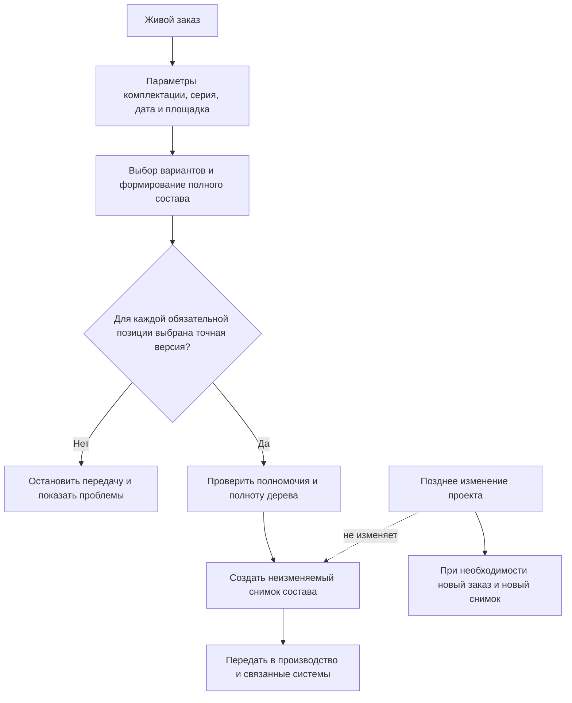

# Точный состав производственного заказа

## Почему живого состава недостаточно

Пока изделие проектируется или заказ уточняется, его состав может закономерно меняться. Выпускаются новые версии деталей, согласуются извещения, меняются разрешённые поставщики, уточняются параметры комплектации и выбираются варианты замен.

Такой **живой состав** полезен для текущей работы: при каждом открытии он показывает результат по актуальным данным и правилам. Но производство не может опираться на плавающий результат. После передачи задания в цех должно быть однозначно известно:

- какая точная версия головного изделия использована;
- какие позиции вошли в заказ;
- какая точная версия выбрана для каждой позиции;
- какие варианты комплектации и групповых замен приняты;
- какие количества и единицы действуют;
- по каким условиям получен результат;
- почему более позднее изменение проекта не переписывает уже выданное задание.

IPS закрывает эту потребность формированием точного дерева заказа. Interlink сохраняет тот же продуктовый результат, но ясно различает изменяемый заказ и неизменяемое свидетельство конкретной передачи.

## Два связанных, но разных объекта

### Живой производственный заказ

Живой заказ существует в процессе планирования. В нём можно уточнять количество изделий, сроки, заводские номера, площадку, климатическое исполнение, дополнительные опции и выбранные варианты замен. Сам заказ имеет версии: после существенного перепланирования появляется новое состояние заказа, а предыдущее остаётся в истории.

Живой заказ не обязан сразу содержать точную версию каждой детали. Пока планирование не закончено, часть состава может определяться правилами.

### Зафиксированный состав передачи

В момент выдачи согласованного задания Interlink создаёт **неизменяемый снимок состава**. Во внутренних архитектурных материалах встречается слово `Snapshot` — снимок, то есть сохранённое точное состояние результата на определённый момент.

Снимок содержит полное выбранное дерево от головного изделия до требуемых конечных объектов. Он не пересчитывается автоматически. Если заказ перепланирован, создаётся новая версия живого заказа и новый снимок. Старый остаётся свидетельством того, что было передано ранее.

## Что должно сохраняться в снимке

С точки зрения продукта снимок должен отвечать на следующие вопросы.

### Что было передано

- точная версия головного изделия;
- полный перечень включённых позиций;
- точная версия каждого объекта;
- количество, единица измерения и номер позиции;
- выбранный вариант конфигурации;
- принятый аналог или групповая замена;
- существенные данные связи, например исполнение или указание на комплект.

### При каких условиях

- номер и версия заказа;
- заводской номер или диапазон номеров;
- дата, производственная площадка и проект;
- параметры комплектации;
- цель передачи;
- применённые правила подбора.

### Почему получился именно этот результат

Для каждой позиции сохраняется краткая причина: точная фиксация, рабочая версия пакета изменения, применяемость по серии, утверждённое правило, выбранный аналог или вариант узла. Внутреннее название такой причины — `ResolutionReason`, то есть «основание выбора версии». Продуктовому пользователю достаточно русского объяснения.

### Кто и когда зафиксировал результат

Снимок содержит автора, время, основание операции и связь с процессом согласования. Для регулируемых процессов могут дополнительно потребоваться электронные подписи и отдельный комплект доказательных материалов.

## Пример 1. Серийный заказ на редукторы

Завод планирует изготовить десять редукторов `РЦ-250` с заводскими номерами 1201–1210. Для заказа указаны дата запуска, серийный диапазон и стандартное горизонтальное исполнение.

При формировании состава система получает:

- корпус версии 04 по правилу «последняя утверждённая»;
- быстроходный вал версии 03 по применяемости для номеров начиная с 1200;
- подшипник версии 02 по применяемости в составе данного редуктора;
- стандартную систему смазки по условиям горизонтального исполнения;
- исходный вариант кронштейна, потому что литая замена разрешена только другой площадке.

После проверки создаётся снимок заказа. На следующей неделе утверждается версия 05 корпуса и новый подшипник версии 03. Живой просмотр будущего заказа уже покажет новые версии, но состав редукторов 1201–1210 останется прежним.

Если производство ещё не началось и планировщик принимает решение перепланировать заказ, он создаёт новую версию заказа. Система заново формирует состав и после согласования создаёт новый снимок. Первый снимок не редактируется: он остаётся записью предыдущей передачи и может быть помечен отменённым установленным процессом.

## Пример 2. Заказной обрабатывающий центр

Обрабатывающий центр выпускается по индивидуальной комплектации. Заказчик выбрал:

- магазин на 60 инструментов;
- внутреннее охлаждение;
- измерительный щуп;
- стружечный транспортёр;
- напряжение 400 В;
- полное защитное ограждение.

Конфигуратор исключает позиции, относящиеся к магазину на 30 инструментов и ручному удалению стружки. Для оставшихся позиций подбираются версии. Привод магазина имеет два допустимых варианта; для этой площадки выбран комплект из двигателя, муфты и редуктора.

Снимок должен сохранить не только точные версии комплектующих, но и сам выбор варианта. Иначе через полгода, когда предпочтительным станет покупной мотор-редуктор, будет невозможно понять, почему в заказе присутствуют три отдельные позиции.

Перед публикацией выясняется, что у измерительного щупа нет утверждённой версии для выбранной системы управления. Заказ нельзя считать точным. Система сохраняет рабочий результат планирования и показывает проблему, но не создаёт производственный снимок до её устранения.

## Пример 3. Партия насосных агрегатов и смена поставщика

Заказ включает двадцать насосных агрегатов. Для электродвигателя разрешены два глобальных аналога. На момент первой передачи выбран двигатель изготовителя А, потому что он имеет высший приоритет и подтверждённый срок поставки.

После изготовления пяти агрегатов поставщик сообщает о задержке. Предприятие решает перевести оставшиеся пятнадцать агрегатов на двигатель изготовителя Б.

Корректная история может выглядеть так:

- первый снимок относится к агрегатам 001–005 и содержит двигатель А;
- новая версия заказа относится к агрегатам 006–020;
- второй снимок содержит двигатель Б и точную версию переходной документации;
- оба снимка сохраняются и не противоречат друг другу, потому что имеют разные области действия.

Попытка просто заменить двигатель в уже опубликованном снимке уничтожила бы связь между фактически собранными изделиями и выданным заданием.

## Пример 4. Ремонт и отличие от фактического исполнения

Для ремонта пресса сформирован точный сервисный комплект: уплотнения, крепёж, новый датчик и переходной кронштейн. Это состояние **заказано и передано** ремонтной бригаде.

Во время ремонта выясняется, что переходной кронштейн не понадобился, а дополнительный кабель пришлось изготовить на месте. Фактическое состояние после ремонта отличается от исходного заказа.

Снимок заказа нельзя переписывать под факт. Он отвечает на вопрос «что было предписано и выдано». Фактическое состояние оборудования должно фиксироваться отдельным учётом исполнения, экземпляров и выполненных работ. Это различие важно для анализа отклонений и качества процесса.

## Пример 5. Повторное использование узла в двух местах

В прокатном стане один насосный модуль установлен в двух технологических линиях. В первой линии он работает при высокой температуре, во второй — в обычных условиях. Из-за разных параметров один и тот же повторно используемый объект может получить разные выбранные версии уплотнений в двух ветвях.

Снимок должен сохранять не только обозначение детали, но и её место в конкретном пути состава. Иначе две одинаковые строки сольются, и станет непонятно, какое уплотнение относится к какой линии.

## Жёсткие условия создания точного снимка

Для производственного свидетельства недостаточно частично раскрытого дерева. Перед созданием система должна проверить:

1. Головное изделие задано точной зафиксированной версией.
2. Состав раскрыт до установленного для данного вида передачи конечного уровня.
3. Для каждой обязательной позиции выбрана одна точная версия.
4. Нет неразрешённых конфликтов комплектации.
5. Все групповые замены выбраны целиком.
6. Нет скрытых резервных результатов, запрещённых производственным процессом.
7. Пользователь имеет право сформировать полный снимок целиком.
8. Запись выполняется целиком: либо сохранён полный снимок, либо не сохранено ничего.

Ограниченный по глубине или обрезанный по правам просмотр не может быть выдан за точный производственный состав.

## Что происходит с исключёнными позициями

В само производственное дерево входят только позиции выбранной комплектации. Система не обязана передавать цеху все отвергнутые альтернативы. Однако для объяснения результата сохраняются исходные параметры, версия правил и сведения о выбранных вариантах.

При необходимости отдельный аналитический отчёт может показать, какие позиции полной структуры были исключены и почему. Это вспомогательная информация, а не часть выдаваемой спецификации.

## Чем снимок заказа не является

- Он не является живым деревом, которое автоматически меняется при каждом открытии.
- Он не заменяет производственную ведомость, если у ведомости есть собственное согласование, подписи и жизненный цикл.
- Он не является учётом фактически изготовленного изделия.
- Он не является временным ускоряющим кэшем системы.
- Он не обязательно копирует все файлы конструкторской документации; для автономного доказательного комплекта может потребоваться отдельная процедура упаковки файлов и подписей.

## Чем решение отличается от IPS

| Аспект | IPS | Interlink |
|---|---|---|
| Планируемый заказ | уточняется в процессе работы | сохраняется как версионируемый живой объект заказа |
| Точный состав | формируется для передачи в производство | создаётся как отдельный неизменяемый снимок |
| Последующие изменения | не должны менять ранее сформированный заказ | технически отделены созданием нового снимка |
| Объяснение выбора | зависит от доступных сведений заказа | для каждой позиции сохраняется деловое основание выбора |
| Неполный результат | должен выявляться процессом | наличие любой обязательной неразрешённой позиции запрещает публикацию |
| Перепланирование | создаёт новое состояние заказа | новая версия заказа и новый снимок, без перезаписи старого |

## Открытые продуктовые вопросы

- Какой уровень раскрытия считается конечным для разных видов производственных передач?
- Какие предупреждения допустимы в снимке, а какие всегда блокируют публикацию?
- Должны ли исключённые позиции храниться в доказательной части результата?
- Как снимок связан с производственной ведомостью, маршрутами, ERP и MES?
- Какие электронные подписи обязательны для разных предприятий?
- Как оформляется отмена опубликованного снимка без физического удаления истории?
- Как разделять один заказ на несколько диапазонов заводских номеров при частичном перепланировании?

## Критерии приёмки

1. Для каждой включённой позиции сохранена одна точная версия и её место в составе.
2. Изменение исходных данных после публикации не меняет старый снимок.
3. Перепланирование создаёт новое состояние заказа и новый снимок.
4. Хотя бы одна обязательная позиция без версии останавливает публикацию целиком.
5. Нельзя выдать за точный состав дерево, обрезанное по глубине или правам.
6. Выбранные параметры, аналоги и групповые замены остаются объяснимыми.
7. Снимок заказа отличается от учёта фактически изготовленного или отремонтированного изделия.

## Состояние реализации

Неизменяемый снимок производственного заказа закреплён как целевой продуктовый контракт. Его полная реализация зависит от готовности сквозного формирования состава, конфигуратора, замен и правил подбора версий.

## Связанные документы

- [Применяемость по головному изделию, серии и дате](Selection-effectivity)
- [Условия включения позиций и конфигуратор](Selection-position-presence)
- [Допустимые групповые замены](Selection-group-substitution)
- [Сквозное формирование многоуровневого состава](Selection-end-to-end)

