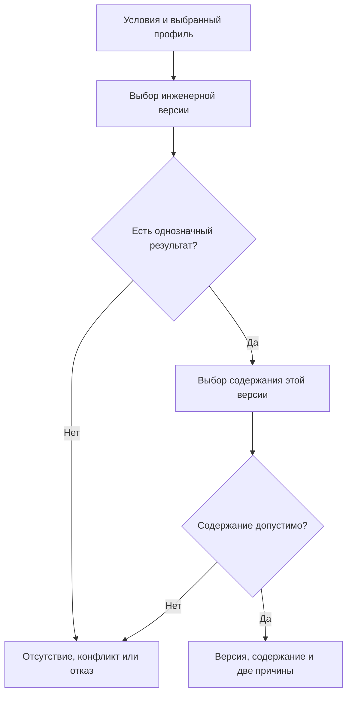

# Что изменилось в подборе версий относительно IPS

## Сохраняется результат, уточняется устройство

IPS позволяет хранить плавающий состав: позиция указывает на дочерний объект, а нужная версия определяется при чтении. Благодаря этому новая версия заимствованного компонента не заставляет немедленно создавать новую версию каждого родительского изделия. Interlink сохраняет эту возможность, включая жёсткую и мягкую конкретизацию, применяемость, связанные контексты, именованные правила и точную фиксацию производственного результата.

Пересмотр не сводится к перестановке правил. Прежняя модель Interlink слишком тесно связывала рабочую копию, контекст и пакет изменения, а мягкую конкретизацию ошибочно трактовала как временное предпочтение. В актуальной целевой модели это исправлено. Задача — воспроизвести обязательные пользовательские результаты IPS и дать устойчивую основу для параллельной работы, интеграций и будущих агентских систем.

Документ описывает **принятый проектный договор на 6 сентября 2026 года**, а не готовый промышленный модуль.

## Версия и её содержание — разные вещи

Инженерная версия — устойчивое обозначение результата разработки: например, «Корпус редуктора, версия Б». Внутри неё могут последовательно появляться неизменяемые опубликованные состояния. Между публикациями инженер работает с изменяемой рабочей копией.

Это позволяет различать две обычные команды. «Создать версию В от версии Б» начинает новую инженерную ветвь. «Исправить и завершить редактирование версии Б» сохраняет обозначение Б и создаёт новое опубликованное содержание Б, если процесс разрешает такую работу. Простое сохранение рабочей копии не выполняет ни одну из этих публикаций.

| Механизм | Предметный смысл |
|---|---|
| Жёсткая привязка версии | Не заменять версию Б другой инженерной версией; содержание Б читать по явно выбранному режиму |
| Точное состояние | Читать именно сохранённое содержание Б, не подмешивая последующие исправления или рабочую копию |
| Мягкая конкретизация | Сохранять предпочтение инженерной версии на отдельной позиции, пока оно участвует в данном режиме |
| Контекст подбора | Хранить согласованные назначения версий и при необходимости их точного или рабочего содержания |
| Неизменяемый снимок | Сохранить точный результат всего объявленного состава, а не только выбор одной позиции |

Жёсткая привязка и мягкая конкретизация могут выбрать одну инженерную версию, но дают разные ограничения. Ни одна не заменяет точное историческое основание автоматически.

## Работа, выбор и проведение разделены

Рабочая область отвечает на вопрос «где находятся мои незавершённые материалы?». Контекст — «какие версии следует совместно рассматривать?». Пакет изменения — «что именно должно стать официальным вместе?».

Конструкторский контекст может включать новую версию корпуса, действующую версию вала и конкретное опубликованное состояние чертежа поставщика. Не все эти материалы редактируются в текущем пакете. После завершения пакета контекст остаётся полезным: он сохраняет принятое сочетание и историю его назначений.

Две команды могут вести разные рабочие копии одной инженерной версии. Когда первая публикует результат, вторая не переписывает его последним сохранением: она получает конфликт и сохраняет свои материалы для сравнения и интеграции. Предприятие вправе отдельно включить эксклюзивный режим работы, но длительная общая блокировка объекта не является обязательным устройством ядра.

## Мягкая конкретизация — полноценный сохраняемый механизм

Выбранная версия хранится на позиции родительского состава и переживает публикацию. Если у насоса два одинаковых уплотнения, на всасывающем фланце можно предпочесть Б, на нагнетательном — Г. Глобальное назначение одной версии объекту не способно заменить эти два независимых решения.

Выключение предпочтений при переходе жизненного цикла не уничтожает сохранённое намерение. Предусмотренный переход может восстановить его. Ручное снятие и замена предпочтения имеют другой смысл: позднее автоматическое восстановление не должно возвращать отменённый выбор. Режим просмотра «игнорировать пользовательскую конкретизацию» вообще ничего не удаляет.

Отдельная [[страница мягкой конкретизации|Selection-soft-concretion]] раскрывает ручные, автоматические и массовые операции. [[Временная проработка|Selection-temporary-preference]] остаётся полезной, но не является её заменой.

## Почему всё ещё один механизм подбора

Один механизм — это единые правила исполнения, одинаковое понимание входов и причин результата. Это не требование поставить все источники в одну навсегда неизменную очередь.

Сначала выбирается инженерная версия, затем её содержание. Точная ссылка завершает обе ступени сразу. Жёсткая привязка завершает выбор версии, но оставляет объявленный выбор содержания этой же версии. Ни ошибка доступа, ни отсутствие содержания не позволяют незаметно перейти к другой версии.

| Источник после жёстких и строгих ограничений | Профиль совместимости с IPS | Редакторский профиль Interlink |
|---|---|---|
| Первый источник | Применяемость | Контекст и группа |
| Следующий, если допустим переход | Контекст и группа | Применяемость |
| Далее | Активная мягкая конкретизация | Активная мягкая конкретизация |
| Общее завершение | Именованное правило и явно разрешённый резерв | Именованное правило и явно разрешённый резерв |

Порядок профиля IPS опирается на подтверждённое описание IPS. Детали конкретной установки, например взаимодействие особых диапазонов и доработок, проверяются отдельно. Редакторский профиль не включается вместо него скрыто.

Фраза «если допустим переход» существенна. Отсутствие ограничения применяемости позволяет рассматривать следующий источник. Явное исключение, конфликт или ошибка не являются пустым результатом, который можно замести резервным правилом. Строгий режим также проверяется до выдачи результата: требование точного состояния не удовлетворяется одной жёсткой привязкой к инженерной версии.

Обе ступени используют объявленные условия. Нижний шаг не получает права отменить верхний. Рабочая копия другой инженерной версии не подходит вместо выбранной. Если разрешённая рабочая копия выбранной версии отсутствует, обычный рабочий режим может читать её опубликованное содержание; но явно закреплённую рабочую копию нельзя незаметно заменить архивом.

## Что находится рядом с подбором, но не растворяется в нём

Условия комплектации определяют присутствие позиции. Допустимая замена определяет, какие объекты и в каком количестве заменяют исходные. Совместимость проверяет, могут ли выбранные участники работать вместе. Версионный подбор отвечает за версию и содержание уже определённой цели.

При этом зависимости нельзя упрощать до лозунга «сначала все аналоги, затем любой подбор». Если допуск аналога относится к конкретной версии исходного двигателя, эту версию необходимо установить **до чтения допуска**. Затем явно выбирается заменитель и для него выполняется обычный подбор. Допуск версии Б нельзя заимствовать у В.

После выбора содержания может потребоваться ещё одна проверка совместимости: новая прошивка способна изменить требования к контроллеру. Отказ такой проверки не запускает скрытый поиск старой прошивки. Альтернативный комплект предлагают отдельным объяснимым действием.

## Три прикладных примера

### 1. Серийный подшипник и опытная разработка

Для редуктора серии 145 применим подшипник версии Б. Конструкторский контекст назначает версию В, ещё проходящую испытания. В профиле IPS подтверждённая применяемость выбирает Б. В редакторском профиле контекст может выбрать В, а разрешённый рабочий режим — её рабочую копию.

Оба ответа объяснимы. Неправильным было бы показать В планировщику только потому, что конструктор открыл её в соседнем окне. Производственная передача требует собственного полного расчёта и действующего допуска.

### 2. Исправление версии чертежа без утраты подписи

В рабочей навигации извещения задана жёсткая связь с чертежом корпуса версии Б. После разрешённого исправления глубины отверстия появляется новое опубликованное содержание Б. Такая связь продолжает вести к Б и может показывать её обновлённое содержание. Это не разрешает изменить точное основание уже согласованного извещения: его исходные и результирующие материалы закрепляются отдельно.

Подпись прежней выдачи относится к прежнему точному состоянию. Она остаётся доказательством того, что подписано, но не становится подписью исправленного файла. Чтобы передать исправление, нужен новый установленный процесс, а не переименование старого свидетельства.

### 3. Замена привода станка комплектом

Покупной мотор-редуктор разрешено заменить комплектом из двигателя, редуктора, муфты и переходной плиты. Менеджер выбирает этот вариант для заказа. Система проверяет весь комплект, подбирает версии его участников и затем проверяет их фактические размеры, интерфейсы и режимы.

Если плита отсутствует или точное содержание муфты несовместимо с валом, результат не годится к передаче. Нельзя опубликовать только успешно подобранные строки. После явного исправления выпускается точный снимок; новое решение не переписывает прошлые заказы.

## Что увидит пользователь

Карточка позиции объясняет отдельно присутствие, выбранный объект, инженерную версию, содержание и результат совместимости. Она различает «предпочтение сохранено, но выключено жизненным циклом», «версия назначена контекстом» и «читается точное состояние старого снимка».

При конфликте двух контекстов показывается причина и доступное действие. При закрытом содержании система не раскрывает недоступные сведения и не заменяет их старой видимой версией. Полный производственный снимок не обрезается до видимой части дерева.

## Как доказать сохранение возможностей IPS

Нужны сценарии с одинаковыми исходными данными в используемой установке IPS и Interlink: две мягкие конкретизации одного объекта, выключение и восстановление по жизненному циклу, объединение контекстов и независимое завершение, создание новой версии от исторического прототипа, итерации, диапазоны применяемости, именованные правила, аналоги и полные групповые замены.

Сравниваются не только номера версий, но и содержание, область действия, видимость, результат ошибки и историческое основание. Целевой договор принят; полное покрытие считается доказанным только после исполнения этих проверок, включая перенос и прикладные рабочие места.

Далее: [[путеводитель по всем сценариям|Version-selection-guide]], [[контексты|Selection-contexts]], [[жёсткая и точная привязка|Selection-exact-fixation]], [[итерации|Selection-iterations]], [[совместимость|Compatibility-matrices]].
