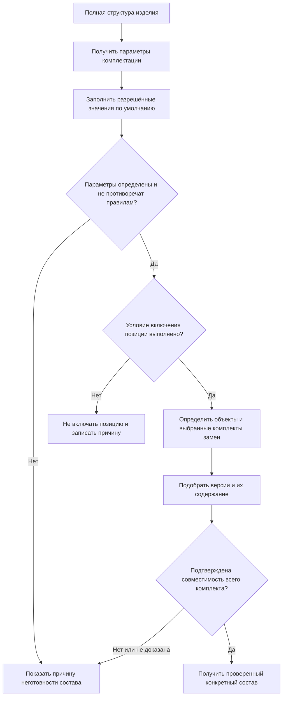
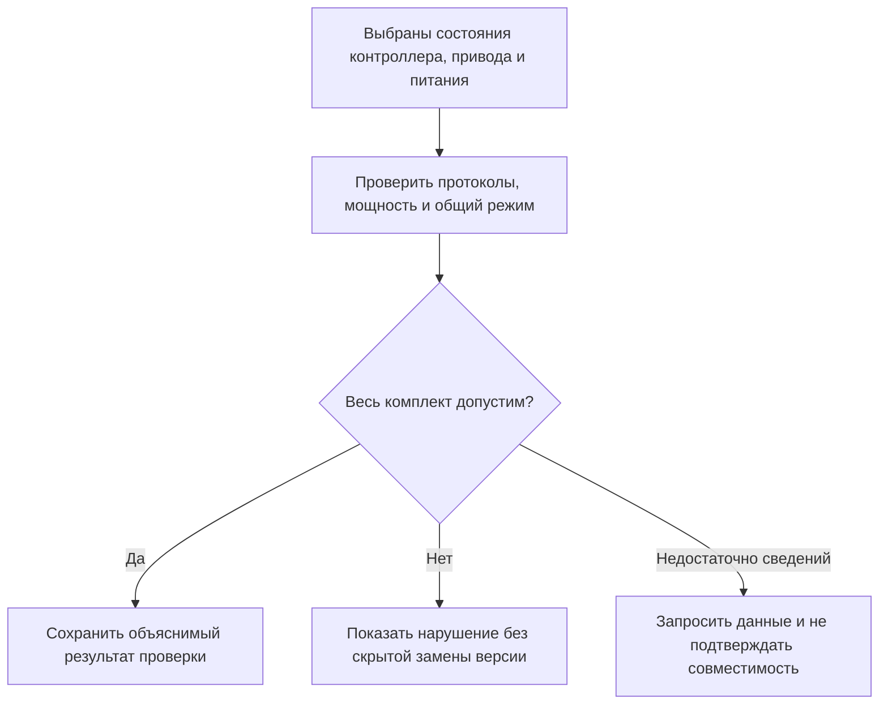

# Условия включения позиций и конфигуратор изделия

> Здесь описан целевой механизм. Полное воспроизведение сценариев конфигуратора IPS и новые проверки совместимости должны быть подтверждены реализацией и приёмочными примерами.

## Почему этот сценарий связан с подбором версий

В IPS формирование состава включает не только выбор версий деталей и сборочных единиц. Для конфигурируемого изделия сначала необходимо определить, какие позиции вообще входят в конкретное исполнение.

Например, полная структура станка может содержать стружечный транспортёр, защитное ограждение разных типов, систему охлаждения через шпиндель и несколько вариантов привода. В заказ конкретного станка войдёт лишь часть этих позиций.

Для пользователя эти действия происходят при раскрытии одного дерева, но отвечают на разные вопросы:

1. **Нужна ли эта позиция в выбранном исполнении?**
2. **Если нужна, какую пользовательскую версию объекта и какое её содержание следует взять?**
3. **Могут ли выбранные объекты именно в этих состояниях работать вместе?**

Interlink должен сохранить пользовательские возможности конфигуратора IPS и явно разделяет эти решения. **Условие включения позиции** определяет, нужна ли строка состава. Подбор версии определяет используемое инженерное решение и его содержание. Проверка совместимости подтверждает допустимость всего выбранного комплекта; её нельзя заменить успехом подбора каждой детали по отдельности.

## Что сохраняется относительно IPS

Interlink должен поддержать знакомые IPS возможности:

- описание полной, или 150-процентной, структуры изделия;
- опции и допустимые значения;
- значения по умолчанию;
- несовместимые сочетания;
- значения, автоматически следующие из уже выбранных;
- условия включения отдельных позиций;
- передачу параметров во вложенные сборочные единицы;
- получение конкретного, или 100-процентного, состава заказа;
- объяснение, почему позиция вошла или не вошла в состав.

Главное изменение состоит не в отказе от конфигуратора, а в явном разделении результатов. Исключённая позиция не должна выглядеть как позиция, для которой не удалось подобрать версию. Это требование к Interlink, а не утверждение об ошибочном поведении любого интерфейса IPS.

## Общая последовательность

Сначала формируется набор параметров конкретного исполнения. Затем для каждой позиции проверяется условие её включения. Исключённая позиция не требует подбора версии и не возвращается в состав резервным правилом. Для включённых позиций определяются объекты, в том числе явно выбранные аналоги и полные комплекты замен. Затем выбираются пользовательские версии и их содержание, после чего проверяются ограничения, зависящие именно от полученных состояний.

Схема показывает основной порядок решений, а не запрет читать версии на подготовительных шагах. Если разрешение на аналог назначено определённой версии исходного насоса, сначала необходимо определить эту версию и прочитать относящееся к ней разрешение. Нельзя взять более удобный перечень аналогов у соседней версии. После явного выбора аналога обычный механизм подбирает версию уже нового объекта.

**Ни успешный расчёт, ни заполнение параметров не публикуют данные автоматически.** Планировщик может сохранить рабочий вариант и вернуться к нему. Для официальной передачи нужны отдельная публикация необходимого содержания, проверка всех обязательных допусков и точный состав передачи.

## Пример 1. Токарный станок с дополнительным оснащением

Полная структура токарного станка `СТ-500` содержит следующие позиции:

| Позиция | Условие включения |
|---|---|
| Станина и шпиндельная бабка | входят всегда |
| Закрытое защитное ограждение | исполнение «полная защита» |
| Стружечный транспортёр | выбрана автоматическая уборка стружки |
| Бак и насос охлаждения через шпиндель | выбрано внутреннее охлаждение |
| Маслоохладитель | внутреннее охлаждение и длительный режим работы |
| Ручной лоток для стружки | автоматическая уборка не выбрана |

Заказчик выбирает полную защиту, автоматический транспортёр и внутреннее охлаждение. Система включает ограждение, транспортёр, бак, насос и, при длительном режиме, маслоохладитель. Ручной лоток исключается.

После этого для каждой включённой позиции подбирается версия и её содержание. Например, для насоса действует правило применяемости по согласованной дате ввода конструкции. Плановая дата поставки заказа не подставляется вместо неё автоматически. Версия ограждения может быть жёстко закреплена заказом; для точной передачи дополнительно фиксируется конкретное опубликованное состояние этой версии.

Если ручной лоток не показан, это нормальный результат комплектации. Сообщение «подходящая версия лотка не найдена» было бы неверным, потому что лоток вообще не нужен.

## Пример 2. Насосный агрегат для холодного климата

Полная структура насосного агрегата включает:

- обычные уплотнения;
- морозостойкие уплотнения;
- подогрев шкафа управления;
- навес от осадков;
- дренаж с обогреваемой трубкой;
- стандартную и низкотемпературную смазку.

Параметры заказа: климатическое исполнение ХЛ1, наружная установка, минимальная температура −50 °C.

Из этих значений следует:

- обычные уплотнения исключаются;
- морозостойкие уплотнения включаются;
- подогрев шкафа включается;
- навес включается;
- обогреваемый дренаж включается;
- стандартная смазка исключается;
- низкотемпературная смазка включается.

Затем система выбирает версии включённых объектов. Если для морозостойкого уплотнения нет утверждённой версии, это уже отдельная проблема подбора версии. Позиция нужна, но состав пока не может быть определён полностью.

## Пример 3. Редуктор с разным монтажным положением

Один и тот же редуктор выпускается с горизонтальным и вертикальным расположением валов. Монтажное положение влияет на масляную ванну, расположение сапуна, контрольную пробку и объём смазки.

Для горизонтального исполнения включаются боковая контрольная пробка и стандартный объём масла. Для вертикального — верхний сапун, дополнительная трубка смазки верхнего подшипника и увеличенный объём масла.

При этом объект «Сапун редуктора» может быть один и тот же, но его версия подбирается отдельно по степени готовности или применяемости. Условие включения отвечает на вопрос, нужен ли сапун в данной позиции; правило версий — какую его документацию использовать.

Если в будущем появляется новое вертикальное исполнение с принудительной смазкой, изменяются условия включения позиций. История старых заказов не пересчитывается: в их точном составе остаются ранее выбранные детали и версии.

## Пример 4. Вложенная конфигурация привода станка

Станок содержит покупной приводной модуль. Верхний уровень задаёт напряжение питания 400 В и требование к степени защиты IP55. Внутри приводного модуля находятся электродвигатель, преобразователь частоты, вентилятор и тормозной резистор.

Напряжение и степень защиты должны быть переданы во вложенную сборку. Дополнительно сам модуль задаёт режим торможения. При интенсивном торможении включается тормозной резистор, при обычном — он не нужен.

Важно ограничить область действия параметров. Настройка вентилятора внутри приводного модуля не должна случайно изменить вентилятор соседнего шкафа управления. Поэтому Interlink рассматривает параметры не как общий набор на весь экран, а как окружение конкретной ветви изделия.

Пользователь при просмотре причины должен увидеть цепочку:

> Тормозной резистор включён, потому что для приводного модуля выбран интенсивный режим торможения. Напряжение 400 В передано из параметров станка. Выбрана версия 02 резистора, утверждённая для данного преобразователя.

## Пример 5. Несовместимое сочетание опций

Заказчик выбрал для обрабатывающего центра компактное ограждение и одновременно магазин на 120 инструментов. По компоновке эти варианты несовместимы.

Система не должна произвольно отключить один из вариантов и продолжить расчёт. Она сообщает конфликт ещё до подбора версий:

> Комплектация не определена. Магазин на 120 инструментов нельзя установить с компактным ограждением. Выберите стандартное ограждение либо магазин меньшей вместимости.

Пока конфликт не устранён, получить допустимый полный состав нельзя. Система может помогать анализировать спорные варианты, но не выдаёт результат такого анализа за готовую комплектацию.

## Пример 6. Подходящие детали ещё не образуют совместимый привод

Для привода подачи выбраны контроллер, преобразователь частоты и электродвигатель. По мощности и напряжению каждый из объектов подходит. Однако опубликованное состояние контроллера использует новую редакцию протокола обмена, а выбранное состояние прошивки преобразователя поддерживает только старую.

Проверка опций «400 В, требуемая мощность, нужный способ монтажа» прошла бы успешно. Несовместимость проявляется только после выбора конкретного содержания. Пользователь видит объяснение: какие состояния были выбраны, какое обязательное требование нарушено и какое изменение нужно рассмотреть.

Interlink не должен молча взять старое состояние контроллера или другую версию преобразователя. Это изменило бы принятое решение, а иногда нарушило жёсткое закрепление. Конструктор явно выбирает другую комплектацию либо оформляет обновление прошивки, затем выполняет проверку заново.

Есть и более сложный случай: преобразователь и тормозной модуль по отдельности совместимы с блоком питания, но в интенсивном режиме их суммарная нагрузка превышает его возможности. Несколько разрешённых пар не доказывают совместимость тройки. Проверять нужно весь комплект со всеми обязательными ограничениями, а не только найти разрешающую ячейку для каждой пары.

В этой схеме положительный результат относится к определённым состояниям и условиям. Он не является вечным разрешением использовать любую будущую прошивку тех же объектов.

## Разные причины отсутствия готового результата

| Результат | Деловой смысл | Пример |
|---|---|---|
| Позиция исключена | она не требуется в выбранном исполнении | подогрев не нужен для умеренного климата |
| Подходящая версия не найдена | позиция нужна, но ни одна версия не подходит | морозостойкое уплотнение требуется, но ещё не утверждено |
| Несовместимая комплектация | выбранное сочетание нарушает обязательное ограничение | компактное ограждение несовместимо с большим магазином |
| Недостаточно сведений | нельзя подтвердить требуемое решение о включении либо допустимости | не указана температура работы или отсутствуют данные о совместимости протокола |
| Правило пока не поддерживается | исполнитель не умеет выполнить требуемую проверку | для нового вида расчёта ещё не подключён необходимый предметный модуль |
| Противоречивые основания | нельзя однозначно определить применяемые правила или данные | предъявлены две взаимоисключающие редакции условий без решения, какую использовать |

В интерфейсе эти состояния должны иметь разные сообщения и разные способы исправления. Исключённая позиция не требует действий. Отсутствующая версия требует работы с объектом или правилом. Несовместимость требует пересмотра выбранного сочетания; нехватка знаний — получения сведений, а не объявления изделия невозможным. Неподдержанное обязательное правило нельзя пропустить ради успешной выдачи.

Если пользователь ещё заполнил не все параметры, сообщение «такой частичный выбор можно продолжить» допустимо только при подтверждённом полном допустимом продолжении всех совместно действующих ограничений. Формулировка «пока конфликтов не обнаружено» означает более слабый промежуточный результат и должна быть показана именно так.

## Значения по умолчанию и явный выбор

Значение по умолчанию удобно, но оно не должно скрывать отсутствие важного решения. Например, цвет кожуха можно заполнить стандартным серым автоматически. Климатическое исполнение или напряжение питания для производственного заказа обычно требуют явного подтверждения.

Interlink должен различать:

- пользователь явно выбрал значение;
- значение получено из заказа верхнего уровня;
- значение выведено из другого параметра;
- применено разрешённое значение по умолчанию;
- обязательное значение отсутствует.

Причина включения позиции должна содержать происхождение значений. Это помогает разбирать сложные случаи и не позволяет незаметному умолчанию превратиться в производственное решение.

## Простая и расширенная область параметров

В простом явно выбранном режиме один набор параметров может действовать на всём дереве изделия. Это подходит, например, для общего климатического исполнения насосной станции. Такой ограниченный режим не заменяет обязательные сценарии передачи параметров во вложенные сборки: их нельзя молча рассчитывать как плоский набор значений.

Сложные изделия требуют расширенного поведения: вложенная сборка получает часть параметров сверху, добавляет свои и иногда локально переопределяет значение. Такое переопределение действует только внутри данной ветви.

Продуктово это означает:

- одинаково названный параметр не обязательно имеет одно значение во всех ветвях;
- система хранит путь, по которому значение пришло к позиции;
- локальное решение одной сборки не «протекает» в соседнюю;
- повторно используемый узел может получить разные допустимые комплектации в двух местах одного изделия.

## Чем решение отличается от IPS

| Аспект | IPS | Interlink |
|---|---|---|
| Полная и конкретная структура | конфигуратор формирует 100-процентный состав из 150-процентного | возможность сохраняется без изменения смысла |
| Положение в общей цепочке | конфигуратор участвует в формировании состава | присутствие позиции, выбор объекта, подбор версии и итоговая совместимость имеют отдельные объяснимые результаты |
| Причина отсутствия строки | поведение проверяется на сценариях конкретной установки | различаются исключение, отсутствие версии, несовместимость и недостаток сведений |
| Передача параметров | поддерживается распространение значений | происхождение и область каждого значения делаются явными |
| Повторяемость результата | зависела от корректной настройки контекста | параметры конкретного расчёта фиксируются вместе с результатом |

## Открытые продуктовые вопросы

- Какие виды опций IPS должны войти в первую версию конфигуратора Interlink?
- Какие значения разрешено заполнять по умолчанию, а какие требуют явного подтверждения?
- Какие правила распространения параметров реально используются во вложенных сборках?
- Как в IPS обрабатывается один и тот же узел, повторно включённый в разные ветви с разными параметрами?
- Нужно ли хранить причины исключения всех позиций в производственном свидетельстве или достаточно выбранного состава и исходных параметров?
- Как пользователю показать конфликт нескольких правил без перегруженного технического объяснения?

## Критерии приёмки

1. Из полной структуры получается конкретный состав для заданного набора параметров.
2. Исключённая позиция не порождает ошибку отсутствия версии.
3. Включённая позиция без подходящей версии делает состав неполным.
4. Несовместимость параметров и выбранного содержания выявляется до официальной передачи; успешный подбор отдельных версий не заменяет проверку комплекта.
5. Пользователь видит, почему позиция включена или исключена и откуда пришли существенные параметры.
6. Локальное значение во вложенной сборке не изменяет соседнюю ветвь.
7. После публикации точного состава передачи последующее изменение правил конфигурации не меняет этот сохранённый результат.
8. Недостаток сведений или неподдержанное обязательное правило не выдаются за исключённую позицию, доказанную несовместимость или подтверждённую комплектацию.

## Состояние реализации

Разделение условий включения позиции, подбора версии и совместимости закреплено в целевой архитектуре Interlink. Также определён путь развития табличных правил и ограничений на несколько совместно выбранных участников. Это не утверждение о готовом конфигураторе: исполнение, интерфейс, вложенная передача параметров и полнота сценариев IPS ещё должны пройти реализацию и приёмку. Расширенные проверки не отменяют обязательное воспроизведение используемых сценариев IPS.

## Связанные документы

- [[Применяемость по головному изделию, серии и дате|Selection-effectivity]]
- [[Допустимые групповые замены|Selection-group-substitution]]
- [[Точный состав производственного заказа|Selection-order-snapshot]]
