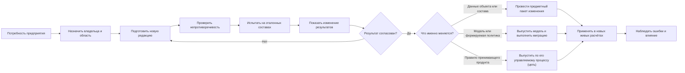
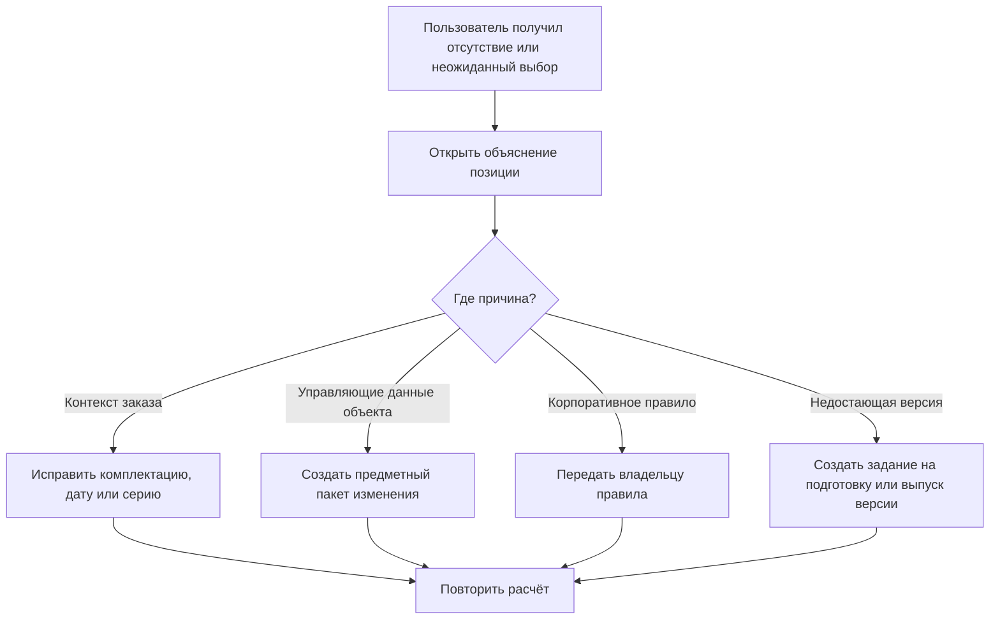

# Как создаются и выпускаются правила подбора

## Почему пользователю недостаточно знать алгоритм

Стабильность состава зависит не только от программы Interlink. Предприятие создаёт применяемость, основные версии, аналоги, варианты, групповые замены и корпоративные правила. Если эти управляющие данные меняются без владельца, испытаний и выпуска, одинаковый заказ может неожиданно получить другой состав.

Поэтому каждый механизм имеет свой управляемый жизненный цикл.

## Четыре слоя управления

### Модель предприятия

Определяет, какие типы объектов и связей существуют, где допустима точная фиксация, какие координаты применяемости поддерживаются и какие параметры конфигурации разрешены.

Владелец: архитектор предметной модели вместе с продуктовыми специалистами.

### Корпоративные правила

Определяют доступные режимы: назначенная основная версия, последняя допустимая, выпущенная, минимальная степень готовности, разрешённый резерв и профиль конкретной операции.

Владелец: методист PLM или НСИ. Правила версионируются и выпускаются.

### Управляющие данные объекта

Это применяемость конкретной версии, точная фиксация позиции, список аналогов, вариант структуры и групповая замена.

Владелец: конструктор, технолог, служба НСИ либо менеджер продукта — по корпоративной матрице.

### Контекст конкретной операции

Это изделие, серия, дата, комплектация, площадка, заказ, пакет изменения и цель расчёта.

Владелец: пользователь и принимающий процесс. Контекст не переписывает корпоративное правило, а задаёт его входные условия.

## Общая логика изменения — и три разных пути выпуска

Старые снимки продолжают ссылаться на прежние точные результаты и происхождение. Новая редакция влияет на будущие живые расчёты только после выпуска.

Важно не отправлять любое правило в один и тот же пакет:

- применяемость, точная фиксация позиции, аналог и групповая замена являются предметными данными и проводятся вместе с изменяемым составом;
- новый параметр конфигуратора, тип связи или формируемая политика относятся к модели предприятия и требуют отдельного выпуска модели и, при необходимости, миграции базы;
- административная политика рабочего места принадлежит принимающему продукту. Её версионирование, испытание и активация — целевой процесс этого продукта, а не уже готовая функция Interlink.

## Что видят автор, рецензент и обычный пользователь

Пока новая редакция готовится, автор и допущенные участники видят черновик и могут рассчитывать будущее поведение на эталонных изделиях. Обычные пользователи продолжают работать по действующей редакции. Рецензент получает не произвольное описание, а точный вариант правила, набор испытаний и сравнение результатов «до/после»: какие позиции изменили выбор, где появился резерв и где версия перестала находиться.

Согласование относится к точному отпечатку этой редакции. Если после согласования изменён критерий, область действия, набор параметров или переход данных, прежнее решение теряет силу: сравнение и требуемое согласование выполняются повторно. Только после этого редакция выпускается своим правильным способом — через модель, настройки принимающего продукта или предметный пакет для данных конкретного объекта.

Отдельная граница зрелости: точное взаимное старшинство варианта позиции, глобального аналога и групповой замены ещё не принято. Документ описывает их отдельное управление и проверку, но не закрепляет окончательный порядок этих трёх структурных механизмов.

## Как создаётся применяемость

Владелец изменения задаёт не техническую формулу, а предметный диапазон: головное изделие, начало и окончание серий, даты и другие утверждённые координаты.

Система должна:

- показать существующие диапазоны того же объекта;
- обнаружить пересечение и пробел;
- рассчитать примеры на границах «до», «с» и «после»;
- показать затронутые заказы и выпуски;
- провести применяемость вместе с версиями, к которым она относится.

### Пример

Новая крышка редуктора применяется с серии 145. Испытание проверяет серии 144, 145 и 146. Для 144 выбирается старая версия, для 145 и 146 — новая. Если другой диапазон уже начинается с 150 и перекрывается, выпуск останавливается до явного разрешения.

## Как назначается основная версия

Уполномоченный пользователь выбирает конкретную официальную версию и видит, где политика «основная версия» изменит живой состав. Назначение выполняется через типизированное быстрое или формальное изменение в зависимости от готовности объекта и масштаба влияния.

Отсутствие основной версии не означает автоматический переход к последней. Резерв должен быть явно предусмотрен профилем операции.

## Как создаётся точная фиксация позиции

Конструктор открывает конкретную позицию состава, выбирает точную официальную версию либо рабочую версию из того же пакета и указывает основание: сертификация, интерфейсная совместимость, договорное требование или воспроизводимость испытаний.

Проверка показывает:

- текущую и предлагаемую версии;
- допустимость версии;
- влияние на каждое использование позиции;
- конфликт с применяемостью и предупреждение о будущем устаревании;
- отличие от фиксации полного снимка.

Фиксация принадлежит позиции в новой версии родительского состава и проводится вместе с ней, а не хранится как скрытая настройка пользователя. Она является строгой: если указанная версия запрещена политикой операции, пользователь получает ошибку, а не незаметный переход к применяемости или последней версии.

## Как ведутся глобальные аналоги

Служба НСИ создаёт связь между исходным и альтернативным объектом, область допустимости и ограничения: предприятие, вид использования, температура, сертификация, направление замены.

Перед выпуском проверяются:

- совместимость ключевых характеристик;
- односторонняя или взаимная заменяемость;
- отсутствие запрещённых цепочек и циклов;
- результат на типовых составах;
- необходимость человеческого решения для критических объектов.

Временный дефицит поставщика не обязательно должен менять глобальный справочник. Для конкретного заказа может быть правильнее явное решение заказа.

## Как создаются групповые замены

Владелец состава определяет исходный набор позиций, альтернативный набор и точную область действия в структуре. Система проверяет количества, единицы, обязательность участников, повторное использование и пересечение с другими заменами.

Испытание должно показать полный результат «до» и «после». Нельзя считать групповую замену удачной, если главный узел заменён, а необходимый переходник или крепёж потерян.

## Как выпускается настраиваемое правило

### Подготовка

Методист выбирает разрешённые критерии и порядок сравнения кандидатов. Обычный пользователь не пишет программный код и не получает возможность выполнить произвольный запрос к базе.

### Испытательный набор

Для правила хранится набор реалистичных примеров:

- обычный серийный состав;
- граница применяемости;
- точная фиксация;
- отсутствие кандидата;
- два равных кандидата;
- аннулированная или недостаточно готовая версия;
- большая повторно используемая сборка.

### Сравнение влияния

Перед выпуском методист видит, какие позиции на эталонных изделиях изменят выбор относительно действующей редакции. Неожиданное массовое изменение требует объяснения или исправления.

### Выпуск

Способ выпуска зависит от носителя правила. Предметные управляющие данные проходят пакет изменения. Правило, которое формируется из модели, получает редакцию в выпуске модели и устанавливается вместе с совместимой миграцией. Политика принимающего продукта активируется его собственным управляемым процессом. Профили операций явно переходят на новую редакцию; снимки сохраняют прежний точный результат и происхождение выбора.

Общее правило выбора нельзя выпустить предметным пакетом одного редуктора или насоса: такой пакет изменяет только данные конкретных объектов. Редакция общего алгоритма относится к модели, а назначение профиля рабочему процессу — к версионируемой настройке принимающего продукта.

## Как изменяется конфигуратор

Администратор модели определяет параметры и допустимые значения. Методист изделия связывает их с условиями включения позиций и ограничениями совместимости. Менеджер заказа только заполняет разрешённую форму комплектации.

Перед выпуском проверяются:

- полнота значений по умолчанию;
- взаимоисключающие и обязательные опции;
- вложенные конфигурации;
- отсутствие комбинаций, дающих неполный состав;
- стабильность ранее согласованных продуктовых вариантов.

Изменение списка параметров может требовать миграции существующих заказов. Система должна показать, какие заказы нельзя автоматически привести к новой редакции.

## Как обрабатывается обнаруженная проблема

Проблема не должна завершаться сообщением «обратитесь к администратору». В ней сохраняются корневое изделие, путь позиции, условия, кандидаты, действующая редакция правила и деловая цель. Владелец получает воспроизводимый случай.

## Кто имеет право менять что

| Действие | Типичный владелец | Как фиксируется |
|---|---|---|
| Параметры конфигуратора | Архитектор модели и методист изделия | Выпуск модели и предметных правил |
| Условия включения позиции | Владелец конструкции | Пакет изменения состава |
| Применяемость версии | Владелец изделия или изменения | Формальное изменение |
| Точная фиксация | Конструктор с предметным полномочием | Пакет изменения позиции |
| Аналоги | Служба НСИ и ответственные специалисты | Управляемое изменение справочника |
| Групповая замена | Владелец состава | Пакет изменения структуры |
| Корпоративная политика выбора | Методист PLM | Версионируемый выпуск правила |
| Автоматический резервный алгоритм | Методист PLM | Версионируемая политика подбора |
| Исключение для конкретного заказа | Планировщик и согласующий | Отдельное решение заказа с основанием; не считается резервным алгоритмом |
| Публикация снимка | Владелец выпуска или заказа | Отдельная контролируемая операция |

Конкретные роли на предприятии могут называться иначе. Важны разделение ответственности и прослеживаемость решения.

## Наблюдение после выпуска

Принимающий продукт собирает показатели:

- доля позиций без результата;
- частота резервного выбора;
- конфликты применяемости;
- число ручных решений;
- изменение состава после новой редакции правила;
- время полного расчёта;
- наиболее частые причины остановки;
- расхождение ожидаемого и фактически использованного состава.

Показатель сам по себе не меняет правило. Владелец анализирует примеры и запускает управляемое улучшение.

## Откат редакции правила

Если новая редакция даёт нежелательный результат, её не редактируют задним числом. Способ отката зависит от носителя:

- предметные данные исправляются новым пакетом изменения;
- для модели выпускается следующая редакция либо выполняется предусмотренный безопасный возврат вместе с согласованным состоянием данных;
- принимающий продукт активирует ранее проверенную версию административной настройки или выпускает следующую.

История сохраняет период действия, владельца и влияние. Откат одного носителя не переписывает другой и не меняет уже опубликованные снимки.

Уже опубликованные снимки не пересчитываются. Открытые заказы должны явно показать, какой редакцией они рассчитаны и требуется ли повтор.

## Отдельное решение одного заказа

Разовое решение — например, согласованная замена двигателя из-за дефицита — не становится новым общим резервным правилом. Принимающий продукт показывает исходный отказ, точную уже зафиксированную версию замены, влияние и требуемых согласующих. После принятия решение сохраняется только в новом снимке конкретной передачи вместе с основанием и полномочиями. Следующий заказ снова использует общее правило.

Временное предпочтение пакета не является носителем такого решения и всегда удаляется перед проведением. Если выбор нужен постоянно, создаётся предметная точная фиксация; если только для одной передачи, принимается отдельное решение заказа и публикуется новый снимок.

## Состояние реализации

Для уже определённого предметного объекта принят порядок выбора его версии: точная фиксация, ранняя остановка строгого режима «только фиксации», рабочая версия, временное предпочтение, применяемость, основное правило и разрешённый резерв. Порядок **структурных** механизмов — варианта позиции, глобального аналога и групповой замены «многие ко многим» — ещё не принят и требует продуктовых сценариев IPS. Полный административный контур правил, испытательные наборы, анализ влияния, применяемость, конфигуратор и рабочие места являются целевой моделью последующих этапов.

Связанные документы: [[работа пользователей|Selection-user-work]], [[настраиваемое правило|Selection-custom-rule]], [[применяемость|Selection-effectivity]], [[конфигуратор|Selection-position-presence]].
