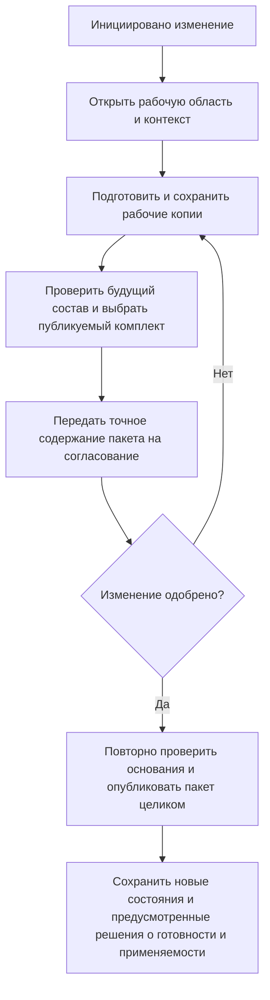

# Последовательное проведение изменений

## Что означает этот режим в IPS

Системное правило IPS `Последовательное проведение изменений` ищет версии объектов, расположенные на уровнях продвижения `Создание и модификация` или `Согласование и утверждение`.

Практический смысл правила — показать согласованный набор версий, которые ещё не стали производственными, но уже участвуют в проводимом изменении.

Этот режим тесно связан с контекстами редактирования и извещениями, но не совпадает с ними полностью:

- контекст содержит точные версии конкретного изменения;
- правило по уровням может находить подходящие зафиксированные версии рабочих стадий;
- процесс согласования управляет заданиями и решениями.

## Как Interlink раскладывает сценарий

В целевой модели различаются четыре обязанности:

1. **Рабочая область** хранит незавершённые копии, а **контекст подбора** определяет, какие версии и какое их содержание нужно видеть вместе.
2. **Правило рабочих стадий** выбирает инженерные версии на предусмотренных уровнях продвижения. Затем определяется их разрешённое опубликованное содержание либо явно выбранная доступная рабочая копия.
3. **Пакет изменения** определяет, какие конкретные результаты нужно опубликовать целиком.
4. **Процесс согласования** назначает задания, собирает решения и разрешает предметные переходы.

Это не четыре конкурирующих алгоритма подбора. Один механизм чтения получает явный контекст и объявленное правило. Он отдельно объясняет, почему выбрана инженерная версия и почему показано именно это её содержание. Контекст может сохраняться после публикации; рабочая область может содержать результаты, не вошедшие в текущий пакет.

Такой разбор помогает понять, почему версия появилась в составе:

- контекст указывает на доступную рабочую копию;
- выбрана инженерная версия на стадии согласования и её опубликованное состояние;
- версия допущена к производству и выбрана производственным правилом.

## Пример 1. Изменение подшипникового узла редуктора

Извещение `ИИ-РЦ250-047` меняет:

- выходной вал;
- подшипник;
- крышку подшипника;
- распорное кольцо;
- сборочный чертёж;
- технологическую операцию сборки.

На этапе разработки конструктор и технолог видят рабочие копии через совместный контекст. Само сохранение правок не публикует их. После внутренней проверки выбранный комплект подготавливается для согласования и последующей публикации.

Руководитель изменения должен видеть весь комплект как единое будущее состояние, а не случайную смесь:

- нового вала;
- старой крышки;
- уже выпущенного чертежа;
- рабочего техпроцесса из другого изменения.

Согласованный набор назначений задаёт контекст, а неделимый выпуск — пакет. Правило рабочих стадий полезно для отдельного просмотра, но принадлежность к нужному уровню сама не доказывает, что все найденные документы согласованы между собой.

## Пример 2. Совместная модернизация механики и электрики станка

Для станка `СТ-500` изменяются:

- ограждение рабочей зоны;
- кабельные трассы;
- электрошкаф;
- перечень элементов;
- руководство по эксплуатации.

Механическая и электрическая части проходят разные маршруты согласования. Тем не менее выпускать их нужно совместно, потому что отверстия в ограждении зависят от нового расположения кабелей.

В Interlink контексты обеих дисциплин читаются совместно, даже если работа заканчивается в разное время. Для неделимой публикации зависимые результаты объединяются в один пакет или в общий неделимый комплект нескольких пакетов. Одна лишь ссылка «зависит от другого изменения» не гарантирует совместной фиксации. Процессы согласования могут оставаться разными, но частично согласованный комплект не выдаётся за готовый производственный состав.

## Пример 3. Уже зафиксированная версия на согласовании

На предприятии принято фиксировать промежуточную версию документа перед внешним согласованием. Такая версия уже не является редактируемой рабочей, но ещё не выпущена в производство.

Для объекта `Рама станка СТ-500.01.000` существуют:

- версия 10 — производственная;
- версия 11 — имеет опубликованное состояние, направленное на согласование;
- версия 12 — разрабатывается в другой рабочей области, недоступной текущему пользователю.

Специальное правило последовательного проведения может выбрать версию 11 и её объявленное содержание. Производственное правило продолжает выбирать версию 10. Рабочая копия версии 12 не раскрывается через запрос «показать всё» или через совпадение уровня продвижения.

Если доработку версии 11 разрешили и затем опубликовали, номер 11 может сохраниться, но появится другое неизменяемое состояние. Прежнее решение рецензента относится к прежнему содержанию, а не автоматически ко всем будущим исправлениям под тем же номером.

## Пример 4. Изменение после согласования

Рецензенты согласовали точное подготовленное содержание версии 04 рабочего колеса насоса. После согласования конструктор изменил диаметр ступицы в рабочей копии.

Прежнее согласование сохраняется в истории и подтверждает решение о прежнем содержании. Но оно не разрешает публикацию исправленного результата: изменённый пакет снова проходит подготовку, проверку и необходимое согласование.

Так сохраняется ключевая потребность IPS: проведение связано с проверенным предметным результатом, а не только с номером извещения или версии. Если после согласования изменилась лишь неиспользуемая текущая редакция справочника, это другой случай: сохранённое точное основание может оставаться действительным. Требование пересчитать по сегодняшним данным должно быть задано процессом явно; сегодняшние права и обязательные запреты проверяются всегда.

## Почему нельзя заменить весь сценарий одним правилом по уровню

Если использовать только правило «Создание или согласование», можно получить версии из разных, не связанных друг с другом изменений. Формально они находятся на нужных уровнях, но не образуют согласованный комплект.

Поэтому для совместной проработки явно задаётся контекст. Его приоритет относительно применяемости определяется выбранным профилем подбора, а не общим лозунгом «пакет всегда главнее». Правило рабочих стадий используется как отдельное представление, а не как доказательство согласованности всего комплекта.

## Как выполняется проведение

Перед проведением проверяются:

- полный перечень затронутых объектов;
- отсутствие неразрешённых конфликтов публикации и недопустимых изменений исходных оснований;
- согласованность состава;
- результаты нормоконтроля и предметных проверок;
- применяемость новых версий;
- точное соответствие согласованному содержимому;
- совместимость фактически выбранного содержания всех обязательных участников;
- судьба явно временных настроек и сохранность долговечных назначений и мягкой конкретизации.

После успешной публикации появляются новые неизменяемые состояния выбранных инженерных версий, а предусмотренные планом решения о готовности и применяемости фиксируются согласованно с ними. Новая инженерная версия создаётся только отдельным намерением. Публикация содержания и разрешение использовать его в производстве не равнозначны: допуск определяется установленным процессом.

## Что увидит пользователь

Интерфейс должен объяснять:

- `Показана рабочая копия, включённая в контекст изменения подшипникового узла`;
- `Показано опубликованное состояние версии 04 на стадии согласования`;
- `Для производства продолжает действовать версия 03`;
- `Другая работа не включена в текущий контекст`;
- `Прежнее согласование относится к другому содержанию; новый результат ещё не согласован`.

## Почему решение закрывает требование IPS

Сохраняются:

- просмотр версий, проходящих изменение;
- согласованный набор затронутых объектов;
- работа с несколькими стадиями подготовки;
- отдельный производственный состав;
- проведение нескольких версий как одного изменения;
- проверяемая связь с извещением и согласованием.

## Вопросы для проверки с заказчиком

- Какие именно уровни использует системное правило IPS?
- В каких модулях оно назначается по умолчанию?
- Когда промежуточная версия становится зафиксированной?
- Требуется ли общий комплект извещений?
- Возможна ли частичная актуализация?
- Какие доработки автоматически переводят версии между уровнями?
- Как пользователи отличают рабочий контекст от правила по уровням?

## Приёмочные сценарии

1. Участник с необходимыми правами видит рабочие копии, явно включённые в контекст.
2. Производство продолжает видеть выпущенный состав.
3. Версия на согласовании показывается по явно разрешённому правилу или назначению контекста, а не случайно подмешивается в производственный состав.
4. Правило рабочих стадий не выдаёт смесь разных изменений за согласованный комплект.
5. Изменение согласованного публикуемого содержания требует нового решения; прежнее согласование сохраняется для прежнего результата.
6. Пакет публикуется целиком либо не публикуется; другие рабочие копии сохраняются.
7. Номер инженерной версии не меняется автоматически после сохранения или публикации её исправленного содержания.

## Состояние реализации

Разделение работы, контекста, инженерной версии и её состояний принято в целевой архитектуре. Сквозное поведение ещё требует реализации и проверки на исходных настройках IPS. Процесс согласования и пользовательские формы остаются функцией прикладной системы поверх Interlink; наличие архитектурного договора не означает готового рабочего места.

## Связанные документы

- [[Работа, контекст и пакет изменения|Selection-change-package]]
- [[Контексты подбора|Selection-contexts]]
- [[Подбор по степени готовности|Selection-maturity]]
- [[Настраиваемое правило|Selection-custom-rule]]
