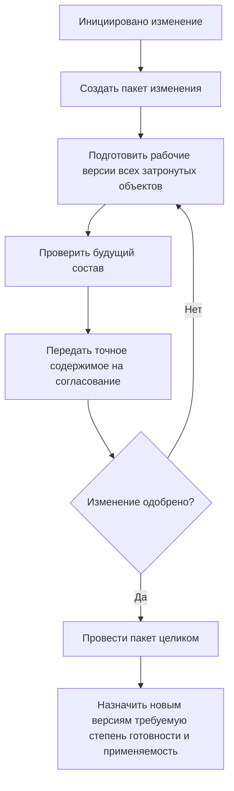

# Последовательное проведение изменений

## Что означает этот режим в IPS

Системное правило IPS `Последовательное проведение изменений` ищет версии объектов, расположенные на уровнях продвижения `Создание и модификация` или `Согласование и утверждение`.

Практический смысл правила — показать согласованный набор версий, которые ещё не стали производственными, но уже участвуют в проводимом изменении.

Этот режим тесно связан с контекстами редактирования и извещениями, но не совпадает с ними полностью:

- контекст содержит точные версии конкретного изменения;
- правило по уровням может находить подходящие зафиксированные версии рабочих стадий;
- процесс согласования управляет заданиями и решениями.

## Как Interlink раскладывает сценарий

В новой модели используются три самостоятельных механизма:

1. **Пакет изменения** показывает рабочие версии, создаваемые прямо сейчас.
2. **Правило рабочих стадий** выбирает уже зафиксированные версии, находящиеся на согласованных стадиях подготовки и утверждения.
3. **Процесс согласования** назначает задания, собирает решения и разрешает проведение.

Такой разбор помогает понять, почему версия появилась в составе:

- она является рабочей версией текущего пакета;
- она зафиксирована и находится на стадии согласования;
- она выпущена и выбрана обычным производственным правилом.

## Пример 1. Изменение подшипникового узла редуктора

Извещение `ИИ-РЦ250-047` меняет:

- выходной вал;
- подшипник;
- крышку подшипника;
- распорное кольцо;
- сборочный чертёж;
- технологическую операцию сборки.

На этапе разработки конструктор и технолог видят рабочие версии внутри одного пакета изменения. После внутренней проверки часть документов переводится на согласование.

Руководитель изменения должен видеть весь комплект как единое будущее состояние, а не случайную смесь:

- нового вала;
- старой крышки;
- уже выпущенного чертежа;
- рабочего техпроцесса из другого изменения.

Interlink обеспечивает согласованный выбор через пакет изменения. Правило рабочих стадий применяется только там, где требуется увидеть уже зафиксированные версии на подготовке или согласовании.

## Пример 2. Совместная модернизация механики и электрики станка

Для станка `СТ-500` изменяются:

- ограждение рабочей зоны;
- кабельные трассы;
- электрошкаф;
- перечень элементов;
- руководство по эксплуатации.

Механическая и электрическая части проходят разные маршруты согласования. Тем не менее выпускать их нужно совместно, потому что отверстия в ограждении зависят от нового расположения кабелей.

В Interlink предметные изменения можно объединить в один пакет или связать несколько пакетов явной зависимостью. Процессы согласования остаются разными, но система не выдаёт частично согласованный комплект за готовый производственный состав.

## Пример 3. Уже зафиксированная версия на согласовании

На предприятии принято фиксировать промежуточную версию документа перед внешним согласованием. Такая версия уже не является редактируемой рабочей, но ещё не выпущена в производство.

Для объекта `Рама станка СТ-500.01.000` существуют:

- версия 10 — производственная;
- версия 11 — зафиксирована и направлена на согласование;
- рабочая версия 12 — создаётся в другом пакете, но недоступна текущему пользователю.

Специальное правило последовательного проведения может выбрать версию 11. Производственное правило продолжает выбирать версию 10. Рабочая версия 12 видна только в своём пакете.

## Пример 4. Изменение после согласования

Рецензенты согласовали пакет, содержащий версию 04 рабочего колеса насоса. После согласования конструктор изменил диаметр ступицы.

Система должна считать прежнее решение недействительным, потому что согласовано другое содержание. Пакет возвращается на проверку и согласование.

Так сохраняется ключевая потребность IPS: проведение относится к точным версиям, а не просто к номеру извещения.

## Почему нельзя заменить весь сценарий одним правилом по уровню

Если использовать только правило «Создание или согласование», можно получить версии из разных, не связанных друг с другом изменений. Формально они находятся на нужных уровнях, но не образуют согласованный комплект.

Поэтому приоритет имеет точный пакет изменения. Правило по степени готовности используется как дополнительное представление, а не как замена контекста.

## Как выполняется проведение

Перед проведением проверяются:

- полный перечень затронутых объектов;
- отсутствие конкурирующих пакетов;
- согласованность состава;
- результаты нормоконтроля и предметных проверок;
- применяемость новых версий;
- точное соответствие согласованному содержимому;
- отсутствие неразрешённых временных предпочтений.

После успешного проведения новые версии получают предусмотренные степени готовности. Если процесс требует выпуска в производство, это выполняется отдельным управляемым переходом.

## Что увидит пользователь

Интерфейс должен объяснять:

- `Показана рабочая версия пакета ИИ-РЦ250-047`;
- `Показана зафиксированная версия на стадии согласования`;
- `Для производства продолжает действовать версия 03`;
- `Версия относится к другому пакету изменения и не включена в текущий состав`;
- `Согласование устарело после изменения содержания`.

## Почему решение закрывает требование IPS

Сохраняются:

- просмотр версий, проходящих изменение;
- согласованный набор затронутых объектов;
- работа с несколькими стадиями подготовки;
- отдельный производственный состав;
- проведение нескольких версий как одного изменения;
- проверяемая связь с извещением и согласованием.

## Вопросы для проверки с заказчиком

- Какие именно уровни использует системное правило IPS?
- В каких модулях оно назначается по умолчанию?
- Когда промежуточная версия становится зафиксированной?
- Требуется ли общий комплект извещений?
- Возможна ли частичная актуализация?
- Какие доработки автоматически переводят версии между уровнями?
- Как пользователи отличают рабочий контекст от правила по уровням?

## Приёмочные сценарии

1. Участник пакета видит рабочие версии всех затронутых объектов.
2. Производство продолжает видеть выпущенный состав.
3. Зафиксированная версия на согласовании выбирается только специальным правилом.
4. Версии из разных несвязанных изменений не образуют один будущий состав.
5. Изменение после согласования требует нового решения.
6. Пакет проводится целиком либо не проводится вообще.

## Состояние реализации

Полная поддержка пакетов изменения и настраиваемых правил рабочих стадий относится к последующим этапам Interlink. Процесс согласования остаётся функцией прикладной системы поверх Interlink.

## Связанные документы

- [Работа внутри пакета изменения](Selection-change-package)
- [Подбор по степени готовности](Selection-maturity)
- [Настраиваемое правило](Selection-custom-rule)

