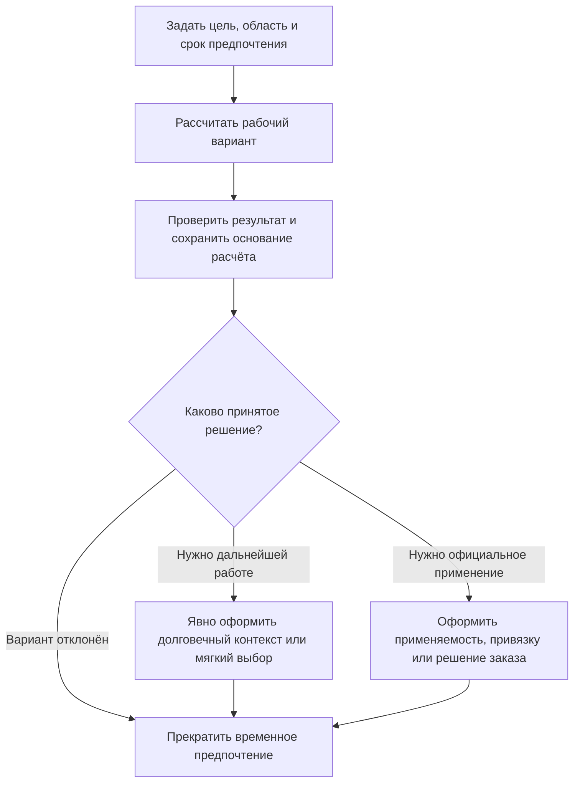
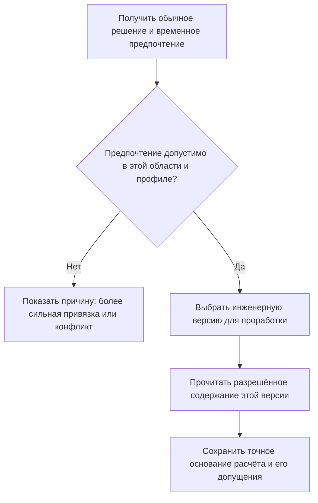

# Временное предпочтение для проработки — не вся мягкая конкретизация

## Что исправлено в понимании механизма

Прежнее описание приравнивало мягкую конкретизацию IPS к настройке, существующей только до завершения пакета изменения. Этого недостаточно: в IPS пользовательский выбор может сохраняться, временно переставать действовать на определённом шаге жизненного цикла и восстанавливаться позднее.

Поэтому в Interlink предусмотрена отдельная [[полная мягкая конкретизация|Selection-soft-concretion]]. Эта страница описывает более узкую возможность: временно предпочесть инженерную версию для испытания варианта, не объявляя это постоянным решением.

## Три похожих действия с разным сроком жизни

| Действие | Где действует и зачем |
|---|---|
| Мягкая конкретизация позиции | Сохраняет намерение использовать инженерную версию на определённой связи; может переживать публикации и рабочие области |
| Долговечное назначение контекста | Задаёт выбор для совместной работы или проекта; имеет собственные редакции, основания и конфликты |
| Временное рабочее предпочтение | Помогает ограниченной проработке; область действия и момент прекращения задаются явно |

Ни закрытие пакета, ни завершение рабочей области не должны удалять долговечный контекст или опубликованное позиционное намерение под видом «очистки временных настроек».

Точное содержимое — ещё один отдельный вопрос. Предпочесть инженерную версию 03 не значит навсегда закрепить её нынешние файлы. Для воспроизводимого расчёта сохраняют точное основание расчёта.

## Как будет организована временная работа

Инженер открывает рабочую область или исследовательский контекст и выбирает цель сравнения. Он указывает объект, предпочитаемую инженерную версию и предусмотренную область действия. Если нужна конкретная позиция или только одно использование повторной подсборки, это должно быть задано явно: настройка «для объекта во всём контексте» не равна выбору «только левый насос».

Система показывает, какое решение действует в обычном составе и какое будет использоваться в проработке. Доступ определяется полномочиями и выбранным контекстом, а не только членством в пакете изменения.

Схема не обещает автоматического превращения временной настройки в официальную. Каждый последующий носитель имеет свою область, полномочия и проверки. Закрытие временной настройки происходит по объявленному правилу, а не случайно из-за перехода жизненного цикла.

## Приоритет не должен быть скрытым

Временное предпочтение не снимает жёсткую привязку. Если закреплена инженерная версия 02, предпочтение 03 не вправе заменить её. Точная ссылка на содержание ещё строже.

Взаимодействие временного выбора, долговечного контекста, мягкой конкретизации и применяемости зависит от явно выбранного профиля. Например, рабочий режим Interlink может ставить контекст перед применяемостью; совместимый с IPS режим может использовать другой подтверждённый порядок.

Если в контексте уже указано несовместимое точное содержание или две рабочие копии одной версии, система должна показать конфликт. «Последняя открытая вкладка победила» не является правилом разрешения.

Проверка предпочтения и сохранение доказательства расчёта — разные действия. Даже допустимый временный выбор не фиксирует автоматически все данные будущих повторных расчётов.

## Пример 1. Подшипник с новой смазкой

Для редуктора серийно используется подшипник версии 02. Поставщик передаёт версию 03 с другой смазкой. Конструктор хочет проверить зазоры, монтаж и температурный режим.

Он создаёт ограниченную проработку и временно выбирает 03. Обычный серийный просмотр продолжает использовать действующее решение. Перед расчётом сохраняется, какое точное содержание подшипника и редуктора использовано.

Если вариант отклонён, предпочтение прекращается. Если он нужен с серии 201, оформляется применяемость. Если его требуется сохранить на определённой позиции для дальнейшей инженерной работы, создаётся соответствующая мягкая конкретизация. Ни один исход не требует притворяться, что временная настройка всегда была постоянной связью.

## Пример 2. Двигатель опытной насосной станции

Для двигателя имеются серийная версия 06 и опытная 07 с другим классом изоляции. Технолог оценивает изменение кабельных вводов и испытательного режима.

Он временно предпочитает 07 в контексте подготовки опытной станции. Если для 07 доступна рабочая копия, режим просмотра должен отдельно разрешить чтение этих рабочих материалов. Выбор номера 07 сам по себе не предоставляет права на неё.

После испытаний решение может остаться долговечным назначением проекта. Тогда оно сохраняется в контексте и не исчезает после завершения текущего пакета правок. Для конкретной производственной передачи отдельно фиксируется допустимый точный комплект. Рабочая копия не выдаётся за опубликованное состояние.

## Пример 3. Сравнение двух рам без изменения серийного станка

Расчётный отдел сравнивает версии 04 и 05 сварной рамы. У 05 добавлены косынки, поэтому нужно сопоставить массу, жёсткость и собственные частоты.

Два расчёта используют две явно заданные конфигурации и точные основания. Переключение предпочтения в одном окне не меняет другой уже запущенный расчёт. Поздняя правка рамы не переписывает результат старого испытания.

Если 05 не даёт выигрыша, временную настройку прекращают. Серийный состав не меняется, но в истории проекта остаются результаты сравнения и причина отказа.

## Пример 4. Только левый насос

Одинаковая насосная подсборка используется слева и справа на стенде. Нужно испытать новое уплотнение только слева. Выбор версии «для объекта уплотнения во всём контексте» затронул бы обе установки.

Поэтому используется явно ограниченное решение конфигурации для пути левой установки. Оно не меняет локальный состав типовой подсборки во всех её применениях. Такое адресное расширение Interlink полезно само по себе, но не должно выдаваться за доказанный внутренний способ хранения мягкой конкретизации IPS.

## Что делать перед официальным выпуском

Принимающий продукт должен показать временные допущения и потребовать предусмотренное решение по каждому из них. Возможны отмена, долговечное назначение для дальнейшей работы, изменение применяемости, явная привязка или согласованное решение заказа.

Согласование временного расчёта не означает согласования нового состава. Для выпуска проверяются точные данные и все обязательные ограничения. Неотменяемый запрет безопасности нельзя обойти превращением предпочтения в «решение заказа».

## Что увидит пользователь

Объяснение должно показывать обычный и рабочий результат, область предпочтения, срок его действия и источник более сильного решения. Если выбор не действует из-за жёсткой привязки или конфликта контекста, это сообщается прямо.

Удобное сообщение: «Версия 03 выбрана только для проработки температурного режима. Серийное назначение не изменено. Расчёт использует сохранённое состояние от 18 апреля».

## Приёмка и вопросы для IPS

Нужно проверить, какие исходные команды создают действительно временное решение, а какие — сохраняемую мягкую конкретизацию. Особенно важны массовый выбор, автоматическое снятие и восстановление по жизненному циклу.

Критерии:

1. Временное предпочтение не выдаётся за полное покрытие мягкой конкретизации.
2. Его область и срок действия видны до применения.
3. Оно не подменяет жёсткую привязку.
4. Завершение работы не удаляет долговечные назначения.
5. Сохранение рабочей копии не означает публикации.
6. Сравнение остаётся воспроизводимым после поздних изменений.
7. Официальный результат получает собственное проверенное основание.

## Состояние реализации

Разделение временной проработки, долговечных контекстов и мягкой конкретизации принято в целевой архитектуре. Конкретные рабочие места, команды завершения и профили предприятия ещё требуют реализации и испытаний.

## Связанные документы

- [[Полная мягкая конкретизация|Selection-soft-concretion]]
- [[Контексты и совместная работа|Selection-contexts]]
- [[Жёсткие и точные привязки|Selection-exact-fixation]]
- [[Применяемость|Selection-effectivity]]
