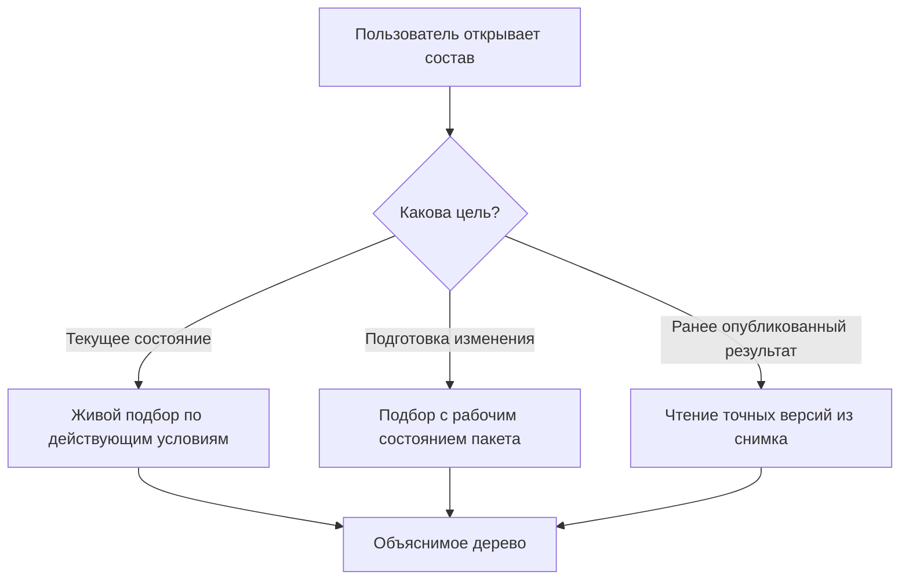
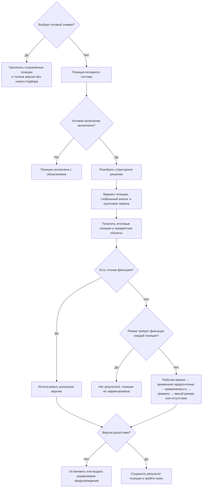

# Как пользователи работают с подбором версий

## Что именно называется подбором

Подбор версий — это не кнопка «взять последнюю». Это общий расчёт, который для каждой позиции многоуровневого изделия отвечает на несколько последовательных вопросов:

1. Должна ли позиция присутствовать в этой комплектации?
2. Остаётся ли исходный объект или выбирается допустимый аналог либо групповая замена?
3. Какую точную зафиксированную версию выбранного объекта следует использовать?
4. Допустим ли итог для текущей цели — просмотра, изменения, выпуска, заказа или ремонта?
5. Можно ли продолжать обход нижних уровней состава?

Пользователь получает не только выбранную версию, но и объяснение каждого решения.

## Три режима работы

### Живой состав

Система рассчитывает состав по сегодняшним официальным данным, действующим правилам и заданным условиям. Результат может законно измениться после выпуска новых версий или новой редакции правила.

Так работают обычный просмотр конструктора, предварительный расчёт заказа, оценка обеспеченности и поиск современной замены для ремонта.

### Будущий состав внутри пакета изменения

Участник открытого пакета видит официальные данные, дополненные его рабочими версиями и подготовленными операциями. Этот режим нужен для ответа «что получится после проведения».

Остальные пользователи без контекста пакета продолжают видеть официальное состояние.

### Ранее опубликованный снимок

Система проверяет вид, корень и целостность неизменяемого снимка, затем читает сохранённые точные версии и не выполняет живой подбор заново. Так открываются уже переданный производственный заказ, состав выпуска и историческое свидетельство. Повреждённый или неподходящий снимок даёт явный отказ; система не заменяет его сегодняшним живым расчётом.

Новая версия компонента не меняет старый снимок.

## Кто участвует

### Конструктор и технолог

Открывают состав, задают инженерно понятную цель, создают точные фиксации на позициях, готовят применяемость в пакете изменения и исправляют предметные ошибки.

Они не должны вручную вводить внутренние идентификаторы правил или версий. Рабочее место показывает обозначение, поколение, степень готовности и причину выбора.

### Менеджер комплектации или заказа

Задаёт требования заказа: исполнение, климат, напряжение, дополнительные опции, площадку, дату и плановый диапазон серийных номеров. Он выбирает из разрешённых бизнес-параметров, а не редактирует структуру правил.

### Методист состава и администратор модели

Определяют, какие параметры допустимы, какие позиции они включают, какие виды аналогов и групповых замен разрешены, какие корпоративные политики выбора доступны. Изменения проходят рецензирование, испытания и управляемый выпуск.

### Владелец продукта или НСИ

Управляет основной версией, применяемостью, корпоративными правилами и конфликтами диапазонов. Полномочия разделяются по типам объектов и предметным областям.

### Планировщик производства

Запускает полный расчёт заказа, разбирает отсутствие подходящих компонентов, согласует разрешённые резервные результаты и публикует точный снимок передачи.

### Сервисный специалист

Сначала читает исторический состав конкретного экземпляра или выпуска, затем отдельно рассчитывает современный допустимый вариант ремонта. Историческая и предлагаемая конфигурации не смешиваются.

## Откуда берутся исходные условия

Пользователь не заполняет десятки технических полей при каждом открытии. Прикладная система собирает контекст из понятных источников.

| Условие | Типичный источник | Кто отвечает |
|---|---|---|
| Головное изделие | Открытая карточка, заказ или проект | Прикладное рабочее место |
| Исполнение и опции | Комплектация заказа или выбранный вариант изделия | Менеджер комплектации |
| Серийный номер или диапазон | Заказ, партия либо план выпуска | Планировщик |
| Дата действия | План производства, дата ремонта или явно выбранная дата анализа | Пользователь и процесс |
| Площадка и предприятие | Заказ, проект и организационная настройка | Принимающий продукт |
| Цель выбора | Просмотр, расчёт, выпуск, заказ, ремонт | Рабочее место и политика |
| Правило выбора | Разрешённый профиль операции | Администратор правил |
| Пакет изменения | Открытая рабочая задача пользователя | Принимающий продукт |
| Снимок | Ранее опубликованный выпуск или передача | Пользователь выбирает деловой артефакт |

Перед расчётом рабочее место показывает краткое резюме: «РЦ-250, исполнение У2, серия 145, площадка Пермь, дата 12.05.2027, политика выпуска». Пользователь может раскрыть подробности и увидеть происхождение каждого значения.

## Какие значения пользователь выбирает вручную

Ручной выбор нужен только там, где существует реальное деловое решение:

- выбрать комплектацию заказчика;
- указать дату или серию для анализа;
- выбрать разрешённую цель просмотра;
- подтвердить допустимый резервный результат;
- создать точную фиксацию критической позиции;
- выбрать один из разрешённых вариантов групповой замены;
- открыть конкретный исторический снимок.

Нельзя позволять пользователю незаметно менять системную политику только для своего окна. Персональная настройка представления допустима; скрытая персональная логика состава — нет.

## Проверка режима и исходных условий

Сначала определяется режим. Для готового снимка проверяются сам снимок, его корень, вид, целостность и право чтения. При ошибке чтение прекращается без перехода к живому подбору.

Только для живого или будущего состава до обхода проверяются:

- существует ли корневой объект и допустима ли его версия;
- заполнены ли обязательные параметры конфигурации;
- согласованы ли серия и дата;
- разрешена ли выбранная политика для этой операции;
- доступен ли пакет изменения и имеет ли пользователь право видеть его рабочее состояние;
- является ли снимок полным и пригодным для чтения;
- нет ли взаимоисключающих значений, например одновременно «северное исполнение» и «тропическое исполнение».

Ошибка входа показывается до долгого расчёта. Пользователь видит поле, источник неверного значения и разрешённое действие.

## Полный порядок обработки одной позиции

Сначала определяется режим всей операции. Если пользователь открыл готовый снимок, Interlink не проверяет заново ни присутствие позиции, ни варианты, ни применяемость, ни правила выбора: он читает уже сохранённый граф точных версий. Следующая схема относится **только к живому расчёту** и к предпросмотру будущего состояния пакета изменения.

Первые шаги решают, **какой объект и какая позиция вообще участвуют**. Только затем выбирается версия объекта. Это предотвращает смешение конфигуратора, замен и версионной политики.

Важная граница зрелости: проверка условия присутствия до выбора версии закреплена нормативно. Богатая модель вариантов структуры, глобальных аналогов и групповых замен пока является целевой продуктовой гипотезой. Их точное взаимное старшинство, адресация повторных вхождений и носитель решения конкретного заказа ещё должны быть приняты. Диаграмма показывает нужное разделение вопросов, а не объявляет окончательный порядок трёх структурных механизмов.

## Порядок выбора версии

Если позиция существует и объект определён, для живого расчёта применяется единый приоритет:

1. **Точная фиксация позиции** — использовать строго закреплённую версию. Если она недопустима, система показывает ошибку; к более слабому правилу она не переходит.
2. **Строгий режим «только точные фиксации»** — если фиксации нет, немедленно вернуть отсутствие результата; рабочая версия, применяемость и резерв уже не рассматриваются.
3. **Рабочая версия того же пакета** — показать будущее содержание объекта участнику явно выбранного изменения.
4. **Временное предпочтение пакета** — использовать выбранную для анализа версию, если объект не имеет собственной рабочей версии в пакете.
5. **Применяемость** — выбрать версию для головного изделия, серии и даты.
6. **Корпоративное правило** — например, назначенная основная, последняя допустимая или требуемая степень готовности.
7. **Заранее определённый резервный алгоритм** либо **отсутствие результата**.

Если выбран готовый снимок, эта цепочка вообще не запускается: система читает сохранённые точные версии и сохранённые первоначальные причины выбора.

Более слабый механизм не отменяет более сильный. Например, «последняя версия» не пересиливает точную фиксацию, а новое правило не переписывает старый снимок. Резервный алгоритм — часть заранее утверждённой политики подбора. Он не равен ручному исключению по конкретному заказу: такое исключение является отдельным решением принимающего продукта и не маскируется как успешный автоматический выбор.

Точная фиксация принадлежит позиции в версии родительского состава. Внутри одного пакета она может ссылаться как на уже официальную версию дочернего объекта, так и на его рабочую версию из того же пакета. После проведения ссылка становится обычной точной связью между официальными версиями.

Временное предпочтение не проводится как официальный факт. Перед проведением его удаляют; если решение должно стать постоянным, отдельно создают точную фиксацию. Для одной передачи заказа принимающий продукт может согласовать разовое решение по уже зафиксированной версии и сохранить его только в новом снимке этой передачи. Само временное предпочтение при этом всё равно удаляется.

## Карточка результата одной позиции

Для каждой позиции система должна сохранить и уметь показать:

- путь от корня состава;
- включена позиция или исключена;
- исходный объект;
- применённый вариант позиции;
- выбранный аналог или групповая замена;
- точную версию итогового объекта;
- механизм, который победил;
- использованные условия;
- применённые уровни выбора и основные причины отказа;
- предупреждения;
- допустимо ли использовать результат для выбранной цели;
- следующее разрешённое действие.

Важно различать «версия выбрана» и «результат разрешено публиковать». Точная фиксация может однозначно выбрать отозванную версию. Блокирует ли это выбранную операцию, определяет явная политика предприятия; сама точная фиксация никогда молча не переходит к другой версии.

Полный список каждого просмотренного кандидата пока не является обязательной частью обычного ответа. Нормативный минимум — указать сработавший уровень, предупреждения и проверенные уровни. Подробная трассировка кандидатов является целевой диагностикой и должна формироваться только по явному запросу, чтобы не перегружать обычную работу и хранение.

## Как выглядит полное дерево

Рабочее место показывает обычное дерево изделия, а не таблицу внутренних правил. На каждой позиции доступны понятные признаки:

- «включена условием комплектации»;
- «заменена аналогом»;
- «версия зафиксирована в позиции»;
- «выбрана для серии 145»;
- «показана рабочая версия пакета»;
- «использован разрешённый резерв»;
- «нет допустимой версии».

Цвет не является единственным носителем смысла. Значок, текст и подробное объяснение должны быть доступны для поиска, отчёта и выгрузки.

## Что происходит при ошибке

### Ошибка входных условий

Расчёт не начинается или останавливается на входе. Ответственный исправляет комплектацию, дату, серию или профиль операции.

### Нет допустимой версии

Позиция получает результат «не найдено», точный путь и причину. В зависимости от цели:

- обычный просмотр может показать неполное дерево с предупреждением;
- публикация снимка всегда останавливается, потому что неполный снимок недопустим;
- живой или диагностический расчёт может остаться неполным и показать проблему;
- выпуск пакета или версии заказа блокируется только тогда, когда явная политика предприятия требует полного результата для этой операции;
- планировщик получает задание выпустить версию, изменить контекст или согласовать допустимый резерв.

### Конфликт применяемости

Система показывает пересекающиеся диапазоны и их владельцев. Исправление выполняется через пакет изменения правил применяемости, а не случайным выбором одной записи.

### Неоднозначная замена

Пользователь видит допустимые варианты и основание каждого. Если политика не определяет победителя, система не выбирает по случайному порядку. Владелец НСИ или заказа принимает явное решение.

### Недопустимая точная фиксация

Версия определяется однозначно, но проверка показывает, почему её нельзя использовать для выпуска: аннулирование, недостаточная степень готовности, несовместимость или запрет политики. Исправляется сама фиксация либо предметное состояние версии.

## Повторный расчёт

После исправления пользователь запускает повтор. Система использует новую редакцию исходных данных и показывает различия:

- какие позиции изменились;
- где исчезла ошибка;
- появились ли новые предупреждения;
- изменилась ли контрольная цифровая сумма всех ожидающих правок, версии модели и применённых настроек — то есть отпечаток будущего содержания;
- какие прежние решения утратили силу.

Для большого состава повтор может пересчитать только безопасно определённую затронутую область, но перед публикацией система всё равно проверяет всё дерево включённых позиций и их точных версий.

## Когда результат становится официальным

Живой расчёт сам по себе не является публикацией. Он может использоваться для просмотра, анализа и предпросмотра пакета.

Официальное значение появляется несколькими разными путями в зависимости от носителя решения:

- проведённое предметное изменение фиксирует новые версии, точные позиции, применяемость и другие данные конкретных объектов;
- общее правило подбора становится официальным через выпуск модели и переход данных либо через версионируемые настройки принимающего продукта — в зависимости от его носителя;
- бизнес-снимок фиксирует всё дерево включённых позиций и их точных версий для одного выпуска или передачи.

Снимок не содержит рабочую версию. Если выбор был подготовлен в пакете изменения, сначала версия фиксируется, затем полный результат проверяется заново; снимок сохраняет точную зафиксированную версию и происхождение решения.

Пользователь должен явно видеть, находится ли он в пробном расчёте, в будущем состоянии пакета или в неизменяемом опубликованном снимке.

## Пример 1. Конструктор проверяет будущую серию редуктора

Конструктор открывает РЦ-250 для серии 145 внутри пакета изменения. Позиция старого подшипника присутствует, но применяемость выбирает новый подшипник. Рабочая версия крышки пакета имеет больший приоритет, чем её официальная версия. На другой позиции точная фиксация сохраняет прежнюю манжету и вызывает предупреждение о несовместимости.

Конструктор переходит из объяснения к позиции, заменяет фиксацию, повторяет расчёт и получает полный допустимый состав. Остальные пользователи до проведения продолжают видеть официальный состав.

## Пример 2. Планировщик формирует насосную станцию

Заказ задаёт северное исполнение, 400 В, площадку Норильск и дату поставки. Конфигуратор включает подогрев, исключает стандартный шкаф и выбирает утеплённый вариант. Для двигателя применяется корпоративный аналог разрешённого поставщика, затем правило выбирает выпущенную версию.

На глубине состава нет кабельного ввода нужной степени готовности. Пробный расчёт показывает неполноту; публикация снимка запрещена. После выпуска кабельного ввода повтор меняет одну ветвь, заказ согласуется и публикуется как точный снимок.

## Пример 3. Сервис ремонтирует старый пресс

Сервисный специалист сначала открывает исторический снимок пресса и видит установленную версию гидрораспределителя без пересчёта. Затем создаёт отдельный ремонтный расчёт на текущую дату. Глобальный аналог предлагает современный распределитель, а групповая замена добавляет переходную плиту и крепёж.

Интерфейс одновременно показывает «было установлено» и «предлагается для ремонта», но не смешивает деревья. После инженерного решения ремонт оформляется отдельным пакетом.

## Пример 4. Методист проверяет новое правило

Методист хочет для площадки Пермь предпочитать подшипники локального поставщика. Он испытывает правило на наборе редукторов и заказов. В одном сертифицированном узле точная фиксация сохраняет импортный подшипник; правило правильно не пересиливает её. В другом случае два локальных кандидата равнозначны, и испытание выдаёт неоднозначность.

Методист добавляет явный критерий и повторяет испытания. Если правило является частью модели, выпускается новая редакция модели с проверенным переходом данных; если это назначение профиля операции, выпускается версия настройки принимающего продукта. Предметный пакет подшипника для этого не используется. Старые снимки остаются прежними, а новые живые расчёты используют выпущенную редакцию.

## Граница ответственности

Interlink отвечает за типизированные данные состава, единый порядок, точный результат, причины выбора, проверки и публикацию снимка.

Принимающий продукт отвечает за рабочие места, получение деловой цели, проверку полномочий пользователя, задания, согласование, уведомления и внешние передачи. До построения снимка он либо разрешает операцию над всем артефактом, либо отклоняет её целиком. После разрешения Interlink строит полный граф без фильтрации ветвей по правам и никогда не формирует персонально «обрезанный» производственный снимок.

Каждая операция, в которой Interlink **подбирает** версию, получает явный контекст подбора с целью, политикой, пакетом, датой, серией и другими нужными условиями. Контекст может быть заранее заполнен рабочим местом, но не становится скрытым состоянием окна. Он не нужен лишь там, где подбора нет: при открытии уже указанной точной версии, чтении истории всех версий, чтении неверсионируемого объекта или готового снимка.

ERP, MES, САПР и система управления инженерными данными получают согласованные представления и подтверждают собственную обработку. Их ответ не должен скрытно менять правила подбора Interlink.

## Состояние реализации

Порядок выбора версии известного объекта и форма основных причин результата определены нормативно. Исполняемого подбора версий в текущем срезе ещё нет: существуют носители контекста, политик, причин и будущих прикладных контрактов, а неподдерживаемые режимы закрываются явным отказом. Команды, запросы, рекурсивный обход, политики и техническая проекция реализуются поэтапно. Применяемость, полный пакет, конфигуратор, богатая семантика аналогов и групповых замен, бизнес-снимки и рабочие места относятся к последующим этапам. Документ описывает целевой пользовательский контракт, а не готовую функцию.

Связанные документы: [[сквозное формирование состава|Selection-end-to-end]], [[как создаются и выпускаются правила подбора|Selection-rule-lifecycle]], [[пакет изменения|Change-package-guide]], [[точный заказ|Selection-order-snapshot]].
