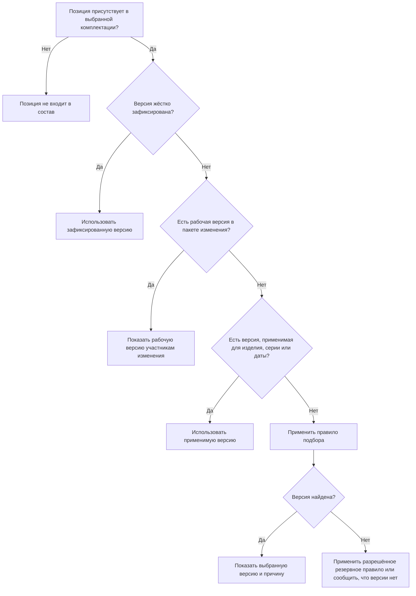

# Подбор версий в IPS и Interlink

## Для кого подготовлены эти документы

Этот комплект предназначен прежде всего для продуктовых специалистов IPS, конструкторов, технологов, специалистов по управлению конфигурацией и руководителей внедрения PLM. Для чтения не требуется знание программирования, устройства базы данных или внутренних средств разработки Interlink.

Цель комплекта — ответить на практический вопрос: **сможет ли новая система сформировать тот же инженерно правильный состав, который сегодня формирует IPS, и что при этом изменится для пользователя?**

В IPS итоговый состав зависит от нескольких механизмов: жёсткой и мягкой конкретизации, применяемости по сериям и датам, контекста редактирования, выбранного правила подбора, уровня продвижения, конфигуратора, допустимых замен и аналогов. В Interlink эти возможности сохраняются, но разделяются по назначению. Благодаря этому становится проще понять, почему система выбрала конкретную версию и какое решение следует исправить, если результат неверен.

## Как читать термины Interlink

В документах сначала используется понятный русский термин. Английское или внутреннее название Interlink приводится в скобках только для сопоставления со спецификацией.

| В документах | Термин Interlink | Простое объяснение |
|---|---|---|
| Объект | `Identity` | Само изделие, сборочная единица, деталь или документ, сохраняющий своё тождество при выпуске новых версий. |
| Версия объекта | `Revision` | Зафиксированное состояние объекта на определённый момент. |
| Рабочая версия | `Draft` | Ещё не выпущенное состояние, которое редактируется внутри пакета изменения. |
| Позиция состава | `Occurrence` | Конкретное место использования дочернего объекта в составе родительской версии. |
| Пакет изменения | `Changeset` | Согласованный набор рабочих версий и изменений состава, который проводится целиком. |
| Жёсткая фиксация версии | `Pin` | Указание: в этой позиции всегда использовать строго определённую версию. |
| Временное предпочтение | `Override` | Указание: во время текущей проработки временно показывать выбранную версию. |
| Применяемость | `Effectivity` | Условия действия версии для головного изделия, серии, серийного номера или даты. |
| Условия подбора | `ResolutionContext` | Все явные исходные данные, с которыми формируется состав. |
| Правило подбора | `Policy` | Правило, выбирающее одну подходящую версию объекта. |
| Резервное правило | `Fallback` | Дополнительное правило, которое разрешено применить, если основное не дало результата. |
| Версия не найдена | `NoMatch` | Позиция нужна, но подходящая версия отсутствует. |
| Причина выбора | `ResolutionReason` | Объяснение, почему система выбрала эту версию. |
| Зафиксированный снимок состава | `Snapshot` | Неизменяемое свидетельство точного состава, опубликованного для выпуска, заказа или обмена. |

Внутренние имена полей продуктовый специалист знать не обязан. В документах используется их предметный смысл: «точно зафиксированная версия» и «объект, который должен быть установлен в этой позиции».

## Главная идея изменений

В IPS несколько механизмов последовательно влияют на одну и ту же позицию состава. Пользователь обычно видит только конечную версию и значок статуса. В Interlink каждый шаг получает собственное назначение и собственное объяснение.

Отдельно от этого, после полного формирования состава, система может опубликовать его неизменяемый снимок. Такой снимок нужен, когда состав передаётся в производство, архив, отчётность или внешнюю систему и больше не должен автоматически меняться.

## Общий машиностроительный пример

В большинстве документов используется семейство цилиндрических редукторов `РЦ-250`. Это позволяет сравнивать сценарии на одном понятном изделии.

Предположим, в составе редуктора есть позиция **«Подшипник выходного вала»**. Сам подшипник является отдельным объектом `Подшипник 3620`. У него последовательно выпущены:

- версия 01 — исходное исполнение для редукторов первых серий;
- версия 02 — изменённая версия с новым поставщиком и уточнённым материалом сепаратора;
- версия 03 — рабочая версия, подготовленная по извещению, но ещё не выпущенная.

В разных ситуациях система должна показать разное:

- для ранее изготовленного редуктора серии 080 — версию 01;
- для нового заказа серии 145 — версию 02;
- конструктору, работающему по текущему извещению, — рабочую версию 03;
- в выпущенной спецификации, где версия зафиксирована жёстко, — именно указанную версию независимо от остальных правил.

Этот пример показывает, почему одной команды «показать последнюю версию» недостаточно.

## Состав комплекта

### Общая картина

- [Что изменилось относительно IPS](Selection-overview) — объяснение новой модели без привязки к одному механизму.
- [Сквозное формирование многоуровневого состава](Selection-end-to-end) — совместная работа всех механизмов на примере редуктора и насосного агрегата.

### Механизмы выбора версии

- [Точная фиксация версии](Selection-exact-fixation) — когда конкретная версия должна оставаться неизменной.
- [Применяемость по изделию, серии и дате](Selection-effectivity) — как учитывать внедрение изменений в производство.
- [Работа внутри пакета изменения](Selection-change-package) — как участники изменения видят будущий состав, не раскрывая его остальным.
- [Временное предпочтение версии](Selection-temporary-preference) — как временно предпочесть версию во время проработки.
- [Назначенная основная версия](Selection-main-version) — как выбрать версию, назначенную основной для обычной работы.
- [Подбор последней версии](Selection-latest-version) — как получить самое новое допустимое зафиксированное состояние.
- [Подбор по степени готовности](Selection-maturity) — как различать рабочие, согласуемые, выпущенные и аннулированные версии.
- [Последовательное проведение изменений](Selection-sequential-changes) — как показать согласованный набор версий, проходящих изменение.
- [Настраиваемое правило подбора](Selection-custom-rule) — как сохранить общие и персональные правила IPS без скрытых настроек окна.
- [«Не совсем подходящая» версия](Selection-no-match) — когда допустим резервный результат, а когда процесс нужно остановить.
- [Просмотр всех версий](Selection-all-versions) — почему это отдельный режим истории, а не обычный состав.

### Механизмы, влияющие на выбранный состав

- [Конфигуратор и включение позиций](Selection-position-presence) — как из 150%-ной структуры получить конкретную комплектацию.
- [Глобальные аналоги](Selection-global-analog) — как заменить сам объект другим объектом предприятия.
- [Допустимые групповые замены](Selection-group-substitution) — как один набор позиций заменить другим внутри конкретного состава.
- [Точный состав производственного заказа](Selection-order-snapshot) — как превратить динамический состав в неизменяемое задание производству.

## Что в этих документах является принятым решением, а что ещё требует подтверждения

Принятыми являются основные разграничения:

- точная фиксация одной позиции отличается от фиксации всего состава;
- рабочая версия видна только в явно указанном пакете изменения;
- применяемость отличается от уровня готовности;
- включение позиции отличается от выбора версии объекта;
- глобальный аналог отличается от допустимой замены в конкретной сборке;
- резервный результат всегда должен быть обозначен предупреждением;
- производственный заказ не должен повторно пересчитывать уже переданный состав.

На реальных данных конкретного заказчика ещё нужно подтвердить:

- точный порядок механизмов в используемой версии и пакете обновлений IPS;
- фактический смысл базовой версии;
- правила сочетания серии и даты;
- перечень уровней продвижения и их использование;
- допустимость «не совсем подходящей» версии в производственных процессах;
- реальные варианты N:M-замен;
- влияние модулей расширения и доработок заказчика.

## Текущее состояние Interlink

Документы описывают целевое поведение системы и одновременно служат будущими приёмочными сценариями. Не все описанные возможности уже реализованы в работающей среде Interlink.

На текущем этапе подготовлена основа объектной модели и проверяемых описаний её правил. Полное чтение многоуровневого состава, все правила подбора, пакеты изменений, применяемость и неизменяемые снимки для деловых процессов реализуются последовательно. Поэтому при обсуждении с продуктовым специалистом следует различать:

- **что должна уметь итоговая система**;
- **какое решение уже принято архитектурно**;
- **что уже подтверждено работающими испытаниями**;
- **что ещё должно быть доказано на данных IPS**.

Актуальное состояние работ приведено в [карте реализации](Current-state-and-roadmap).

## Источники

Комплект подготовлен на основе руководств и реконструкции IPS, нормативных документов Interlink и созданной продуктовой базы знаний. Основные ссылки:

- [Функциональная база IPS](From-IPS-to-Interlink)
- [Формирование состава: IPS → Interlink](Versions-and-composition)
- [Что меняется относительно IPS](From-IPS-to-Interlink)
- [Версии, изменения и снимки](Changes-and-evidence)
- [Глоссарий](Glossary)
- [Реестр источников](Trust-and-sources)
