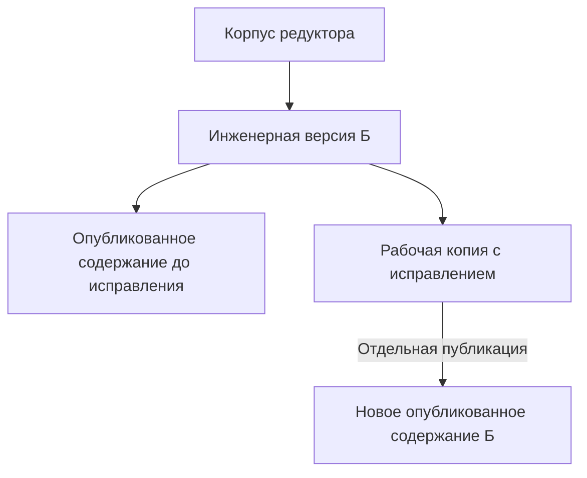
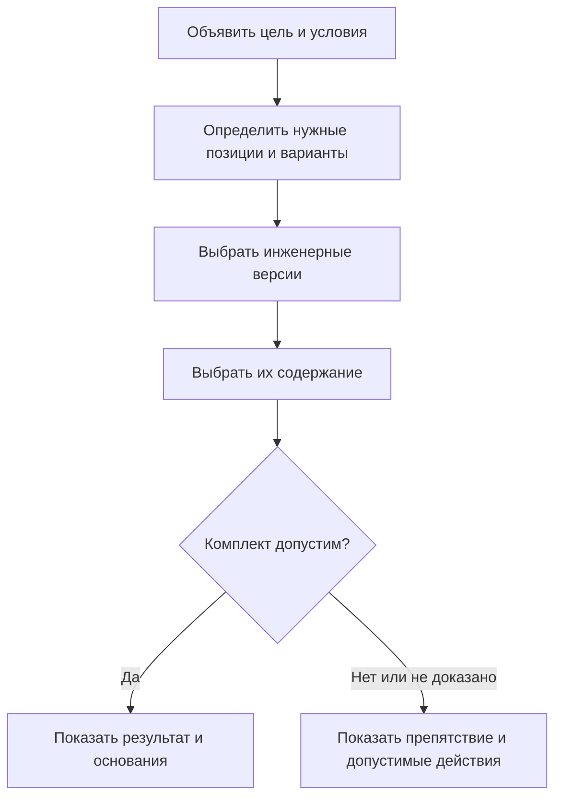

# Версии, состав и конфигурация

## Почему последняя версия не всегда правильная

Конструктор опытного станка, планировщик серийного заказа и сервисный инженер могут открыть один и тот же привод — и обоснованно получить разные результаты. Первый изучает рабочие изменения, второй использует допущенное к производству решение, третий должен увидеть, что было передано для конкретного экземпляра несколько лет назад.

Interlink сохраняет сильную сторону IPS: позиция состава может указывать на объект без постоянного закрепления одной его версии. Версия определяется для конкретной задачи. Но система должна явно различать инженерную версию, её содержимое и основание выбора. Без этого нельзя одновременно обеспечить удобную разработку и точную историю.

**Статус главы:** принятая целевая модель, согласованная с архитектурой на 6 сентября 2026 года. Полное исполнение и пользовательские рабочие места ещё предстоит реализовать и проверить.

## Объект, инженерная версия, опубликованное состояние и рабочая копия

Объект — это, например, «Корпус редуктора РЦ-250» независимо от его изменений. Инженерная версия — «версия Б корпуса»: у неё своё обозначение, происхождение и жизненный цикл. Опубликованное состояние — точное содержание этой версии после конкретного завершения работы. Рабочая копия — изменяемые материалы версии, которые инженер ещё подготавливает.

Допустим, технолог обнаружил неверную глубину отверстия в версии Б корпуса. Если процесс разрешает редактировать эту версию, исправление может завершиться новым опубликованным состоянием **той же версии Б**. Старое содержание не переписывается. Если изменение требует новой инженерной версии, её создают отдельным осознанным действием — например, версию В.

Новое содержание не обязательно означает новый номер инженерной версии. Обычное сохранение рабочей копии ещё не является публикацией. Право исправить версию определяется её процессом и полномочиями, а не самим наличием рабочей копии.

## Три разных решения о точности

| Решение | Что оно сохраняет | Что может измениться при следующем чтении |
|---|---|---|
| Подбирать версию объекта | Сам объект и объявленные условия подбора | Выбранная инженерная версия и её содержание |
| Жёстко привязать к инженерной версии | Например, всегда использовать версию Б | Разрешённое содержание Б: опубликованное или рабочее, согласно режиму |
| Указать точное опубликованное состояние | Конкретное неизменяемое содержание Б | Выбранное содержание не меняется |

Жёсткая конкретизация версии воспроизводит нужный смысл IPS, но не получает лишнего обещания «байты никогда не изменятся». Для официальной подписи и производственной передачи требуется более точная ссылка — на опубликованное состояние. Исследовательский расчёт может опираться и на неизменяемое сохранение рабочих материалов: это точное основание анализа, но ещё не публикация версии. Подробности: [[жёсткая привязка и точное содержание|Selection-exact-fixation]] и [[итерации|Selection-iterations]].

Кроме того, [[мягкая конкретизация|Selection-soft-concretion]] сохраняет предпочтение версии **на конкретной позиции**. Она переживает завершение работы, но может быть заслонена более приоритетным источником или временно выключена жизненным циклом. Это не одноразовая настройка пакета.

## Где работают и где выбирают

Рабочая область хранит незавершённые материалы. Контекст подбора хранит согласованные назначения версий, в том числе тех, которые никто сейчас не редактирует. Пакет изменения определяет, какие подготовленные результаты должны стать официальными вместе.

Эти границы могут пересекаться, но не совпадают. Конструкторы и технологи могут читать объединённые контексты, при этом завершать свои пакеты независимо. В одной рабочей области можно готовить несколько публикаций. Закрытие пакета не должно уничтожать контекст или сохранённую мягкую конкретизацию.

См. [[контексты и совместная работа|Selection-contexts]], [[пакет изменения|Selection-change-package]] и [[итерации и восстановление|Selection-iterations]].

## Как складывается конкретный состав

Сначала определяется, читается ли готовое историческое основание или строится живой состав. Готовый снимок не пересчитывается. Для живого состава различаются четыре вопроса:

1. Какие позиции нужны по комплектации и какой допустимый вариант выбрал пользователь?
2. Какая инженерная версия каждого выбранного объекта нужна?
3. Какое содержание этой версии разрешено читать?
4. Совместим ли весь полученный комплект для заявленной цели?

При выборе аналога иногда нужно сначала установить версию **исходного** компонента: допуск замены может относиться именно к ней. После выбора заменителя его версия определяется тем же общим механизмом. Нельзя взять допуск соседней версии или искать другую версию скрыто, пока не получится совместимый ответ.

Это схема обязанностей, а не универсальная очередь всех правил. Зависимый от исходной версии допуск читается после установления этой версии. Проверки, которым нужны точные свойства выбранных компонентов, выполняются после выбора содержания.

В профиле совместимости IPS применяемость предшествует контексту, затем учитываются активная мягкая конкретизация и правило. В отдельном редакторском профиле Interlink контекст может быть поставлен раньше применяемости. Профиль выбран явно и сохраняется в объяснении — это не случайное различие между окнами. Подробнее: [[что изменилось в подборе|Selection-overview]].

## Три ситуации из практики

### Серийный редуктор и опытное усиление корпуса

Для редуктора серии 145 действует корпус версии Б. Конструктор создал версию В для усиленного исполнения и работает с её копией. Производственный расчёт по профилю IPS продолжает выбирать Б по применяемости. Редакторский профиль с явно заданным контекстом может показывать рабочее содержание В для проработки. Видимость рабочего материала разрешается отдельно; наличие его у коллеги не меняет серийный расчёт.

### Две позиции одной детали

На всасывающем и нагнетательном фланцах насоса используется одно семейство уплотнений. Для первого места сохранена мягкая конкретизация на версию Б, для второго — на Г. Система сохраняет оба решения и объясняет их по позициям. Назначение одной версии всему объекту в контексте — другой механизм; в профиле IPS оно может заслонить оба позиционных предпочтения. Пользователь должен видеть причину этого результата.

### Станок передан в производство

Комплект станка включает механику, шкаф, программное обеспечение привода и кабели. По отдельности их версии допустимы, но выбранное содержание новой прошивки требует другого контроллера. Полная проверка выявляет несовместимость; система не подставляет старую прошивку тайно. После явного инженерного решения выпускается точный комплект. Его снимок сохраняется при последующих изменениях, а фактическая установка деталей учитывается отдельно от разрешения их применять.

## Что получает пользователь и как принимать результат

Для позиции нужны две понятные причины: «почему выбрана версия» и «почему показано это содержание». Например: «версия Г предпочитается на нагнетательном фланце; показана её доступная рабочая копия». Отдельно показываются выбранный вариант, условия применяемости и результат совместимости.

Приёмка должна доказать, что разные позиции и контексты не смешиваются, сохранение не подменяет публикацию, жёсткая привязка не меняет инженерную версию, а снимок не пересчитывается. Требование полного покрытия IPS проверяется на реальных установках: правила, доработки и спорные комбинации параметров не объявляются известными заранее.

Полный маршрут: [[подбор версий по сценариям|Version-selection-guide]], [[допустимые замены|Allowed-replacements]], [[матрицы совместимости|Compatibility-matrices]], [[состояние и план развития|Current-state-and-roadmap]].
