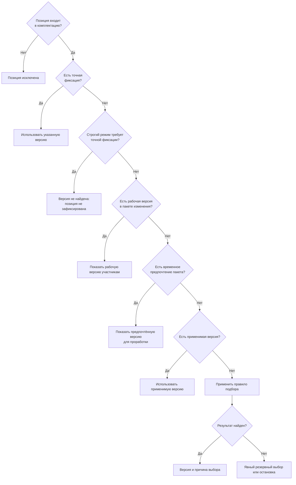

# Версии, состав и конфигурация

## Почему «показать последнюю версию» недостаточно

Для одного и того же компонента правильной может быть разная версия:

- старая версия для ранее изготовленного изделия;
- выпущенная версия для нового заказа;
- рабочая версия для участников изменения;
- строго указанная версия в подписанном комплекте;
- версия, применимая только к конкретному диапазону заводских номеров.

Interlink рассматривает выбор версии как объяснимый процесс с явными исходными условиями.

## Основные понятия

**Объект** сохраняет тождество при появлении новых состояний. **Версия объекта** — определённое зафиксированное состояние. **Позиция состава** — конкретное место использования дочернего объекта в родительской версии.

Позиция обычно указывает на объект, а подходящая версия выбирается при чтении. Если требуется строгое воспроизведение, позиция или снимок фиксирует точную версию.

## Порядок решений

Точный порядок относительно IPS ещё проверяется на реальных установках. В Interlink принято принципиальное требование: порядок должен быть единым, версионируемым и объяснимым.

## Точная фиксация

Точная фиксация означает: использовать строго указанную версию. Она сильнее обычного подбора и нужна для выпущенных комплектов, расчётов, управляющих программ и других результатов, которые нельзя самопроизвольно обновить.

Конфликт точной фиксации с аннулированием или применяемостью не должен скрываться. Продуктовый процесс определяет, блокирует ли он действие или требует решения ответственного.

## Пакет изменения

Участники изменения могут видеть будущую рабочую версию, тогда как остальные пользователи продолжают видеть выпущенное состояние. Условия чтения явно содержат пакет изменения, поэтому переключение другого окна не изменяет результат.

## Применяемость

Применяемость отвечает на вопрос, для какого головного изделия, серии, заводского номера или периода действует версия. Она отличается от степени готовности и от включения позиции в комплектацию.

Пересекающиеся диапазоны, открытые границы и частичное аннулирование должны давать однозначный результат или понятный конфликт.

## Правила выбора

В разных сценариях может требоваться:

- назначенная основная версия;
- самая новая допустимая версия;
- версия не ниже установленной степени готовности;
- корпоративное правило по набору признаков.

Правило является частью условий расчёта, а его версия сохраняется там, где результат должен быть воспроизводимым.

Общий смысл правила выпускается через новую редакцию модели предприятия; назначение профиля конкретной операции — через версионируемую настройку принимающего продукта. Предметный пакет одного изделия изменяет его применяемость, фиксации и состав, но не выпускает общий алгоритм.

## Резервный выбор

IPS умеет в отдельных сценариях возвращать «не совсем подходящую» версию. Interlink разделяет два исхода:

- резервный результат разрешён, явно помечен и требует установленной реакции;
- подходящей версии нет, поэтому процесс останавливается.

Предварительный анализ может допускать ближайший вариант, а производственная публикация — запрещать.

## Конфигуратор и включение позиций

Избыточная структура содержит все возможные варианты. Параметры заказа и правила определяют, какие позиции присутствуют в конкретном исполнении. Только после этого для присутствующих позиций выбираются объекты и версии.

Это различие важно: отсутствие насоса из-за комплектации и отсутствие подходящей версии обязательного насоса — разные результаты и требуют разных действий.

## Аналоги и групповые замены

Глобальный аналог заменяет объект другим допустимым объектом предприятия. Локальная групповая замена может заменить комплект «двигатель плюс муфта» другим комплектом внутри определённой сборки. Interlink не сводит оба механизма к одному списку ссылок.

## Объяснение результата

Для каждой выбранной позиции пользователь должен понимать:

- почему позиция присутствует;
- какой объект выбран;
- какая версия выбрана;
- какое правило победило;
- было ли предупреждение;
- какие условия применялись.

Это минимальная карточка результата. Полное рабочее место также показывает путь позиции в дереве, исходный и заменяющий объекты, допустимость публикации, значимые отклонённые варианты и разрешённое следующее действие.

## Как пользователь выполняет расчёт

Пользователь открывает изделие, заказ, пакет изменения или ранее опубликованный снимок. Рабочее место показывает происхождение головного изделия, серии, даты, комплектации и правила. Для живого состава Interlink выполняет расчёт; для готового снимка читает сохранённые зафиксированные версии без пересчёта. Если снимок повреждён или относится к другому артефакту, чтение завершается отказом, а не живым пересчётом.

При ошибке пользователь получает владельца проблемы и предметное действие: исправить комплектацию, выпустить версию, устранить пересечение применяемости, выбрать допустимую замену или получить отдельное разрешение. После исправления выполняется повторный расчёт и показываются различия.

Полный путь ролей, входов, состояний и ошибок описан на странице [[Как пользователи работают с подбором версий|Selection-user-work]]. Жизненный цикл применяемости, аналогов, конфигуратора и корпоративных правил — на странице [[Как создаются и выпускаются правила подбора|Selection-rule-lifecycle]].

Подробные неизвестности собраны в [[Вопросах о составе и подборе|Questions-composition]].

## Подробный разбор каждого механизма

Эта глава даёт общую картину. Для последовательного изучения всех механизмов IPS и соответствующих решений Interlink откройте [[подробный путеводитель по подбору версий|Version-selection-guide]]. В нём каждый сценарий вынесен в отдельный документ и разобран на машиностроительных примерах.

## Состояние реализации

Единый порядок выбора версии известного объекта принят нормативно, но исполняемого полного подбора сейчас нет. Условия присутствия позиции закреплены; богатая модель глобальных аналогов и групповых замен ещё содержит открытые продуктовые решения. Рекурсивный состав, применяемость, конфигуратор и бизнес-снимки вводятся поэтапно. Поэтому страницы описывают целевую работу пользователя и не обещают готовый модуль.
